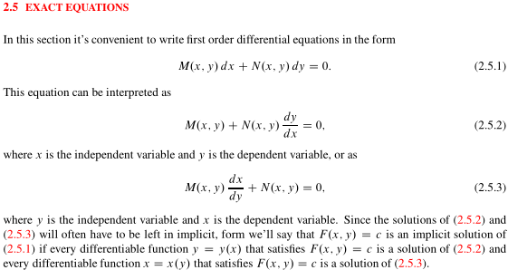
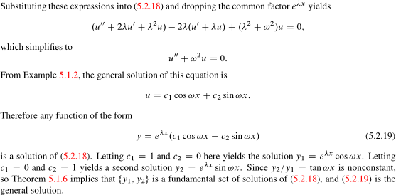
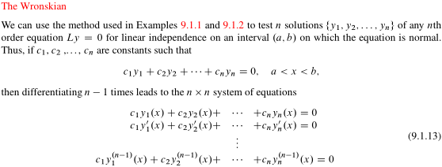
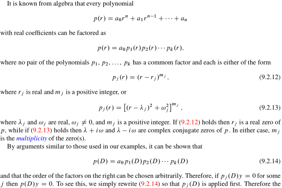

## First Order Equations

### 线性齐次一阶方程

### 线性非齐次一阶方程

### 非线性方程转化为可分离方程

#### 伯努利方程

#### 齐次非线性方程

### 全微分方程

### 积分因子

----

## Linear Second Order Equations

### 齐次线性二阶方程

### 常系数齐次线性方程

$e^{xi}=cosx+isinx\\
e^{xi}=1+yi+\frac{(yi)^2}{2!}+...+\frac{(yi)^n}{n!}+...\\
=[1-\frac{(yi)^2}{2!}+\frac{(yi)^4}{4!}-...]+[y-\frac{y^3}{3!}+\frac{y^5}{5!}-...]i=cosx+isinx$​​

$\frac{1}{2}(y_1+y_2)=e^\lambda cos\omega x,\frac{1}{2i}(y_1-y_2)=e^\lambda sin\omega x,\ \frac{1}{2}(y_1+y_2) 与 \frac{1}{2i}(y_1-y_2) 线性无关$​

### 非齐次线性方程

### 常系数非齐次方程-未定系数I

### 常系数非齐次方程-未定系数II

### 非齐次线性方程降阶

$x^2y^"+pxy'+qy=f(x)\rightarrow x=\pm e^t, y^"_t+(p-1)y'_t+qy=f(\pm e^t)$​

$x^ny^{(n)}+p_1x^{n-1}y^{(n-1)}+...+p_{n-1}xy'+p_ny=f(x)\\
\rightarrow x=\pm e^t,D=\frac{d}{dt},x^{k}y^{(k)}=D(D-1)...(D-k+1)y=A_D^ky\\
\rightarrow (A_D^n+p_1A_D^{n-1}+...p_{n-1}D+p_n)y=f(\pm e^t)$​​

----

## Linear Higher Order Equations

### 线性高阶方程简介

### 高阶常系数齐次方程

