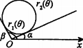

### 二重积分

X 型区域 D：穿过 D 内部平行于 y 轴的直线与 D 的边界相交不多于两点

Y 型区域 D：穿过 D 内部平行于 x 轴的直线与 D 的边界相交不多于两点

#### 对称性(二重)

##### 普通对称性

积分区域关于 y 轴对称，z=f(x,y)关于 x 奇或偶

积分区域关于 x 轴对称，z=f(x,y)关于 y 奇或偶

##### 轮换对称性

$x\xleftrightarrow{\text{对调}}y, D$ 不变或 $D$ 关于 y=x 对称 $\Rightarrow\iint\limits_{D}f(x,y)d\sigma=\iint\limits_{D}f(y,x)d\sigma$

#### 计算

##### 直角坐标系

后积先定限，限内画条线，先交写下限，后交写上限

##### 极坐标系

弧长微元 $rd\theta$，扇环面积微元 $d\sigma=dxdy=dr·rd\theta$

###### 选择原则

- 被积函数是否为$f(x^2+y^2), f(y/x), f(x/y)$等形式
- 积分区域 D 是否与圆有关

##### 直角坐标系与极坐标系互相转化后计算

##### 交换积分次序计算

##### 二重积分处理一元积分

### 三重积分

#### 对称性(三重)

##### 普通对称性(偶倍奇 0)

- 积分区域关于 y 轴对称，f(x,y,z)关于 x 奇或偶
- 积分区域关于 x 轴对称，f(x,y,z)关于 y 奇或偶
- 积分区域关于 xOy(z=0)对称，f(x,y,z)关于 z 奇或偶

$\Omega$关于 yOz 面对称

##### 轮换对称性(三重)

$x\xleftrightarrow{\text{对调}}y, \Omega$ 不变 $\Rightarrow\iiint\limits_{\Omega}f(x,y,z)dv=\iiint\limits_{\Omega}f(y,x,z)dv$

$\Omega=\{(x,y,z)|x^2+y^2+z^2\le R^2\} \Rightarrow\iiint\limits_{\Omega}f(x)dv=\iiint\limits_{\Omega}f(y)dv=\iiint\limits_{\Omega}f(z)dv$

#### 计算(三重)

1. 直角坐标系

- 先 1 后 2，先 z 后 xy，投影穿线
  适用：$\Omega$有下曲面$z=z_1(x,y)$，上曲面$z=z_2(x,y)$
  

  $\iiint\limits_{\Omega}f(x,y,z)dv=\iint\limits_{D_{xy}}d\sigma\int_{z_1(x,y)}^{z_2(x,y)}f(x,y,z)dz$

- 先 2 后 1，先 xy 后 z，定限截面
  适用：$\Omega$是旋转体，旋转曲面方程$z=z(x,y)$
  

  $\iiint\limits_{\Omega}f(x,y,z)dv=\int_{a}^{b}dz\iint\limits_{D_z}f(x,y,z)d\sigma$

2. 柱面坐标系=定积分+极坐标系二重积分
   

   在直角坐标系二重积分中，若$\iint\limits_{D_{xy}}d\sigma$ 适用极坐标系$(x^2+y^2)$，则令
   $\begin{cases}
x=rcos\theta\\
x=rsin\theta
\end{cases}, dxdydz=rdrd\theta dz$

   $\iiint\limits_{\Omega}f(x,y,z)dv=\iiint\limits_{\Omega}f(rcos\theta,rsin\theta,z)rdrd\theta dz$

3. 球面坐标系
   适用：被积函数含 $f(x^2+y^2+z^2), f(x^2+y^2)$；积分区域球或锥的部分
   

   $\begin{cases}
x=rsin\phi cos\theta\\
y=rsin\phi sin\theta\\
z=rcos\phi
\end{cases}\Rightarrow x^2+y^2+z^2=r^2$

   体积微元：经线方向弧长=$rd\phi$，纬线方向弧长=$rsin\phi d\theta$，向心方向高=dr

   $dxdydz=r^2sin\phi drd\phi d\theta$

   $\iiint\limits_{\Omega}f(x,y,z)dv=\iiint\limits_{\Omega}f(rsin\phi cos\theta,rsin\phi sin\theta,rcos\phi)r^2sin\phi drd\phi d\theta$

##### 坐标变换公式

### 一型曲线、曲面积分

#### 一型对弧长曲线积分(线积分)

- 空间参数式
  $\bm{v}=\frac{d\bm{r}}{dt}=x'(t)\bm{i}+y'(t)\bm{j}+z'(t)\bm{k}, |v(t)|=\sqrt{x'^2(t)+y'^2(t)+z'^2(t)}$

  $\int_\Gamma f(x,y,z)ds=\int_a^bf(x(t),y(t),z(t))|v(t)|dt$

- 平面一般式 $r=xi+y(x)j$
  $\bm{v}=\frac{d\bm{r}}{dx}=\bm{i}+y'(x)\bm{j}, |v(x)|=\sqrt{1+y'^2(x)}$

  $\int_L f(x,y)ds=\int_a^bf(x,y(x))|v(x)|dx$

- 平面极坐标式 $r=r(\theta), x=r(\theta)cos\theta, y=r(\theta)sin\theta$
  $\bm{v}=\frac{d\bm{r}}{d\theta}=(r'(\theta)cos\theta-r(\theta)sin\theta)\bm{i}+(r'(\theta)sin\theta+r(\theta)cos\theta)\bm{j}$

  $|v(\theta)|=\sqrt{r^2(\theta)+r'^2(\theta)}$

  $\int_L f(x,y)ds=\int_a^bf(r(\theta)cos\theta,r(\theta)sin\theta)|v(\theta)|d\theta$

#### 一型对面积曲面积分

曲面在 yOz 平面投影$D_{yz}$，点的外法向与 x 正轴夹角$cos\alpha$

曲面在 xOz 平面投影$D_{xz}$，点的外法向与 y 正轴夹角$cos\beta$

曲面在 xOy 平面投影$D_{xy}$，点的外法向与 z 正轴夹角$cos\gamma$

$dS=\frac{1}{|cos\alpha|}dydz=\frac{1}{|cos\beta|}dxdz=\frac{1}{|cos\gamma|}dxdy$

- 隐式等值面 f(x,y,z)=c 投影到 xOy 平面

  $\frac{1}{|cos\gamma|}=\frac{|\nabla f|}{|\nabla f·k|}=\frac{|(f'_x,f'_y,f'_z)|}{|(f'_x,f'_y,f'_z)(0,0,1)|}=\frac{\sqrt{f'^2_x+f'^2_y+f'^2_z}}{|f'_z|}$

  $\iint_\Sigma g(x,y,z)dS=\iint_{D_{xy}} g(x,y,z)\frac{\sqrt{f'^2_x+f'^2_y+f'^2_z}}{|f'_z|}dxdy$

- 显示曲面 z=z(x,y), f(x,y,z)=z(x,y)-z=0

  $\frac{1}{|cos\gamma|}=\frac{|\nabla f|}{|\nabla f·k|}=\frac{|(f'_x,f'_y,-1)|}{|(f'_x,f'_y,-1)(0,0,1)|}=\sqrt{f'^2_x+f'^2_y+1}=\sqrt{z'^2_x+z'^2_y+1}$

  $\iint_\Sigma g(x,y,z)dS=\iint_{D_{xy}} g(x,y,z(x,y))\sqrt{z'^2_x+z'^2_y+1}dxdy$

#### 几何

##### 重心/质心，形心

##### 转动惯量

转动惯量：一个物体保持其转动状态能力大小的物理量

形状体积质量相同时，若质量分布越集中于转动轴，转动惯量越小，角速度越快；转动惯量越大，转动时间更长

$I=\Sigma_im_ir_i^2$

m(i)代表该物体内一个质点微元的质量，r(i)代表该质元与转轴距离

##### 引力

### 二型曲线、曲面积分

向量场

#### 二型对坐标曲线积分

在向量场沿曲线 做功，F 与 s 同向时做正功，反向时做负功

$\bm{F}(x,y,z)=M(x,y,z)\bm{i}+N(x,y,z)\bm{j}+P(x,y,z)\bm{k}$

$d\bm{r}=dx\bm{i}+dy\bm{j}+dz\bm{k}$

$W=\int_{\Gamma}\bm{F·T}ds=\int_{\Gamma}\bm{F}·d\bm{r}=\int_{\Gamma}Pdx+Qdy+Rdz$ （化为单变量定积分）

$=\int_\Gamma\bm{F}·\frac{d\bm{r}}{dt}dt=\int_a^b(Px'(t)+Qy'(t)+Rz'(t))dt$ （参数式 t 变量定积分）

##### 二型曲线对称性

- 曲线向量 关于 y 轴对称，位移微分向量 dx 方向(符号)不变，被积函数 P 关于 x 为奇，则$\int_LPdx$ (做功)=0
- 曲线向量 关于 y 轴对称，位移微分向量 dy 方向(符号)改变，被积函数 Q 关于 x 为偶，则$\int_LQdy$ (做功)=0
- 曲线向量 关于 x 轴对称，位移微分向量 dx 方向(符号)改变，被积函数 P 关于 x 为偶，则$\int_LPdx$ (做功)=0
- 曲线向量 关于 x 轴对称，位移微分向量 dy 方向(符号)不变，被积函数 Q 关于 x 为奇，则$\int_LQdy$ (做功)=0

##### 格林公式

1. D 封闭区域(L 封闭曲线)，2. L 正方向：左手在 D 内，3. P、Q 有一阶连续偏导数

   $\oint_{L\pm}P(x,y)dx+Q(x,y)dy=\pm\iint_D(\frac{\partial Q}{\partial x}-\frac{\partial P}{\partial y})d\sigma$

- 题设非闭曲线—补线法

  

  解法：1. 分段化单变量定积分，2. 对称性，3. 格林公式-补线

- 题设有非一阶连续偏导点——挖点法(外线内线各一次格林公式)

  
  

#### 二型对坐标曲面积分

向量场沿曲面 g(x,y,z)=c 外法向的通量(流量)
通量=$\iint_\Sigma\bm{F·n}d\sigma$
速度场 $\bm{F}(x,y,z)=P(x,y,z)\bm{i}+Q(x,y,z)\bm{j}+R(x,y,z)\bm{k}$
$d\bm{S}=\bm{n}dS=(cos\alpha,cos\beta,cos\gamma)dS$

$=(cos\alpha\frac{1}{|cos\alpha|}dydz,cos\beta\frac{1}{|cos\beta|}dxdz,cos\gamma\frac{1}{|cos\gamma|}dxdy)$

$=(\pm dydz,\pm dxdz,\pm dxdy)$ 正负号取决于方向余弦

$\iint_\Sigma\bm{F·n}dS=\iint_{D_{xy}}\bm{F·\frac{\nabla g}{|\nabla g|}}\frac{|\nabla g|}{|\nabla g|·k}dA$

$=\iint_\Sigma (Pcos\alpha+Qcos\beta+Rcos\gamma)dS=\iint_\Sigma Pdydz+Qdxdz+Rdxdy$

$\iint_\Sigma R(x,y,z)dxdy=\pm \iint_{D_{xy}}R(x,y,z(x,y))dxdy$

$\iint_\Sigma P(x,y,z)dydz=\pm \iint_{D_{xy}}P(x,y,z)\frac{cos\alpha}{cos\gamma}dxdy$

### 向量场积分

#### 线积分

**定义**
曲线：$\bm{r}(t)=x(t)\bm{i}+y(t)\bm{j}+z(t)\bm{k}, a\le t\le b$

f 沿曲线的复合函数：$f(x(t),y(t),z(t))$

f 在曲线上从 a 到 b 的线积分：$\int_Cf(x,y,z)ds$

**计算**

$\bm{v}=\frac{d\bm{r}}{dt}=x'(t)\bm{i}+y'(t)\bm{j}+z'(t)\bm{k}, |v(t)|=\sqrt{x'^2(t)+y'^2(t)+z'^2(t)}$

$s(t)=\int_a^t|v(\tau)|d\tau, ds=|v(\tau)|d\tau$

$\int_Cf(x,y,z)ds=\int_a^bf(x(t),y(t),z(t))|v(t)|dt$

#### 向量场，功，环量，流量

##### 向量场

三维向量场：$\bm{F}(x,y,z)=M(x,y,z)\bm{i}+N(x,y,z)\bm{j}+P(x,y,z)\bm{k}$
如：力场、速度场，电磁场

##### 梯度场

$f(x,y,z)$的梯度场是梯度向量：$\nabla f=\frac{\partial f}{\partial x}\bm{i}+\frac{\partial f}{\partial y}\bm{j}+\frac{\partial f}{\partial z}\bm{k}$

##### 力沿曲线做的功

空间力场：$\bm{F}(x,y,z)=M(x,y,z)\bm{i}+N(x,y,z)\bm{j}+P(x,y,z)\bm{k}$

空间曲线：$\bm{r}(t)=x(t)\bm{i}+y(t)\bm{j}+z(t)\bm{k}, a\le t\le b$

$F·T$沿曲线的积分即 力 F 沿曲线从 a 到 b 所作的功, T 为单位切向量
变力 F 沿曲线 r(t)做功：

$W=\int_{t=a}^{t=b}\bm{F·T}ds=\int_{t=a}^{t=b}\bm{F}·d\bm{r}$

$=\int_a^b\bm{F}·\frac{d\bm{r}}{dt}dt$

$=\int_a^b(M\frac{dx}{dt}+N\frac{dy}{dt}+P\frac{dz}{dt})dt$

$=\int_a^bMdx+Ndy+Pdz$

**计算**

$F(x(t),y(t),z(t)), \frac{d\bm{r}}{dt}, \bm{F}·\frac{d\bm{r}}{dt}$

##### 流量积分与环流量

空间速度场：$\bm{F}(x,y,z)=M(x,y,z)\bm{i}+N(x,y,z)\bm{j}+P(x,y,z)\bm{k}$

空间曲线：$\bm{r}(t)=x(t)\bm{i}+y(t)\bm{j}+z(t)\bm{k}, a\le t\le b$

流量积分：$\int_a^b\bm{F·T}ds$

环流量积分：$\oint_a^b\bm{F·T}ds$（闭曲线）

**穿过平面内一闭曲线的流量：**

平面内向量场$\bm{F}(x,y)=M(x,y)\bm{i}+N(x,y)\bm{j}$，光滑闭曲线 C，n 为 C 的单位外法向量，则 F 穿过 C 的流量：
$\int_C\bm{F·n}ds$

假定 C 以逆时针运行，

$n=T\times k=(\frac{dx}{ds}i+\frac{dy}{ds}j)\times k=\frac{dy}{ds}i-\frac{dx}{ds}j$

$\int_C\bm{F·n}ds=\int_C(M\frac{dy}{ds}-N\frac{dx}{ds})ds=\oint_CMdy-Ndx$

#### 势函数与保守场,路径无关

**路径无关和保守场**：空间开区域 D 上的场 F 对 D 内任意两点 A 与 B，从 A 到 B 所做的功$\int_A^BF·dr$对所有路径都相同，则 1. 积分$\int F·dr$在 D 内路径无关，2. F 在 D 上是保守场

**势函数**：F 是 D 上的场，$\exists$数量值函数 f，$F=\nabla f \Rightarrow$ f 是 F 在 D 上的一个势函数

**线积分基本定理**：向量场$F=Mi+Nj+Pk$，其分量在空间连通开区域 D 上连续，$\forall A,B\in D, \int_A^BF·dr$ 与 D 内连接 A,B 的路径无关 $\Leftrightarrow \exists$ 可微函数 f

- $F=\nabla f=\frac{\partial f}{\partial x}i+\frac{\partial f}{\partial y}j+\frac{\partial f}{\partial z}k$
- $\int_A^BF·dr=\int_A^BMdx+Ndy+Pdz=f(B)-f(A)$
- $\oint_A^BF·dr=0$

**检验 F 是否保守/检验 F 微分形式是否完全**
场$\bm{F}(x,y,z)=M(x,y,z)\bm{i}+N(x,y,z)\bm{j}+P(x,y,z)\bm{k}$，其各分量函数都有一阶连续偏导数，
则 F 是保守场，微分形式完全$\Leftrightarrow P_y=N_z, M_z=P_x, N_x=M_y$（二阶混合偏导数相等）

#### 曲面面积和曲面积分

xOy 平面上的曲面$f(x,y,z)=c$一点的切向量（偏导数/梯度）：($u_i, v_i$)，微元面积 $\Delta \sigma_i$ 近似为切平面上的投影微元面积 $\Delta P_i$ ，其在 xOy 平面上的投影微元面积:

$\Delta A_i=|(u_i\times v_i)·k|=\Delta P_i|cos\gamma_i|, \gamma_i=<u_i\times v_i, k>$

$\Delta P_i=\frac{\Delta A_i}{|cos\gamma_i|}$

$\frac{1}{|cos\gamma_i|}=\frac{|\nabla f|}{|\nabla f·k|}=\frac{|(f'_x,f'_y,f'_z)|}{|(f'_x,f'_y,f'_z)(0,0,1)|}=\frac{\sqrt{f'^2_x+f'^2_y+f'^2_z}}{|f'_z|}\xlongequal{z=f(x,y)}\frac{|(f'_x,f'_y,-1)|}{|(f'_x,f'_y,-1)(0,0,1)|}=\sqrt{f'^2_x+f'^2_y+1}=\sqrt{z'^2_x+z'^2_y+1}$

曲面面积=$\iint_R\frac{|\nabla f|}{\nabla f·k}dA$, k 是 R 的单位法向量
