## 二重积分

### 对称性(二重)

#### 普通对称性

积分区域 D 关于 y 轴对称，z=f(x,y)关于 x 奇，$\iint_Df(x,y)dxdy=0$

积分区域 D 关于 x 轴对称，z=f(x,y)关于 y 奇，$\iint_Df(x,y)dxdy=0$

积分区域 D 关于 原点 对称，z=f(x,y)关于 (x,y) 奇，$\iint_Df(x,y)dxdy=0$

#### 轮换对称性

$x\xleftrightarrow{\text{对调}}y, D$ 不变或 $D$ 关于 y=x 对称 $\Rightarrow\iint\limits_{D}f(x,y)d\sigma=\iint\limits_{D}f(y,x)d\sigma$

### 计算

#### 直角坐标系

后积先定限，限内画条线，先交写下限，后交写上限

X 型区域 D：穿过 D 内部平行于 y 轴的直线与 D 的边界相交不多于两点

Y 型区域 D：穿过 D 内部平行于 x 轴的直线与 D 的边界相交不多于两点

#### 极坐标系

弧长微元 $rd\theta$，扇环面积微元 $d\sigma=dxdy=dr·rd\theta$

 

##### 选择原则

- 被积函数是否为$f(x^2+y^2), f(y/x), f(x/y)$等形式
- 积分区域 D 是否与圆有关

#### 二重积分换元法

**定理** f(x,y) 在 xOy 平面上闭区域 D 上连续，变换 $T:x=x(u,v),y=y(u,v)$ 将 uOv 平面上的闭区域 D'变为 xOy 平面上的 D，满足：

1. $x(u,v),y(u,v)$ 在 D'上有一阶连续偏导数，2. $J(u,v)=\frac{\partial (x,y)}{\partial (u,v)}\ne 0$，3. 变换 $T:D'\rightarrow D$一一映射

$\iint_Df(x,y)dxdy=\iint_{D'}f(x(u,v),y(u,v))|J(u,v)|dudv$

观察先令 $u=u(x,y), v=v(x,y)$，再反解变换 $T:x=x(u,v),y=y(u,v)$

#### 直角坐标系与极坐标系互相转化后计算

#### 交换积分次序计算

#### 二重积分处理一元积分

---

## 三重积分

### 对称性(三重)

#### 普通对称性(偶倍奇 0)

- 积分区域$\Omega$关于 yOz 面对称，f(x,y,z)关于 x 奇，$\iiint_\Omega f(x,y,z)=0$
- 积分区域$\Omega$关于 zOx 面对称，f(x,y,z)关于 y 奇，$\iiint_\Omega f(x,y,z)=0$
- 积分区域$\Omega$关于 xOy 面对称，f(x,y,z)关于 z 奇，$\iiint_\Omega f(x,y,z)=0$

#### 轮换对称性(三重)

$x\xleftrightarrow{\text{对调}}y, \Omega$ 不变 $\Rightarrow\iiint\limits_{\Omega}f(x,y,z)dv=\iiint\limits_{\Omega}f(y,x,z)dv$

$\Omega=\{(x,y,z)|x^2+y^2+z^2\le R^2\} \Rightarrow\iiint\limits_{\Omega}f(x)dv=\iiint\limits_{\Omega}f(y)dv=\iiint\limits_{\Omega}f(z)dv$

### 计算(三重)

1. 直角坐标系

- 先 1 后 2，先 z 后 xy，投影穿线
  适用：$\Omega$有下曲面$z=z_1(x,y)$，上曲面$z=z_2(x,y)$

  $\iiint\limits_{\Omega}f(x,y,z)dv=\iint\limits_{D_{xy}}d\sigma\int_{z_1(x,y)}^{z_2(x,y)}f(x,y,z)dz$

- 先 2 后 1，先 xy 后 z，定限截面
  适用：$\Omega$是旋转体，旋转曲面方程$z=z(x,y)$

  $\iiint\limits_{\Omega}f(x,y,z)dv=\int_{a}^{b}dz\iint\limits_{D_z}f(x,y,z)d\sigma$

2. 柱面坐标系=定积分+极坐标系二重积分
   

   在直角坐标系二重积分中，若$\iint\limits_{D_{xy}}d\sigma$ 适用极坐标系$(x^2+y^2)$，则令
   $\begin{cases}
   x=rcos\theta\\
   y=rsin\theta
   \end{cases}, dxdydz=rdrd\theta dz$

   $\iiint\limits_{\Omega}f(x,y,z)dv=\iiint\limits_{\Omega}f(rcos\theta,rsin\theta,z)rdrd\theta dz$

3. 球面坐标系
   适用：被积函数含 $f(x^2+y^2+z^2), f(x^2+y^2)$；积分区域球或锥的部分
   

   $\begin{cases}
   x=rsin\phi cos\theta\\
   y=rsin\phi sin\theta\\
   z=rcos\phi
   \end{cases}\Rightarrow x^2+y^2+z^2=r^2,\theta\in[0,2\pi],\phi\in[0,\frac{\pi}{2}]$

   体积微元：经线方向弧长=$rd\phi$，纬线方向弧长=$rsin\phi d\theta$，向心方向高=dr

   $dxdydz=r^2sin\phi drd\phi d\theta$

   $\iiint\limits_{\Omega}f(x,y,z)dv=\iiint\limits_{\Omega}f(rsin\phi cos\theta,rsin\phi sin\theta,rcos\phi)r^2sin\phi drd\phi d\theta$

#### 坐标变换公式

---

## 一型曲线、曲面积分

### 一型对弧长曲线积分(线积分)

- 空间参数式
  $\pmb{v}=r'(t)=\frac{d\pmb{r}}{dt}=x'(t)\pmb{i}+y'(t)\pmb{j}+z'(t)\pmb{k}, |r'(t)|=\sqrt{x'^2(t)+y'^2(t)+z'^2(t)}$

  $\int_\Gamma f(x,y,z)dr=\int_a^bf(x(t),y(t),z(t))|r'(t)|dt$

- 平面一般式 $\pmb{r}=x\pmb{i}+y(x)\pmb{j}$
  $\pmb{v}=r'(x)=\frac{d\pmb{r}}{dx}=\pmb{i}+y'(x)\pmb{j}, |r'(x)|=\sqrt{1+y'^2(x)}$

  $\int_L f(x,y)dr=\int_a^bf(x,y(x))|r'(x)|dx$

- 平面极坐标式 $r=r(\theta), \pmb{r}=r(\theta)cos\theta\pmb{i}+r(\theta)sin\theta\pmb{j}$

  $\pmb{v}=\pmb{r}'(\theta)=\frac{d\pmb{r}}{d\theta}=(r'(\theta)cos\theta-r(\theta)sin\theta)\pmb{i}+(r'(\theta)sin\theta+r(\theta)cos\theta)\pmb{j}$
  $|\pmb{r}'(\theta)|=\sqrt{r^2(\theta)+r'^2(\theta)}$

  $\int_L f(x,y)dr=\int_a^bf(r(\theta)cos\theta,r(\theta)sin\theta)|\pmb{r}'(\theta)|d\theta$

#### 对称性

##### 普通对称性

- 曲线 $\Gamma$ 关于 yOz 面对称，f 关于 x 为奇，$\int_\Gamma f(x,y,z)dr=0$，f 关于 x 为偶，$\int_\Gamma f(x,y,z)dr=2\int_{\Gamma_1} f(x,y,z)dr$
- 曲线 $\Gamma$ 关于 zOx 面对称，f 关于 y 为奇，$\int_\Gamma f(x,y,z)dr=0$，f 关于 y 为偶，$\int_\Gamma f(x,y,z)dr=2\int_{\Gamma_1} f(x,y,z)dr$
- 曲线 $\Gamma$ 关于 xOy 面对称，f 关于 z 为奇，$\int_\Gamma f(x,y,z)dr=0$，f 关于 z 为偶，$\int_\Gamma f(x,y,z)dr=2\int_{\Gamma_1} f(x,y,z)dr$

##### 轮换对称性

x 与 y 对调，$\Gamma$ 不变，$\int_\Gamma f(x,y,z)dr=\int_\Gamma f(y,x,z)dr$

### 一型对面积曲面积分

曲面在 yOz 平面投影$D_{yz}$，点的外法向与 x 正轴夹角$cos\alpha$

曲面在 xOz 平面投影$D_{xz}$，点的外法向与 y 正轴夹角$cos\beta$

曲面在 xOy 平面投影$D_{xy}$，点的外法向与 z 正轴夹角$cos\gamma$

$dS=\frac{1}{|cos\alpha|}dydz=\frac{1}{|cos\beta|}dxdz=\frac{1}{|cos\gamma|}dxdy$

- 隐式等值面 g(x,y,z)=c 投影到 xOy 平面

  $\frac{1}{|cos\gamma|}=\frac{|\nabla g|}{|\nabla g·k|}=\frac{|(g'_x,g'_y,g'_z)|}{|(g'_x,g'_y,g'_z)(0,0,1)|}=\frac{\sqrt{g'^2_x+g'^2_y+g'^2_z}}{|g'_z|}$

  $\iint_\Sigma f(x,y,z)dS=\iint_{D_{xy}} f(x,y,z)\frac{\sqrt{g'^2_x+g'^2_y+g'^2_z}}{|g'_z|}dxdy$

- 显示曲面 z=z(x,y), g(x,y,z)=z(x,y)-z=0

  $\frac{1}{|cos\gamma|}=\frac{|\nabla g|}{|\nabla g·k|}=\frac{|(g'_x,g'_y,-1)|}{|(g'_x,g'_y,-1)(0,0,1)|}=\sqrt{g'^2_x+g'^2_y+1}=\sqrt{z'^2_x+z'^2_y+1}$

  $\iint_\Sigma f(x,y,z)dS=\iint_{D_{xy}} f(x,y,z(x,y))\sqrt{z'^2_x+z'^2_y+1}dxdy$

#### 对称性

##### 普通对称性

- 曲面$\Sigma$ 关于 yOz 面对称，f 关于 x 为奇，$\iint_\Sigma f(x,y,z)dS=0$，f 关于 x 为偶，$\iint_\Sigma f(x,y,z)dS=2\iint_{\Sigma_1} f(x,y,z)dS$；
- 曲面$\Sigma$ 关于 zOx 面对称，f 关于 y 为奇，$\iint_\Sigma f(x,y,z)dS=0$，f 关于 y 为偶，$\iint_\Sigma f(x,y,z)dS=2\iint_{\Sigma_1} f(x,y,z)dS$；
- 曲面$\Sigma$ 关于 xOy 面对称，f 关于 z 为奇，$\iint_\Sigma f(x,y,z)dS=0$，f 关于 z 为偶，$\iint_\Sigma f(x,y,z)dS=2\iint_{\Sigma_1} f(x,y,z)dS$；

##### 轮换对称性

x 与 y 对调，$\Sigma$ 不变，$\iint_\Sigma f(x,y,z)dS=\iint_\Sigma f(y,x,z)dS$

### 重积分与一型线面积分应用

#### 几何量

##### 平面曲线

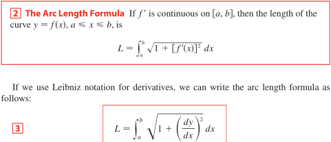

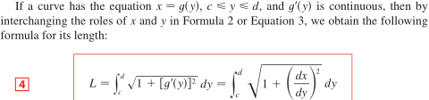

##### 平面区域

曲边梯形面积 $S_D=\int_a^b|f(x)|dx$

平面面积 $S_D=\iint_Dd\sigma$

##### 空间区域

曲顶柱体体积 $V=\iint_D|z(x,y)|d\sigma$

空间体积 $V=\iiint_\Omega dv$

##### 空间曲线

曲线弧长 $L=\int_\Gamma dr=\int_\alpha^\beta \sqrt{x'^2(t)+y'^2(t)+z'^2(t)}dt$

##### 空间曲面薄片

曲面面积 $S_{\Sigma}=\iint_\Sigma dS=\iint_{D_{xy}}\sqrt{1+z'^2_x+z'^2_y}dxdy=\iint_{D_{yz}}\sqrt{1+x'^2_y+x'^2_z}dydz=\iint_{D_{zx}}\sqrt{1+y'^2_z+y'^2_x}dzdx$

#### 重心/质心，形心 $\rho=C$

##### 平面薄片 D

面密度$\rho(x,y)$，重心$(\bar x,\bar y)=(\frac{\iint_Dx\rho(x,y)d\sigma}{\iint_D\rho(x,y)d\sigma},\frac{\iint_Dy\rho(x,y)d\sigma}{\iint_D\rho(x,y)d\sigma})$

形心$(\bar x,\bar y)=\frac{1}{S_D}(\iint_Dxd\sigma,\iint_Dyd\sigma)$

##### 空间物体$\Omega$

体密度$\rho(x,y,z)$，重心$(\bar x,\bar y,\bar z)=(\frac{\iiint_\Omega x\rho(x,y,z)dv}{\iiint_\Omega \rho(x,y,z)dv},\frac{\iiint_\Omega y\rho(x,y,z)dv}{\iiint_\Omega \rho(x,y,z)dv},\frac{\iiint_\Omega z\rho(x,y,z)dv}{\iiint_\Omega \rho(x,y,z)dv})$

形心$(\bar x,\bar y,\bar z)=\frac{1}{V_\Omega}(\iiint_\Omega xdv,\iiint_\Omega ydv,\iiint_\Omega zdv)$

##### 曲线 L

线密度$\rho(x,y,z)$，重心$(\bar x,\bar y,\bar z)=(\frac{\int_L x\rho(x,y,z)dr}{\int_L \rho(x,y,z)dr},\frac{\int_L y\rho(x,y,z)dr}{\int_L \rho(x,y,z)dr},\frac{\int_L z\rho(x,y,z)dr}{\int_L \rho(x,y,z)dr})$

形心$(\bar x,\bar y,\bar z)=\frac{1}{L}(\int_L xdr,\int_L ydr,\int_L zdr)$

##### 曲面薄片$\Sigma$

面密度$\rho(x,y,z)$，重心$(\bar x,\bar y,\bar z)=(\frac{\iint_\Sigma x\rho(x,y,z)dS}{\iint_\Sigma \rho(x,y,z)dS},\frac{\iint_\Sigma y\rho(x,y,z)dS}{\iint_\Sigma \rho(x,y,z)dS},\frac{\iint_\Sigma z\rho(x,y,z)dS}{\iint_\Sigma \rho(x,y,z)dS})$

形心$(\bar x,\bar y,\bar z)=\frac{1}{S_\Sigma}(\iint_\Sigma xdS,\iint_\Sigma ydS,\iint_\Sigma zdS)$

#### 转动惯量

转动惯量：一个物体保持其转动状态能力大小的物理量

形状体积质量相同时，质量分布越集中于转动轴，转动惯量越小，角速度越快；转动惯量越大，转动时间更长

$I=\Sigma_ir_i^2m_i, m_i$ 质点微元的质量，$r_i$ 质元与转轴距离

##### 平面薄片 D

面密度$\rho(x,y)$，薄片对 x 轴，y 轴和原点 O 的转动惯量：

$I_x=\iint_Dy^2\rho(x,y)d\sigma,I_y=\iint_Dx^2\rho(x,y)d\sigma,I_O=\iint_D(x^2+y^2)\rho(x,y)d\sigma$

##### 空间物体$\Omega$

体密度$\rho(x,y,z)$，$I_x=\iiint_\Omega (y^2+z^2)\rho(x,y,z)dv,I_y=\iiint_\Omega (z^2+x^2)\rho(x,y,z)dv$

$I_z=\iiint_\Omega (x^2+y^2)\rho(x,y,z)dv,I_O=\iiint_\Omega (x^2+y^2+z^2)\rho(x,y,z)dv$

##### 曲线 L

线密度$\rho(x,y,z)$，$I_x=\int_L (y^2+z^2)\rho(x,y,z)dr,I_y=\int_L (z^2+x^2)\rho(x,y,z)dr$

$I_z=\int_L (x^2+y^2)\rho(x,y,z)dr,I_O=\int_L (x^2+y^2+z^2)\rho(x,y,z)dr$

##### 曲面薄片$\Sigma$

面密度$\rho(x,y,z)$，$I_x=\iint_\Sigma (y^2+z^2)\rho(x,y,z)dS, I_y=\iint_\Sigma (z^2+x^2)\rho(x,y,z)dS$

$I_z=\iint_\Sigma (x^2+y^2)\rho(x,y,z)dS, I_O=\iint_\Sigma (x^2+y^2+z^2)\rho(x,y,z)dS$

#### 引力

## 二型曲线、曲面积分

向量场

### 二型对坐标曲线积分

在向量场沿曲线 做功，F 与 s 同向时做正功，反向时做负功

$\pmb{F}(x,y,z)=P(x,y,z)\pmb{i}+Q(x,y,z)\pmb{j}+R(x,y,z)\pmb{k}$

$d\pmb{r}=\pmb{T}dr=(cos\alpha, cos\beta, cos\gamma)dr=dx\pmb{i}+dy\pmb{j}+dz\pmb{k}$

$W=\int_{\Gamma}\pmb{F}·d\pmb{r}=\int_{\Gamma}\pmb{F·T}dr=\int_{\Gamma}Pdx+Qdy+Rdz$ （化为单变量定积分）

$W=\int_\Gamma\pmb{F}·\frac{d\pmb{r}}{dt}dt=\int_a^b(Px'(t)+Qy'(t)+Rz'(t))dt$ （参数式 t 变量定积分）

#### 二型曲线对称性

- 有向曲线 关于 y 轴对称，位移微分向量 dx 方向(符号)不变，场分量 P 关于 x 为奇，则$\int_LPdx$ (做功)=0
- 有向曲线 关于 y 轴对称，位移微分向量 dy 方向(符号)改变，场分量 Q 关于 x 为偶，则$\int_LQdy$ (做功)=0
- 有向曲线 关于 x 轴对称，位移微分向量 dx 方向(符号)改变，场分量 P 关于 y 为偶，则$\int_LPdx$ (做功)=0
- 有向曲线 关于 x 轴对称，位移微分向量 dy 方向(符号)不变，场分量 Q 关于 y 为奇，则$\int_LQdy$ (做功)=0

#### 平面二型曲线计算

##### 基本-化定积分

##### 格林公式（闭合曲线积分—曲面积分）

$\int_a^bF'(x)dx=F(b)-F(a)$

平面闭区域 D 上的二重积分可以通过沿闭区域 D 的边界曲线 L 上的曲线积分来表示

1. D 封闭区域(L 封闭曲线)，2. L 正方向：左手在 D 内，3. P、Q 有一阶连续偏导数

   > $\iint_D \frac{\partial P}{\partial y}dxdy=\int_a^b(P(x,y_2(x))-P(x,y_1(x)))dx=-\oint_L Pdx$
   >
   > $\iint_D \frac{\partial Q}{\partial x}dxdy=\int_c^d(Q(x_2(y),y)-Q(x_1(y),y))dy=\oint_L Qdy$

   $\oint_{L\pm}P(x,y)dx+Q(x,y)dy=\pm\iint_D(\frac{\partial Q}{\partial x}-\frac{\partial P}{\partial y})dxdy$

   let $P=-y, Q=x, \Rightarrow2\iint_Ddxdy=\oint_Lxdy-ydx, S_D=\frac{1}{2}\oint_Lxdy-ydx$

- 题设：非闭曲线—补线法

  

  解法：1. 分段化单变量定积分，2. 对称性，3. 格林公式-补线

- 题设：含非一阶连续偏导点——挖点法(外线内线各一次格林公式)

  

  对复连通区域 D1 使用格林公式，力场沿[外线-内线]与[内线-外线]的路径做功抵消：

  $\iint_{D_1}(\frac{\partial Q}{\partial x}-\frac{\partial P}{\partial y})dxdy=\oint_{L+l}Pdx+Qdy$

  $\oint_L=\oint_{L^++C^-}-\oint_{C^-}=\oint_{L^++C^-}+\oint_{C^+}$

##### 平面上曲线积分与路径无关的条件

**定理**：区域 G 单连通，P、Q 在 G 内一阶偏导连续；

$\int_LPdx+Qdy$ 在 G 内与路径无关$\Leftrightarrow\oint_LPdx+Qdy=0$沿 G 内任意闭曲线积分为 0

$\Leftrightarrow\frac{\partial P}{\partial y}=\frac{\partial Q}{\partial x}$

$\Leftrightarrow\exist$ 可微势函数 $f(x,y)$, 全微分 $df=Pdx+Qdy, f^{''}_{xy}=f^{''}_{yx}$

**计算势函数**

- $f(x,y)=\int_{(a,b)}^{(x,y)}Pdx+Qdy=\int_{a}^{x}P(x,b)dx+\int_{b}^{y}Q(x,y)dy$
- 待定函数法：$f(x,y)=\int Pdx, f'_y=Q$​
- 凑微分法：$d(uv)=vdu+udv,d(\frac{u}{v})=\frac{vdu-udv}{v^2}$

###### 全微分方程

$\exist$ 可微函数 $f(x,y)$, 全微分 $df=Pdx+Qdy=0\Rightarrow f(x,y)=C$ 隐式通解

#### 曲线积分基本定理

空间区域 $\Omega$ 内的向量场 $\pmb{F}=P\pmb{i}+Q\pmb{j}+R\pmb{k}$，分量 P,Q,R 在 $\Omega$ 内连续

$\exist$​ 可微势函数 $f, \pmb{F}=\nabla f\Rightarrow\forall A,B\in \Omega, \int_A^B\pmb{F}·d\pmb{r}$​ 与 $\Omega$​ 内连接 A,B 的路径无关

$\int_C\pmb{F}·d\pmb{r}=\int_a^b\pmb{F(r)}·\frac{d\pmb{r}}{dt}dt=\int_a^b\frac{df}{dt}dt=f(x(t),y(t),z(t))|_a^b=f(B)-f(A)$​

#### 空间二型曲线计算

##### 斯托克斯公式 1.18.7, 1.18.17

$\Sigma$ 为空间某区域$\Omega$内的光滑有向曲面片，$\Gamma$ 为$\Sigma$的光滑边界，方向与$\Sigma$的法向量成右手系，P、Q、R 在$\Omega$内具有连续的一阶偏导数，取 $\Gamma$ 所围平面 $z=z(x,y)$ 的单位外法向 $\pmb{n}=(cos\alpha,cos\beta,cos\gamma)=\frac{\pmb{\nabla g}}{|\nabla g|}$，

> $\iint_\Sigma \frac{\partial P}{\partial z}dzdx-\frac{\partial P}{\partial y}dxdy=\iint_\Sigma (\frac{\partial P}{\partial z}\frac{cos\beta}{cos\gamma}-\frac{\partial P}{\partial y})dxdy=-\iint_\Sigma (\frac{\partial P}{\partial z}z'_y+\frac{\partial P}{\partial y})dxdy$
>
> $=-\iint_{D_{xy}}\frac{\partial}{\partial y}P(x,y,z(x,y))dxdy\xlongequal{格林}\oint_CP(x,y,z(x,y))dx=\oint_\Gamma P(x,y,z)dx$
>
> $\iint_\Sigma \frac{\partial Q}{\partial x}dxdy-\frac{\partial Q}{\partial z}dydz=\oint_\Gamma Qdy$
>
> $\iint_\Sigma \frac{\partial R}{\partial y}dydz-\frac{\partial R}{\partial x}dzdx=\oint_\Gamma Rdz$

$$
\oint_\Gamma Pdx+Qdy+Rdz=\iint_\Sigma \left|
\begin{array}{ccc}
cos\alpha & cos\beta & cos\gamma\\
\frac{\partial }{\partial x} & \frac{\partial }{\partial y} & \frac{\partial }{\partial z}\\
P & Q & R
\end{array}
\right| dS=\iint_\Sigma \left|
\begin{array}{ccc}
dydz & dzdx & dxdy\\
\frac{\partial }{\partial x} & \frac{\partial }{\partial y} & \frac{\partial }{\partial z}\\
P & Q & R
\end{array}
\right|=\iint_\Sigma \pmb{rot F·n}dS
$$

$$=\iint_\Sigma ((\frac{\partial R}{\partial y}-\frac{\partial Q}{\partial z})cos\alpha+(\frac{\partial P}{\partial z}-\frac{\partial R}{\partial x})cos\beta+(\frac{\partial Q}{\partial x}-\frac{\partial P}{\partial y})cos\gamma)dS$$

$$=\iint_\Sigma (\frac{\partial R}{\partial y}-\frac{\partial Q}{\partial z})dydz+(\frac{\partial P}{\partial z}-\frac{\partial R}{\partial x})dzdx+(\frac{\partial Q}{\partial x}-\frac{\partial P}{\partial y})dxdy$$

> 结论：向量场 F 沿有向闭曲线 $\Gamma$ 的环流量=向量场 F 的旋度通过曲面 $\Sigma$ 的通量

#### 环流量

$W=\oint_{\Gamma}\pmb{F}·d\pmb{r}=\oint_{\Gamma}\pmb{F·T}dr=\oint_{\Gamma}Pdx+Qdy+Rdz$ （化为单变量定积分）

$W=\oint_\Gamma\pmb{F}·\frac{d\pmb{r}}{dt}dt=\oint_a^b(Px'(t)+Qy'(t)+Rz'(t))dt$ （参数式 t 变量定积分）

#### 环量密度(旋度)

$$
\pmb{rot F}=\pmb{\nabla\times F}=\left|
\begin{array}{ccc}
\pmb{i} & \pmb{j} & \pmb{k}\\
\frac{\partial }{\partial x} & \frac{\partial }{\partial y} & \frac{\partial }{\partial z}\\
P & Q & R
\end{array}
\right|=(\frac{\partial R}{\partial y}-\frac{\partial Q}{\partial z})\pmb{i}+(\frac{\partial P}{\partial z}-\frac{\partial R}{\partial x})\pmb{j}+(\frac{\partial Q}{\partial x}-\frac{\partial P}{\partial y})\pmb{k}
$$

### 二型对坐标曲面积分

向量场沿曲面 g(x,y,z)=c 外法向的通量(流量)，通量正-源，通量负-汇

通量=$\iint_\Sigma\pmb{F·n}d\sigma$

速度场 $\pmb{F}(x,y,z)=P(x,y,z)\pmb{i}+Q(x,y,z)\pmb{j}+R(x,y,z)\pmb{k}$

$d\pmb{S}=\pmb{n}dS=\frac{\pmb{\nabla g}}{|\nabla g|}dS=(cos\alpha,cos\beta,cos\gamma)dS$

$=(cos\alpha\frac{1}{|cos\alpha|}dydz,cos\beta\frac{1}{|cos\beta|}dxdz,cos\gamma\frac{1}{|cos\gamma|}dxdy)$

$=(\pm dydz,\pm dxdz,\pm dxdy)$ 正负号取决于外法向与投影坐标面法向量(正轴)的方向余弦

$\iint_\Sigma\pmb{F}·d\pmb{S}=\iint_\Sigma\pmb{F·n}dS=\iint_\Sigma (Pcos\alpha+Qcos\beta+Rcos\gamma)dS\\=\iint_\Sigma Pdydz+Qdxdz+Rdxdy=\pm\iint_{D_{yz}}Pdydz\pm\iint_{D_{xz}}Qdxdz\pm\iint_{D_{xy}}Rdxdy$

#### 投影坐标面转换

二型曲面积分 => 一型曲面积分 => 二重积分

$\iint_\Sigma P(x,y,z)dydz=\pm\iint_{D_{xy}}P(x,y,z)\frac{cos\alpha}{cos\gamma}dxdy=\mp\iint_{D_{xy}}P(x,y,z)\frac{\partial z}{\partial x}dxdy$

$\iint_\Sigma Pdydz+Qdxdz+Rdxdy=\pm\iint_{D_{yz}} (P-Q\frac{\partial x}{\partial y}-R\frac{\partial x}{\partial z})dydz$

$=\pm\iint_{D_{zx}} (-P\frac{\partial y}{\partial x}+Q-R\frac{\partial y}{\partial z})dzdx=\pm\iint_{D_{xy}} (-P\frac{\partial z}{\partial x}-Q\frac{\partial z}{\partial y}+R)dxdy$

#### 二型曲面对称性

- 曲面关于 yOz 坐标面对称，外法向$\pmb{n}$关于 x 轴的方向余弦变号（dydz 变号）;

  场分量 P 关于 x 为偶，通量$\iint_\Sigma Pdydz=0$，场分量 P 关于 x 为奇，通量$\iint_\Sigma Pdydz=2\iint_{\Sigma_1}Pdydz$

- 曲面关于 xOz 坐标面对称，外法向$\pmb{n}$关于 y 轴的方向余弦变号（dxdz 变号）；

  场分量 Q 关于 y 为偶，通量$\iint_\Sigma Qdxdz=0$，场分量 Q 关于 y 为奇，通量$\iint_\Sigma Qdxdz=2\iint_{\Sigma_1} Qdxdz$

- 曲面关于 xOy 坐标面对称，外法向$\pmb{n}$关于 z 轴的方向余弦变号（dxdy 变号）；

  场分量 R 关于 z 为偶，通量$\iint_\Sigma Rdxdy=0$，场分量 R 关于 z 为奇，通量$\iint_\Sigma Rdxdy=2\iint_{\Sigma_1}Rdxdy$

 

 

#### 二型曲面计算

##### 基本-化二重积分

##### 高斯公式

1. $\Sigma$封闭曲面(封闭区域$\Omega$)，2. $\Sigma$取外侧，3. P,Q,R 有一阶连续偏导数

   > $\iiint_\Omega \frac{\partial R}{\partial z}dv=\iint_{D_{xy}}[R(x,y,z_2(x,y))-R(x,y,z_1(x,y))]dxdy=\oiint_\Sigma Rdxdy$

   $\oiint_\Sigma \pmb{F·n}dS=\oiint_\Sigma (Pcos\alpha+Qcos\beta+Rcos\gamma)dS=\oiint_\Sigma Pdydz+Qdxdz+Rdxdy$

   $=\iiint_\Omega (\frac{\partial P}{\partial x}+\frac{\partial Q}{\partial y}+\frac{\partial R}{\partial z})dv=\iiint_\Omega div \pmb{F}dv=\iiint_\Omega \pmb{\nabla·F}dv$

   > 结论：向量场 F 通过闭曲面 $\Sigma$ 流向外侧的通量=向量场 F 的散度在闭曲面 $\Sigma$ 所围闭区域 $\Omega$ 上的积分

- 题设：$\Sigma$不封闭，$\Omega$非有界闭区域——补面法

  

  $\iint_{\Sigma}=\oiint_{\Sigma+\Sigma_1}-\iint_{\Sigma_1}$

- 题设：P,Q,R,$\frac{\partial P}{\partial x},\frac{\partial Q}{\partial y},\frac{\partial R}{\partial z}$ 在$\Omega$上不连续(如分母无定义点)——挖洞法

  

  $\oiint_{\Sigma_{out}}=\oiint_{\Sigma_{out}+\Sigma'_{in}}-\oiint_{\Sigma'_{in}}=\oiint_{\Sigma_{out}+\Sigma'_{in}}+\oiint_{\Sigma'_{out}}$

#### 通量密度(散度)

> 定积分中值：$\int_a^bf(x)dx=(b-a)f(\xi)$ 计算平面面积，取 y 高度均值
>
> 二重积分中值：$\iint_D f(x,y)dxdy=S_Df(\xi,\eta)$ 计算空间体积，取 z 高度均值
>
> 三重积分中值：$\iiint_\Omega f(x,y,z)dxdydz=V_\Omega f(\xi,\eta,\zeta)$ 计算空间质量，取密度均值

$div \pmb{F}=\pmb{\nabla·F}=\frac{\partial P}{\partial x}+\frac{\partial Q}{\partial y}+\frac{\partial R}{\partial z}=\lim\limits_{\Omega\to (x,y,z)}\frac{1}{V}\iiint_\Omega (\frac{\partial P}{\partial x}+\frac{\partial Q}{\partial y}+\frac{\partial R}{\partial z})dv=\lim\limits_{\Omega\to (x,y,z)}\frac{1}{V}\oiint_\Sigma \pmb{F·n}dS$

- 散度>0 的点为正源，流体向外发散；

- 散度<0 的点为负源(汇或洞)，流体向该点汇聚吸收；

---

### 向量场积分

#### 向量场

三维向量场：$\pmb{F}(x,y,z)=M(x,y,z)\pmb{i}+N(x,y,z)\pmb{j}+P(x,y,z)\pmb{k}$

如：力场、速度场，电磁场

##### 梯度场

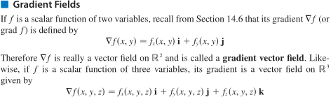

数量函数 $f(x,y,z)$的梯度场：$\nabla f=\frac{\partial f}{\partial x}\pmb{i}+\frac{\partial f}{\partial y}\pmb{j}+\frac{\partial f}{\partial z}\pmb{k}$

**保守场与势函数**：保守场 F 是一个势函数 f 的梯度。$\exist\ f, \nabla f=F$​​

#### 线积分

##### 力沿曲线做的功

空间力场：$\pmb{F}(x,y,z)=M(x,y,z)\pmb{i}+N(x,y,z)\pmb{j}+P(x,y,z)\pmb{k}$

空间曲线：$\pmb{r}(t)=x(t)\pmb{i}+y(t)\pmb{j}+z(t)\pmb{k}, a\le t\le b$

$F·T$沿曲线的积分即 力 F 沿曲线从 a 到 b 所作的功, T 为单位切向量
变力 F 沿曲线 r(t)做功：

$W=\int_{t=a}^{t=b}\pmb{F·T}ds=\int_{t=a}^{t=b}\pmb{F}·d\pmb{r}$

$=\int_a^b\pmb{F}·\frac{d\pmb{r}}{dt}dt$

$=\int_a^b(M\frac{dx}{dt}+N\frac{dy}{dt}+P\frac{dz}{dt})dt$

$=\int_a^bMdx+Ndy+Pdz$

空间速度场：$\pmb{F}(x,y,z)=M(x,y,z)\pmb{i}+N(x,y,z)\pmb{j}+P(x,y,z)\pmb{k}$

空间曲线：$\pmb{r}(t)=x(t)\pmb{i}+y(t)\pmb{j}+z(t)\pmb{k}, a\le t\le b$

流量积分：$\int_a^b\pmb{F·T}ds$

环流量积分：$\oint_a^b\pmb{F·T}ds$（闭曲线）

**穿过平面内一闭曲线的流量：**

平面内向量场 $\pmb{F}(x,y)=M(x,y)\pmb{i}+N(x,y)\pmb{j}$，光滑闭曲线 C，n 为 C 的单位外法向量，则 F 穿过 C 的流量：
$\int_C\pmb{F·n}ds$

假定 C 以逆时针运行，

$\pmb{n}=\pmb{T}\times \pmb{k}=(\frac{dx}{ds}\pmb{i}+\frac{dy}{ds}\pmb{j})\times \pmb{k}=\frac{dy}{ds}\pmb{i}-\frac{dx}{ds}\pmb{j}$

$\int_C\pmb{F·n}ds=\int_C(M\frac{dy}{ds}-N\frac{dx}{ds})ds=\oint_CMdy-Ndx$

#### 线积分基本定理

> 微积分基本定理：$\int_a^b f'(x)dx = f(b)-f(a)$

##### 线积分基本定理

> 曲线 $C:\pmb{r}(t),a\le t\le b$​​​， f 在 C 上一阶偏导连续，即梯度向量 $\nabla f$​​​ 连续 $\Rightarrow \int_C \nabla f·d\pmb{r}=f(\pmb{r}(b))-f(\pmb{r}(a))$​​​
>
> 推论：曲线 $C_1, C_2$​​​ 具有相同点起点与终点， f 在 C 上一阶偏导连续（梯度向量场 $F=\nabla f$​​​ 连续）$\Rightarrow \int_{C_1} \nabla f·d\pmb{r}=\int_{C_2} \nabla f·d\pmb{r}$​​​​​（F 是保守场且 F 连续 $\Rightarrow$​​ 线积分与路径无关）

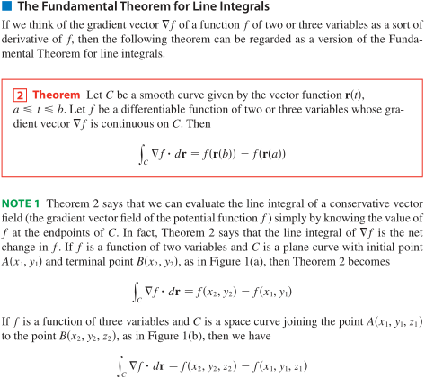

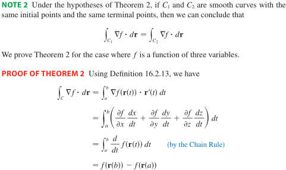

##### 路径无关

非单连通区域：存在一个环路（闭合路径），中间有洞

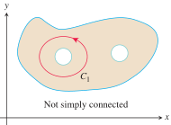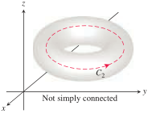

> 对区域D内任意闭合曲线C，线积分 $\int_C \pmb{F}·d\pmb{r}$​ 与路径无关 $\Leftrightarrow\int_C \pmb{F}·d\pmb{r}=0$​

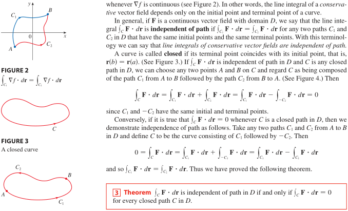

> 在连通开区域D内，向量场 F 连续，$\int_C \pmb{F}·d\pmb{r}$  与路径无关 $\Rightarrow F 是保守场, 即\ \exist\ 势函数f, \nabla f=F$​
>
> 推论：在连通开区域D内，向量场 F 连续，则有等价条件结论：F 是保守场 $\Leftrightarrow$​ 线积分与路径无关

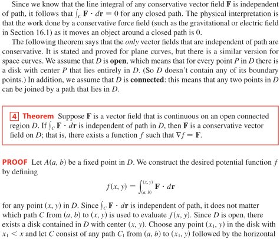

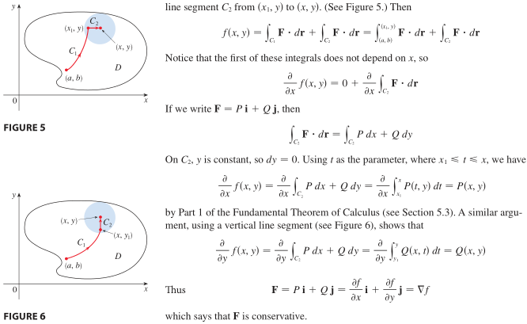

总结：

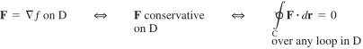

##### 保守场与势函数

> 在连通区域D内，若 $\pmb{F}=P\pmb{i}+Q\pmb{j}$​​ 是保守场，P, Q 有一阶连续偏导数 $\Rightarrow \frac{\partial P}{\partial y}=\frac{\partial Q}{\partial x}$​​
>
> 推论：在连通区域D内，向量场 F 有一阶连续偏导数，(F是保守场 $\Leftrightarrow$​ 线积分与路径无关) $\Rightarrow \frac{\partial P}{\partial y}=\frac{\partial Q}{\partial x}$​

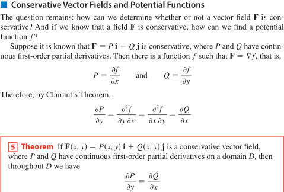

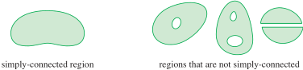

> 判别：在单连通区域D内，向量场 $\pmb{F}=P\pmb{i}+Q\pmb{j}$​​​​，P, Q 有一阶连续偏导数，$\frac{\partial P}{\partial y}=\frac{\partial Q}{\partial x}\Rightarrow$​​​​ F 是保守场
>
> 推论：在单连通区域D内，向量场 F 有一阶连续偏导数，则有等价条件结论：
> (F是保守场 $\Leftrightarrow$ 线积分与路径无关) $\Leftrightarrow\frac{\partial P}{\partial y}=\frac{\partial Q}{\partial x}$

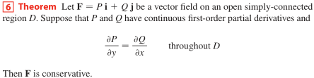

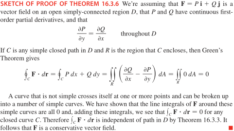

##### 能量守恒

在保守场内，力做功，起点至终点间的动能增加(减少)量 = 起点至终点间的势能减少(增加)量

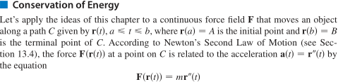

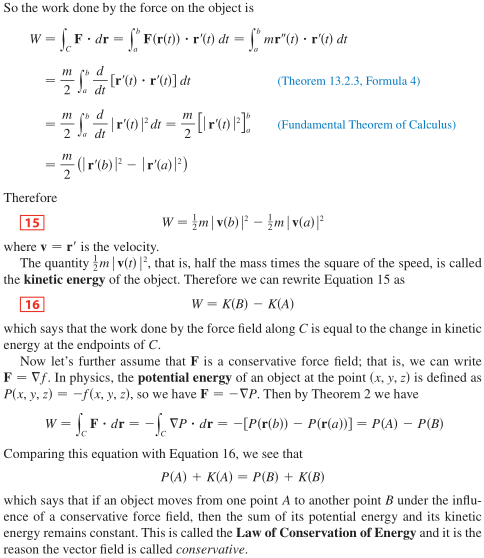

#### 格林定理

> 线积分与二重积分的联系

定义正方向：沿闭合曲线左边的区域被该曲线包围

> 正方向闭合曲线 C 包围着区域 D，向量场 $\pmb{F}=P\pmb{i}+Q\pmb{j}$​​​，P, Q 有一阶连续偏导数 $\Rightarrow \int_C Pdx+Qdy=\iint_D(\frac{\partial Q}{\partial x}-\frac{\partial P}{\partial y})dA$​​

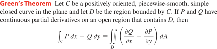

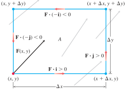

##### 格林定理面积公式

$\iint_DdA,\frac{\partial Q}{\partial x}-\frac{\partial P}{\partial y}=1$

$A=\oint_Cxdy=-\oint_Cydx=1/2\oint_Cxdy-ydx$​

##### 格林定理扩展

- 两个并区域存在公共边界时，对两区域使用格林公式会消去公共曲线积分（互为相反方向）
- 非单连通区域（存在洞）时，区域的曲线边界由内（顺时针）外（逆时针）两曲线组成

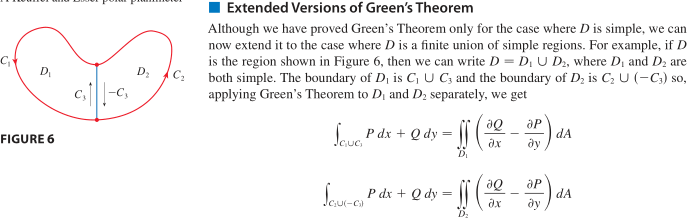

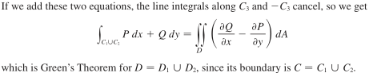

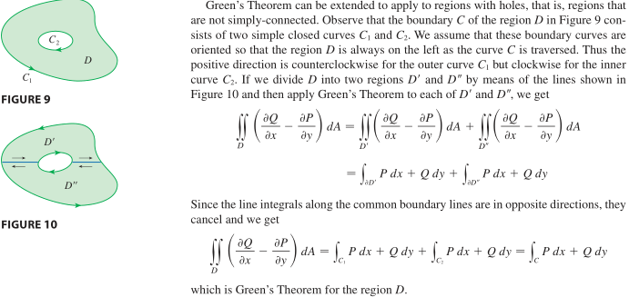

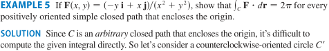

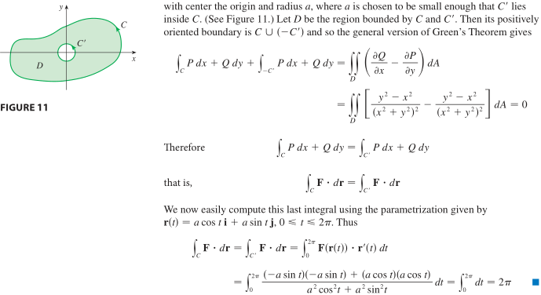

#### 旋度与散度

旋度表现为向量场，散度表现为数量场

##### 旋度

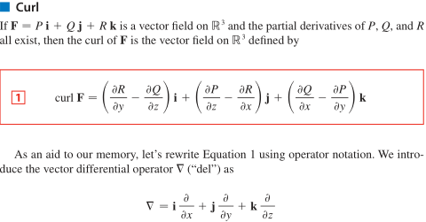

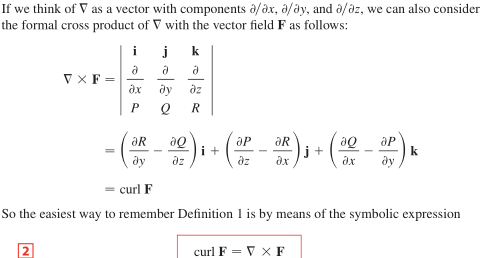

> 三元函数 f 有连续的二阶偏导数 $\Rightarrow curl(\nabla f)=0$​​
>
> 推论：向量场 F 是保守场 $\Rightarrow curl\ F=0$

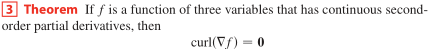

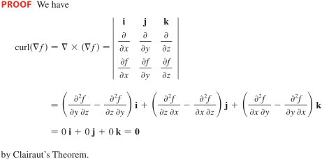

> 定义在域 $R^3$ 上的向量场(保证了单连通) $F=Pi+Qj+Rk$，各分量函数有连续的偏导数，旋度 $curl\ F=0\Rightarrow F$ 是保守场

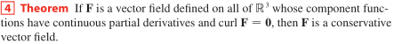

物理含义

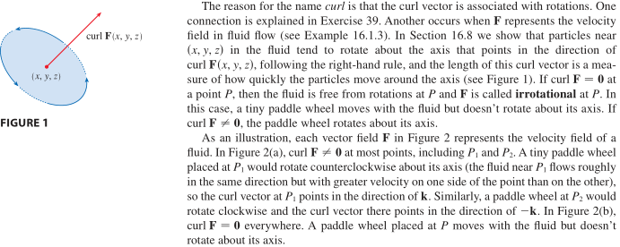

##### 散度

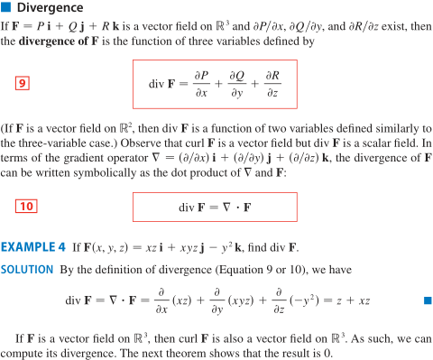

> 定义在域 $R^3$​​​ 上的向量场 $F=Pi+Qj+Rk$​​​，P, Q, R 有连续的二阶偏导数 $\Rightarrow div\ curl\ F=\nabla ·(\nabla\times F)=0$​

源：涌出来>涌入量，汇：涌入量>涌出量，无源：涌入量=涌出量

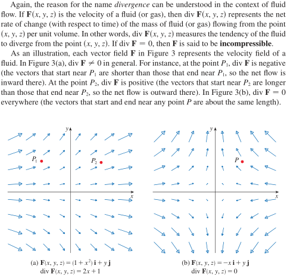

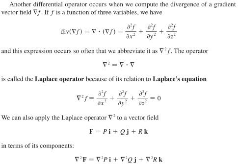

##### 格林定理的向量形式

**用旋度**

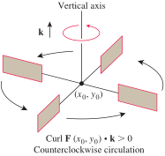

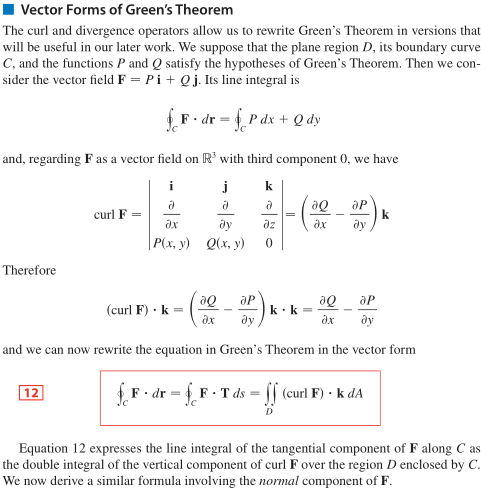

**用散度**

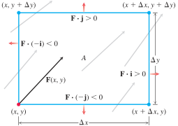

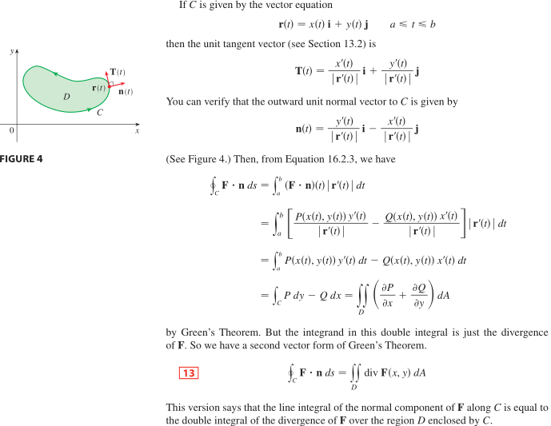

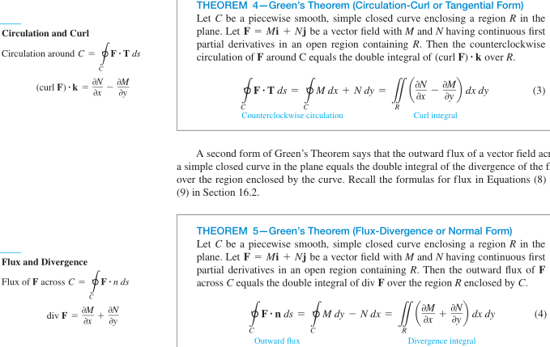

#### 曲面面积和曲面积分

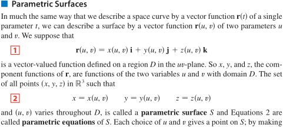

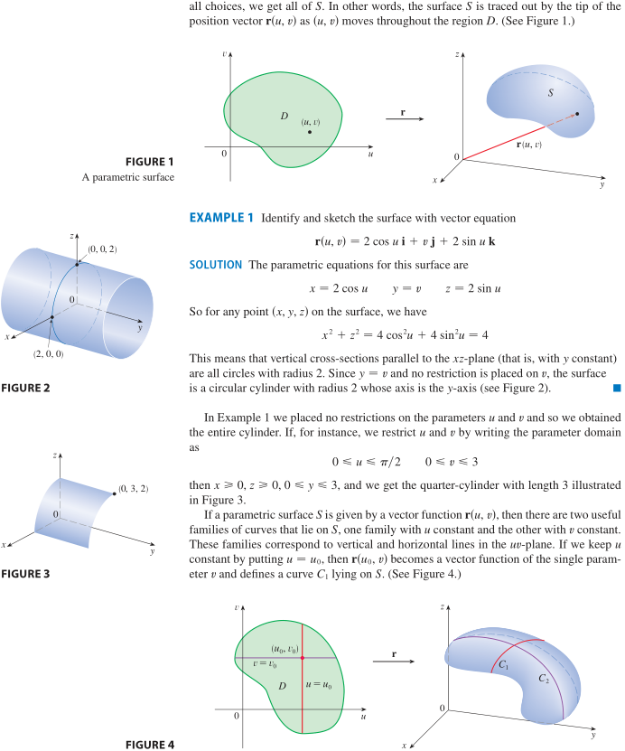

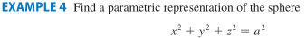

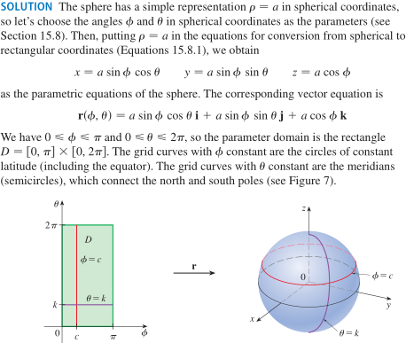

##### 切平面

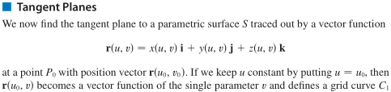

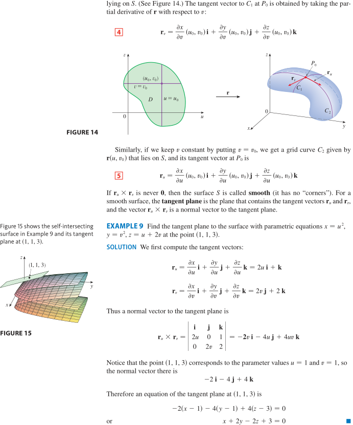

##### 曲面面积

> 光滑参数面方程 $r(u,v)=x(u,v)i+y(u,v)j+z(u,v)k,u,v\in D.$​ 对应的曲面 S 面积： $A(S)=\iint_D|r_u\times r_v|dA$​

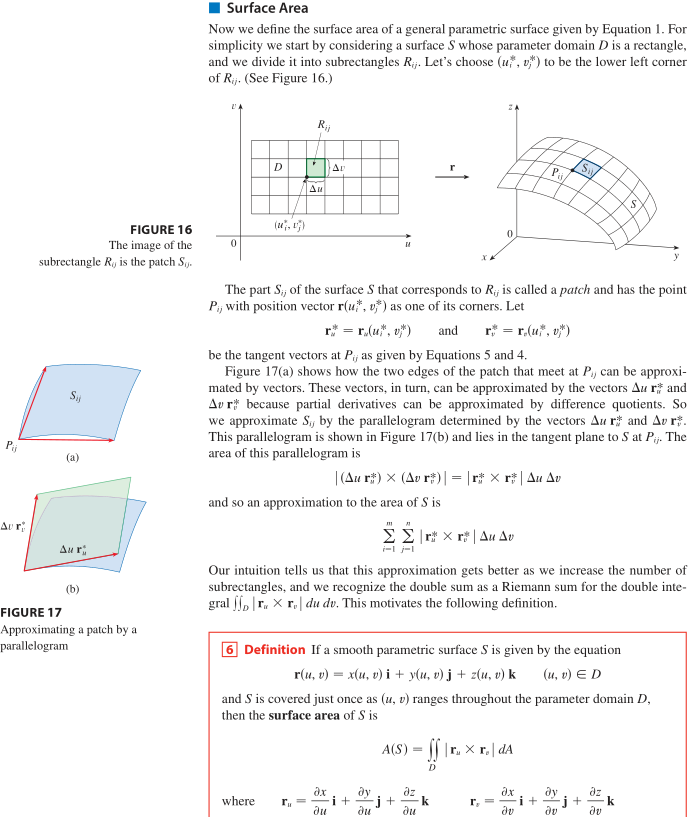

**参数曲面面积**

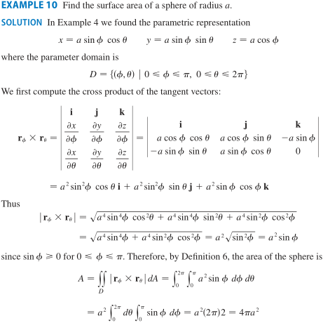

**函数 z=f(x,y) 的曲面面积**

$r_x=(1,0,\frac{\partial f}{\partial x}),r_y=(0,1,\frac{\partial f}{\partial y})$

$\Delta S=|r_x\times r_y|\ 对应\ \Delta A=1·1$，曲面微元面积：坐标面投影微元面积 = $|r_x\times r_y|:1$

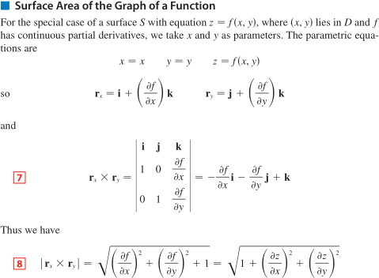

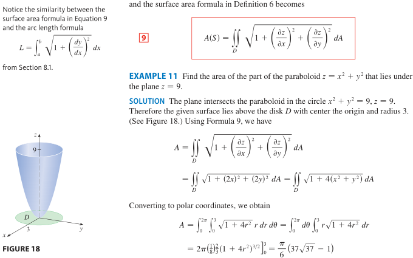

#### 曲面积分

##### 参数曲面

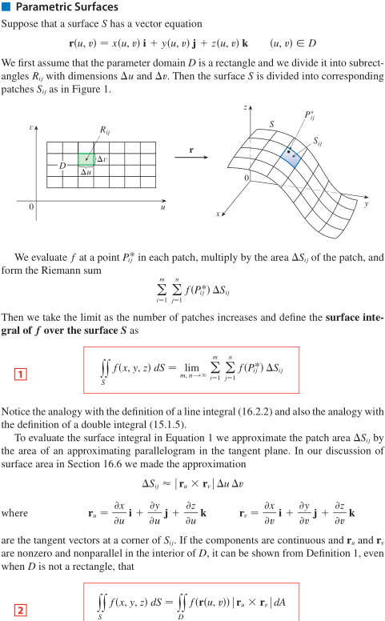

**参数曲面积分**

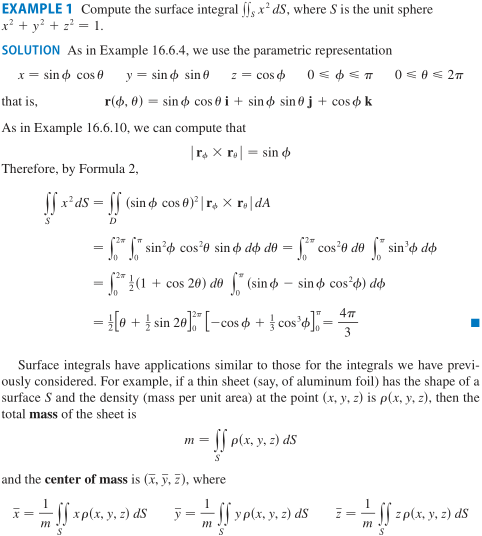

**函数 z=g(x,y) 的曲面积分**

总结：

##### 有向曲面

**函数 z=g(x,y) 的有向曲面的单位法向量**

**向量函数参数式有向曲面的单位法向量**

##### 向量场曲面积分

> 在有向曲面 S 上，向量场 F 连续，单位法向量 n，F 在 S 上的曲面积分 $\iint_S\pmb{F}·d\pmb{S}=\iint_S\pmb{F·n}dS$

**向量函数曲面的向量场积分**

**函数z=f(x,y)曲面的向量场积分**

**隐函数曲面 g(x,y,z)=c 的向量场积分**

#### Stokes 定理

> $R^3$​ 上有向曲面 **S** 以一个简单闭合正向曲线 C 为边界（C 与 S 外法向成右手系），向量场 **F** 的各分量在包含曲面 S 的开区域有连续一阶偏导数 $\Rightarrow \int_C \pmb{F}·d\pmb{r}=\iint_S curl\ \pmb{F}·d\pmb{S}$​

$\int_C \pmb{F·T}dr=\iint_S curl\ \pmb{F·n}dS$

$curl\ F=\nabla\times F$

**格林定理基于平面，是Stokes定理的特别例子**

**以函数 z=g(x,y) 证明 Stokes 定理**

##### 相同有向曲线可对应不同曲面

##### Stokes 定理扩展-有洞

##### 空间曲线-路径无关

> 判别：在 $R^3$ 单连通区域 D 内，向量场 $F=Pi+Qj+Rk$，P,Q,R 有一阶连续偏导数，$\nabla \times F=0\Rightarrow$​​​​​​​​​​​​ F 是保守场，线积分路径无关​（对 D 内任意闭合曲线 C，$\oint_CF·dr=0$​）

##### 总结

#### Gauss 定理

> $R^3$​​ 上闭区域 **E** 被有向闭曲面 **S** 包围，向量场 **F** 的各分量在包含空间闭区域 E 的开区域有连续一阶偏导数 $\Rightarrow \iint_S \pmb{F}·d\pmb{S}=\iiint_E div\ \pmb{F}·dV=\iint_S \pmb{F·n}dS$​

$div\ F=\nabla ·F$

##### Gauss 定理扩展

#### 总结

