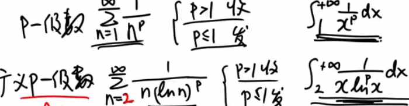
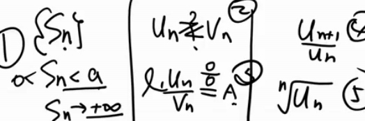
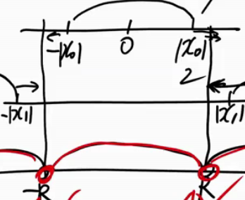
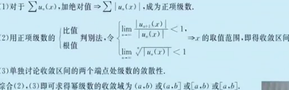
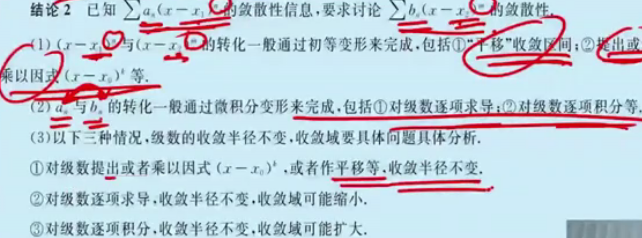
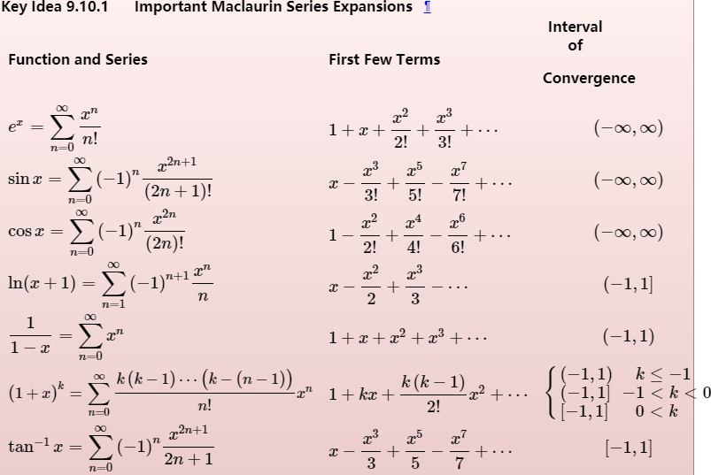
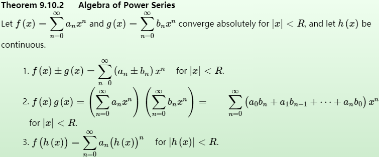

### [无穷级数](https://sites.und.edu/timothy.prescott/apex/web/apex.Ch9.S2.html)
无穷级数：$\Sigma_{n=1}^\infty a_n$，部分和序列：$S_n=\Sigma_{1}^n a_n$

$\lim\limits_{n\to\infty}S_n=\Sigma_{n=1}^\infty a_n=\begin{cases}
L & \text{收敛,部分和有上界}\\
\infty & \text{发散}
\end{cases}$

#### 几何级数
$\Sigma_{n=0}^\infty ar^n$

$r\ne 1$, 部分和 $S_n=\Sigma_{i=0}^{n-1} ar^i=\frac{a(1-r^n)}{1-r}$

$|r|<1$, 级数收敛，$\Sigma_{n=0}^\infty ar^n=\frac{a}{1-r}$

#### 级数性质
$\Sigma_{n=1}^\infty a_n=A, \Sigma_{n=1}^\infty b_n=B$
- 数乘：$\Sigma_{n=1}^\infty c·a_n=c·\Sigma_{n=1}^\infty a_n$
- 线性：$\Sigma_{n=1}^\infty (a_n\pm b_n)=\Sigma_{n=1}^\infty a_n\pm \Sigma_{n=1}^\infty b_n$
- 必要条件：$\lim\limits_{n\to\infty}a_n=0$
- 改变级数任意有限项，级数敛散性不变
- 任意加括号后的新级数仍收敛

**级数收敛必要条件**

$\Sigma_{n=1}^\infty a_n=L\rightarrow \lim\limits_{n\to\infty}a_n=0$

$\lim\limits_{n\to\infty}a_n\ne0\rightarrow \Sigma_{n=1}^\infty a_n$ 发散（逆否）

### [积分测试](https://sites.und.edu/timothy.prescott/apex/web/apex.Ch9.S3.html)
$\int_1^\infty a(x)dx$ 收敛 $\leftrightarrow \Sigma_{n=1}^\infty a_n$ 收敛

$\int_1^\infty a(x)dx$ 发散 $\leftrightarrow \Sigma_{n=1}^\infty a_n$ 发散

#### P级数
p级数 $\Sigma_{n=1}^\infty \frac{1}{n^p}$, $\Sigma_{n=1}^\infty \frac{1}{(an+b)^p}$

$\Sigma_{n=1}^\infty \frac{1}{(an+b)^p}$ 收敛 $\leftrightarrow p>1$

证明：$\int_{1}^{\infty}\frac{1}{(ax+b)^{p}} dx=\lim\limits_{t\to\infty}\int_{1}^{t}\frac{1}{(ax+b)^{p}} dx\\
=\lim\limits_{t\to\infty}\frac{1}{a(1-p)}(ax+b)^{1-p}|_{1}^{t}=\lim\limits_{t\to\infty}\frac{1}{a(1-p)}((at+b)^{1-p}-(a+b)^{1-p})$

> 调和平均数：{a,c,b}, c 满足：$\frac{1}{c}=\frac{1}{2}(\frac{1}{a}+\frac{1}{b})$

**调和级数**：$\Sigma_{n=1}^\infty\frac{1}{an+b}$，$\int_{1}^{\infty}\frac{1}{(ax+b)} dx=\lim\limits_{t\to\infty}\frac{1}{a}(ln|at+b|)_{1}^{t}$

### [比较测试](https://sites.und.edu/timothy.prescott/apex/web/apex.Ch9.S4.html)
$a_n\le b_n$ （大收小收，小散大散）

$\Sigma_{n=1}^\infty b_n$ 收敛 $\rightarrow\Sigma_{n=1}^\infty a_n$ 收敛

$\Sigma_{n=1}^\infty a_n$ 发散 $\rightarrow\Sigma_{n=1}^\infty b_n$ 发散

#### 极限比较测试
$\lim\limits_{n\to\infty}\frac{a_n}{b_n}=L>0 \rightarrow \Sigma_{n=1}^\infty a_n$ 与 $\Sigma_{n=1}^\infty b_n$ 相同敛散性

$\lim\limits_{n\to\infty}\frac{a_n}{b_n}=0, \&\ \Sigma_{n=1}^\infty b_n$ 收敛 $ \rightarrow \Sigma_{n=1}^\infty a_n$ 收敛

$\lim\limits_{n\to\infty}\frac{a_n}{b_n}=\infty, \&\ \Sigma_{n=1}^\infty b_n$ 发散 $ \rightarrow \Sigma_{n=1}^\infty a_n$ 发散

### [交替级数和绝对值收敛](https://sites.und.edu/timothy.prescott/apex/web/apex.Ch9.S5.html)

交替级数：$\Sigma_{n=1}^\infty (-1)^na_n\ or\ \Sigma_{n=1}^\infty (-1)^{n+1}a_n, a_n>0$

**交替级数测试（莱布尼茨判别）**

$a_n>0$，递减，$\lim\limits_{n\to\infty}a_n=0\rightarrow\Sigma_{n=1}^\infty (-1)^na_n\ and\ \Sigma_{n=1}^\infty (-1)^{n+1}a_n$ 收敛

如：$\Sigma_{n=2}^\infty (-1)^{n}\frac{\ln n}{n}$（头几项非递减，后项递减）
$b'(n)=\frac{1-\ln n}{n^2}$，当 $n\ge3, b'(n)<0$

**绝对与条件收敛**

$\Sigma_{n=1}^\infty a_n$绝对收敛：$\Sigma_{n=1}^\infty a_n$收敛，$\Sigma_{n=1}^\infty |a_n|$收敛

$\Sigma_{n=1}^\infty a_n$条件收敛：$\Sigma_{n=1}^\infty a_n$收敛，$\Sigma_{n=1}^\infty |a_n|$发散

如：交替调和级数 $\Sigma_{n=1}^\infty (-1)^{n+1}\frac{1}{n}$ 条件收敛

**绝对收敛定理(性质)**

$\Sigma_{n=1}^\infty |a_n|$ 收敛 $\rightarrow\Sigma_{n=1}^\infty a_n$ 收敛（比值或根值测试）

$\rightarrow\forall \{b_n\}\ as\ \{a_n\}$ 的重排列，$\Sigma_{n=1}^\infty b_n=\Sigma_{n=1}^\infty a_n$

### [ 比值与根值测试](https://sites.und.edu/timothy.prescott/apex/web/apex.Ch9.S6.html)

#### 比值测试

$\lim\limits_{n\to\infty}|\frac{a_{n+1}}{a_{n}}|=L$

$L<1\rightarrow \Sigma_{n=1}^\infty a_n$收敛

$L>1\rightarrow \Sigma_{n=1}^\infty a_n$发散

如：含阶乘项

#### 根值测试

$\lim\limits_{n\to\infty}|a_n|^{1/n}=L$

$L<1\rightarrow \Sigma_{n=1}^\infty a_n$收敛

$L>1\rightarrow \Sigma_{n=1}^\infty a_n$发散

如：每项都含指数幂 $a_n=(b_n)^n$

### 正项级数敛散性判别总结

### [幂级数](https://sites.und.edu/timothy.prescott/apex/web/apex.Ch9.S8.html)

> 函数项级数：$\Sigma_{n=1}^\infty u_n(x), x\in I.\ x=x_0, \Sigma_{n=1}^\infty u_n(x_0)$ 为常数项级数

$\Sigma_{n=0}^\infty a_nx^n=a_0+a_1x+a_2x^2+...$

$\Sigma_{n=0}^\infty a_n(x-c)^n=a_0+a_1(x-c)+a_2(x-c)^2+...$ (x以c为中心)

幂级数系数：$a_n$

**收敛点与发散点**

$\exist x_0\in I, \Sigma_{n=1}^\infty u_n(x_0)$ 收敛

$\exist x_0\in I, \Sigma_{n=1}^\infty u_n(x_0)$ 发散

**Abel定理**

$\exist x=x_0, \Sigma_{n=0}^\infty a_n(x-c)^n$ 收敛 $\rightarrow\forall x:|x-c|<|x_0-c|,\ \Sigma_{n=0}^\infty a_n(x-c)^n$ 绝对收敛

$\exist x=x_0, \Sigma_{n=0}^\infty a_n(x-c)^n$ 发散 $\rightarrow\forall x:|x-c|>|x_0-c|,\ \Sigma_{n=0}^\infty a_n(x-c)^n$ 发散

**推论**

$\exist x=x_0, \Sigma_{n=0}^\infty a_n(x-c)^n$ 收敛 $\rightarrow$ 收敛半径$R\ge|x_0-c|$

$\exist x=x_0, \Sigma_{n=0}^\infty a_n(x-c)^n$ 发散 $\rightarrow$ 收敛半径$R\le|x_0-c|$

$\exist x=x_0, \Sigma_{n=0}^\infty a_n(x-c)^n$ 条件收敛 $\rightarrow$ 收敛半径$R=|x_0-c|$

**幂级数收敛性(半径与区间)**

满足下列其中一种情况：

1. 当且仅当$x=c, \Sigma_{n=0}^\infty a_n(x-c)^n$ 收敛， $R=0$
2. $\forall x, \Sigma_{n=0}^\infty a_n(x-c)^n$ 收敛， $R=\infty$
3. $\exist R>0, x\in(c-R, c+R)\ or\ |x-c|<R, \Sigma_{n=0}^\infty a_n(x-c)^n$ 收敛

**幂级数与绝对值幂级数收敛半径定理**

$\Sigma_{n=0}^\infty a_n(x-c)^n\ and\ \Sigma_{n=0}^\infty |a_n(x-c)^n|$ 有相同收敛半径

可使用**比值、根值测试**得出收敛半径与区间，端点开闭需单独判断

$\lim\limits_{n\to\infty}|\frac{u_{n+1}(x)}{u_{n}(x)}|<1$ 得x取值范围，收敛半径R

$\lim\limits_{n\to\infty}|u_{n}(x)|^{1/n}<1$ 得x取值范围，收敛半径R

**求函数项级数收敛域**

**抽象幂级数敛散性**

#### 幂级数(和)函数

$S(x)=\Sigma_{n=0}^\infty a_nx^n$

**运算法则**

$\Sigma_{n=0}^\infty a_nx^n\ and\ \Sigma_{n=0}^\infty b_nx^n$ 收敛半径 $R_a, R_b$
1. $k\Sigma_{n=0}^\infty a_nx^n=\Sigma_{n=0}^\infty ka_nx^n, |x|<R_a$
2. $\Sigma_{n=0}^\infty a_nx^n\pm\Sigma_{n=0}^\infty b_nx^n=\Sigma_{n=0}^\infty k(a_n\pm b_n)x^n, |x|<min\{R_a, R_b\}$
3. 通项&下标统一变形
   - 下标变，通项不变：$\Sigma_{n=k}^\infty a_nx^n=a_kx^k+...+a_{k+l-1}x^{k+l-1}+\Sigma_{n=k+l}^\infty a_nx^n$
   - 下标不变，通项变：$\Sigma_{n=k}^\infty a_nx^n=x^l\Sigma_{n=k}^\infty a_nx^{n-l}$
   - 下标、通项都变：$\Sigma_{n=k}^\infty a_nx^n=\Sigma_{n=k+l}^\infty a_{n-l}x^{n-l}=\Sigma_{n=k-l}^\infty a_{n+l}x^{n+l}$
   
   如：$\Sigma_{n=0}^\infty a_{n}x^{2n}+\Sigma_{n=0}^\infty b_{n+1}x^{2n+2}=a_0+\Sigma_{n=1}^\infty a_{n}x^{2n}+\Sigma_{n=1}^\infty b_{n}x^{2n}\\=a_0+\Sigma_{n=0}^\infty (a_n+b_n)x^{2n}$

**幂级数和函数的导数与不定积分**

$S(x)=\Sigma_{n=0}^\infty a_n(x-c)^n$ 收敛半径 R
- $S(x)$ 在 $(c-R, c+R)$ 连续，任意阶可导

- $S'(x)=\Sigma_{n=1}^\infty a_nn(x-c)^{n-1}$ 收敛半径 R，收敛域可能缩小

- $\int S(x)dx=C+\Sigma_{n=0}^\infty a_n\frac{(x-c)^{n+1}}{n+1}$ 收敛半径 R ，收敛域可能扩大

  $\int_0^x S(t)dt=\Sigma_{n=0}^\infty a_n\int_0^x t^ndt=\Sigma_{n=0}^\infty a_n\frac{(x-c)^{n+1}}{n+1}$ 

**求幂级数的和函数**

利用逐项求导、逐项积分性质，结合常见函数的麦克劳林展开式求

- 先逐项导后积：$S(x)=S(c)+\int_c^x S'(t)dt$

  $\Sigma_n^\infty u_n(x)=v(x)\Sigma_n^\infty \frac{(x-c)^{kn}}{n}=v(x)S_1(x),\ S_1^{'}(x)=k(x-c)^{k-1}\Sigma_n^\infty (x-c)^{k(n-1)}=T(x), |x-c|<1$

  $S(x)=v(x)S_1(x)=v(x)(S_1(c)+\int_{c}^x T(t) dt)$

- 先逐项积后导：$S(x)=(\int_c^x S(t)dt)'$

  $\Sigma_n^\infty u_n(x)=v(x)\Sigma_n^\infty n(x-c)^{n-1}=v(x)S_1(x),\ \int_c^x S_1(t) dt=\Sigma_n^\infty (x-c)^{n}=T(x), |x-c|<1$

- $S(x)=v(x)S_1(x)=v(x)(T(x))'$

**求函数的幂级数展开式**

- 先导后逐项积：$f'(x)=\Sigma_n^\infty a_nx^n, f(x)=f(0)+\int_{0}^x f'(t) dt=f(0)+\Sigma_n^\infty a_n\int_{0}^x t^n dt$，
- 先积后逐项导：$\int f(x)dx=\Sigma_n^\infty a_nx^n+C, f(x)=(\int f(x)dx)'=\Sigma_n^\infty na_nx^{n-1}$

### [泰勒多项式](https://sites.und.edu/timothy.prescott/apex/web/apex.Ch9.S9.html)

**泰勒多项式**

f 在 x=c 展开 n 阶

$p_n(x)=f(c)+f'(c)(x-c)+\frac{f''(c)}{2!}(x-c)^2+...+\frac{f^{(n)}(c)}{n!}(x-c)^n\\
=\Sigma_{k=0}^n\frac{f^{(k)}(c)}{k!}(x-c)^k$

**麦克劳林多项式**

f 在 x=c=0 展开 n 阶

$p_n(x)=f(0)+f'(0)x+\frac{f''(0)}{2!}x^2+...+\frac{f^{(n)}(0)}{n!}x^n\\
=\Sigma_{k=0}^n\frac{f^{(k)}(0)}{k!}x^k$

### [泰勒级数](https://sites.und.edu/timothy.prescott/apex/web/apex.Ch9.S10.html)
f 在 x=c 任意阶可导

**泰勒级数**：$\Sigma_{n=0}^\infty \frac{f^{(n)}(c)}{n!}(x-c)^n$

**麦克劳林级数**：$\Sigma_{n=0}^\infty \frac{f^{(n)}(0)}{n!}x^n$

