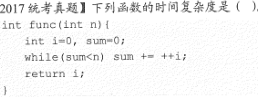

# 1. 绪论

## 1.1 数据结构基本概念

### 数据结构的逻辑结构

1. 逻辑结构
   - <u>线性结构</u>：线性表，栈，队列，数组
   - 非线性结构：集合，树，图
2. 存储结构：
   - 顺序存储：优点：随机存储 存储密度大，缺点：需相邻存储 产生碎片
   - 链式存储：优点：充分利用存储单元，缺点：指针占用空间，顺序存取
   - 索引存储：优点：检索快，缺点：附加索引表，增删改表时间
   - 散列(hash)存储：根据关键字计算存储地址。优点：增删改查快，缺点：散列函数可能存在存储单元冲突
3. 运算

## 1.2 算法及其评价

算法的5个特性：有穷性、确定性、可行性、输入、输出

算法效率的度量：时间复杂度、空间复杂度

### 时间复杂度

基本运算（最深层循环内语句）的频度与$T(n)$同数量级，一般忽略低阶项与常数

- $T(n)=O(f(n)):\ \exist c,n_0,当N\ge n_0, T(n)\le cf(n)$ 最坏（低阶或同阶无穷大）
- $T(n)=\Omega(f(n)):\ \exist c,n_0,当N\ge n_0, T(n)\ge cf(n)$ 最好（高阶或同阶无穷大）
- $T(n)=\theta(f(n)):\ T(n)=O(f(n))=\Omega(f(n))$ 平均（同阶无穷大）

法则：$T_1(n)=O(f(n)),T_2(n)=O(g(n))\\
\Rightarrow T_1(n)+T_2(n)=max(O(f(n)),O(g(n)))\\
\Rightarrow T_1(n)·T_2(n)=O(f(n)·g(n))$

常见时间复杂度：$1\le O(log_2n)\le O(n)\le O(nlog_2n)\le O(n^2)\le O(n^3)\le O(2^n)\le O(n!)\le O(n^n)$

代码中判断：

1. 嵌套循环：用 $\sum$ 求和 
2. 语句含循环变量与循环条件的 n 有关：设次数t，建立方程/不等式，或直接 n 反解次数
3. 递归程序：递推公式

$n=1+2+...+t=t(t+1)/2$

$T(n)=2^2·T(n·2^{-2})+2n=2^i·T(n·2^{-i})+i·n=2^{log_2n}T(1)+nlog_2n$

或令 $n=2^k$

### 空间复杂度

S(n)

