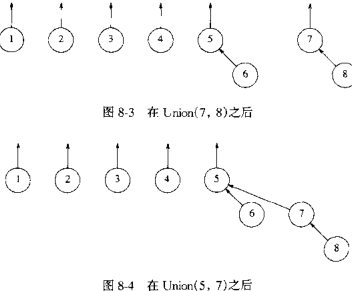
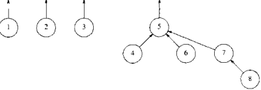
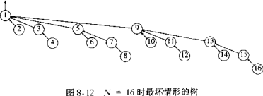
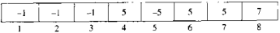
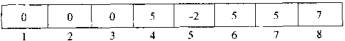

## 两种运算

- Find：当且仅当两个元素属于相同集合时，返回集合名
- Union：当两个集合不属于同一等价类时，可合并为新的等价类

## 基本数据结构

可用树来表示集合，树的每个元素都有相同的根，集合名由根结点给出；初始状态每个集合一个元素（每个树一个根结点）

- `X=Union(X, Y)`：两棵树合并，即一棵树根结点指向另一棵树根结点
- `R=Find(X)`：查找元素的根结点，花费时间与树的深度成正比



使用数组存储树，索引—元素位置，内容—指向的根结点索引


```cpp
void init(DisjSet S);
void unionSet(DisjSet S, int root1, int root2);
int find(DisjSet S, int x);
```

不相交集初始化

```cpp
void init(DisjSet S) {
    for (int i=NumSets; i>0; i--)
        S[i] = 0;
}
```

不相交集 Union（不考虑树的大小高度）

```cpp
void unionSet(DisjSet S, int root1, int root2) {
    S[root2] = root1;
}
```

不相交集 Find

```cpp
int find(DisjSet S, int x) {
    if (S[x] <= 0) 
        return x;
    return Find(S, S[x]);
}
```

## 求并算法



### 按大小求并

让较小的树成为较大的树的子树，任意结点的深度 $\le log N$



实现：每个根的数组元素为它的树大小（结点数）的负值，初始为-1



### 按高度求并

让高度较浅的树成为较深的树的子树，树的深度 $\le log N$。

实现：每个根的数组元素为它的树深度（高度）的负值，初始为0；只有两颗深度相对的树求并时树的高度才+1



```cpp
void unionSet(DisjSet S, int root1, int root2) {
    if (S[root2] < S[root1]) //root2 is deeper set
        S[root1] = root2;
    else {
        if (S[root1] == S[root2])
            S[root1]--;
        S[root2] = root1;
    }
}
```


