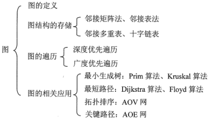

**考纲**

图的基本概念

图的存储及基本操作：邻接矩阵法，邻接表法，邻接多重表法，十字链表

图的遍历：深度优先搜索 DFS，广度优先搜索 BFS

图的应用：最小生成树，最短路径，拓扑排序，关键路径

**知识框架**



错题：

图概念：3,6,7,9,16,18

图的存储：8,11

图的遍历：6,13

图的应用：1,3,5,10,14,17,18,21,22,24,29,30

## 1. 图的基本概念

#### 图的定义

图 G：顶点集 V、边集 E，$G=(V,E), V=\{v_1,...,v_n\}, E=\{(u,v)|u,v\in V\}$，|V|>0：图G顶点数，|E|：图G边的条数

#### 有向图

有向边（弧）：顶点的有序对，$<u,v>$ 为从 u 指向 v 的弧，u 邻接 v

有向图的边集 E 是有向边的集合

#### 无向图

无向边（边）：顶点的无序对，$(u,v)或(v,u)\Leftrightarrow \exist <u,v> \& <v,u>$ 

无向图的边集 E 是无向边的集合

#### 完全图

<u>无向完全图：任意两顶点之间都存在边</u>，$|E|=C_n^2=\frac{n(n-1)}{2}$

<u>有向完全图：任意两顶点之间都存在方向相反的两条弧</u>，$|E|=A_n^2=n(n-1)$

<u>注：无向图 n 个顶点要保证任何情况下都连通的最少边数 $C_{n-1}^2+1$（考虑n-1个顶点完全图）</u>


#### 连通、连通图、连通分量

连通：无向图中，两顶点之间存在路径

连通图：图中任意两顶点都连通。$|E|_{min}=n-1$

非连通图：图中存在两顶点不连通。n 个顶点边数 $< n-1\Rightarrow$ 非连通图，$|E|_{max}=C_{n-1}^2$

<u>连通分量：无向图的极大连通子图（包含原图的所有边）</u>


#### 强连通图、强连通分量

<u>强连通：**有向图**中，一对顶点 u到v、v到u 之间都有路径</u>

强连通图：图中任意一对顶点都强连通。$|E|_{min}=n$（环）

强连通分量：有向图的极大强连通子图

#### 生成树、生成森林

<u>连通图的生成树；包含连通图中全部顶点的一个**极小连通子图**（用最少的边连通，无环）</u>

无向图 n 个顶点的生成树有 n-1 条边

<u>非连通图的生成森林：由非连通图的连通分量的各生成树构成。</u>

无向图 n 个顶点的森林，树的棵数x = n - 边数e（e+(x-1)+1=n）


#### 顶点的度、入度、出度

顶点的度：

- <u>无向图中顶点 v 的边条数，**全部顶点的度之和=2*边数=2|E|**</u>
- <u>有向图中顶点 v 的弧条数，**顶点 v 的度=v 的入度+v 的出度**，全部顶点v 的入度之和=全部出度之和=边数</u>

入度：有向图中以顶点 v 为终点的有向边数

出度：有向图中以顶点 v 为起点的有向边数

#### 边的权、网

网（带权图）：边上带有权值的图

#### 稀疏图

图 G 满足 $|E|<|V|log|V|$

#### 路径、路径长度、回路

路径、路径长度：类似树中的概念

回路（环）：第一顶点与最后顶点相同的路径。n 个顶点边数 $> n-1\Rightarrow$ 有环

<u>对有向图，DFS、拓扑排序可判断回路</u>

#### 简单路径、简单回路

<u>简单路径：路径序列中，顶点不重复出现的路径</u>

<u>简单回路：除首尾顶点外，其余顶点不重复出现的回路</u>

#### 距离

从顶点 u 到顶点 v 的最短路径若存在，则次路径长度为 u 到 v 的距离（不存在路径时距离$\infty$）

#### 有向树

一个顶点入度0，其它顶点入度1的有向图

## 2. 图的存储及基本操作

### 邻接矩阵法

用一维数组存储顶点信息，用二维数组存储边的信息。

邻接矩阵：存储边的关系（顶点间的邻接关系）的二维数组 $A[n][n],A[i][i]=0$

$A[i][j]=\begin{cases}1 & (v_i,v_j)或<v_i,v_j>\in E\\0 & (v_i,v_j)或<v_i,v_j>\notin E\end{cases}$

对于有向带权图：

$A[i][j]=\begin{cases}w_{ij} & (v_i,v_j)或<v_i,v_j>\in E\\0或\infty & (v_i,v_j)或<v_i,v_j>\notin E\end{cases}$

顶点 i 的入度 = $\sum_{k=1}^nA[k][i]$（i 列和），出度 = $\sum_{k=1}^nA[i][k]$（i 行和）

```cpp
struct Graph {
    int n, int e; //顶点数，边数
    vertex V[MaxSize]; //顶点集
    int E[MaxSize][MaxSize]; //邻接矩阵
};
```


特点：

- 邻接矩阵表示法空间复杂度$O(n^2), n=|V|$

- 无向图的邻接矩阵是[对称矩阵](data-structure/stack-queue?id=对称矩阵)，可采用压缩存储，实际只需存储下三角矩阵元素
- 无向图邻接矩阵的第 i 行（第 i 列）非零（非$\infty$）元素个数=顶点 $v_i$  的度

### 邻接表法

边链表：对每个顶点 $v_i$ 建立一个单链表，第 i 个单链表中的表头结点存储顶点 $v_i$ 信息，其余结点存放顶点 $v_i$ 边的信息（邻接顶点）

顶点表；顺序存储每个顶点边链表表头结点

```cpp
struct ArcNode { //邻接的顶点位置索引与边信息
	int adj; //
    int weight = 0;
    struct ArcNode *next;
};
struct Vertex { //顶点表结点信息
    int data;
    ArcNode *first; //顶点第一条边（弧）指针
};
struct Graph {
    Vertex* vertices[MaxSize];
    int n, e; //顶点数，边数
};
```


特点：

- 无向图邻接表法的所需存储空间 $O(|V|+2|E|)$，有向图邻接表法的所需存储空间 $O(|V|+|E|)$

- 有向图邻接表表示中，<u>顶点出度=顶点邻接边表的结点数，顶点入度=全部邻接边表中顶点出现次数</u>

- 找一顶点的所有邻边，邻接表法需读取其邻接边表，邻接矩阵法需扫描一行 $O(n)$；

  确定两顶点是否存在边，邻接表法需在其邻接边表中查，邻接矩阵法立即查到 $O(1)$

**邻接数组**

```cpp
struct Vertex { //顶点表结点信息
    int data;
    int* neighbors[MaxSize]; //顶点的邻接顶点索引数组
};
struct Graph {
    Vertex* vertices[MaxSize];
    int n, e; //顶点数，边数
};
```


### 邻接多重表法

无向图的链式存储结构

边结点：边依附的两顶点 $v_i,v_j$ 在顶点表的索引位置、指向下一条依附 $v_i,v_j$ 各自的边指针

```cpp
struct Edge { //边节点信息
	int iu, iv; //依附的两顶点索引位置
    int weight = 0;
    struct Edge *unext, *vnext;
};
struct Vertex { //顶点表结点信息
    int data;
    Edge *firstEdge; //顶点第一条边指针
};
```


### 图的基本操作

```
isAdjacent(G, x, y);
neighbors(G, x);
insertVertex(G, x);
deleteVertex(G, x);
addEdge(G, x, y);
removeEdge(G, x, y);
firstNeighbor(G, x);
nextNeighbor(G, x, y);
getEdgeWeight(G, x, y);
setEdgeWeight(G, x, y);
```

## 3. 图的遍历

为避免同一顶点被访问多次，遍历过程必须记下已访问过的顶点

### 广度优先搜索 BFS

<u>类似树的层序遍历——使用队列</u>

对一个极大连通子图：

1. 起始顶点 v 入队
2. 若队列非空，取队首顶点，标记已访问并出队；遍历其邻接顶点，将未访问过的入队；执行 2

```cpp
void BFS(Graph G, Vertex* V) {
    queue<Vertex*> Q;
    Vertex* p;
    Q.push(V);
    while (!Q.empty) {
        p = Q.front();
		//func(p);
	    p->setVisited(true); //队首出队前标记已访问
        for (Vertex* v : G.getNeighbors(p)) {
            if (!v->visited) 
                Q.push(v);
        }
        Q.pop();
    }
}
void BFSGraph(Graph G) {
    for (int i=0; i<G.n; i++)
        G.vertices[i]->setVisited(false);
    for (int i=0; i<G.n; i++)
        if (!G.vertices[i]->visited) 
            BFS(G, G.vertices[i]); //对若干连通分量进行BFS
}
```

**BFS 算法性能分析**

n 个顶点都入队一次，空间复杂度 $O(|V|)$，访问的时间复杂度 $O(|V|)$

查找顶点的邻接顶点：

- 采用邻接表存储，每个邻边顶点至少访问一次，查找时间复杂度 $O(|E|)$，总的时间复杂度 $O(|V|+|E|)$
- 采用邻接矩阵存储，每个顶点需要扫描一行$O(|V|)$，总的时间复杂度 $O(|V|^2)$

#### BFS 算法求解单源最短路径问题

**最短路径** $d(u,v)$：从 u 到 v 经过的边数最少的路径（最短路径长度，不考虑边权）

```cpp
void minDistanceByBFS(Graph G, int i) {
    queue<int> Q;
    int q; //队首元素，存放顶点索引
    Vertex* V=G.vertices[i];
	V->d[i] = 0;
    Q.push(i);
    while (!Q.empty) {
        q = Q.front();
	    G.vertices[q]->setVisited(true); //队首出队前标记已访问
        for (int j : G.getNeighbors(q)) {
            if (!G.vertices[j]->visited) {
                Q.push(j);
                V->d[j] = V->d[q] + 1;
            }
        }
        Q.pop();
    }
}
```

#### 广度优先生成树


### 深度优先搜索 DFS

<u>类似树的先序遍历——使用栈</u>

对一个极大连通子图：

1. 起始顶点 v 入栈
2. 若栈非空，取栈顶顶点，标记已访问并出栈；遍历其邻接顶点，对每个未访问过的顶点执行 1

```cpp
void DFS(Graph G, Vertex* V) {
    //func(v);
    V->setVisited(true);
    for (Vertex* v: G.getNeighbors(V)) {
        if (!v->visited) 
            DFS(G, v);
    }
}
void DFSGraph(Graph G) {
    for (int i=0; i<G.n; i++)
        G.vertices[i]->setVisited(false);
    for (int i=0; i<G.n; i++)
        if (!G.vertices[i]->visited) 
            DFS(G, G.vertices[i]); //对若干连通分量进行DFS
}
```

**DFS 算法性能分析**

n 个顶点都入栈一次，空间复杂度 $O(|V|)$，访问的时间复杂度 $O(|V|)$

查找顶点的邻接顶点：

- 采用邻接表存储，每个邻边顶点至少访问一次，查找时间复杂度 $O(|E|)$，总的时间复杂度 $O(|V|+|E|)$
- 采用邻接矩阵存储，每个顶点需要扫描一行$O(|V|)$，总的时间复杂度 $O(|V|^2)$

<u>注：对有向图，DFS、拓扑排序可判断回路。</u>

<u>对有向无环图，若DFS中先递归遍历后输出，则序列为逆拓扑序</u>

#### 深度优先生成树与生成森林


### 图的遍历与图的连通性

无向图：图调用 DFS 或 BFS 的次数 = 图的连通分量数（非连通子图数）

有向图：非强连通分量调用一次 BFS 或 DFS 无法访问该连通分量的所有顶点


## 4. 图的应用

### 最小生成树 MST

连通图的生成树；包含连通图中全部顶点的一个极小连通子图（用最少的边连通）

**最小生成树**：带权连通无向图 G 的所有生成树中，边的权值之和最小的生成树

性质：

- <u>**无向图或有向图存在相同边权时最小生成树(树形)不唯一，当有向图各边权值互不相等时，最小生成树唯一**</u>
- <u>最小生成树的边的权值之和唯一</u>
- 最小生成树的边数 = 顶点数 - 1

#### Prim 算法

算法思想：选取一个顶点作为初始树，从树的邻接边中选取一个权值最小的边顶点合并(邻接顶点指向树中顶点)，直到所有顶点合并


1. 取邻接表第一个顶点赋值为 v，并标记已访问
2. 遍历顶点 v 的邻接边顶点，若其未访问过，则标记它的前驱(源路径)为 v 以及边的权
3. 遍历所有顶点，找出未访问过 & 源路径有效 & 边权最小的顶点，赋值为 v，并标记已访问；执行 2

```cpp
typedef struct Vertex {
    List<Edge*> e;
    bool visited = false;
    int path = -1; //顶点的前驱顶点索引
    int dist = INFINITY; //顶点与前驱顶点边权(路径长度)
} Vertex;
```

```cpp
void Prim(Graph G) {
    int v = 0; //顶点索引
	G.V[v].visited = true;    
    for (int i=0; i<G.n-1; i++) {
        for (Edge e: G.getNeighbors(v)) { //for (int w=1; w<G.n; w++) { //邻接矩阵
            if (!G.V[e.adj].visited) {    //	if (G.edges[v][w] && G.edges[v][w]!=INFINITY && !T[w].visited) {
                G.V[e.adj].path = v;
                G.V[e.adj].dist = e.weight;
            }
        }
        int minDist = INFINITY;
        for (int j=0; j<G.n; j++) { //在与当前生成树邻接的所有顶点路径中取权值最小的顶点索引
            if (!G.V[j].visited && G.V[j].path != -1 && G.V[j].dist < minDist) {   
                minDist = G.V[j].dist;
                v = j;
            }
        }
        G.V[v].visited = true;
    }
}
```

时间复杂度：$O(|V|^2)$，Prim 算法适合于边稠密的图

#### Kruskal 算法

算法思想：<u>初始每个每次选出权值最小的边，且边满足其两个顶点所在集合不相交，合并顶点集合，直到全部顶点加入</u>


借助数据结构：[不相交集](data-structure/tree)、[优先队列](data-structure/priority-queue-heap)

1. 初始化不相交集（|V|棵单节点树），初始化优先队列，读入边表数据，建立小顶堆（比较边的权）
2. 优先队列出队边结点(最小权)，若不相交集中边的两顶点(索引)所在集合不相等，则将两顶点集合合并，直到全部顶点合并

```cpp
void Kruskal(vector<Edge> edges, int n) {
    DisjointSet<int> S(n); //不相交集，存放生成树的节点索引，初始为森林
    auto cmp = [](Edge* left, Edge* right) { return left->weight < right->weight; };
    priority_queue<Edge*, vector<Edge*>, decltype(cmp)> H(cmp); //优先队列
    for (int i=0; i<n; i++) //读入边表数据，建堆
        H.push(&edges[i]);
    //vector<Edge> mst; while(mst.size()!=n)
    int seletedEdges = 0;
    while (seletedEdges < G.n - 1) {
        Edge* e = H.top(); 
        H.pop();
        int uset = S.find(e->iu); //查找iu所在集合(根顶点索引)
        int vset = S.find(e->iv); //查找iv所在集合(根顶点索引)
        if (uset != vset) {
            seletedEdges++; 
            //mst.push_back(e);
            S.unionSet(uset, vset);
        }
    }
}
```

时间复杂度：优先队列每次删除一个最小边 $O(log|E|)$，共 $O(|E|log|E|)$，最坏情况为完全图 $|E|=|V^2|$，故 Kruskal 算法适合于边稀疏的图

### 最短路径

[BFS 算法求解单源最短路径问题](data-structure/graph?id=bfs-算法求解单源最短路径问题)

**最短路径**：带权图中，顶点 u 与 v 之间经过边的权值之和最小的（带权）路径长度

带权有向图的最短路径问题：

- 求单源最短路径，即某一顶点到其它各顶点的最短路径——Dijkstra 算法
- 求每对顶点间的最短路径——Floyd 算法

```
//v.d--dist(s,v), v.path--s到v最短路径上v的前驱顶点
if v.d > u.d + w(u,v) 
	v.d = u.d + w(u,v);
	v.path = u;
```

#### 单源最短路径问题（Dijkstra 算法）


```
v4.dist=1, v2.dist=2, dmin=1, v4
v3.dist=3, v3.path=v4, v5.dist=3, v5.path=v4, v7.dist=5, v7.path=v4, v6.dist=9, v6.path=v4, dmin=2, v2
dmin=3, v5
dmin=3, v5
dmin=5, v7;
v6.dist=6, v6.path=v7
```

算法思想

1. 源顶点 s，赋值为 u 

2. 对 u 遍历其邻接边顶点 v，若 v 未访问过 且 v 经中间顶点 u 到源顶点 s 路径长 < v 到源顶点 s 路径长 $u.d+w(u,v)<v.d$，则更新顶点 v 到 s 的路径距离 $v.d=u.d+w(u,v)$，v 的前驱顶点 $v.path=u$
3. 遍历所有顶点，找出未访问过 & 前驱路径有效 & 路径最短的顶点，赋值为 u，并标记已访问；执行 2

```cpp
typedef struct Vertex {
    List<Edge*> edge;
    bool visited = false;
    int path = -1; //到源顶点路径上的前驱顶点索引 predecessor
    int dist = INFINITY; //到源顶点的路径长度
} Vertex;
```

```cpp
void Dijkstra(Graph G, int v) {
	//int v = 0;
    G.V[v].visited = 0;
    G.V[v].dist = 0;
    for (int i=0; i<G.n-1; i++) {
        for (Edge e: G.getNeighbors(v)) {
            if (!G.V[e.adj].visited && G.V[v].dist + e.weight < G.V[e.adj].dist) {
                G.V[e.adj].path = v;
                G.V[e.adj].dist = G.V[v].dist + e.weight;
            }
        }
        int minDist = INFINITY;
        for (int j=0; j<G.n; j++) { //在与当前生成树邻接的所有顶点路径中取权值最小的顶点索引
            if (!G.V[j].visited && G.V[j].path != -1 && G.V[j].dist < minDist) {   
                minDist = G.V[j].dist;
                v = j;
            }
        }
        G.V[v].visited = true;
    }
}
void printPath(Graph G, int v) {
    if (v.path != -1) {
        printPath(G.V[v].path); //递归直到源顶点开始
        cout << "->";
    }
    cout << G.V[v].path;
}
```

时间复杂度：Dijkstra 算法对稠密图 $O(|V|^2)$​，对稀疏图更快

#### 有向带负权图-单源最短路径（Bellman-Ford 算法）

```cpp
void BellmanFord(Graph* graph, int src) {
	int V = G->vertex_n, E = G->edge_n;
    int dist[V], predecessor[V];
	// Step 1: Initialize distances from src to all other vertices as INFINITE
    for (int i=0; i<V; i++)
        dist[i] = INT_MAX;
    dist[src] = 0;
    // Step 2: Relax all edges |V| - 1 times. A simple shortest
    // path from src to any other vertex can have at-most |V| - 1 edges
    for (int i = 0; i < V - 1; i++) {
    	for (int j = 0; j < E; j++) {
            int u = graph->edge[j].src, v = graph->edge[j].dest;
            int w = graph->edge[j].weight;
            if (dist[u] != INT_MAX && dist[u] + w < dist[v]) {
                dist[v] = dist[u] + w;
                predecessor[v] = u;
            }
        }   
    }
    // Step 3: check for negative-weight cycles.
    for (int i = 0; i < E; i++) {
        int u = graph->edge[i].src, v = graph->edge[i].dest;
        int w = graph->edge[i].weight;
        if (dist[u] != INT_MAX && dist[u] + w < dist[v]) {
            printf("Graph contains negative weight cycle");
            return; // If negative cycle is detected, simply return
        }
    }
    // printArr(dist, V); printArr(predecessor, V);
    return;
}
```

#### 各顶点间最短路径问题（Floyd 算法）

在邻接矩阵的基础上得到一系列顶点间的距离矩阵：$D^{(0)},...,D^{(k-1)},D^{(k)},...,D^{(n)}$

$D^{(k)}:$ 从原始邻接边矩阵 $D^{(0)}$ 开始，对于当前中间点 $v_k$，每对顶点 $v_i$ 到 $v_j$ 间有一条最短路径，且路径中有若干编号<=k的中间顶点。

经当前中间点 $v_k$ 的短路径：$v_i,\{编号\le k\ 的若干中间顶点\},v_j$

以中间点 $v_k$划分：$v_i,\{编号\le k-1\ 的若干中间顶点\},v_k,\{编号\le k-1\ 的若干中间顶点\},v_j$


距离递推式：$d_{ij}^0=w_{ij},\ k\ge 1, d_{ij}^k=min\{d_{ij}^{k-1},d_{ik}^{k-1}+d_{kj}^{k-1}\}$


对于d(1,0)，经中间点2时，d(1,0)=7, d(3,0)=4；经中间点3时，d(1,0)=d(1,3)+d(3,0)=6


```
d(1,0)+d(0,2)=5<∞, d(1,2)=5; d(3,0)+d(0,2)=9<∞, d(3,2)=9, path=0
d(2,1)+d(1,0)=9<∞, d(2,0)=9, path=1
d(0,2)+d(2,1)=10<∞, d(0,1)=10; d(0,2)+d(2,3)=4<∞, d(0,3)=4; d(1,2)+d(2,3)=6<∞, d(1,3)=6; d(3,2)+d(2,1)=16<∞, d(3,1)=4, path=2
d(2,3)+d(3,0)=7<9, d(2,0)=7, path=3
```

实现

```cpp
void floyd(Graph G, int d[][MaxSize], int path[][MaxSize]) {
    for (int i=0; i<G.n; i++)
        for (int j=0; j<n; j++) {
            d[i][j] = G.edges[i][j]
            path[i][j] = -1;
        }
    for (int k=0; k<n; k++) //k-th mid-vertex 
        for (int i=0; i<n; i++) //u
            for (int i=0; j<n; j++) //v
                if (d[i][k] + d[k][j] < d[i][j]) {
                	d[i][j] = d[i][k] + d[k][j];
                    path[i][j] = k;
                }
}
void printPath(int d[][MaxSize], int path[][MaxSize], int i, int j) { 
    cout << i;
    for (;path[i][j] != -1; i = path[i][j])
        cout << "->" << path[i][j];
}
```

时间复杂度：$O(|V|^3)$ ，对稠密图更快

也可用单源最短路径算法 求解 每对顶点之间的最短路径问题，前提是边权非负，依次将每个顶点作为源顶点，时间复杂度 $O(|V|^2)·|V|=O(|V|^3)$

### 拓扑排序


> AOV(Activity On Vertex Network)：用有向无环图表示一个活动在顶点上的网络
>
> 顶点：活动，有向边$<v_i,v_j>:\ 活动\ v_i\ 先于\ v_j$ 进行

- 有向图的拓扑有序序列唯一时，图中的入度/出度都可能 >1
- 邻接矩阵为三角阵时，存在拓扑序列，但不一定唯一


TopSort 算法思想：从 AOV 网中<u>**选一个没有前驱的顶点并输出，删除该顶点及临接边**；重复执行</u>，直到 AOV 网为空或不存在无前驱的顶点（存在环）

TopSort 算法实现（<u>**使用栈or队列or集合，序列不一定唯一**</u>）：

- 暂存入度0的顶点

- 若栈/队列非空，出队顶点 v，将与其邻接的所有顶点入度-1；若其中有顶点入度为0，就将其入队；

  若出(入)队顶点数<顶点总数，则图存在回路(环)，排序失败

<u>注：对于出队or出栈的顶点，其邻接边入度0的顶点与还未出队/出栈的入度0的顶点无序</u>

也可用深度优先搜索 DFS 遍历实现 topsort

```cpp
void topSort(Graph G) {
    unordered_set<Vertex> S; //stack<Vertex> S;
    int count = 0;
    for (int i=0; i<G.n; i++) 
        if (!indegree[i])
            S.insert(i);
    while (!Q.empty()) {
        auto v = *(S.begin());
        Q.erase(v);
        ++count; //cout << ++count;
        for (Edge* e: G.getNeighbors(v)) 
            if (--indegree[e.adj] == 0)
                Q.insert(e.adj);
    }
    if (count != G.n) throw CycleException {};
}
```

topsort 遍历了所有顶点及邻接边，时间复杂度 $O(|V|+|E|)$


a入度0开始，b在c前，d出度0结束；e有3种可能位置 => 3种拓扑序列

### 关键路径

> AOE(Activity On Edge Network)：用带权有向无环图表示一个活动在边上的网络
>
> 顶点：事件的开始；有向边权值：完成该活动的开销
>
> 源点：仅有的入度为0的开始顶点，表示工程开始；
>
> 汇点：仅有的出度为0的结束顶点，表示工程结束
>
> <u>关键路径：从源点到汇点的所有路径中，具有最大路径长度的路径；关键路径上的事件活动完成时，所有活动均已完成</u>
>
> 关键活动：关键路径上的活动，其影响整个工程的完成时间。$a_i:d(i)=l(i)-e(i)=0$
>
> <u>最短完成时间：关键路径长度，即关键路径上各活动开销总和</u>

AOE网性质：

- 只有某顶点事件发生后，从该顶点事件出发的各有向边活动才能开始 $\circ\rightarrow$
- 只有在进入某顶点事件前的各有向边活动都结束时 (max-end-time)，该顶点事件才能发生 $\rightarrow\circ$


#### 事件 $v_k$ 的最早发生时间 $ve(k)$

$ve(k)$：从源点 $v_0$ 到顶点 $v_k$ 的最大路径长度

$ve(0)=0\\
ve(k)=max\{ve(j) + w(v_j,v_k)|v_k\text{: a back-adjacent of }v_j\}$

<u>在 topsort 基础上计算</u>：

- 初始 `ve[0...n]=0`

- 出队一个入度为0的顶点 $v_j$，计算它所有临边后继顶点 $v_k$的最早发生（开始）时间：

  若 `ve[j]+w(vj,vk)>ve[k]`，则  `ve[k]=ve[j]+w(vj,vk)`

<u>关键路径可通过求 ve() 得出：从 ve(n) 到 ve(1) 逆序观察经 max 挑选出的均为关键路径各顶点</u>

#### 事件 $v_k$ 的最迟发生时间 $vl(k)$

$vl(k)$： 在不推迟整个工程完成的前提下，事件 $v_k$ 最迟必须发生的时间

$vl(n)=ve(n)\\
vl(k)=min\{vl(j) - w(v_k,v_j)|v_k\text{: a prior-adjacent to }v_j\}$

在 topsort（结果入栈）基础上逆序（或逆 topsort 找出度为0）计算：

- 初始 `vl[0...n]=ve[n]`

- 出栈一个出度为0的顶点 $v_j$，计算它所有临边前驱顶点 $v_k$的最迟(晚)发生（开始）时间：

  若 `vl[j]-w(vk,vj)<ve[k]`，则  `vl[k]=vl[j]-w(vk,vj)`


#### 活动 $a_i$ 的最早开始时间 $e(i)$ 

活动最早开始时间：活动弧 $<v_j,v_k>$ 起点依附的[事件最早发生时间](data-structure/graph?id=事件-c194a9eg-的最早发生时间-c194a9eg)。$e(i)=ve(j)$

#### 活动 $a_i$ 的最迟开始时间 $l(i)$ 

活动最迟开始时间：活动弧 $<v_k,v_j>$ 终点依附的[事件最迟发生时间](data-structure/graph?id=事件-c194a9eg-的最迟发生时间-c194a9eg) - 活动时间。$l(i)=vl(j)-w(v_k,w_j)$

#### 活动 $a_i$ 的最迟开始时间 $l(i)$ 与最早开始时间 $e(i)$  的差额 $d(i)$

$d(i)=l(i)-e(i)$：指完成该活动的时间余量（可拖延时间）

关键活动 $a_i:d(i)=l(i)-e(i)=0$ 表示活动不可拖延


<u>注：存在多个关键路径时，缩短整个工程时间需要加快若干个包括在所有关键路径上的关键活动</u>


如图 $ve(6)$=27，关键路径：bdcg, bdeh, bfh。加快一个活动 b 可缩短工期，加快两个活动 d与f 也能缩短工期
