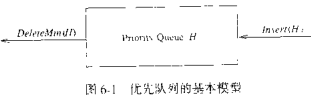
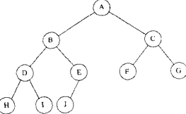
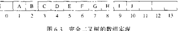
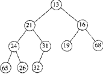
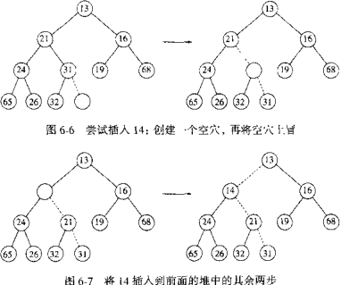
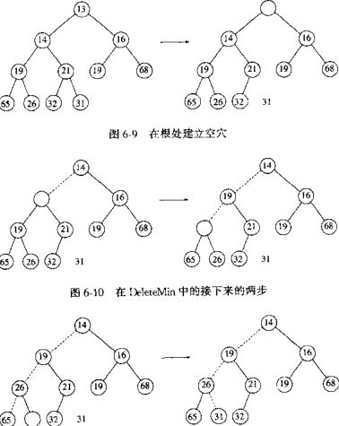

## 模型

基本操作：

- 删除最大(小)的，类似出队
- 插入，类似入队



## 二叉堆

### 结构性质

**二叉堆**：[完全二叉树](data-structure/tree?id=特殊二叉树)

- 高度为 h 的完全二叉树结点数 $N\in[2^{h-1},2^h-1]$
- N 个结点的完全二叉树 高度 $h=\lfloor log_2N\rfloor+1\ 或\ \lceil log_2(N+1)\rceil$

**顺序存储**

按层序编号存储到一维数组 $B[n]$ 中，下标从1开始；

结点 i 对应 $B[i]$，双亲 $B[i/2]$，左右孩子 $B[2i],B[2i+1]$ （若有）





优先队列声明

```cpp
struct Heap {
    int capacity = MaxSize;
    int size = 0;
    int elements[MaxSize];
};
typedef struct Heap Heap, *PriorityQueue;
bool IsEmpty(PriorityQueue H);
void Insert(PriorityQueue H, int x);
int DeleteMin(PriorityQueue H);
int FindMin(PriorityQueue H);
```

C++容器适配器 [priority_queue](https://zh.cppreference.com/w/cpp/container/priority_queue)

### 堆序性质



（除根节点）任意结点 X 的父节点关键字 $\le$ X 的关键字；最小元总在根节点

#### 插入 Insert



（向下冒泡）

1. 将完全二叉树末尾下一个位置作为新空位

2. 若空位的父节点关键字 > x，则空位关键字 = 其父节点关键字，更新父节点为新空位，执行  2

   否则，新空位关键字 = x

```cpp
void Insert(PriorityQueue H, int x) {
    int i = H->size++;
    for (; H->elements[i/2] > x; i/=2) 
        H->elements[i] = H->elements[i/2];
    H->elements[i] = x;
}
```

#### 删除最小元 DeleteMin



（向上冒泡）

根结点将产生一个空位，将其两个儿子较小者移入空位，直到最后一个节点需要移到合适的空位

1. 暂存根结点关键字，作为新空位

2. 若空位有孩子，且末尾元素关键字 > 空位孩子关键字，则空位关键字 = 其孩子关键字；更新其孩子为新空位，执行 2

   否则表示找到末尾元素的新位置，新空位关键字 = x

3. 返回暂存的根结点关键字

```cpp
int DeleteMin(PriorityQueue H) {
    int i, child;
    if (H->isEmpty()) 
        return H->elements[0];
    minEl = H->elements[1];
    lastEl = H->elements[H->size--];
    for (i=1; i*2 <= H->size; i=child) {
        child = i*2; //若结点存在右孩子，则取关键字小的作为待比较结点
        if (child != H->size && H->elements[child+1] < H->elements[child])
            child++;
        if (lastEl > H->elements[child]) 
            H->elements[i] = H->elements[child];
        else break;
    }
    H->elements[i] = lastEl;
    return minEl;
}
```

