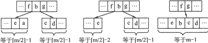

**考纲**

查找基本概念，查找算法的分析及应用

顺序查找，分块查找，折半查找

**树型查找：二叉搜索树、平衡二叉树、红黑树**

B 树及其操作、B+ 树的概念

散列Hash表

字符串模式匹配

查找算法的分析与应用

**知识框架**


**错题**

顺序/折半查找：6,8,13,15,19

B树与B+树：1,5,8,9,10,14,17,18

散列表：3,4,9.12,18

## 1. 查找的基本概念

平均查找长度 $ASL=\frac{1}{n}\sum_{i=1}^nC_i,\ C_i$：找到第 i 个数据元素所需进行的比较次数

## 2. 顺序查找和折半查找

### 顺序查找

平均查找长度 $ASL=\frac{1}{n}\sum_{i=1}^ni=\frac{n+1}{2}$

### 折半查找（二分查找）

<u>二分查找仅适用于有序的顺序存储表</u>

二分查找思想：将给定key与表中中间位置元素比较，若相等，则查找成功返回位置；若小于，则在左子表继续查；若大于，则在右子表继续查

```cpp
int B_Search(vector<int> L, int key) {
    int low=0, high=L.size(), mid;
    while (low <= high) {
        mid = (low+high) / 2;
        if (key == L[mid])
            return mid;
        else if (key < L[mid]) 
            high = mid - 1;
        else
            low = mid + 1;
    }
    return -1;
}
```


描述二分查找的判定树：<u>AVL 树（平衡二叉搜索树）</u>

<u>查找成功长度：根节点到目的结点路径上的结点数</u>

查找成功 $ASL\le\frac{1}{n}\sum_{i=1}^{h=\lfloor log_2n\rfloor+1}i·2^{i-1}=\frac{2^h(h-1)+1}{n}\approx log_2n$，本例成功 ASL=(1+2x2+3x4+4x4)/11=3

<u>查找失败长度：根节点到空指针父节点路径上的结点数</u>

空指针数 = 2 · 叶结点数 + 单分支结点数 = 2 · 度0结点数 + 度1结点数，$2n_0+n_1=n_0+n_1+n_2+1=n+1$

查找失败 $ASL\le\frac{1}{n}\lceil log_2(n+1)\rceil n\approx log_2n$，本例失败 ASL=(3x4+4x8)/12=11/3

<u>最多比较次数 = 树高 h</u> =$\lfloor log_2(n+1)\rfloor+1或\lceil log_2(n+1)\rceil$

**<u>注：二分查找的判定树 比较序列的索引取整保持一致，比较序列满足二叉排序</u>**

### 分块查找

分块查找又称索引顺序查找

分块查找思想：将查找表分为若干子块，<u>块内元素无序，块间有序；通过索引表（含各块最大关键字，各块第一元素地址）确定块；再在块内顺序查找</u>

若对 n 元素有序顺序表建立索引顺序结构，采用折半查找时的平均查找长度 $ASL=2\lceil log_2(\sqrt{n}+1)\rceil$

## 3. 树型查找

### 二叉搜索树BST

#### BST查找

```cpp
//非递归
Node* bstSearch(Node *T, int key) {
	while (T && key != T.data) {
        if (key < T->data)
            T = T->lchild;
        else
            T = T->rchild;
    }
    return T;
}
```

```cpp
//递归
Node* bstSearch(Node* T, int key) {
    if (!T || key == T->data) 
        return T;
    if (key < T->data) 
        return bstSearch(T->lchild, key);
    else
        return bstSearch(T->rchild, key);    
}
```

#### BST树查找效率

BST 查找效率取决于树的高度

若 BST 的左、右子树的高度之差绝对值 $\le 1$，为平衡二叉树，平均查找长度 $O(log_2n)$

若 BST 是一个只有左（右）子树的单支树，平均查找长度 $O(n)$


第 i 层的结点需查找 i 次

$ASL_a=(1+2*2+4*3+3*4)/10\\
ASL_b=(1+...+10)/10$ 

### 平衡二叉树AVL

#### AVL 树查找

> 定义 $n_h$：深度 h 的 AVL 树的最少结点数
>
> $n_0=0,n_1=1,n_2=2,n_3=4,...,n_h=n_{h-1}+n_{h-2}+1$

函数 N(h) 与斐波那契数相关

n 个结点的 AVL树最大深度=平均查找长度=$O(log_2n)$​

### 红黑树

#### 查找


## 4. B树 和 B+树

2-3 树结点：至多含有2个键和3条链接

m阶B树结点 类似 (m-1)-m 树结点：至多含有m-1个键和m条链接

### B树及其操作

m阶B树的定义：

- 若节点数N=0，为空树；

- 若节点数N>0，则**每个结点至多m棵子树，至多有m-1个关键字**；结点孩子数=结点关键字数+1

  <u>若根结点（非叶），子树棵数 $[2,m]$，关键字数 $[1,m-1]$</u>

  <u>普通结点（非根非叶）子树棵数 $[\lceil m/2\rceil,m]$，关键字数 $[\lceil m/2\rceil-1,m-1]$</u>
  
  <u>所有叶结点(空结点)都在同一层，作为查找失败的空指针节点，**叶(空)结点数 = 关键字数+1**</u>
  
  结点关键字从左到右递增有序（类似 AVL 树）

非叶结点结构：

$k_i$ 结点关键字，$k_1<...<k_n$

$p_i$ 指向子树根结点的指针，$k_i<\{p_i子树所有关键字\}< k_{i+1}\\
p_0\rightarrow k_{1...n_0}<k_1<...<p_i\rightarrow k_{1...n_i}<...<k_n<p_n\rightarrow k_{1...n_n}$


#### B树高度/结点数/关键字数

<u>注：**考虑最少结点时，仅需根节点2子树(关键字数1)，普通结点$\lceil m/2\rceil$子树(关键字数$\lceil m/2\rceil-1$)；并不需要存在一结点具有m棵子树或有m-1个关键字。**（如 3 阶B树结点数最少时类似满二叉树）</u>

**B树结点数与关键字**

已知结点数，关键字数与单位结点关键字数成正向关系

m 阶B树结点数 N，关键字数 n 范围 $[(N-1)(\lceil m/2\rceil-1)+1,N(m-1)]$

<u>已知关键字数，结点数与单位关键字数成反向关系</u>

m 阶B树关键字数 n，结点数 N 范围 $[\frac{n}{m-1}, \frac{n-1}{\lceil m/2\rceil-1}+1]$

**B树高度与结点数**

已知高度，结点数与单位结点关键字数成正向关系

m 阶B树高度 h，结点数 N 范围 $[\frac{\lceil m/2\rceil^{h}-1}{\lceil m/2\rceil-1},\frac{m^{h}-1}{m-1}]$

**B树高度与关键字数**

m 阶 B 树高度 h，关键字数 n 范围

- $h_{min}$：结点至多m棵子树，m-1个关键字，$n\le (m-1)(1+m+...+m^{h-1})=m^h-1\Rightarrow h\ge log_m(n+1)$

  

- $h_{max}$：根节点至少2棵子树，普通结点至少 $\lceil m/2\rceil$ 棵子树，第 h+1 层空叶节点至少 $2(\lceil m/2\rceil)^{h-1}$ 个

  $n+1\ge 2(\lceil m/2\rceil)^{h-1}\Rightarrow h\le log_{\lceil m/2\rceil}(\frac{n+1}{2})+1$
  
  

例：3阶B树共8个关键字，高度范围：$log_39=2\le h\le 1+log_24.5$

应用：磁盘存取次数

#### B树查找

- 对某个子树结点x，先顺序查找关键字，若找到则返回 $(结点, 关键字索引)$

  若 `k < x->key[i]`，则从磁盘读取 `x->p[i]` 页面到内存，递归查找 `x->p[i]` 结点

  若 x 是空叶结点，返回空

```cpp
tuple<Node*,int> BTree_Search(Node* x, int k) {
	int i = 1;
    for (; i <= x->n && k >= x->key[i]; i++);
    if (i <= x->n && k == x->key[i])
        return (x, i);
    else if (x->leaf)
        return NULL;
    //DISK_READ(x, x->p[i]);
    return BTree_Search(x->p[i], k);
}
```

#### B树插入

插入位置是终端结点，插入后可能需要调整：结点自底(向上)分裂(甚至升高)；保证每个结点关键字数 $[\lceil m/2\rceil-1,m-1]$

（**插入后**）若关键字数 = m，则对结点分裂：

- <u>若为根结点，则向上新建根结点作为父节点，B树高度+1</u>
- **若父结点关键字数 < m-1 未满，则新建兄弟结点；在原结点中间划分$[1...\lceil m/2\rceil-1],\lceil m/2\rceil,[\lceil m/2\rceil+1...m]$，左部分在原结点，右部分放新节点，中间移到其父节点；**
- 若父结点关键字数 = m-1 满了，则对父节点分裂

例：5阶B树插入关键字：


例：4阶空B树插入5,6,9,13,8,2,12,15


#### B树删除

删除后，可能需要移动替换或合并；保证每个结点关键字数 $\ge \lceil m/2\rceil-1$

- （**删除前**）关键字在终端结点：

  - 关键字数 $>\lceil m/2\rceil-1$，直接删除

  - 关键字数 $=\lceil m/2\rceil-1$，若左(右)兄弟结点存在关键字数 $>\lceil m/2\rceil-1$，则<u>该兄弟上去一个关键字</u>，父结点下来一个关键字替换；

    
    
  - 关键字数 $=\lceil m/2\rceil-1$，若左(右)兄弟结点关键字数均 $=\lceil m/2\rceil-1$，则父结点下来一个关键字替换被删关键字，将<u>该节点与兄弟结点合并</u>；

    
    
    合并时若父节点关键字数$-1=\lceil m/2\rceil-1$，则继续替换或合并；可能减少到0，则合并后结点作为根节点

- 关键字不在终端结点，可用其前驱结点最右关键字（或后继结点最左关键字）替代；前驱后继结点一定是终端结点，再用上述方法删除终端结点的关键字

### B+树

m阶B+树的定义：

- 若节点数N=0，为空树；

- 若节点数N>0，则每个分支结点至多m棵子树，至多m个关键字；结点孩子数=索引(关键字)数

  根结点（非叶）子树棵数 $[2,m]$

  普通结点（非根）子树棵数 $[\lceil m/2\rceil,m]$

  所有分支结点包含其各子节点最大索引（关键字）及其指针，仅起到索引作用

  所有叶结点都在同一层，包含全部关键字及指向对应记录的指针

  结点索引（或关键字）从左到右递增有序，相邻叶结点从小到大相连形成线性链表


B+树的每次查找都是一条从根结点到叶结点的路径

应用：关系数据库系统中的索引

## 5. 散列表

### 概念

**散列函数**：一个把查找表中的关键字映射成该关键字对应地址的函数.

*addr=Hash(key)* (addr：数组索引、内存地址)

**冲突**：$\exist\ k_1\ne k_2,\ H(k_1)=H(k_2)$ 散列函数把多个不同关键字映射到同一地址

**同义词**：映射到同一地址发生碰撞的不同关键字

**散列表**：根据关键字直接进行访问的数据结构，它建立了关键字和存储地址之间的直接映射关系，理想情况下，查找的时间复杂度 $O(1)$

### 散列函数的构造方法
原则:

- 散列函数的 **定义域需包含全部需要存储的关键字**，而值域范围依赖于散列表大小或地址范围

- 散列函数计算出来的 **地址应该能等概率, 均匀地分布** 在整个地址空间中，以减少冲突的发生

- 散列函数应尽量简单, 能在较短时间内计算出任一关键字的散列地址

#### 直接定址法

取关键字的某个线性函数值为散列地址：

$H(key)=key,\ or\ H(key)=a·key+b$

特点：适合关键字分布基本连续（否则不连续会造成多空位）

#### 除留余数法 (简单)
假定散列表表长 m，取质数 p，满足 $p\le m,p\rightarrow m$

$H(key)=key \% p$

特点：等概率地散列

### 冲突处理方法
冲突处理：即为产生冲突的关键字寻找下一个“空”的 Hash 地址

- 用 $H_i$ 表示处理冲突中第 i 次探测得到的散列地址
- 假设得到的另一散列地址 $H_1$ 仍发生冲突，继续求下一地址 $H_2$，直到 $H_k$ 不发生冲突位置

#### 开放定址法
空闲地址既向它的同义词表项开放，又向它的非同义词表项开放

递推式：$H_i=(H(key)+d_i)\%m$

$H(key)$ 散列函数，m 散列表表长，$d_i$ 增量序列

##### 增量序列取法
- **线性探测法** $d_i=0,1,2,...,m-1$，冲突发生时，顺序查找表中下一单元，直到找到一个空闲单元
  
  问题：可能使第 i 个散列地址的同义词存入第 i+1 个散列地址，本来应存入第 i+1 个散列地址的元素争夺第 i+2 个散列地址的元素的地址，造成大量元素在相邻散列地址上“**聚集堆积**”，降低查找效率

- **平方探测法** $d_i=0,1^2,-1^2,2,-2^2,...,i^2,-i^2\ (i\leq m/2,\ m\xlongequal{素数}4k+3 )$

  特点：可避免“堆积”问题，但不能探测散列表所有单元（至少一半）

- **再散列法** $d_i=Hash_2(key)$，第二个散列函数计算关键字的地址增量
  
  $H_i=(H(key)+i·Hash_2(key))\%m$（ i 为冲突次数）

- **伪随机序列法** $d_i=$ 伪随机数序列

"堆积"问题：解决冲突的方法不当 导致的 同义词或非同义词散列到同一地址

> 注意：在开放定址情形下，不能随便物理删除表中的已有元素，因为若删除元素，则会截断其他具有相同散列地址的元素的查找地址；应做一个删除标记——逻辑删除

#### 分离链接法
为了避免非同义词发生冲突，可把所有同义词存储在一个线性链表中，这个线性链表由其散列地址唯一标识，即散列地址 i 的同义词链表的头指针存放在散列表第 i 个单元中


### 散列查找及性能分析
查找步骤: 

- 初始化地址 $addr=Hash(key)$

- 若 `HashTable[addr]` 为空，则查找失败；

- 若 `HashTable[addr]==key` ，则查找成功；

  否则用冲突处理计算下一散列地址：`addr=Hi(key)`，继续探测；

**查找成功的 ASL**：对 HashTable 中每个关键字的比较次数。查找一关键字不冲突时比较1次，冲突一次时比较次数+1

**查找失败的 ASL**：<u>对 HashTable 中**每个H(key)地址 i 从该位置到空位置**的比较次数</u>。

例：关键字序列 keys[]=\{19,14,23,01,68,20,84,27,55,11,10,79\}，散列构造函数 $H(key)=key \% 13$，散列表长 L=16；

用线性探测法处理冲突，递推式：$H_i=(H(key)+i)\%16,\ d_i=i$


查找 key=84：$H(84)=6,\ L[6]\neq$ 84

处理冲突：$H_1(84)=(6+1)\%16=7,\ L[7]\neq 84$

处理冲突：$H_2(84)=(6+2)\%16=8,\ L[8]=84$，查找成功


查找成功的 ASL=(1x6+2+3x3+4+9)/keys.size=2.5​

查找失败的 ASL=(1+13+...+2)/keys.size=13(1+13)/2/keys.size

**查找效率(平均查找长度)的影响因素**

- 散列函数

- 冲突处理方法

- 装填因子：$\alpha=\frac{表中记录数n}{散列表长度m}$

  $\alpha$ 越大，记录越满，发生冲突的可能性越大

## 6. 字符串模式匹配-KMP算法

> 给定字符串 `T[0..N-1]` 和模式 `P[0..M-1]` ，写一个函数`search(string P, string T)` 打印所有的 `P` 出现在 `T` 中的位置（*n > m*）

$lps[i]$：可转移状态的模式前缀函数。the longest proper prefix of $pat[0..i]$ which is also a suffix of $pat[0..i]$

$pat_k\sqsupset pat_i$：pat[0..k] 是 pat[0..i] 的后缀函数，是 pat[0..i] 的真前缀及真后缀。真前缀不包含末位(索引位)，真后缀不包含首位

$pat[i-lps[i]+1..i]=
\begin{cases}pat[0..lps[i]-1],\ lps[i]\le i,&i从0开始\\
pat[1..lps[i]],\ lps[i]\le i-1,&i从1开始\end{cases}$

前缀函数迭代引理

$\begin{matrix}lps[i]=max\{k+1:\ k<i,\ pat[0..k]是pat[0..i]的后缀函数\},&i从0开始\\
lps[i]=max\{k:\ k<i,\ pat[1..k]是pat[1..i]的后缀函数\},&i从1开始\end{matrix}$

[Examples of lps[] construction:](https://www.geeksforgeeks.org/kmp-algorithm-for-pattern-searching/)

```
For the pattern “AAAA”, 
lps[] is [0, 1, 2, 3]
For the pattern “ABCDE”, 
lps[] is [0, 0, 0, 0, 0]
For the pattern “AABAACAABAA”, 
lps[] is [0, 1, 0, 1, 2, 0, 1, 2, 3, 4, 5]
For the pattern “AAACAAAAAC”, 
lps[] is [0, 1, 2, 0, 1, 2, 3, 3, 3, 4] 
For the pattern “AAABAAA”, 
lps[] is [0, 1, 2, 0, 1, 2, 3]
```

**有限状态自动机**

状态集合 {0...7}，初始状态 0，接受状态 7，有向弧：根据输入发生状态转移


```
lps[1..7] = [0, 0, 1, 2, 3, 0, 1]
--------
ababa|ca
  aba|ba
k+1=4, i=6, b!=c, k+1=lps[k]+1=2, b!=c, k+1=lps[k]+1=1, a!=c
k+1=1, i=7, a==a, k=1
ababaca
      a
------------
ababa|bacaba
ababa|c
k+1=6, i=6, c!=b, k+1=lps[k]+1=4, b==b, k=4
ababab|acaba
  abab|aca
k+1=5, i=7, a==a, k=5
k+1=6, i=8, c==c, k=6
k+1=7, i=9, a==a, k=7. k=lps[k]=1
abababaca|ba
        a|babaca
```

### KMP 算法思想

KMP 算法预处理模式串 `pat`，构造一个前缀函数状态转移数组 `lps[M]`，未匹配时根据已匹配的长度回退到最近的待匹配索引处：若待匹配索引 k 的模式字符 `P[k]` 不等于待匹配文本字符 `T[i]`，此时前 k-1 位串的匹配长度 `lps[k-1]`，因此将待匹配索引回退到 `k=lps[k-1]`，重新比较

```c
//i从0开始, k:待匹配索引,   lps[k-1]:上个串的匹配长度, 匹配到:P[lps[k-1]-1]
if (pat[k]!=T[i]) k=lps[k-1]; //待匹配索引回退:k=lps[k-1]-1+1
//i从1开始, k+1:待匹配索引, lps[k]:上个串的匹配长度,   匹配到:P[lps[k]]
if (pat[k+1]!=T[i]) k=lps[k]; //待匹配索引回退:k+1=lps[k]+1
```

根据《算法导论》kmp 算法伪代码 [修正索引从0开始](https://www.hackerearth.com/practice/algorithms/string-algorithm/string-searching/tutorial/)

```cpp
void prefix(const string pat, int lps[]) {
  int m = pat.size();
  int k = 0;
  lps[0] = 0;
  for (int i=1; i<m; i++) {
    while (k > 0 && pat[k] != pat[i])
      k = lps[k-1];
    if (pat[k] == pat[i])
      k++; //update length and also the next compared index
    lps[i] = k;
  }
}
```

```cpp
//example: kmp("ababaca", "abababacaba");
void kmp(const string P, const string T) {
  const int m = P.size();
  const int n = T.size();
  int lps[m] = {0};
  int k = 0;
  prefix(P, lps);
  for (int i=0; i<n; i++) {
    while (k > 0 && P[k] != T[i])
      k = lps[k-1];
    if (P[k] == T[i]) {
      k++; //update length and also the next compared index
      if (k == m) {
        cout << "found pattern at index " << i-(k-1);
        k = lps[k-1]; //look for the next match
      }
    }
  } 
}
```

```
lps[0..6] = [0, 0, 1, 2, 3, 0, 1]
--------
ababa|ca
  aba|ba
k=3, i=5, b!=c, k=lps[k-1]=1, b!=c, k=lps[k]=0, a!=c
k=0, i=6, a==a, k=1
ababaca
      a
------------
ababa|bacaba
ababa|c
k=5, i=5, c!=b, k=lps[k-1]=3, b==b, k=4
ababab|acaba
  abab|aca
k=4, i=6, a==a, k=5
k=5, i=8, c==c, k=6
k=6, i=9, a==a, k=7. k=lps[k-1]=1
abababaca|ba
        a|babaca
```


