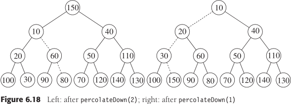

**考纲**

排序的基本概念

插入排序：直接插入排序，折半插入排序，希尔排序

交换排序：起泡排序，快速排序

选择排序：简单选择排序，堆排序

二路归并排序

基数排序

外部排序

各种排序算法的比较与应用

**知识框架**


**重难点**：快速排序，堆排序，归并排序

## 1. 基本概念

稳定性：存在多个相同关键字在排序前后它们的相对位置关系若不改变，则说明算法稳定

内部排序算法基本操作：比较+移动（除基数排序外）

内部排序算法分类：

- 插入类：直接插入，折半插入
- 交换类：气泡排序，快速排序
- 选择类：简单选择，堆排序
- 归并类：二路归并，多路归并
- 基数类：基数排序（基于多关键字排序思想）


## 2. 插入排序

### 直接插入排序

需要 $i=1...n-1$ 趟排序，第 i 趟保证前 $i+1$ 个元素 $arr[0...i]$ 元素为已排序

在 $arr[0...i-1]$ 中从后往前将比 $arr[i]$ 大的元素后移一个位置，将 $arr[i]$ 放入到其中一个合适位置

```cpp
template <typename T, typename Compare = less>
void insertsort(vector<T> & arr, Compare cmp) {
    for (int i=1; i<arr.size(); i++) {
        T tmp = arr[i];
        int j = i;
        for (; j && cmp(tmp, arr[j-1]); j--)
            arr[j] = arr[j-1];
        arr[j] = tmp;
    }
}
```

最坏情况时间复杂度 $O(n^2)$，最好情况（有序时每趟只比较1次）时间复杂度 $\Omega(n)$

平均时间复杂度 $\Theta(n^2)$

### 折半插入排序

查找插入位置时使用折半查找

时间复杂度：虽然每趟减少了查找次数 $O(log_2n)$，但主要的移动次数 $O(n)$ 没变，时间复杂度 $O(n^2)$ 

### 希尔排序

使用索引增量缩小的序列的插入排序，最后一趟（增量=1），即上述插入排序

$h_1,...,h_t:\ \lfloor n/2\rfloor,...,\lfloor n/2^k\rfloor,...,2,1$ 

选用该增量序列的排序时间复杂度 $O(n^2)$

稳定性：相同关键字的不同记录在使用不同增量排序后相对顺序可能会发生改变，所以不稳定

```cpp
template <typename T, typename Compare = less>
void shellsort(vector<T> & arr, Compare cmp) {
    for (int gap=arr.size()/2; gap>0; gap/=2) {
        for (int i=gap; i<arr.size(); i++) {
            T tmp = arr[i];
            int j = i;
            for (; j>=gap && cmp(tmp, arr[j-gap]); j-=gap) 
                arr[j] = arr[j-gap];
            arr[j] = tmp;
        }
    }
}
```

## 3. 交换排序

### 冒泡排序

需要 $i=1...n-1$ 趟排序，第 i 趟保证后 i​ 个元素 $arr[n-i...n-1]$ 元素为已排序

在 $arr[0...n-i]$ 中顺序比较相邻元素，若存在逆序关系则交换移动，使较大的元素向后冒泡，直到落在末位 $arr[n-i]$ 

```cpp
template <typename T, typename Compare = less>
void bubblesort(vector<T> & arr, Compare cmp) {
    for (int i=1; i<arr.size(); i++) {
		flag = false; //标记每趟初始不存在逆序
        for (int j=1; j<=n-i; j++) {
            if (cmp(a[j], a[j-1])) {
                std::swap(a[j], a[j-1]);
                flag = true;
            }
        }
        if (!flag) return ;
    }
}
```

最坏情况时间复杂度 $O(n^2)$，最好情况（有序时第1趟比较次 n 返回）时间复杂度 $\Omega(n)$

平均时间复杂度 $\Theta(n^2)$

特点：每趟排序后，冒泡到一端的子序列均为最终有序列，即每趟均有一个元素落在最终位置

### 快速排序

快速排序用到分治思想

$qsort(arr)\rightarrow\text{select pivot and partition}\rightarrow qsort(smaller),pivot,qsort(larger)$

```cpp
// simple partition and merge
template <typename T>
void quicksort(vector<T> & arr) {
    if (arr.size() > 1) {
        vector<T> smaller, same, larger;
        auto pivot = arr[arr.size() / 2];
        for (auto & item: arr) {
            if (item < pivot) smaller.push_back(std::move(item));
            else if (pivot < item) larger.push_back(std::move(item));
            else same.push_back(std::move(item));
        }
        quicksort(smaller);
        quicksort(larger);
        int i=0;
        for (; i<smaller.size(); i++) arr[i] = std::move(smaller[i]);
        for (; i<same.size(); i++) arr[i] = std::move(same[i]);
        for (; i<larger.size(); i++) arr[i] = std::move(larger[i]);    
    }
}
```

一趟快速排序：将小于枢纽元 $pivot$ 的元素移动到数组前 $arr[0...i-1]$，大于枢纽元的元素移动到数组后  $arr[i+1...n-1]$，则枢纽元 $pivot$ 置于最终位置 $arr[i]$

选择头作为枢纽元，设置左右两个索引指针

1. 从后往前比较，若出现比枢纽元小的将其值赋值给左指针指向单元

2. 从前往后比较，若出现比枢纽元大的将其值赋值给右指针指向单元

3. 左右指针相遇时，即为枢纽元位置，赋值；再递归对左右两子数组排序


```cpp
template <typename T>
void quicksort(vector<T> & arr, int left, int right) {
    if (left < right) {
        T & pivot = arr[left]; //select left as pivot
        int i=left, j=right;
        while (i < j) {
            while (i < j && pivot <= arr[j]) j--;
            arr[i] = arr[j];
            while (i < j && arr[i] <= pivot) i++;
            arr[j] = arr[i];
        }
        arr[i] = pivot;
        quicksort(arr, left, i-1);
        quicksort(arr, i+1, right);    
	}
}
```

空间复杂度：使用递归栈（调用深度），最好情况 $\Omega(log_2n)$，最坏情况 $O(n)$，平均情况 $\Theta(log_2n)$

时间复杂度：与划分是否对称有关

- 最坏情况：两区域分别包含 n-1 、0个元素——基本有序或基本逆序，时间复杂度 $O(n^2)$

  避免：可选择头尾中间三元素的中间值作为枢纽元

- 最好情况：选择适当枢纽元平衡划分两区域，时间复杂度 $\Omega(nlog_2n)$

- 平均情况：$\Theta(nlog_2n)$

稳定性：相同关键字靠左（或右）的可能会先被交换到另一区域，不稳定

## 4. 选择排序

### 简单选择排序

需要 $i=1...n-1$ 趟排序，第 i 趟保证前 $i+1$ 个元素 $arr[0...i]$ 元素为已排序

在 $arr[i-1...n-1]$ 中选出最小关键字，将其与 $arr[i-1]$ 交换

```cpp
template <typename T, typename Compare = less>
void selectsort(vector<T> & arr, Compare cmp) {
    for (int i=0; i<n-1; i++) {
        mini = i;
        for (int j=i; j<n; j++) 
            if (cmp(arr[j], arr[mini]))
                mini = j;
        if (mini != i)
            std::swap(arr[i], arr[mini]);
    }
}
```

时间复杂度：$O(n^2)$

稳定性：相同关键字 $a[i],a[j]$，前面记录 $a[i]$ 在某趟排序后可能会被换到 $a[j]$ 的后面，相对位置改变，不稳定

特点：每趟排序后，枢纽元将落在最终位置上

### 堆排序

以数组的形式（完全二叉树）存放优先队列（大根堆或小根堆）

序列中，对于有孩子的结点（$1\le i\le \lfloor n/2\rfloor$）：

- 大根堆：$a[i]\ge a[2i],a[i]\ge a[2i+1]$，

  下滤：若(子树)根结点关键字 < 左右孩子关键字较大者，则将两者交换，从该孩子继续判断，直至成为堆

- 小根堆：$a[i]\le a[2i],a[i]\le a[2i+1]$

  下滤：若(子树)根结点关键字 > 左右孩子关键字较小者，则将两者交换，从该孩子继续判断，直至成为堆

构建优先队列时，从最后一个子树结点到根结点依次调整位置：其与孩子存在逆序则下滤

（图为小根堆的最后一次根结点下滤）



**堆排序**

- 构建优先队列（大根堆）：


- 优先队列队首（根）出队，将其与队尾元素交换；调整堆，使新的队首（根）下滤到适当位置


```cpp
template <typename T>
void heapsort(vector<T> & a) {
    for (int i=a.size()/2; i>=0; i--) //buildheap
        percolateDown(a, i, a.size());
    for (int i=a.size()-1; i; i--) {
        std::swap(a[0], a[i]); //最大元素换到队尾，队尾换到根
        percolateDown(a, 0, i); //从根向下调整堆，使根元素下滤
    }
}
template <typename T>
void percolateDown(vector<T> & a, int i, int n) {
    T tmp = a[i];
    int child = 2*i+1; //left
    for (; child<n; i=child, child=2*i+1) {
        if (child != n-1 && a[child] < a[child+1])
            child++; //right
        if (tmp < a[child])
            a[i] = a[child];
        else break;
    }
    a[i] = tmp;
}
```

时间复杂度：

- 建堆时间与结点所在高度有关：$\sum_{i=1}^{h=\lfloor log_2n\rfloor}(h+1-i)·2^{i-1}=(h+1)(2^h-1)-(2^h(h-1)+1)\approx 2·2^h-h=n-\lfloor log_2n\rfloor$，时间复杂度 $O(n)$
- 置换后的根节点下滤时间：$(n-1)h$，时间复杂度 $O(nlog_2n)$

稳定性：相同关键字 $a[i],a[j]$ 后面的  $a[j]$ 先被替换到根，可能被下滤到 $a[i]$ 前面，不稳定

## 5. 归并排序

分治思想


```cpp
template <typename T>
void mergesort(vector<T> & a) {
    vector<T> tmp(a.size());
    mergesort(a, tmp, 0, a.size()-1)
}
template <typename T>
void mergesort(vector<T> & a, vector<T> & tmp, int left, int right) {
    if (left < right) {
        int c = (left + right) /2;
        mergesort(a, tmp, left, c);
        mergesort(a, tmp, c+1, right);
        merge(a, tmp, left, c, right);
    }
}
template <typename T>
void merge(vector<T> & a, vector<T> & tmp, int left, int center, int rend) {
    int i = 0, right = center+1;
    while (left <= center && right <= rend) {
        if (a[left] <= a[right])
            tmp[i] = a[left++];
        else
            tmp[i] = a[right++];
    }
    while (left <= center)
        tmp[i] = a[left++];
    while (riht <= rend)
        tmp[i] = a[right++];
    while (rend >= left) 
        a[rend] = tmp[rend--]; //copy tmp-array back
}
```

空间复杂度：使用辅助数组，$O(n)$

时间复杂度：$O(nlog_2n)$

## 6. 基数排序

基于关键字的各位的大小排序，按照最低位优先，权重递增依次排序

每个关键字由 d 位组成，每位的取值范围 $[0,r-1]$，基数 r

需要 $i=0...d-1$ 趟排序，每趟根据第 $d-i$ 位对关键字进行：分配与收集（借助 d 个队列或链表）

分配的链表或队列索引：`a[j] / r^i) % r`


空间复杂度：$O(n)$

时间复杂度：每趟分配 $O(n)$，收集 $O(r)$，时间复杂度 $O(d(n+r))$

## 7. 排序算法比较及应用

### 内部排序算法的比较


## 8. 外部排序

### 外部排序方法

常用算法：多路归并排序

1. n 个记录分 k 路依次读入内存，经**置换-选择排序**（可用**败者树**或优先队列）得到 $m\le\lceil n/k\rceil$ 个大小不一、较少较长的初始归并段

2. 根据初始归并段 构造 k-huffman **最佳归并树**，使 I/O次数=2*带权路径长度 最小

3. 按最佳归并树的归并顺序（每组 k 段）依次读入内存进行归并排序

   对每一组，将 k 段段首记录读入内存；

   每次从 k 个记录选出最小值（使用**败者树**或优先队列），将其写回外存，并将其所在记录段的次小值读入内存补上空位；继续选。

（图为5路归并）


一趟归并：n 个记录均被归并一次，每个记录需要2次 I/O 读写操作

外部排序的总时间=外存信息读写时间+内部排序时间+内部归并时间，主要在于外存读写时间

减少外存读写次数：

- 减少归并趟数：**增大归并路数 k** 或 **减少初始归并段数**

- 调整归并段归并顺序：归并段长度短的优先归并——**最佳归并树** k-huffman-tree

### 置换-选择排序

目的：减少初始归并段数。若采用内部排序生成初始归并段，则初始归并段长度依赖于内存工作缓冲区大小（路数 k）

置换-选择排序算法：

1. 从输入文件输入 k 个记录到工作区

2. 从工作区中选择关键字最小的记录，赋值为 outmax，输出到新的文件段中

3. 若输入文件非空，则输入下一记录到工作区

4. 若工作区非空，在工作区比 outmax 值大的记录中选择关键字最小的记录，赋值为 outmax，输出到文件段中；

   - 执行 3，直到工作区选不出新的 outmax 记录，由此得到一个初始归并段；执行 2

   若工作区为空，则已得到全部初始归并段，结束


### 最佳归并树

目的：组织长度不等的初始归并段的归并顺序，归并段长度短的优先，使I/O次数最少

叶结点——初始归并段，权值——归并段长度（记录数），

结点带权路径——归并段的读或写记录数，树的带权路径长度WPL——所有记录总的读或写记录数

总I/O次数=2·WPL

**k 路平衡归并**

假设不考虑各个归并段长度，采用 k 路平衡归并：


树的带权路径长度 $WPL=2·\sum_{i=1}^n initSegment[i].length=242$，总I/O次数=484

**[huffman-k 叉树](data-structure/tree?id=huffman-k-叉树)**


严格的 huffman-k 叉树不含度 $1...(k-1)$ 的结点：$n_0=(k-1)n_k+1$

若初始归并段不足以构成一棵严格的 k 叉树时，需添加若干长度为0的 “虚段”

判断需添加的 "虚段" 数：

- 若 $n_k=(n_0-1)\%(k-1)=0$，说明初始结点足够形成严格 k-tree

- 若 $n_k=(n_0-1)\%(k-1)=i>0$，则需添加 $k-1-i$ 个虚段结点

### 败者树

内部排序与内部归并中，每次比较都需要在 k 路输入记录中选择最小值输出

第一次建树选择最小值需比较 n-1 次，以后每次仅需比较 $\lceil log_2k\rceil$ 次


