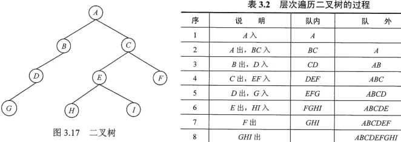
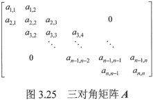

**考纲**

栈和队列基本概念、顺序/链式存储结构

多维数组的存储，特殊矩阵的压缩存储

栈、队列、数组的应用

**知识框架**


## 3.1 栈

### 栈的基本概念

**定义**


$S=(a_1,...,a_5), a_1 栈底, a_5 栈顶$，出入栈操作在栈顶，入栈次序：$a_1,...,a_5$，出栈次序：$a_5,...,a_1$

特性：后进先出

**数学性质**

$Catalan(n)$ 数：n 个不同元素以某种次序进栈（期间可能出栈），出栈元素不同排列数 $\frac{1}{n+1}C^n_{2n}$

如：$C(3)=5, 出栈排列:a_3a_2a_1,\ a_2a_3a_1,\ a_2a_1a_3,\ a_1a_3a_2,\ a_1a_2a_3$

**栈的基本操作**

```cpp
Init(&S);
IsEmpty(S);
Push(&S, x);
Pop(&S, &x);
GetTop(S, &x);
Destroy(&S);
```

### 栈的顺序存储

```cpp
typedef struct {
    int data[MaxSize];
    int top = -1; //
} Stack;
```

栈顶元素 `S.data[S.top]`，栈长 `S.top+1`

栈空：`S.top == -1`，栈满：`S.top == MaxSize-1`

入栈：栈不满时，栈指针+1，赋值

出栈：栈非空时，取值，栈指针-1

**入栈**

```cpp
bool Push(Stack &S, int x) {
    if (S.top == MaxSize-1)
        return false
    S.data[++S.top] = x;
    return true;
}
```

**出栈**

```cpp
bool Pop(Stack &S, int &x) {
    if (S.top == -1)
        return false;
 	x = S.data[S.top--];
    return true;
}
```

#### 共享栈


栈满：`top1 -top0 == 1 `，上溢

### 栈的链式存储


所有操作都在表头进行，入栈：单链表头插法

```cpp
typedef struct Node {
    int data;
    struct Node *next;
} *Stack;
```


## 3.2 队列

### 队列基本概念

操作特性：先进先出，队尾插入，队头删除


```cpp
Init(&Q);
IsEmpty(Q);
EnQueue(&Q, x);
DeQueue(&Q, &x);
GetHead(Q, &x);
```

### 队列的顺序存储

```cpp
struct Queue {
    int data[MaxSize];
    int front=0, rear=0; //队头、队尾指针
}
```

初始队空：`Q.front == Q.rear == 0`

入队：队不满时，队尾赋值，`Q.rear += 1`，队尾指针指向下一个空单元

出队：队不空时，队头取值，`Q.front += 1`

假溢出问题：经一系列入队出队后，指针均指向末端 `MaxSize-1` 处，队中无元素但无法入队


#### 循环队列

入队：`Q.rear = (Q.rear+1) % MaxSize`

出队：`Q.front = (Q.front+1) % MaxSize`

队空与队满都有 `Q.front == Q.rear`，如何区分？

1. 牺牲一个单元(队首或队尾)

   队满：`(Q.rear+1) % MaxSize == Q.front`

   队列长度：`(Q.rear+MaxSize-Q.front) % MaxSize`

2. 类型声明里增加 `int size;` 元素个数

   对空：`Q.size==0`，队满：`Q.size==MaxSize`

3. 类型声明里增加 `bool tag;` 对空0，队满1

   队空：出队导致 `Q.front == Q.rear`，`Q.tag=0`

   队满：入队导致 `Q.front == Q.rear`，`Q.tag=1`

**牺牲队头，front 指向空单元，先指针+1**

```cpp
bool EnQueue(Queue &Q, int x) {
    if ((Q.rear+1) % MaxSize == Q.front)
        return false;
    Q.rear = (Q.rear+1) % MaxSize; //
    Q.data[Q.rear] = x; //
    return true;
}
bool DeQueue(Queue &Q, int &x) {
    if (Q.rear == Q.front)
        return false
    Q.front = (Q.front+1) % MaxSize; //
    x = Q.data[Q.front]; //
    return true;
}
```

**牺牲队尾，rear 指向空单元，后指针+1**

```cpp
bool EnQueue(Queue &Q, int x) {
    if ((Q.rear+1) % MaxSize == Q.front)
        return false;
    Q.data[Q.rear] = x; //
    Q.rear = (Q.rear+1) % MaxSize; //
    return true;
}
bool DeQueue(Queue &Q, int &x) {
    if (Q.rear == Q.front)
        return false
    x = Q.data[Q.front]; //
    Q.front = (Q.front+1) % MaxSize; //
    return true;
}
```


### 队列的链式存储

```cpp
struct Node {
    int data;
    struct Node* next;
};
typedef struct {
    Node *front, *rear;
} Queue;
```

**不带头节点的链队**

队空：`Q.front == NULL || Q.rear == NULL`

初始化

```cpp
void InitQueue(Queue &Q) {
    Q.front = Q.rear = NULL;
}
```

入队：开始队列为空时，指针均更新指向首元节点，

出队：只有一个节点时，指针均更新指向NULL

```cpp
void EnQueue(Queue &Q, int x) {
    Node *s = (Node*)malloc(sizeof(Node));
    s->data = x;
    s->next = NULL;
    if (Q.rear == NULL) //开始队列为空时，指针均更新指向首元节点
        Q.front = Q.rear = s; //
    else {
        Q.rear->next = s; //尾插法，更新尾指针
        q.rear = s; //        
    }
}
bool DeQueue(Queue &Q, int &x) {
    if (Q.rear == NULL) //队列空 
        return false;
    Node *tmp = Q.front; //
    if (Q.front == Q.rear) //只有一个节点时，指针均更新指向NULL
        Q.front == Q.rear = NULL; //
    else 
        Q.front = Q.front->next;
    x = tmp->data; //
    free(p);
    return true;
}
```

**带头节点的链队**


队空：`Q.front == Q.rear || Q.front->next == NULL`

初始化

```cpp
void InitQueue(Queue &Q) {
    Q.front = Q.rear = (Node*)malloc(sizeof(Node));
    Q.front->next = NULL;
}
```

入队：尾插法，更新尾指针

出队：只有一个节点时，尾指针更新等于头指针

```cpp
void EnQueue(Queue &Q, int x) {
    Node *s = (Node*)malloc(sizeof(Node));
    s->data = x;
    s->next = NULL;
    Q.rear->next = s; //尾插法，更新尾指针
    q.rear = s; //
}
bool DeQueue(Queue &Q, int &x) {
    if (Q.front == Q.rear) //队列空
        return false;
    Node *tmp = Q.front->next; //
    if (Q.rear == tmp) //只有一个节点时，尾指针更新等于头指针
        Q.rear = Q.front; //
    Q.front->next = tmp->next; //
    x = tmp->data; //
    free(p);
    return true;
}
```

### [双端队列 deque](https://zh.cppreference.com/w/cpp/container/deque)


[STL之deque函数详解](https://blog.csdn.net/hnust_xiehonghao/article/details/8800007)

队列的前端、后端都可进行入队、出队操作

```
pop_back();
pop_front();
push_back(x);
push_front(x);
```

**两个栈底邻接的栈**：限定双端队列入队出队都在同一端


限定受限的双端队列入队出队都在同一端时，该端相当于栈

**输入受限的双端队列**


由输入受限的双端队列两端混合输出的序列数 $<n!-\frac{1}{n+1}C^n_{2n}$

**输出受限的双端队列**


由输出受限的双端队列两端混合输入后，输出的序列数 $<n!-\frac{1}{n+1}C^n_{2n}$

## 3.3 栈和队列应用

### 栈在表达式求值中的应用

中缀表达式：标准式，依赖运算符的优先级，需处理括号。A+B*(C-D)-E/F

后缀表达式：运算符在操作数后面，已考虑了运算符的优先级且没有括号。ABCD-*+EF/-


后缀表达式求值过程：对于表达式每一项，

- 若该项是操作数，则压入栈；
- 若该项是操作符<op>，则连续从栈中退出两操作数Y、X，形成运算指令 X<op>Y，将结果再压入栈

栈顶存放最终运算结果

**中缀表达式转换后缀表达式**

- 如果字符是 '(', '*', '/'，入栈

- 如果字符是 ')'，输出栈顶符号并出栈，再出栈 '('

- 如果字符是 '+', '-'，

  （先判断高优先级）如果栈非空且栈顶为 '*', '/'，输出栈顶符号并出栈；

  （再判断低优先级）如果栈非空且栈顶为 '+', '-'，输出栈顶符号并出栈；

  入栈

- 否则输出运算数

```cpp
string midToSuffix(string s) {
  string str("");
  stack<char> st;
  for (string::iterator it = s.begin(); it!=s.end(); it++) {
    if (*it == '(' || *it == '*' || *it == '/') {
      st.push(*it);
    } else if (*it == ')') {
      str += st.top();
      st.pop();
      st.pop(); //'('
    } else if (*it == '+' || *it == '-') {
      if (!st.empty()) {
        char c = st.top();
        if (c == '*' || c == '/') {
          str += c;
          st.pop();
          if (!st.empty()) {
            c = st.top();
            if (c == '+' || c == '-') {
              str += c;
              st.pop();
            }
          }
        } 
      }
      st.push(*it);
    } else {
      str += *it;
    }
  }
  while (!st.empty()) {
    str += st.top();
    st.pop();
  }
  return str;
}
```


### 栈在递归中的应用

### 队列在层次遍历中的应用

**二叉树层次遍历**

- 根节点入队

- 循环判断，若队不空：

  若队首节点有左孩子，则左孩子入队；若队首节点有右孩子，则右孩子入队

  队首节点出队输出



### 队列在计算机系统的应用

主机与外设之间速度不匹配——设置缓冲区队列，如：主机与打印机

多用户终端对系统资源的竞争——设置用户程序请求队列

## 3.4 特殊矩阵的压缩存储

### 矩阵的压缩存储

压缩存储：为相同元素只分配一个存储空间，对零元素不分配存储空间

特殊矩阵：具有相同元素（包括零元素），相同元素的分布呈规律性。如：对称矩阵、三角矩阵、对角矩阵

#### 对称矩阵


矩阵 $A_{n\times n},\ a_{ij}=a_{ji}$，用一维数组 $B[\frac{n(n+1)}{2}]$ 存放其下三角部分

$a_{ij}$ 前面的元素： $1+...+(i-1)+(j-1)=\frac{i(i-1)}{2}+j-1$

1 行 $a_{11}$

i-1 行 $a_{i-1,1},...,a_{i-1,i-1}$

i 行 $a_{i1},...,a_{i,j-1}$

$a_{ij}=B[k]=\begin{cases}
B[\frac{i(i-1)}{2}+j-1] & i\ge j\\
B[\frac{j(j-1)}{2}+i-1] & i<j
\end{cases}$

#### 三角矩阵


**下三角矩阵**

类似对称矩阵，一维数组末尾 $B[\frac{n(n+1)}{2}]$ 存放上三角区同一常数

$a_{ij}$ 前面的元素： $1+...+(i-1)+(j-1)=\frac{i(i-1)}{2}+j-1$

$a_{ij}=B[k]=\begin{cases}
B[\frac{i(i-1)}{2}+j-1] & i\ge j\\
B[\frac{n(n+1)}{2}] & i<j
\end{cases}$

**上三角矩阵**

一维数组末尾 $B[\frac{n(n+1)}{2}]$ 存放下三角区同一常数

$a_{ij}$ 前面的元素： $n+...+(n-i+2)+(j-i)=\frac{(i-1)(2n-i+2)}{2}+j-i$

1 行 $a_{11},...,a_{1n}$

i-1 行 $a_{i-1,i-1},...,a_{i-1,n}$

i 行 $a_{ii},...,a_{i,j-1}$

$a_{ij}=B[k]=\begin{cases}
B[\frac{(i-1)(2n-i+2)}{2}+j-i] & i\le j\\
B[\frac{n(n+1)}{2}] & i>j
\end{cases}$

#### 三对角矩阵



$\forall a_{ij},when\ |i-j|>1,a_{ij}=0$

将三对角元素按行优先存放在一维数组 B

$a_{ij}$ 前面的元素： $2+3+...+3+(j-i+1)=3(i-1)-1+j-i+1=2i+j-3$

1 行 $a_{11},a_{12}$

i-1 行 $a_{i-1,i-2},a_{i-1,i-1},a_{i-1,i}$

i 行 $a_{i,i-1},...,a_{i,j-1}$

$a_{ij}=B[k]=B[2i+j-3]\ (|i-j|\le 1)$

数组下标 $k=2i+j-3\Rightarrow$ 行列号 $i=\lfloor (k+1)/3+1\rfloor$ 如：$B[5]=a_{32}$

### 稀疏矩阵

矩阵元素个数 s 远大于非零元素个数 t，如：$A_{n\times n}$ 非零元素个数 $\le n$；

存储非零元素的行号、列号、值


#### 顺序存储

**三元组**

```cpp
struct Mat {
    int rows, cols;
    int data[][3]; //i,j,v
}
```

#### 链式存储

**邻接表**

矩阵的每一行非零元素连成一个链表，结点存储矩阵值及其列号


**十字链表**

矩阵的每一行、每一列用一个带头结点的链表表示，

头结点5分量：行数、列数、非零元素个数、指向行列头结点数组的指针

普通结点5分量：行下标、列下标、数据、指向下方及右方结点的指针


