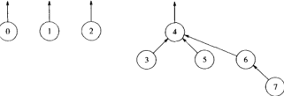

**考纲**

树的基本概念

二叉树：二叉树定义/特征，二叉树顺序/链式存储结构，二叉树遍历，线索二叉树概念与构造

树、森林：树的存储结构，森林与二叉树的转换，树和森林的遍历

树与二叉树应用：~~二叉搜索树，平衡二叉树~~，哈夫曼树/哈夫曼编码，并查集及其应用

**知识框架**


**错题**：

树概念：4,7

二叉树：4,6,18,20,23

二叉树遍历：3,4,5,23,24,26,29,31

树与森林：6,7,8,9,16

树与二叉树应用：10,13,14,16,17,33

## 1. 树的基本概念

树的递归定义：

- 若节点数N=0，为空树；

- 若节点数N>0，则树由根 root 及0个或多个非空子树 $T_1,...,T_k$ 组成，每个子树都由根 root 的一条有向边 edge 连接。


结点的祖先：根到结点唯一路径上的任意结点

结点的度：结点的 子树/孩子/分支 个数

<u>树的度：各结点度的最大值 m，即 m 叉树</u>

<u>路径：（自上而下）连接两结点之间经过的结点序列；路径长度：路径上边的个数</u>

<u>树的路径长度：根到每个结点的路径长度之和</u>

结点的深度：从根节点到当前结点 k 的 路径/结点/层 数（到根）

结点的高度：从当前结点 k 到叶子结点的最大 路径/结点/层 数（到叶）

树的深(高)度：根的高度，最深叶结点的深度，节点最大层数

森林：m 个互不相交的树的集合

### 树的性质

- <u>N 个结点的树共有 N-1 条边/分支，所有结点度数之和 N-1（根节点没有父节点）</u>

  总结点数=总分支数+1=结点总度数+1

- 度为 m 的树第 i 层结点数至多 $m^{i-1}$ 个

- 度为 m 的树高度 h，结点数至多 $1+m+...+m^{h-1}=\frac{1-m^h}{1-m}$ 个（满）

  度为 m 的树结点数 N，最小高度 $h_{min}=\lceil log_m(N(m-1)+1)\rceil$，最大高度 $h_{max}$= N-(m-1)

- <u>度为 m 的树**总分支数**</u> = $n-1=\sum_{i=0}^m n_i-1=\sum_{i=1}^m i·n_i$

  <u>度为 m 的树**叶结点数**</u> = $n_0=\sum_{i=1}^m (i-1)·n_i+1$

例：在一棵度为4的树T中，若有20个度为4的节点，10个度为3的节点，1个度为2的节点，10个度为1的节点，则树T的叶节点个数?

## 2. 二叉树的概念

二叉树特点：每个结点至多有两个子树，树的度 $m\le 2$

二叉树的递归定义：

- 若节点数N=0，为空二叉树；

- 若节点数N>0，则树由根 root 及 0个或1个，或2个左右子树组成


### 特殊二叉树

#### 满二叉树

高度为 h 的满二叉树结点数 $N=2^h-1$

- 每个子树根结点（除叶结点）都有两个左右孩子结点，叶结点集中在最下层
- 对满二叉树按层序编号，结点 i，双亲 $\lfloor i/2\rfloor$（除根节点），左右孩子 $\lfloor 2i\rfloor,\lfloor 2i+1\rfloor$（除叶节点）

#### 完全二叉树

高度为 h 的完全二叉树结点数 $N\in[2^{h-1},2^h-1]$，其与高度 h 的满二叉树中编号 1~N 的结点一一对应

- 若 $i\le \lfloor n/2\rfloor$，则结点 i 为分支结点；若 $i>\lfloor n/2\rfloor$，则结点 i 为叶结点

- 度为1 的结点至多1个，且只有左孩子

- 编号 i 的结点 度为1 或是叶节点，则编号 >i 的结点均为叶结点

- 若 n 奇数，则分支结点都有左右孩子；若 n 偶数，则编号最大的分支结点 $n/2$ 只有左孩子

- 对完全二叉树按层序编号：
  - $i>1$，结点 i 的双亲 $\lfloor i/2\rfloor$
  - $i\le n/2$，结点 i 的左孩子 $2i$
  - $i\le (n-1)/2$，结点 i 的右孩子 $2i+1$
  - <u>结点 i 所在层次 (深度)</u> $h_i=\lfloor log_2i\rfloor+1$
  
- <u>N 个结点的完全二叉树 高度</u> $h=\lfloor log_2N\rfloor+1\ 或\ \lceil log_2(N+1)\rceil$

  <u>N 个结点的完全二叉树 叶节点数</u> $n_0=\lceil\frac{N}{2}\rceil$

**二叉搜索树**：左子树上所有结点关键字 < 根节点关键字 < 右子树上所有结点关键字

**平衡二叉树**：任意结点的左右子树的深度之差 $\le$ 1


### 二叉树性质

- **总分支数** = 单分支结点数 + 2* 双分支结点数，$n-1=n_0+n_1+n_2-1=n_1+2n_2$

  **总结点数** $n=n_0+n_1+n_2=n_1+2n_2+1$

- **叶结点数** = 双分支结点数 + 1，度0结点数 = 度2结点数 + 1，$n_0=n_2+1$

- **空指针数** = 2* 叶结点数 + 单分支结点数 = 2*度0结点数 + 度1结点数，$2n_0+n_1=n_0+n_1+n_2+1=n+1$

- <u>非空二叉树，第 k 层结点数至多</u> $2^{k-1}$

- <u>二叉树高度h，结点数至多</u> $2^h-1$

- $Catalan(n)$ 数：n 个结点能构成不同二叉树个数 $C(n)=\frac{1}{n+1}C_{2n}^n$

只有度0, 度2结点的二叉树如：

```
╭[]╮
o ╭[]╮
  o  o   
```

### 二叉树存储结构

#### 顺序存储

按层序编号存储到一维数组 $B[n]$ 中，下标从1开始

- 完全二叉树：结点 i 对应 $B[i]$，双亲 $B[i/2]$，左右孩子 $B[2i],B[2i+1]$ （若有）
- <u>一般二叉树：空节点补充关键字0，使整体对应完全二叉树</u>（空间利用率低）


#### 链式存储

结点：数据、左右指针（父指针）


```cpp
typedef struct BTNode {
    int data;
    struct BTNode *lchild, *rchild;
} BTNode, *BTree;
```


N 个结点的二叉链表有 N+1 个空链域

## 3. 二叉树的遍历、线索二叉树

### 二叉树的遍历

递归算法借助**系统内存栈**

#### 先序遍历

若树非空，则访问根节点，先序遍历左子树，先序遍历右子树

```cpp
int preOrder(BTNode* T) {
    int acc = 0;
    if (!T) {
        acc = func(T);
        acc += PreOrder(T->lchild);
        acc += PreOrder(T->rchild);        
    }
    return acc;
}
```

#### 中序遍历

若树非空，则中序遍历左子树，访问根节点，中序遍历右子树

```cpp
int inOrder(BTNode* T) {
    int acc = 0;
    if (!T) {
        acc = InOrder(T->lchild);
        acc += func(T);
        acc += InOrder(T->rchild);        
    }
    return acc;
}
```

#### <u>后序遍历</u>

若树非空，则后序遍历左子树，后序遍历右子树，访问根节点

```cpp
int postOrder(BTNode* T) {
    int acc = 0;
    if (!T) {
        L = PostOrder(T->lchild);
        R = PostOrder(T->rchild);
        acc = func(T, L, R);
    }
    return acc;
}
```

每个结点访问一次，时间复杂度 $O(n)$，空间复杂度 $O(n)$

递归栈的深度 = 树的深度，最坏情况下，二叉树是 n 结点、深度 n 的单支树

- 计算磁盘文件区块数（m叉树），计算二叉树深度 $h(T)=max\{h(T\rightarrow l),h(T\rightarrow r)\}+1$
- 通过后序回溯可确定从孩子结点到祖先结点的路径

#### 遍历的非递归算法


先序序列：ABDEC，中序序列：DBEAC，后序序列：DEBCA

非递归算法借助**用户栈**

##### 先序遍历（DFS）

1. 若根元素 p 非空，<u>访问根元素p</u>，p 入栈，p更新为左子树 `p=p->lchild`，执行 1

2. 若根元素 p 为空，p 更新为栈顶元素右子树 `p=S.top()->rchild`，栈顶元素出栈，执行 1


```cpp
void preOrder(BTNode* T) {
	stack<BTNode*> S;
    BTNode *p = T;
    while (p || !S.empty()) { //节点非空或栈不空
        if (p) { //节点非空，访问
            // func(p);
            S.push(p);
            p = p->lchild;
        } 
        else { //节点为空，指向右，出栈
            p = S.top()->rchild; //更新为父节点右孩子
            S.pop();
        }
    }
}
```

##### 中序遍历

1. 若根元素 p 非空，p 入栈，p更新为左子树 `p=p->lchild`，执行 1

2. 若根元素 p 为空，<u>p 赋值为栈顶元素`p=S.top()`并访问</u>，p 更新为右子树 `p=p->rchild`，栈顶元素出栈，执行 1

```cpp
void inOrder(BTNode* T) {
	stack<BTNode*> S;
    BTNode *p = T;
    while (p || !S.empty()) { //节点非空或栈不空
        if (p) { //节点非空，向左走
            S.push(p);
            p = p->lchild;
        } 
        else { //节点为空，指向栈顶访问
            p = S.top();
            // func(p);
            p = p->rchild; //更新为父节点右孩子
            S.pop();
        }
    }
}
```

##### 后序遍历

1. 若根元素 p 非空，p 入栈，p更新为左子树 `p=p->lchild`，执行 1

2. 若根元素 p 为空，p 赋值为栈顶元素，

   若右子树非空且未访问过，p 更新为右子树 `p=p->rchild`，执行 1

   若右子树为空或已访问过，<u>访问栈顶元素并标记</u>，p 更新为空，栈顶元素出栈，执行 2

```cpp
void postOrder(BTNode *T) {
	stack<BTNode*> S;
    BTNode *p = T， r = NULL; //r标记刚访问过的子树根节点
    while (p || !S.empty()) { //节点非空或栈不空
        if (p) { //节点非空，向左走
            S.push(p);
            p = p->lchild;
        } 
        else { //节点为空，判断栈顶元素右孩子
            p = S.top();
            if (p->rchild && p->rchild != r)
                p = p->rchild; //更新为父节点右孩子
            else {
                // func(p);
                r = p; 
            	p = NULL;
                S.pop();
            }
        }
    }
}
```

#### 层次遍历（BFS）


层序遍历借助 **队列**

1. 树根结点先入队
2. 若队列非空，<u>p 赋值为队首元素并访问</u>；若有左孩子，左孩子入队；若有右孩子，右孩子入队；队首出队，执行 2

```cpp
void levelOrder(BTNode *T) {
    queue<BTNode*> Q;
    BTNode *p;
    Q.push(T);
    while (!Q.empty()) {
        p = Q.front();
        // func(p);
        if (p->lchild)
            Q.push(p->lchild)
        if (p->rchild)
            Q.push(p->rchild)
        Q.pop();
    }
}
```

#### <u>由遍历序列构造二叉树</u>

<u>先/层序+中序序列，唯一确定一个二叉树：局部同序 -- 根右，局部逆序 -- 根左 : 左根</u>

<u>中序+后序序列，唯一确定一个二叉树：局部同序 -- 左右，局部逆序 -- 根右 : 右根</u>

如：先序序列 ABCDEFGHI，中序序列 BCAEDGHFI


先序+后序序列，不能唯一确定二叉树

例：先序与后序相反的3结点二叉树

```
 ╭o ╭-o  o-╮ o╮ 
╭o  o╮    ╭o  o╮
o    o    o    o
```

### 线索二叉树

#### 基本概念

[n 个结点的二叉树有 n+1 个空链域（空指针）](data-structure/tree?id=二叉树性质)

线索二叉树省掉了非递归遍历算法中的用户栈，充分<u>利用空链域作为部分线索</u>：

若结点左孩子指针为空，则用来指向前驱，若结点右孩子指针为空，则用来指向后继

结点增加 `ltag, rtag` 字段，`ltag=1` 表示 `lchild` 为前驱线索，`rtag=1` 表示 `rchild` 为后继线索


```cpp
typedef struct TNode {
    int data;
    struct TNode *lchild, *rchild;
    int ltag = 0, rtag = 0;
} TNode
```

线索化：对二叉树以某种次序遍历，将空指针指向前驱或后继线索，成为线索二叉树

#### 中序线索二叉树的构造


`左子树最后结点 -> rchild = 根结点 = lchild <-右子树第一个结点`

**中序遍历线索化递归算法**

- 最左节点前驱为空，最右节点后继为空，

- 左叶结点的后继指向父节点，右叶结点的前驱指向父节点，

- 左子树最右下结点的后继指向根节点，右子树最左下结点的前驱指向根节点

```cpp
// p 指向正在访问结点，pre 指向刚访问过的结点
void inThread(TNode *p, TNode *&pre) {
	if (p) {
        inThread(p->lchild, pre); //线索化左子树
        if (!p->lchild) { //最左节点前驱为空,右子树最左下结点的前驱指向根节点
            p->lchild = pre;
            p->ltag = 1;
        }
        if (pre && !pre->rchild) { //左子树最右下结点的后继指向根节点
            pre->rchild = p;
            pre->rtag = 1;
        }
        pre = p; //
        InThread(p->rchild, pre);
    }
}
```

**通过中序遍历建立中序线索二叉树**

```cpp
void createInThread(TNode *T) {
    TNode *pre = NULL; //中序遍历后的最左节点前驱为空
    if (T) {
        inThread(T, pre); //
        pre->rchild = NULL; //中序遍历后的最右一节点后继为空
        pre->rtag = 1;
    }
}
```

带头结点的中序线索二叉树

`Head->lchild = T; Head->rchild = 最右结点`

`最左结点->lchild = Head; 最右结点->rchild = Head`


#### 中序线索二叉树的遍历

定位中序序列的第一个结点（最左下）

```cpp
TNode* front(TNode *p) {
    while (!p->ltag)
        p = p->lchild;
    return p;
}
```

定位中序序列中结点 p 的后继

```cpp
TNode* next(TNode *p) {
    if (!p->rtag) //rtag=0, 右子树序列第一个结点
        return front(p->rchild);
    return p->rchild; //后继线索
}
```

定位中序序列的最后一个结点（最右下）

```cpp
TNode* back(TNode *p) {
    while (!p->rtag)
        p = p->rchild;
    return p;
}
```

定位中序序列中结点 p 的前驱

```cpp
TNode* prev(TNode *p) {
    if (!p->ltag) //ltag=0, 左子树序列最后一个结点
        return back(p->lchild);
    return p->lchild; //前驱线索
}
```

**中序线索二叉树的遍历**

```cpp
void inOrder(TNode *T) {
    for (TNode *p=front(T); p; p=next(p)) 
        // func(p);
}
```

#### 先序线索二叉树与后序线索二叉树


##### 先序遍历线索化二叉树

先序序列 结点 p 的前驱：

- 若 p 为左叶结点，p 的前驱为双亲
- 若 p 为右叶结点，p 的前驱为双亲左子树先序最后结点

`左子树第一根结点 -> lchild = 根结点`

`左子树最后结点 -> rchild = 右子树第一根结点`

`右子树第一根结点 -> lchild = 左子树 ? 左子树最后结点 : 根结点`

```cpp
// p 指向正在访问结点，pre 指向刚访问过的结点
void preThread(TNode *p, TNode *&pre) {
	if (p) {
        if (!p->lchild) { //右子树根结点的前驱指向左子树最右下结点
            p->lchild = pre;
            p->ltag = 1;
        }
        if (pre && !pre->rchild) { //左子树最右下结点的后继指向右子树根节点
            pre->rchild = p;
            pre->rtag = 1;
        }
        pre = p; //        
        !p->ltag && preThread(p->lchild, pre); //左孩子非空线索化左子树
        preThread(p->rchild, pre);
    }
}
```

定位中序序列的第一个结点（最左下）

##### 后序遍历线索化二叉树

后序序列 结点 p 的后继：

- 若 p 为左叶结点，p 的后继为双亲右子树后序第一结点
- 若 p 为右叶结点，p 的后继为双亲

`左子树最后根结点 -> rchild = 右子树第一结点`

`右子树第一结点 -> lchild = 左子树最后根结点`

`右子树最后根结点 -> rchild = 根结点`

```cpp
// p 指向正在访问结点，pre 指向刚访问过的结点
void postThread(TNode *p, TNode *&pre) {
	if (p) {
		preThread(p->lchild, pre); //线索化左子树
        preThread(p->rchild, pre);
        if (!p->lchild) { //右子树根结点的前驱指向左子树最右下结点
            p->lchild = pre;
            p->ltag = 1;
        }
        if (pre && !pre->rchild) { //左子树最右下结点的后继指向右子树根节点
            pre->rchild = p;
            pre->rtag = 1;
        }
        pre = p; //            
    }
}
```

<u>注：先序、中序线索二叉树均可通过孩子指针完整遍历（无需借助栈），</u>

<u>后序线索二叉树由于最后访问根节点，当右子树结点有右孩子时，结点后继指向孩子，无法直接通过指针遍历父节点，需借助栈实现完整遍历</u>


## 4. 树、森林

### 树的存储结构

#### 双亲表示

连续顺序存储，每个结点增设一个伪指针，指示其双亲结点在数组中的位置

找结点的双亲，时间复杂度 $O(1)$，找结点的孩子，时间复杂度 $O(n)$


```cpp
struct Node {
    int data;
    int parent; //双亲索引
};
struct Tree {
    Node nodes[MaxSize];
    int n; //结点数
}
```

#### 孩子表示


#### 孩子兄弟表示

二叉树表示法，每个结点包括：值、指向结点第一个孩子指针、指向结点下一兄弟结点指针。

易于找结点的孩子，找结点的双亲较麻烦


```cpp
struct Node {
    int data;
    struct Node *firstChild, *nextSibling;
};
```

### <u>树、森林与二叉树的转换</u>

**树 $\rightarrow$ 二叉树**：孩子兄弟表示法（二叉链表）

每个结点只保留孩子它与第一个孩子的连线，其余孩子（兄弟）用线连接


**森林 $\rightarrow$ 二叉树**：

先将每个树用孩子兄弟表示法转化为二叉树，每个树对应的二叉树右子树为空；将<u>第二个树作为第一个树的右子树，以此类推</u>


树T/森林F转换二叉树BT时

- 每个叶节点对应有一个“左孩子(左指针)为空的节点”，BT无左孩子结点数 = T/F叶结点数 = $n_0$ 

- 每个分支(非叶)节点对应有一个“右孩子(右指针)为空的节点”，根节点转换后也无右孩子。

  BT无右孩子结点数 = T/F有分支的结点数 + 1 = $n-n_0+1$

例：已知一棵有2011 个结点的树，其叶结点个数为116，该树对应的二叉树中无右孩子的结点的个数?

### <u>树和森林的遍历</u>

**树的遍历**（<u>对应其二叉树先、中序理解</u>）

1. 先根遍历：若树非空，先访问根节点，再依次遍历根节点每个子树（类似二叉树先序）如上图树的先根遍历：ABEFCDG
2. 后根遍历：若树非空，先依次遍历根节点每个子树，再访问根节点（类似其对应的二叉树中序）如上图树的后根遍历：EFBCGDA

**森林的遍历**（<u>对应其二叉树先、中、后序理解</u>）

1. 先根遍历：访问第一个树的根节点，先根遍历第一个树根节点的子树，先根遍历其它树。如上图森林先根遍历：ABCDEFGHI
2. 中根遍历：后根遍历第一个树的根节点子树，访问第一个树根节点，后根遍历其它树。如上图森林先根遍历：BCDAFEHIG
3. 后根遍历：对应二叉树的后序遍历

### 树与不相交集

#### 两种运算

- Find：当且仅当两个元素属于相同集合时，返回集合名
- Union：当两个集合不属于同一等价集合时，可合并为新的等价集合

#### 基本数据结构

用树来表示每个集合，树的每个元素都有相同的根，集合名由根结点给出；

初始状态每个集合一个元素（每个树一个根结点）

用数组存储树，初始化每个树根 `S[i]=-1`，存放指向的父节点索引

- `X=Union(X, Y)`：两棵树合并，即一棵树根结点指向另一棵树根结点
- `R=Find(X)`：查找元素的根结点


不相交集初始化

```cpp
void init(DisjSet S) {
    for (int i=NumSets; i>0; i--)
        S[i] = 0;
}
```

不相交集 Union（随意不考虑树高度）

```cpp
// unionSet(S, 4, 6); //4
void unionSet(DisjSet S, int root1, int root2) {
    S[root2] = root1;
}
```

不相交集 Find，向上找直到树根

```cpp
int find(DisjSet S, int x) {
    while (S[x] >= 0) 
        S = S[x]; 
    return x;
}
```

#### 求并算法

避免随意合并导致的最坏情况：子树高度从左到右 由低到高

##### 按大小求并

让较小的树成为较大的树的子树，任意结点的深度 $\le log N$。`unionSet(S, 3, 4) = 4`



实现：每个根的数组元素为它的**树大小（结点数）的负值**，初始为-1

```
-1 -1 -1  4 -5  4  4  6
 0  1  2  3  4  5  6  7
```

##### 按高度求并

让高度较浅的树成为较深的树的子树，树的深度 $\le log N$。

实现：每个根的数组元素为它的**树深度（高度）的负值**，初始为-1；只有两颗深度相等的树求并时树的高度才+1

```
-1 -1 -1  4 -3  4  4  6
 0  1  2  3  4  5  6  7
```

```cpp
// assume root1 and root2 are distinct
void unionSet(DisjSet S, int root1, int root2) {
    if (S[root2] < S[root1])	//root2 is deeper set
        S[root1] = root2;		//make root2 new root
    else {
        if (S[root1] == S[root2])
            S[root1]--;			//h+1
        S[root2] = root1;
    }
}
```

## 5. 树与二叉树的应用

### 二叉搜索树 BST

#### 定义

二叉搜索树的递归定义：

- 若节点数N=0，为空二叉树；

- 若节点数N>0，则树由根 root 及 0个或1个，或2个左右子树组成

  若左子树非空，<u>max{ 左子树结点值 } < 子树根结点值</u>

  若右子树非空，<u>子树根结点值 < min{ 左子树结点值 }</u>

中序遍历二叉搜索树 $\rightarrow$ 递增有序序列


#### 查找

```cpp
//非递归
Node* bstSearch(Node *T, int key) {
	while (T && key != T.data) {
        if (key < T->data)
            T = T->lchild;
        else
            T = T->rchild;
    }
    return T;
}
```


```cpp
//递归
Node* bstSearch(Node* T, int key) {
    if (!T || key == T->data) 
        return T;
    if (key < T->data) 
        return bstSearch(T->lchild, key);
    else
        return bstSearch(T->rchild, key);    
}
```

#### 插入

- 若 BST 为空，直接插入结点
- 若 BST 非空，若 `key < T->data` ，插入到左子树；若 `key > T->data` ，插入到右子树

```cpp
Node* bstInsert(Node *T, int key) {
    if (!T) {
        T = (Node*)malloc(sizeof(Node)); //
        T->data = key; //
        T->lchild = T->rchild = NULL;
        return T;
    }
    else if (key == T->data) 
        return T;
    else if (key < T->data) 
        return bstInsert(T->lchild, key); //
    else
        return bstInsert(T->rchild, key); //
}
```

```pseudocode
function BST-INSERT(T, z) is:
	y = T.nil			// 暂存父节点
	x = T.root
	while x != T.nil:	// 找到插入点位置(父节点)
		y = x
		if z.key < x.key then:
			x = x.left
		else
			x = x.right
	z.p = y				// 链接(插入)
	if y == T.nil then:
		T.root = z
	elseif z.key < y.key
		y.left = z
	else
		y.right = z
```


#### 构造

```cpp
void createBST(Node *&T, int key[], int n) {
    T = NULL; //reset
    for (int i=0; i<n; i++) 
        bstInsert(T, key[i]);
}
```

#### 删除

- 若待删结点是叶结点，直接删除

- 若待删结点只有一个左子树或右子树，则让其子树成为其父节点的子树，替代其位置

- 若待删结点有左、右两子树，

  可用其直接前驱（左子树值最大结点）替代，或用其直接后继（右子树中序第一结点值最小）替代；

  然后删去这个直接前驱（或后继）


#### BST树查找效率

BST 查找效率取决于树的高度

若 BST 的左、右子树的高度之差绝对值 $\le 1$，为平衡二叉树，平均查找长度 $O(log_2n)$

若 BST 是一个只有左（右）子树的单支树，平均查找长度 $O(n)$


第 i 层的结点需查找 i 次

$ASL_a=(1+2*2+4*3+3*4)/10\\
ASL_b=(1+...+10)/10$ 

### 平衡二叉树

#### 定义


**AVL 树**：<u>带有平衡条件的二叉搜索树（二叉查找树）</u>

任意结点的左、右子树的高度差定义为平衡因子，其绝对值 $\le 1$，保证树的深度（高度）$O(logn)$

> 定义 $n_h$：<u>深度 h 的 AVL 树的最少结点数（此时非叶分支结点平衡因子均为1）</u>
>
> $n_0=0,n_1=1,n_2=2,n_3=4,...,n_h=n_{h-1}+n_{h-2}+1$

函数 N(h) 与斐波那契数相关

```cpp
struct Node {
    int data, height;
    Node *lchild, *rchild;
}
```

#### AVL 树平衡调整

当二叉搜索树插入或删除一个节点时，若路径上的路径因此导致了不平衡，则先在<u>路径上找到离结点最近的 |平衡因子|>1 的结点</u>，对以其为根的子树结点调整位置关系

**插入不平衡的4种情况**

- LL：对结点A的左孩子的左子树插入

- LR：对结点A的左孩子的右子树插入

- RL：对结点A的右孩子的左子树插入

- RR：对结点A的右孩子的右子树插入

**插入平衡调整**

- <u>LL 向右单旋转：左孩子右上旋转，父结点右下旋转，左孩子的右子树作为父结点的左子树</u>

  ```cpp
  Node* singleRotateLeft(Node *T) {
      Node *p = T->lchild;
      T->lchild = p->rchild;
      p->rchild = T;
      T->height = max(T->lchild->height, T->rchild->height) + 1;
      p->height = max(p->lchild->height, T->height) + 1;    
      return p;
  }
  ```

  

  

- <u>RR 向左单旋转：右孩子左上旋转，父结点左下旋转，右孩子的左子树作为父结点的右子树</u>

  

- <u>LR 先左后右双旋转：左孩子的右子树根结点先RR左上旋转代替左孩子，新左孩子再 LL 右上旋转代替不平衡父结点</u>

  ```cpp
  Node* doubleRotateLeft(Node *T) {
      T->lchild = singleRotateRight(T->lchild);
      return singleRotateLeft(T);
  }
  ```

  

- <u>RL 先右后左双旋转：右孩子的左子树根结点先LL右上旋转代替右孩子，新右孩子再 RR 左上旋转代替不平衡父结点</u>

  

平衡二叉树生成过程


如：插入7--LR型；插入9，父路径最近的不平衡结点为15，LL型；插入8--RL型

<u>注：二叉搜索(排序)树删除一叶结点再插入，结果与原树相同；</u>

<u>二叉搜索(排序)树删除一叶结点再插入，结果与原树可能不同（可能需要平衡调整）</u>

#### AVL 树查找

n 个结点的 AVL树最大深度=平均查找长度=$O(log_2n)$​

#### 2-3 查找树<算法>*

2- 结点：含有一个键和两条链接，标准的二叉查找树中的结点

3- 结点：含有两个键和三条链接

##### 2-3 查找树定义

若节点数N=0，为空树；

若节点数N>0，则树由根 root 及 0/1/2/3 个子树组成

- 2- 结点，含有一个键（及其对应的值）和两条链接，左链接指向的 2-3 树中的键都小于
  该结点，右链接指向的 2-3 树中的键都大于该结点。

- 3- 结点，含有两个键（及其对应的值）和三条链接，左链接指向的 2-3 树中的键都小
  于该结点，中链接指向的 2-3 树中的键都位于该结点的两个键之间，右链接指向的 2-3
  树中的键都大于该结点。


平衡 2-3 查找树：所有空链接到根结点的距离相同

##### 查找

先将它和根结点中的键比较。如果它和其中任意一个相等，查找命中；

否则我们就根据比较的结果找到指向相应区间的链接，并在其指向的子树中递归地继续查找。

如果这是个空链接，查找未命中。


#### 红黑二叉查找树<算法>*

红黑树基本思想：用标准的二叉查找树（完全由 2-结点构成）和一些额外的信息（替换 3-结点）来表示 2-3 树。

树中的链接类型：红链接将两个 2-结点连接起来构成一个 3-结点，黑链接则是 2-3 树中的普通链接。

红黑树将 3- 结点表示为由一条左斜的红色链接（两个 2-结点其中之一是另一个的左子结点）相连的两个 2-结点


优点：1. 可以直接使用标准二叉查找树的 `get()` 方法。

2. 对于任意的 2-3 树，只要对结点进行转换，我们都可以立即派生出一棵对应的二叉查找树。

##### 红黑树等价定义

- 红链接均为左链接
- 任何一个结点不能同时和两条红链接相连
- 该树是完美黑色平衡的，即任意空链接到根结点的路径上的黑链接数量相同


##### 结点颜色

结点颜色：指向该结点的链接的颜色


##### 旋转并重置父节点链接

- 单旋转：保持红黑树的有序性、平衡性
- 复合旋转：保持红黑树不存在两条连续的红链接、不存在红色的右链接

`h = rotateLeft(h);`


#### 红黑树<算法导论>

##### 性质

- 结点定义为红或黑，根节点黑，叶结点 (NIL) 黑
- 红结点的两个儿子都是黑
- 结点到子孙结点的所有路径包含相同数量的黑结点
- 查找树的性质：左子树最大值<根节点值<右子树最小值


> n 个内结点的红黑树高度至多 $2log(n+1)$

##### 旋转


```c
struct rbnode { 
	rbnode *left, *right, *parent;
    bool color;
    int key;
};
```
左旋：`x.right = y.left, x.parent[left|right] = y, y.left = x`

右旋：`y.left = x.right, y.parent[left|right] = x, x.right = x`

```pseudocode
function LEFT-ROTATE(T, x) is:
	y = x.right
	x.right = y.left	// turn y’s left subtree into x’s right subtree
	if y.left != T.nil then:
		y.left.p = x
	y.p = x.p			// link x’s parent to y
	if x.p == T.nil then:
		T.root = y
	elseif x == x.p.left
		x.p.left = y
	else 
		x.p.right = y
	y.left = x			// put x on y’s left
	x.p = y
```

##### 插入

根据查找性质使插入后为有序树

```pseudocode
function RB-INSERT(T, z) is:
	y = T.nil			// 暂存父节点
	x = T.root
	while x != T.nil:	// 找到插入点位置(父节点)
		y = x
		if z.key < x.key then:
			x = x.left
		else
			x = x.right
	z.p = y				// 链接(插入)
	if y == T.nil then:
		T.root = z
	elseif z.key < y.key
		y.left = z
	else
		y.right = z
	z.left = T.nil
	z.right = T.nil
	z.color = RED
	RB-INSERT-FIXUP(T, z)
```

**插入修正**

上下着色变换（奇数次）、左旋转、右旋转


```pseudocode
function RB-INSERT-FIXUP(T, z) is:
	while z.p.color == RED:
		if z.p == z.p.p.left
			y = z.p.p.right			// z.uncle
			if y.color == RED		// case 1
				z.p.color == BLACK
				y.color = BLACK
				z.p.p.color = RED
				z = z.p.p
			elseif z == z.p.right	// case 2
            	z = z.p
            	LEFT-ROTATE(T, z)
            else					// case 3
            	z.p.color = BLACK
            	z.p.p.color = RED
            	RIGHT-ROTATE(T, z.p.p)
		else  (same as then clause with “right” and “left” exchanged)
	T.root.color = BLACK
```

- **case 1: z's uncle y is red**, change color for z.p, z.uncle, z.p.p, update z=z.p.p
- **Case 2: z's uncle y is black and z is a right child**, (z up, z.p down) update z=z.p, left-rotate(T, z)
- **Case 3: z's uncle y is black and z is a left child**, (z.p up, z.p.p down) change color for z.p, z.p.p, right-rotate(T, z.p.p)


### huffman 树与 huffman 编码

#### 定义

[路径长度](data-structure/tree?id=_1-树的基本概念)：两结点所在路径上边的个数（结点数-1）

树的路径长度：根到每个结点的路径长度之和

带权路径长度：结点到根的路径长度 * 结点权值

树的带权路径长度：所有叶结点到根的带权路径长度之和。$WPL=\sum_{i=1}^nw_il_i$

**huffman 树**：含有 n 个带权叶结点，且带权路径长度 WPL 最小的二叉树


图c 树 WPL=7x1+5x2+2x3+4x3=35 最小

#### 构造

给定 n 个权值 $w_1,...,w_n$ 结点，构造 huffman 树：

1. n 个结点作为 n 个仅含一结点的二叉树，构成森林F。
2. 构造新节点，从 F 中选两棵根结点权值最小的树作为其左、右子树，<u>其权值=左子树根权值+右子树根权值</u>；
3. <u>从 F 中删除那两棵子树，将新树结点加入 F；执行 2,3</u>，直到 F 只剩一棵树

**特点**：

- 每个初始结点最终成为叶结点，权值越小的结点到根结点路径长度越长
- <u>构造过程共新建了 n-1 个双分支结点，huffman 树结点总数=2n-1</u>
- huffman 树不存在度1结点

#### huffman 编码（压缩）

固定长度编码：对每个字符采用相同长度的二进制位表示

可变长度编码：对不同字符依据其出现 **频率** 采用不等长的二进制位表示，频率高-短编码，频率低-长编码，总的字符平均编码长度缩短（数据压缩效果）

<u>前缀编码：任一字符编码都不是另一字符编码的前缀</u>（解码不会出现歧义）

**huffman 编码**：利用 huffman 树

- 字符出现频度$\rightarrow$权值
- 根到字符叶结点的路径的边 edge 标记序列（0往左, 1往右）$\rightarrow$ 前缀编码
- <u>**权值（频度）大的叶结点（字符）路径长度（前缀编码）短**</u>


树的 WPL=1x45+3x(12+13+16)+4x(5+9)=224，即 huffman 二进制编码长度

#### huffman k 叉树

当数量不够时，补上若干权值为0的结点到森林F；然后重新选取构造

> 非空 k 叉树，$n_i$ 即度 i 结点数，$n_0=n_2+2n_3+...+(k-1)n_k+1$

- 严格的 huffman k 叉树不含度 $1...(k-1)$ 的结点，$n_0=(k-1)n_k+1$

- <u>构造过程共新建了 $n_k=(n-1)/(k-1)$ 个 k 分支结点</u>

- <u>判断需添加的虚空结点数</u>：若 $n_k=(n_0-1)\%(k-1)=0$，说明初始结点足够形成 k-huffman

  若 $n_k=(n_0-1)\%(k-1)=i>0$，则需添加 $k-1-i$ 个虚空结点（[外部排序最佳归并树](data-structure/sort?id=最佳归并树)）
