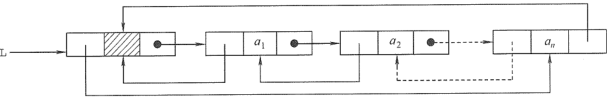

# 2. 线性表

**考纲**

线性表基本概念

线性表实现：顺序/链式存储

线性表应用

**错题**

链表：7,8,9,10,12,14,20,21

## 2.1 线性表定义、基本操作

### 定义

$L=(a_1,a_2,...,a_n)$

### 基本操作
```cpp
InitList(&L);
Length(L);
LocateElem(L, e);
GetElem(L, i);
Insert(&L, i, e);
Delete(&L, i, e);
print(L);
destroy(&L);
```

## 2.2 线性表顺序表示

### 顺序表定义

元素的逻辑顺序与物理顺序相同

**数组静态分配**

```c
typedef struct {
    int data[MaxSize];
    int length;
} SqList;
```

**数组动态分配**

```cpp
typedef struct {
    int *pdata;
    int MaxSize, length;
} SqList;
L.pdata = (int*)malloc(sizeof(int)*InitSize); //C
L.pdata = new int[InitSize]; //C++
```

### 顺序表基本操作

**插入**：后面的元素后移

```cpp
bool Insert(SqList &L, int i, int e) {
    if (i < 0 || i > L.length) //check index
        return false;
    if (L.length >= MaxSize) //check size
        return false
    for (int j=L.length-1; j>=i; j--) {
        L.data[j+1] = L.data[j];
    }
    L.data[i] = e;
    L.length++;
    return true;
}
```

最好情况：表尾插入，时间复杂度 O(1)

最坏情况：表头插入，时间复杂度 O(n)

平均时间复杂度 O(n)

**删除**：后面的元素前移

```cpp
bool Delete(SqList &L, int i, int &e) {
    if (i < 0 || i >= L.length) //check index
        return false;
    e = L.data[i];
    for (int j=i; j<L.length-1; j++) {
        L.data[j] = L.data[j+1]
    }
    L.length++
    return true;
}
```

最好情况：表尾删除，时间复杂度 O(1)

最坏情况：表头删除，时间复杂度 O(n)

平均时间复杂度 O(n)

#### 顺序表逆置、循环移动

**简单逆置**

```c
void reverse(int arr[], int l, int r) {
	for (int i=l,tmp; i<r/2; i++) {
        tmp = arr[i];
        arr[i] = arr[r-i];
        arr[r-i] = tmp;
    }
}
```

**循环左移k个元素**

```c
//   x[0]...x[k-1],x[k]...x[n-1]
//=> x[k-1]...x[0],x[n-1]...x[k] => x[k]...x[n-1],x[0]...x[k-1]
void move(int arr[], int n, int k) {
	reverse(arr, 0, k);
	reverse(arr, k, n-1);
	reverse(arr, 0, n-1);    
}
```

## 2.3 线性表链式表示

### [单链表](https://zh.cppreference.com/w/cpp/container/forward_list)

```c
typedef struct Node {
    int data;
    struct Node *next;
} Node;
```

### 单链表基本操作

含头节点方便算法处理，无需判断是否为首元

建立有序表：依次插入元素建表时间复杂度 $O(n^2)$，先排好序再建表时间复杂度 $O(nlog_2n)$

#### 头插法建表


```cpp
void HeadInsert(Node *&L, int in[], int n) {
    Node *s;
    L = (Node*)malloc(sizeof(Node));
    L->next = NULL;
    for (int i=0; i<n; i++) {
        s = (Node*)malloc(sizeof(Node));
        s->data = in[i];
        s->next = L->next; //
        L->next = s; //
    }
}
```

#### 尾插法建表


```cpp
void TailInsert(Node *&L, int in[], int n) {
    Node *s, *r;
    L = r = (Node*)malloc(sizeof(Node));
    L->next = NULL;
    for (int i=0; i<n; i++) {
        s = (Node*)malloc(sizeof(Node));
        s->data = in[i];
        r->next = s; //
        r = s; //
    } 
}
```

#### 按序号查找节点

```cpp
Node* GetElem(Node *L, int i) {
    Node *p = L->next;
    if (i == 0) return L;
    if (i < 0) return NULL;
    int j = 1;
    while (p && j<i) {
        p = p->next;
        j++;
    }
    return p;
}
```

#### 按值查找节点

```cpp
Node* LocateElem(Node *L, int x) {
    Node *p = L->next;
    while (p && *p->data != x)
        p = p->next;
    return p;
}
```

#### 按值查找前驱节点

```cpp
Node* FindPrevious(Node *L, int x) {
    Node *p = L;
    while (p->next && p->next->data != x) 
        p = p->next;
    return p;
}
```

#### 按序号插入节点

先查找前驱节点，先右后左更新指针


```cpp
Node* Insert(Node *L, int i, int x) {
    Node *p = GetElem(L, i-1);
    if (p) {
        Node *s = (Node*)malloc(sizeof(Node));
        s->data = x;
        s->next = p->next; //
        p->next = s; //
        return s;
    }
    return NULL;
}
```

#### 删除节点

先查找前驱节点


```cpp
void Delete(Node *L, int x) {
    Node *p, *tmp;
	p = FindPrevious(L, x);
    if (p->next) {
		tmp = p->next; //
		p->next = tmp->next; //
        free(tmp);
    }
}
```

将后继节点数据赋给查找结点，更新查找节点 `next` 

```cpp
void Delete(Node *L, int x) {
    Node *p, *tmp;
	p = LocateElem(L, x);
    if (p) {
		tmp = p->next; //
        p->data = tmp->data; //
		p->next = tmp->next; //
        free(tmp);
    }
}
```

<u>注：对于含尾指针的单链表删除尾元素需要时间复杂度 $O(n)$，因为需要定位其前驱结点</u>

#### 有序链表合并

链表 A，B 非递减，合并成链表 C 非递减

```cpp
void merge(Node *A, Node *B, Node *&C) {
    Node *pa = A->next, *pb = B->next, *pc;
    pc = C = (Node*)malloc(sizeof(Node));
    C->next = NULL;
    while (pa && pb) {
        if (pa->data <= pb->data) {
            pc->next = pa;
            pa = pa->next;
        }
        else {
            pc->next = pb;
            pb = pb->next;
        }
        pc = pc->next;
    }
    //remains
    if (pa) pc->next = pa;
    if (pb) pc->next = pb;    
}
```

### 双链表

快速访问前驱结点，方便插入/删除


```cpp
typedef struct Node {
    int data;
    struct Node *prev, *next;
} Node;
```

#### 插入

从插入结点开始按 “∞” 更新指针


```cpp
Node* Insert(Node *L, int i, int x) {
    Node *p = GetElem(L, i-1);
    if (p) {
        Node *s = (Node*)malloc(sizeof(Node));
        s->data = x;
        s->next = p->next; //
        p->next->prev = s; //
        s->prev = p; //
        p->next = s; //
        return s;
    }
    return NULL;
}
/*
        s->prev = p->prev;
        p->prev->next = s;
        s->next = p;
        p->prev = s;
*/
```

#### 删除


```cpp
void Delete(Node *L, int x) {
    Node *tmp = Locate(L, x);
    if (tmp) {
		tmp->prev->next = tmp->next; //
        tmp->next->prev = tmp->prev; //
        free(tmp);
    }
}
```

### 循环链表

#### 循环单链表

设置尾指针`r`，指向头节点 `r->next = L`，访问表头表尾时间复杂度 O(1)


#### 循环双链表

头节点 `prev` 指向表尾 `L->prev = r; r->next = L`



<u>注：带头指针或尾指针的循环双链表插入/删除首元、尾元的时间复杂度 $O(1)$</u>

### 静态链表

利用数组，`next` 指向数组下标；插入删除无需移动元素


```cpp
typedef struct {
    int data;
    int next;
} Node;
```

### 顺序表与链表比较

