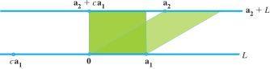
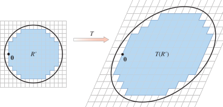
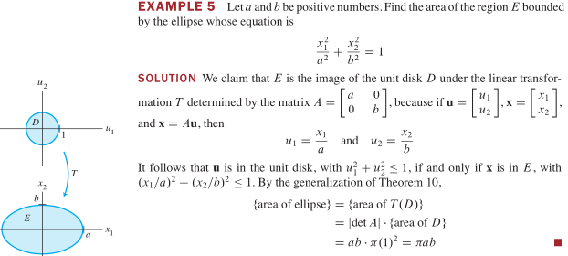

## 3.1 行列式
$A_{3\times 3}$ 的行列式 

$det\ A=a_{11}a_{22}a_{33}+a_{12}a_{23}a_{31}+a_{13}a_{21}a_{32}-a_{11}a_{23}a_{32}-a_{12}a_{21}a_{33}-a_{13}a_{22}a_{31}\\
=(a_{11}a_{22}a_{33}-a_{11}a_{23}a_{32})-(a_{12}a_{21}a_{33}-a_{12}a_{23}a_{31})+(a_{13}a_{21}a_{32}-a_{13}a_{22}a_{31})\\
=a_{11}det\ A_{11}+a_{12}det\ A_{12}+a_{13}det\ A_{13}$
（$A_{ij}$ 由 A 中删去 i 行 j 列得到）

> **定义** $n\ge 2, A_{n\times n}=[a_{ij}]$ 的行列式是形如 $\pm a_{ij} det\ A_{ij}$ 的 n 项和，$\pm$ 符号交替出现
>
> $det\ A=a_{11}A_{11}-a_{12}A_{12}+...+(-1)^{n+1}a_{1n}A_{1n}=\sum_{j=1}^n(-1)^{j+1}a_{1j}A_{1j}$ 
>
> $A$ 的 $(i,j)$ 余因子 $C_{ij}=(-1)^{i+j}det\ A_{ij}$ 

> **定理** $A_{n\times n}$ 的行列式可按任意行或列的余因子（代数余子）展开式来计算
>
> 按第 i 行展开：$det\ A=a_{i1}C_{i1}+a_{i2}C_{i2}+...+a_{in}C_{in}$
>
> 按第 j 列展开：$det\ A=a_{1j}C_{1j}+a_{2j}C_{2j}+...+a_{nj}C_{nj}$

> **定理** A 为三角阵 $\Rightarrow$ $det\ A=\Pi_{i}^n a_{ii}$（主对角线元素乘积）

## 3.2 行列式性质

> **定理** 行变换：方阵 A 经行变换得方阵 B（对列变换有同样结论）
>
> 1. 倍加行：$r_j=kr_i+r_j, det\ B=det\ A$
> 2. 倍乘行：$r_i=kr_i, det\ B=k·det\ A$
> 3. 行交换：$r_i\leftrightarrow r_j, det\ B=-det\ A$

$|EA|=|E||A|,|E|=\begin{cases}1& E:倍加行(列)\\k& E:倍乘行(列)\\-1& E:交换行(列)\end{cases}$

$A\xrightarrow[行倍加]{行交换r次} U\Rightarrow|A|=\begin{cases}(-1)^r·|U| & A 可逆\\0 & A 不可逆\\\end{cases}$（ U 为行阶梯型三角阵）

> **定理** 矩阵 A 可逆 $\Leftrightarrow |A|\ne 0$

**列变换**

行列式的列变换与行变换有相同效果

>  **定理** $A_{n\times n}\Rightarrow det\ A^T=det\ A$

证（归纳法）：$\\
n=1$，定理成立$\\
n=k$，假设定理成立，$det\ A_{k\times k}^T=det\ A_{k\times k}\\
n=k+1$，A 中 $a_{1j}$ 的余因子$=A^T$ 中 $a_{j1}$ 的余因子，$det\ A_{1j}=det\ A^T_{j1}$（$k\times k$ 行列式）
$\\\Rightarrow det\ A=a_{i1}C_{i1}+a_{i2}C_{i2}+...+a_{in}C_{in}=a_{1i}C_{1i}+a_{2i}C_{2i}+...+a_{ni}C_{ni}=det\ A^T$

**行列式与矩阵乘积**

> **定理** 乘法性质：$A_{n\times n},B_{n\times n}\Rightarrow det\ AB=(det\ A)(det\ B)\\|AB|=|A|·|B|$

## 3.3 克拉默法则、体积和线性变换

$A_{n\times n}, b\in R^n$，$A_i(b)$ 表示 A 中第 i 列由向量 b 替换得到的矩阵：

$A_i(b)=[a_1...b...a_n]$

>**定理** 克拉默法则：$A_{n\times n}$ 可逆，$\forall b\in R^n$， 方程 $Ax=b$ 的唯一解：$x_i=\frac{det\ A_i(b)}{det\ A}=\frac{|A_i(b)|}{|A|}$

证：$A·I_i(x)=A[e_1...x...e_n]=[Ae_1...Ax...Ae_n]=[a_1...b...a_n]=A_i(b)\\
\Rightarrow|A||I_i(x)|=|A|x_i=|A_i(b)|$

**求$A^{-1}$的公式**

$A^{-1}$  的 j 列向量 x，$Ax=e_j$，$A^{-1}(i,j):\ a_{ij}^{-1}=x_i=\frac{det\ A_i(e_j)}{det\ A}=\frac{|A_i(e_j)|}{|A|}\xlongequal[展开]{按i列}\frac{|(-1)^{i+j}A_{ji}|}{|A|}=C_{ji}$

伴随矩阵：$A^T$ 各元素替换为其代数余子（余因子），记：$A^*,\ (adj\ A)$

> **定理** 逆矩阵公式：$A^{-1}=\frac{A^*}{|A|}$

**用行列式表示面积或体积**

> **定理** 由 $A_{2\times 2}$ 的列确定的平行四边形面积：$||A||$，由 $A_{3\times 3}$ 的列确定的平行六面体体积：$||A||$

证：（以 $R^2$ 为例）

A 为二阶对角矩阵，显然成立。$\left|det\begin{bmatrix}a&0\\0&d\end{bmatrix}\right|=|ad|=$ 矩阵面积

A 不为二阶对角矩阵，只需证 $A=[a_1\ a_2]$ 列变换成对角矩阵时，不改变行列式与面积

> $a_1,a_2\ne \bm{0}\Rightarrow \forall c,\ a_1,a_2$ 确定的平行四边形面积=$a_1,a_2+ca_1$ 确定的平行四边形面积

**线性变换**

> **定理** $T:R^2\rightarrow R^2$ 是由 $A_{2\times 2}$ 确定的线性变换，S 是 $R^2$ 中一个平行四边形 $\Rightarrow T(S)$ 面积 $=||A||·S$ 面积
> 
> $T:R^3\rightarrow R^3$ 是由 $A_{3\times 3}$ 确定的线性变换，S 是 $R^3$ 中一个平行六面体 $\Rightarrow T(S)$ 体积 $=||A||·S$ 体积
>
> **推论**：定理对 $R^2$ 中任意有限面积的的区域，对 $R^3$ 中任意有限体积的的区域均成立（极限积分）

