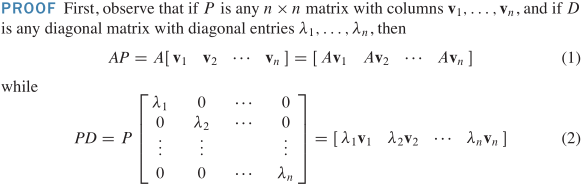
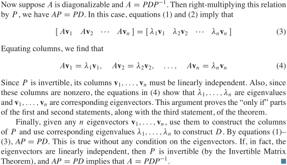
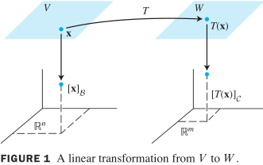
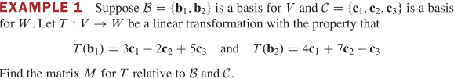
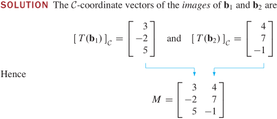
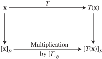
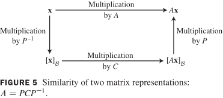

## 5.1 特征值与特征向量
$T:x\mapsto Ax, T(x)=Ax=\lambda x$，A 对 x 的作用仅仅“拉伸”了 x

> **定义** $A_{n\times n},x\ne \bf{0},\exist \lambda, Ax=\lambda x$ 有非零解 $x\\
> \Leftrightarrow (A-\lambda I)x=0$ 有非零解 （方程有自由变量）$x\\
> \Leftrightarrow \lambda$ 为 A 的特征值，$x$ 为对应 $\lambda$ 的特征向量

A 对应于 $\lambda$ 的特征空间：$(A-\lambda I)x=0$ 的解集，$Nul\ (A-\lambda I)$ 零空间

> **定理** A 为三角矩阵 $\Rightarrow$ A 的主对角线元素是其特征值

> **定理** $\lambda_1,...,\lambda_r$ 是 $A_{n\times n}$ 相异的特征值，$v_1,...,v_r$ 是 $\lambda_1,...,\lambda_r$ 对应的特征向量 $\Rightarrow \{\lambda_1,...,\lambda_r\}$ 线性无关

## 5.2 特征方程
$ (A-\lambda I)x=0$ 有非零解 $\Leftrightarrow A-\lambda I$ 矩阵不可逆 $\Leftrightarrow |A-\lambda I|=0$

**行列式**

$A\xrightarrow[行倍加]{行交换r次} U\Rightarrow|A|=\begin{cases}(-1)^r·|U| & A 可逆\\0 & A 不可逆\\\end{cases}$（ U 为行阶梯型三角阵）

> **定理** 可逆矩阵定理（续）
>
> A不可逆 $|A|=0\Leftrightarrow\exist\ \lambda_i=0$
> 
> A可逆 $|A|\ne 0\Leftrightarrow \forall\ \lambda_i\ne 0$

**特征方程**

> $\lambda$ 是 $A_{n\times n}$ 的特征值 $\Leftrightarrow \lambda$ 是方程 $|A-\lambda I|=0$ 的根

特征多项式：$A_{n\times n}$ 关于 $\lambda$ 的 n 次特征多项式 $|A-\lambda I|$

特征值 $\lambda$ 的重数：特征方程根中 $\lambda$ 的重数

**特征值计算性质**

> 韦达定理：n次方程 $b_nx^n+...+b_1x+b_0=\sum_{i=0}^nb_ix^i=0$​，$\sum_{i=1}^nx_i=-\frac{b_{n-1}}{b_n},\prod_{i=1}^nx_i=(-1)^n\frac{b_0}{b_n}$​​

> $\{\lambda:|A-\lambda I|=0\}\Rightarrow$ 对角矩阵、三角矩阵的特征值 $\lambda_i=a_{ii}$
> 
> $\exists\ \lambda_i...n,|A-\lambda I|=\prod_{i=1}^n=(\lambda_i-\lambda)=0, 右式得: b_n=(-1)^n,b_{n-1}=\sum_{i=1}^n\lambda_i·(-1)^{n-1}$
>
> - 左式 $|A-\lambda I|$ (定义式)只有主对角线元 $(a_{ii}-\lambda) 含 \lambda$，对应乘积项 $\prod_{i=1}^n(a_{ii}-\lambda)含\lambda^{n-1}\\\Rightarrow tr(A)=\sum_{i=1}^na_{ii}=\sum_{i=1}^n\lambda_i$
>
> - $let\ \lambda=0\Rightarrow |A|=\prod_{i=1}^n\lambda_i=b_0$
> 
> $r(A)=1\Rightarrow \lambda=0,...,0,tr(A)$​
> 
> 矩阵多项式 $f(A)$​ 与 A 有相同特征向量，$f(A)v_i=f(\lambda_i)v_i$​

**相似性** 

$A_{n\times n},B_{n\times n},\exist P$ 可逆

A 与 B 相似：A 相似于 B：$P^{-1}AP=B,A=PBP^{-1}\Leftrightarrow$ B 相似于 A：$Q=P^{-1},\ Q^{-1}BQ=A, B=QAQ^{-1}$

> **定理** $A_{n\times n}$与 $B_{n\times n}$  相似 $\Rightarrow$ A，B 有相同特征多项式，相同特征值（相同重数）

证：$B=P^{-1}AP\Rightarrow B-\lambda I=P^{-1}AP-\lambda P^{-1}P=P^{-1}(A-\lambda I)P\\
\Rightarrow |B-\lambda I|=|P^{-1}(A-\lambda I)P|=|A-\lambda I|$

## 5.3 对角化

分解式：$A=PDP^{-1}$（D 为对角矩阵），利用分解式可快速计算 $A^k$

> **定理** 对角化定理：$A_{n\times n}$ 可对角化 $\Leftrightarrow A$ 有 n 个线性无关的特征向量（形成 $R^n$ 的基）
> 
> $\exist D$对角阵，$A_{n\times n}=PDP^{-1}\Leftrightarrow P$ 的列向量是 A 的 n 个线性无关的特征向量$\\
> $（D 的主对角线元素：A 对应 P 中特征向量的特征值）

$R^n$ 的特征向量基：$A_{n\times n}$ 的 n 个线性无关的特征向量





**矩阵的对角化**

将 A 对角化，即求可逆矩阵 P 和对角矩阵 D，$A=PDP^{-1}$ 

1. 求 A 的特征值：$|A-\lambda I|=0$
2. 求 A 的3个线性无关的特征向量：$(A-\lambda_i I)x=0\Rightarrow \{v_1,v_2,v_3\}$
3. 用2步得到的特征向量构造矩阵 $P=[v_1,v_2,v_3]$
4. 用特征向量对应的特征值构造矩阵 $D=\begin{bmatrix}\lambda_1&0&0\\0&\lambda_2&0\\0&0&\lambda_3\end{bmatrix}$
5. 验证：$AP=PD$

矩阵可对角化的充分条件

> **定理** $A_{n\times n}$ 有 n 个相异特征值 $\Rightarrow$ A 可对角化

**特征值不全相异的矩阵**

> **定理** $A_{n\times n}$ 相异的特征值：$\lambda_1,...,\lambda_p,1\le k\le p$，
>
> - $\lambda_k$ 的特征空间的维数 $=n-r(A-\lambda E)\le\lambda_k$ 的代数重数
> - $A_{n\times n}$ 可对角化 $\Leftrightarrow$ 所有不同特征空间的维数之和 $=n\\\Leftrightarrow A$ 的特征多项式 $|A-\lambda I|$ 可完全因式分解 $\\\Leftrightarrow$ 每个 $\lambda_k$ 的特征空间维数 $=n-r(A-\lambda E)=\lambda_k$ 的代数重数
> - $A_{n\times n}$ 可对角化，$B_k$ 是对应 $\lambda_k$ 的特征空间的基 $\Rightarrow B_1,...,B_p$ 基中所有向量的集合是 $R^n$ 的特征向量基

## 5.4 特征向量与线性变换

**线性变换的矩阵**

$V\mapsto R^n, W\mapsto R^m, T:V\mapsto W,\ V$ 的基 $B=\{b_1,...,b_n\}, W$ 的基 $C\\
x\in V, [x]_B\in R^n,\ T(x)$ 的坐标向量 $[T(x)]_C\in R^m$

$if\ x=r_1b_1+...+r_nb_n, [x]_B=\begin{bmatrix}r_1\\\vdots\\r_n\end{bmatrix}
\Rightarrow T(x)=r_1T(b_1)+...+r_nT(b_n)
\\\Rightarrow [T(x)]_C=r_1[T(b_1)]_C+...+r_n[T(b_n)]_C
=[[T(b_1)]_C\ ...\ [T(b_n)]_C]\begin{bmatrix}r_1\\\vdots\\r_n\end{bmatrix}=T'_{C\gets T(B)}[x]_B$

$T'_{C\gets T(B)}=[[T(b_1)]_C\ ...\ [T(b_n)]_C]$​ 为 T 相对于基 B 和  C 的矩阵







**同一空间 V 到 V 的线性变换**

$W=V,C=B \Rightarrow T'_{B\gets T(B)}=[[T(b_1)]\ ...\ [T(b_n)]]$​ 为 T 相对于基 B 的矩阵，记：$[T]_B$​

$x\in V,\ [T(x)]_B=[T]_B[x]_B$



**$R^n$ 上的线性变换**

> **定理** 对角矩阵表示
>
> $\exist D_{n\times n}对角阵,P=[b_1...b_n],A=PDP^{-1},R^n 基B=\{b_1...b_n\}(A的特征向量)\Rightarrow T:x\mapsto Ax$​ 相对其特征向量基 B 的矩阵 $[T]_B=D$​
>
> $T:x\mapsto Ax, T:u\mapsto Du$ 是相对于不同基的同一个线性变换（A 相似 D）

证：[基 B 到 $R^n$ 标准基的坐标变换矩阵](linear-algebra/vector-spaces?id=_44-坐标系)：$P=[b_1...b_n]\\
x=P[x]_B,\ [x]_B=P^{-1}x$

$T(x)=Ax\Rightarrow [T]_B=[[T(b_1)]_B...[T(b_n)]_B]\\
=[[Ab_1]_B...[Ab_n]_B]=[P^{-1}Ab_1...P^{-1}Ab_n]=P^{-1}A[b_1...b_n]=P^{-1}AP=D$​

```
     x --A--> Ax    = PDP^-1*x
P^-1*↓        ↑P*
  [x]p --D--> [Ax]p = D[x]p = DP^-1*x
```

**矩阵表示的相似性**

$if\ A\ 相似\ C,P=[b_1...b_n],A=PCP^{-1},B=\{b_1...b_n\}\Rightarrow T:x\mapsto Ax$​ 相对基 B 的矩阵 $[T]_B=C$​



## 5.5 复特征值*

