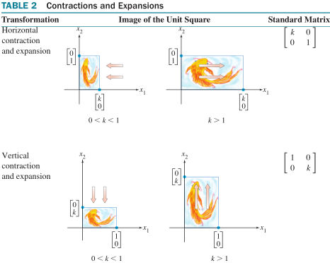
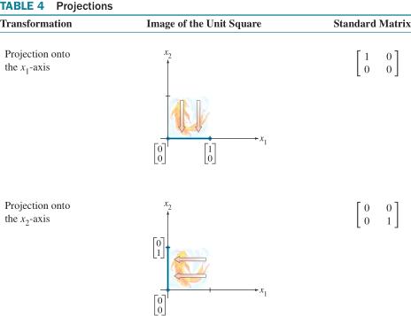

## 1.1 线性方程组

$a_1x_1+a_2x_2+...+a_nx_n=b$

解集：方程组所有可能解的集合

两个线性方程组等价：两组有相同解集

含两变量的两个线性方程的组的解——两行向量确定的直线的交点

- 两直线平行，无交点（无解）
- 两直线交叉，一交点（唯一解）
- 两直线重合，处处交点（无穷解）

含三变量的三个线性方程的组的解——三行向量确定的平面的交点

- 三平面无共同交点（无解）
- 三平面交叉于一点，一交点（唯一解）
- 三平面重合，处处交点（无穷解）

> 线性方程组的解：1. 无解，2. 唯一解，3. 无穷多解
>
> 线性方程组相容：有解；不相容：无解

**矩阵记号**

方程组：$\begin{cases}
a_{11}x_1+a_{12}x_2+a_{12}x_3=b_1\\
a_{21}x_1+a_{22}x_2+a_{23}x_3=b_2\\
a_{31}x_1+a_{32}x_2+a_{33}x_3=b_3
\end{cases}$

系数矩阵：$\begin{bmatrix}
a_{11} & a_{12} & a_{12}\\
a_{21} & a_{22} & a_{23}\\
a_{31} & a_{32} & {33}
\end{bmatrix}$

增广矩阵：$\begin{bmatrix}
a_{11} & a_{12} & a_{12} & b_1\\
a_{21} & a_{22} & a_{23} & b_2\\
a_{31} & a_{32} & a_{33} & b_3
\end{bmatrix}$

**解线性方程组**

方程组$\xrightarrow[]{消元}$等价方程组

增广矩阵$\xrightarrow[]{变换}$上三角矩阵

> 初等行变换
>
> - 对换(interchange)：$r_i\leftrightarrow r_j$
> - 倍乘(scaling)：$r_i=k*r_i,\ k\ne 0$
> - 倍加(replacement)：$r_i=r_i+k*r_j,\ k\ne 0$

两矩阵行等价：$A\xleftrightarrow{初等变换}B$

行变换可逆：

- 对换的逆：$(r_i\leftrightarrow r_j)^{-1}:\ r_i\leftrightarrow r_j$
- 倍乘的逆：$(r_i=k*r_i)^{-1}:\ r_i=\frac{1}{k}*r_i,\ k\ne 0$
- 倍加的逆：$(r_i=r_i+k*r_j)^{-1}:\ r_i=r_i-k*r_j,\ k\ne 0$

> 两线性方程组增广矩阵等价 $\Rightarrow$ 有相同解集

## 1.2 简化行与阶梯型

先导元素：非零行中最左边的非零元素

> **定义 行阶梯形**
>
> 1. 所有非零行都在所有零行上面
> 2. 每一行的先导元素所在的列在前一行先导元素的右边
> 3. 某一先导元素所在列下方元素都是 0
>
> **简化行阶梯形**
>
> 4. 每一行的先导元素是 1
> 5. 每一行的先导元素 1 是该元素所在列(主元列)的唯一非零元素

> 定理 简化行阶梯型矩阵的唯一性：每个矩阵 行等价于 唯一的简化行阶梯形矩阵

**主元位置**

> 主元位置: 矩阵中对应于其简化阶梯型中先导元素 1 的位置
>
> 主元列: 矩阵含有主元位置的列

**行化简算法**

1. 最左的非零列作为主元列, 主元位置在该列顶部, 若为 0, 则对换两行, 保证主元非零
2. 倍加行变换, 使主元下面元素得 0
3. 对剩下的非主元列非主元行的子矩阵(右下)执行上述步骤, 直到没有非零行需处理
4. 从最右的主元开始, 倍加行变换, 使每个主元上方的各元素得 0; 主元倍乘变换得 1

**线性方程组的解**

增广矩阵~简化阶梯型：$\begin{bmatrix}
1 & 0 & a_{12} & b_1\\
0 & 1 & a_{23} & b_2\\
0 & 0 & 0 & 0
\end{bmatrix}$，等价方程组：$\left\{\begin{array}{rl}
x_1 +a_{12}x_3=b_1\\
x_2+a_{23}x_3=b_2\\
0=0
\end{array}\right.$

基本变量：系数矩阵中主元列对应的未知变量；简化阶梯型使每个基本变量仅出现在一个非零方程中；当含有自由变量时，基本变量可用自由变量线性表示

自由变量：系数矩阵中非主元列对应的未知变量；简化阶梯型仍使每个自由变量出现在每个非零方程中

**解集的参数表示**

通解：$\begin{cases}
x_1=-a_{12}x_3+b_1\\
x_2=-a_{23}x_3+b_2\\
x_3=x_3+0
\end{cases}(x_3\in R)$，
向量式：$\begin{bmatrix}x_1\\x_2\\x_3\end{bmatrix}=c
\begin{bmatrix}-a_{12}\\-a_{23}\\0\end{bmatrix}+
\begin{bmatrix}b_1\\b_2\\0\end{bmatrix},\ c\in R$

> **定理 解的存在与唯一性**
>
> 线性方程组相容 $\\\Leftrightarrow$ 增广矩阵最右列不是主元列 $\Leftrightarrow$ 行阶梯型没有行如 $\begin{bmatrix}0 & ... & 0 & b\end{bmatrix}\ b\ne 0$ 的行
> $\\\Rightarrow$ 解集：（1）无自由变量，唯一解；（2）有自由变量，无穷多解

**行化简算法解线性方程组**

1. 用行化简算法把增广矩阵化成阶梯型，若方程组不相容则停止，否则下一步
2. 继续行化简算法得简化阶梯型
3. 写出对应简化方程组，把每个非零方程改写为用自由变量表示基本变量的形式

## 1.3 向量方程

**$R^2$中的向量**

(列)向量：2x1 列矩阵，由两实数的有序对确定 $\begin{bmatrix}a\\b\end{bmatrix}=(a,\ b)$

**$R^2$的几何表示**

向量 $\begin{bmatrix}a\\b\end{bmatrix}$ 几何表示：$(0,\ 0)\rightarrow(a,\ b)$ 有向线段
$R^2$ 可看作平面上所有点的集合

**$R^3$的向量**

(列)向量：3x1 列矩阵，表示三维空间点或有向线段

**线性组合(线性表示)**

向量 $\bm{u}=c_1\bm{v_1}+...+c_k\bm{v_k}$ 称为向量 $\bm{v_1},\bm{v_2},...,\bm{v_k}$ 以 $c_1, c_2, ...,c_k$ 为权的线性组合

> 向量方程 $x_1\bm{a_1}+x_2\bm{a_2}+...+x_n\bm{a_k}=\bm{b}$ 与增广矩阵 $[a_1\ a_2\ ...\ a_n\ b]$ 的线性方程组有相同解集
>
> $\bm{b}$ 可由 $\bm{a_1},\bm{a_2},...,\bm{a_n}$线性表示 $\Leftrightarrow$ 对应增广矩阵的线性方程组有解

> **定义** $Span\left\{v_1, v_2, ... , v_k\right\}$：$R^n$ 中的向量 $v_1, v_2, ... , v_k$ 的所有线性组合 $c_1\bm{v_1}+...+c_k\bm{v_k}$ 的集合，称为由 $v_1, v_2, ... , v_k$ 张成的 $R^n$ 的子集（子空间）

$\bm{b}\in Span\left\{v_1, v_2, ... , v_k\right\} \Leftrightarrow x_1\bm{v_1}+x_2\bm{v_2}+...+x_n\bm{v_k}=\bm{b}$ 有解
$\Leftrightarrow $增广矩阵 $[v_1\ v_2\ ...\ v_n\ b]$ 的线性方程组有解

## 1.4 矩阵方程 $Ax=b$

> **定义** $A_{m\times n}$矩阵各列 $a_1,a_2,...,a_n\ (a_i=A_{·i}),\ x$ 是 $R^n$ 中的向量，则 $Ax$ 是 A 的各列向量以 $x$ 中对应元素为权的线性组合
> $\\Ax=[a_1\ a_2\ ...\ a_n]\begin{bmatrix}x_1\\x_2\\...\\x_n\end{bmatrix}=x_1a_1+x_2a_2+...+x_na_n=
> \begin{bmatrix}A_{1·} · x\\A_{2·}· x\\...\\A_{m·}· x\end{bmatrix}$

> **定理** $A_{m\times n}$矩阵各列 $a_1,a_2,...,a_n, b\in R^m$,
>
> 矩阵方程 $Ax=b$ 与向量方程 $x_1a_1+x_2a_2+...+x_na_k=\bm{b}$ 有相同解集，
>
> 它又与增广矩阵 $[a_1\ a_2\ ...\ a_n\ b]$ 的线性方程组有相同解集

**解的存在性**

方程 $Ax=b$ 有解 $\Leftrightarrow$ b 是 A 的各列的线性组合

例：$Ax=b$ 是否对任意的 b 有解？

$\begin{bmatrix}
a_{11} & a_{21} & a_{31} & b_1\\
a_{12} & a_{22} & a_{32} & b_2\\
a_{13} & a_{23} & a_{33} & b_3
\end{bmatrix}\sim\begin{bmatrix}
a_{11} & a_{21} & a_{31} & b_1\\
0 & a'_{22} & a'_{32} & c_1b_1+c_2b_2\\
0 & 0 & 0 & k_1b_1+k_2b_2+k_3b_3
\end{bmatrix}$

$Ax=b$ 有解 $\Leftrightarrow$ 平面方程 $k_1b_1+k_2b_2+k_3b_3=0 \Leftrightarrow b\in Span\left\{a_1, a_2, a_3\right\}$ 子空间 (平面)

> **定理** $A_{m\times n}$矩阵
>
> $\forall b\in R^m, Ax=b$ 有解：$[A\ b]\sim[I\ d]$ $\\\Leftrightarrow \forall b\in R^m$ 都是 A 的列的一个线性组合
> $\\\Leftrightarrow$ A 的各列（n 个 m 维列向量）生成 $R^m$ $\\\Leftrightarrow$ A 中每一行都有一个主元位置

## 1.5 线性方程组的解集

**齐次线性方程组**

$Ax=0\Leftrightarrow \exist \ x=0$ 零解

$Ax=0$ 有非零解 $\Leftrightarrow \exist$ 自由变量 $x_i$

- $A_{3\times 3}x=0,\ x$ 有 1 个自由变量（2 个方程）

  $\bm{x}=\begin{bmatrix}x_1\\x_2\\x_3\end{bmatrix}
  =x_3 \begin{bmatrix}-a'_{12}\\-a'_{23}\\0\end{bmatrix}
  =x_3\bm{v}\ (x_3\in R)\Leftrightarrow\bm{x}\in Span\left\{v\right\}$

  几何意义：解集是 $R^3$ 中的一条过原点的直线

- $A_{3\times 3}x=0,\ a_1x_1+a_2x_2+a_3x_3=0,\ x$ 有 2 个自由变量

  $\bm{x}=\begin{bmatrix}x_1\\x_2\\x_3\end{bmatrix}
  =x_2 \begin{bmatrix}-\frac{a_2}{a_1}\\1\\0\end{bmatrix}+x_3
  \begin{bmatrix}-\frac{a_3}{a_1}\\0\\1\end{bmatrix}
  =x_2\bm{v_1}+x_3\bm{v_2}\ (x_{2,3}\in R)\Leftrightarrow\bm{x}\in Span\left\{v_1, v_2\right\}$

  几何意义：解集是 $R^3$ 中的一个过原点的平面

**参数向量形式(解集)**

$\bm{x}=t_1\bm{u}+t_2\bm{v}\ (t_{1,2}\in R)$

**非齐次方程组的解**

1. $Ax=b$ 无解
2. $Ax=b$ 唯一解
3. $Ax=b$ 无穷解

通解结构：一个特解向量（由 b 变换）+对应齐次方程的通解（若干向量的线性组合）

$Ax=b,\ [A\ b]\sim\begin{bmatrix}
  1 & 0 & a'_{12} & b'_1\\
  0 & 1 & a'_{23} & b'_2\\
  0 & 0 & 0 & 0
  \end{bmatrix}$

$\bm{x}=\begin{bmatrix}x_1\\x_2\\x_3\end{bmatrix}=x_3
  \begin{bmatrix}-a'_{12}\\-a'_{23}\\0\end{bmatrix}+
  \begin{bmatrix}b'_1\\b'_2\\0\end{bmatrix}=x_3\bm{v}+\bm{p}\ (x_3\in R)$

**参数向量形式(解集)**

$\bm{x}=t\bm{v}+\bm{p}\ (t\in R)$

## 1.7 线性无关

$Ax=0 \Leftrightarrow x_1\bm{a_1}+x_2\bm{a_2}+x_3\bm{a_3}=\bm{0}$

问题：齐次线性方程组—向量方程中，零解是否是唯一解？

> **定义** $R^n$ 中一组向量 $\left\{v_1, ..., v_k\right\}$ 线性无关：$x_1v_1+x_2v_2+...+x_kv_k=0$ 仅有零解 $(v_{1...k}\ne \bm{0})$
>
> $\left\{v_1, ..., v_k\right\}$ 线性相关：$\exist$ 不全为 0 的权 $c_1,...,c_k$ ， $c_1v_1+c_2v_2+...+c_kv_k=0$ 有非零解

> 矩阵 A 的各列向量线性无关 $\Leftrightarrow$ 方程 $Ax=0$ 仅有零解
>
> 一向量 $v$ 线性无关 $\Leftrightarrow \bm{v}\ne\bm{0}$
>
> 二向量 $v_1, v_2$ 线性相关 $\Leftrightarrow \exist\ c,\ v_2=cv_1$
>
> 多向量集合 $S=\left\{v_1,...,v_k\right\}$ 线性相关 $\Leftrightarrow \exist v_i$ 是其它向量的线性组合
>
> 多向量集合 $S=\left\{v_1,...,v_k\right\}$ 线性相关，$v_1\ne 0\ \Rightarrow \exist v_j(j>1)$ 是它前面向量的线性组合

> **定理** 一向量组的向量个数大于每个向量元素个数（维数）$\Rightarrow$ 向量组相关
>
> $R^n$ 中向量组 $\left\{v_1,...,v_k\right\}, k>n\Rightarrow$向量组相关

证明：$k>n\Rightarrow\exist$ 自由变量 $\Leftrightarrow Ax=0$ 有非零解

> **定理** $R^n$ 中向量组 $S=\left\{v_1,...,v_k\right\}, \exist v_i=\bm{0} \Rightarrow$向量组相关
> （零向量可由任意一组基线性表示）

证明：令 $c_i\ne 0, c_j(j\ne i)=0$（不全为 0 的权）$\Rightarrow Ax=0$ 有非零解

行变换不影响矩阵列向量之间的线性相关性；

列变换不影响矩阵行向量之间的线性相关性；

## 1.8 线性变换

$A_{m\times n} x_{n\times 1}=b_{m\times 1}$

> 变换 $T:R^n\rightarrow R^m, T(x)=Ax,\ x\in R^n,\ T(x)\in R^m$ 为 x 在 T 变换下 的像

**矩阵变换**

- 投影变换：$A=\begin{bmatrix}
  1 & 0 & 0\\
  0 & 1 & 0\\
  0 & 0 & 0\end{bmatrix},\ T:x\rightarrow Ax$ 把 $R^3$ 的点投影到 $x_1x_2$ 平面
- 剪切变换：$A=\begin{bmatrix}
  1 & 3 \\
  0 & 1 \end{bmatrix},\ T:R^2\rightarrow R^2, T(x)=Ax$ 把 $R^2$ 的正方形各点映射为平行四边形的点（顶边拉向右边）

  

- 伸缩变换：$r\in R,T:R^2\rightarrow R^2, T(x)=rx$
- 旋转变换：$T:R^2\rightarrow R^2, T(x)=\begin{bmatrix}
  cos\theta & -sin\theta\\
  sin\theta & cos\theta\end{bmatrix} \begin{bmatrix}
  x_1\\ x_2\end{bmatrix},\ \theta>0$ 逆时针

## 1.9 线性变换的矩阵

线性变换 $T:R^n\rightarrow R^m\ \sim$ 矩阵变换 $x\rightarrow Ax$

> **定理** 线性变换 $T:R^n\rightarrow R^m \Rightarrow \exist A_{m\times n}, \forall x\in R^n, T(x)=A(x), A=[T(e_1)\ ...\ T(e_n)],\ e_i:I_n$ 的 i 列
>
> A 为线性变换 T 的标准矩阵（对单位矩阵 $I_n$ 基向量 $e_i$ 的作用）

伸缩变换：$T(x)=rx, x\in R^2$，$A=[T(e_1)\ ...\ T(e_n)]=[re_1\ re_2]=\begin{bmatrix}r & 0\\0 & r\end{bmatrix}$

