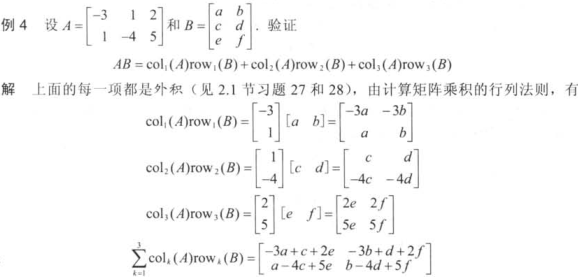

## 矩阵运算

$A_{m\times n}=[a_1\ a_2\ ...\ a_n]$

向量运算推广到矩阵

**加法与数乘**

和：两个维度相同的矩阵A与B的和矩阵，它的各列是A与B对应列之和

$A_{m\times n}+B_{m\times n}=[a_1+b_1\ ...\ a_n+b_n]$

数乘：标量r与矩阵A的数乘矩阵，它的各列是A的对应列的r倍

$rA_{m\times n}=[ra_1\ ra_2\ ...\ ra_n]$​

**矩阵行列式**

$|kA|=k^n|A|$

### 矩阵乘法

复合映射：$x\rightarrow Bx\rightarrow A(Bx)$，$A(Bx)=(AB)x$

> **定义** 矩阵 $A_{m\times n},\ B_{n\times p},\ (AB)_{m\times p}=[Ab_1\ ...\ Ab_p]=\begin{bmatrix}a_1B\\\vdots\\a_mB\end{bmatrix}$​
>
> $AB$​​​​​ 的每一列是 A 的各列以 B 的对应列元素为权的线性组合 $col_j(AB)=A·b_j$​
>
> $AB$​​​ 的每一行是 B 的各行以 B 的对应行元素为权的线性组合 $row_i(AB)=a_i·B$​​​

> **计算 AB 的行列法则**
>
> AB 的 i 行 j 列元素：A 的 i 行与 B 的 j 列对应元素乘积之和
>
> $(AB)_{ij}=a_{i1}b_{1j}+a_{i2}b_{2j}+...+a_{in}b_{nj}$​

计算 AB 的列行法则

矩阵多项式 $f(A)=a_0E+\sum_{i=1}^na_iA^i$​

$A_{n\times n}$ 的两个多项式乘法可交换 $f(A)g(A)=g(A)f(A)$

**矩阵乘法性质**

> **定理** 矩阵 $A_{m\times n}$
>
> $A(BC)=(AB)C$  结合律
>
> $A(B+C)=AB+AC$  左分配律
>
> $(B+C)A=BA+CA$  右分配律
>
> $r(AB)=(rA)B+A(rB)$  
>
> $I_mA=A=AI_m$​

矩阵乘法的行列式

$A_{n\times n},B_{n\times n}\Rightarrow |AB|=|A|·|B|$

**矩阵乘幂**

$A^0=I,A^kA^h=A^{k+h},(A^k)^h=A^{kh}$

> **注意** （一般情况下）
>
> $AB\ne BA$ 交换律不成立（AB的列是A的各列的线性组合，BA的列是B的各列的线性组合）
>
> $(AB)^2=A^2B^2\nRightarrow AB=BA.\ (A=\begin{bmatrix}0&1\\0&0\end{bmatrix},B=\begin{bmatrix}1&0\\0&0\end{bmatrix},A^2=AB=0,BA\ne 0)$
>
> $AB=AC\nRightarrow B=C$ 消去律不成立（矩阵方程可能由非零解）
>
> $AB=0\nRightarrow A=0\ or\ B=0$​​​（齐次矩阵方程可能由非零解）

$A_{n\times n},B_{n\times n},A=kE(k\ne 0)\Rightarrow AB=BA$

### 矩阵转置

$A_{m\times n}$ 转置 $(A^T)_{n\times m}$ 的列是 A 的对应行构成

> **定理** 矩阵 $A,B$
>
> $(A^T)^T=A$
>
> $(A+B)^T=A^T+B^T$
>
> $(rA)^T=rA^T$
>
> $(AB)^T=B^TA^T$​​ 矩阵乘积的转置=逆序矩阵转置的乘积
>
> $(A^{-1})^T=(A^T)^{-1}$

$Ax$​​ combines the columns of $A$​​ while $x^TA^T$ combines the rows of $A^T$

**向量点乘（内积）与矩阵转置乘**

$x^Ty$​ is a number, $xy^T$ is a matrix.

$(Ax)^Ty = x^T (A^T y)$ Inner product of $Ax$ with $y$ = Inner product of $x$ with $A^Ty$

## 矩阵的逆

### 伴随矩阵

$A^*$：将 $A^T$ 各元素替换为其代数余子（余因子）$C_{ij}=(-1)^{i+j}A_{ij}=a^{-1}_{ji}|A|$

$A^*A=AA^*=|A|E$

$A^*=|A|A^{-1},A^{-1}=\frac{A^*}{|A|}\\
|A^*|=||A|A^{-1}|=|A|^n|A^{-1}|=|A|^{n-1}=\frac{||A|E|}{|A|}\\
(kA)^*=\begin{bmatrix}k^{n-1}C_{11}&\dots&k^{n-1}C_{n1}\\\vdots&\ddots&\vdots\\k^{n-1}C_{1n}&\dots&k^{n-1}C_{nn}\end{bmatrix}=k^{n-1}A^*=|kA|(kA)^{-1}\\
(A^{-1})^*=\frac{A}{|A|}=(A^*)^{-1},\ (A^T)^*=(A^*)^T,\ (AB)^*=B^*A^*\\
n>2,\ (A^*)^*=(|A|A^{-1})^*=|A|^{n-1}(A^{-1})^*=|A|^{n-2}A$​​​​​​​​

### 可逆

可逆：方阵 $A_{n\times n},\ \exist C_{n\times n}, CA=AC=I_n.\ C$​​​ 记为 $A^{-1}$​​​ ，则 $A^{-1}A=AA^{-1}=I$​​​

> **定理** $A=\begin{bmatrix}a&b\\c&d\end{bmatrix},\ ad-bc\ne0\Rightarrow A^{-1}=\frac{1}{ad-bc}\begin{bmatrix}d&-b\\-c&a\end{bmatrix}$
>
> $A_{n\times n}$​​​ 可逆 $\Leftrightarrow$​​​ $|A|\ne0$​​​

> **定理**  $A_{n\times n}$​​​ 可逆 $\Rightarrow \forall b\in R^n, Ax=b$​​​ 有唯一解 $x=A^{-1}b$​​​；$Ax=0$​​​ 只有**0**解

> **定理** 可逆矩阵性质
>
> $A$ 可逆 $\Leftrightarrow A^{-1}$ 可逆 $(A^{-1})^{-1}=A\ \Leftrightarrow A^T$ 可逆 $(A^T)^{-1}=(A^{-1})^T\Leftrightarrow A^*$ 可逆 $(A^*)^{-1}=\frac{A}{|A|}=(A^{-1})^*$
>
> $A_{n\times n},B_{n\times n}$​ 可逆 $\Rightarrow AB$​ 可逆，$(AB)^{-1}=B^{-1}A^{-1}$​ 可逆矩阵的乘积也可逆
>
> $(kA)^{-1}=\frac{A^{-1}}{k}(k\ne 0)\\
> |A^{-1}|=|A|^{-1}$

### 初等矩阵

初等矩阵：单位矩阵进行初等行变换后的矩阵E。由于行变换可逆，故初等矩阵可逆

1. 倍加行：$E=\begin{bmatrix}1&0&0\\0&1&0\\c&0&1\end{bmatrix},\ EA:r_3=cr_1+r_3,\ E^{-1}=\begin{bmatrix}1&0&0\\0&1&0\\-c&0&1\end{bmatrix}$
2. 交换行：$E=\begin{bmatrix}0&1&0\\1&0&0\\0&0&1\end{bmatrix},\ EA:r_1\leftrightarrow r_2,\ E^{-1}=E$
3. 倍乘行：$E=\begin{bmatrix}1&0&0\\0&1&0\\0&0&c\end{bmatrix},\ EA:r_3=cr_3,\ E^{-1}=\begin{bmatrix}1&0&0\\0&1&0\\0&0&1/c\end{bmatrix}$​

> **定理** $A_{n\times n}$ 可逆 $\Leftrightarrow$ A 行等价于 $I_n,\ [A\ I]\sim[I\ A^{-1}]$

充分性：方阵 A 可逆 $\Rightarrow$ 每行有个主元位置都在对角线上，$A\sim I$

必要性：$A\sim I$，每步行化简变换=左乘一个初等矩阵
$\exist E_1,...,E_p,\ A\sim E_1A\sim E_2(E_1A)\sim ... \sim E_p(E_{p-1}...E_1A)=I\Rightarrow E_pE_{p-1}...E_1A=I,\ A^{-1}=E_pE_{p-1}...E_1·I$

### 可逆矩阵特征

> **定理** 可逆矩阵定理
>
> 矩阵 $A_{n\times n}$​ 可逆$\\
> \Leftrightarrow \exist C_{n\times n}, CA=AC=I\\
> \Leftrightarrow A\sim I_n\\
> \Leftrightarrow A$​ 有 n 个主元位置$\\
> \Leftrightarrow Ax=0$​ 仅有零解 $\\
> \Leftrightarrow \forall b\in R^n, Ax=b$​ 至少有一个解$\\
> \Leftrightarrow A$​ 的各列线性无关$\\
> \Leftrightarrow A$​ 的各列生成 $R^n\\
> \Leftrightarrow A^T,A^*$​ 可逆

## 分块矩阵

### 加法与数乘

若矩阵 A与B 相同维数，相同分块方式，则 A+B，rA 分块计算

### 分块乘法

A 的列数分法与 B 的行数一致，按照行列展开

分块矩阵乘法的行列法则引出两个矩阵乘积的最一般的方法：

> **定理** AB 的列行展开法则
>
> $A_{m\times n}, B_{n\times p}\Rightarrow AB=[col_1(A)\ col_2(A)\ ...\ col_n(A)]\begin{bmatrix}row_1(B)\\row_2(B)\\...\\row_n(B)\end{bmatrix}=col_1(A)row_1(B)+...+col_n(A)row_n(B)$

### 分块矩阵的逆

对角线分块矩阵，初等变换法计算

$\begin{bmatrix}A_{11}&0\\0&A_{22}\end{bmatrix}^{-1}
=\begin{bmatrix}A_{21}^{-1}&0\\0&A_{22}^{-1}\end{bmatrix},
\begin{bmatrix}0&A_{12}\\A_{21}&0\end{bmatrix}^{-1}
=\begin{bmatrix}0&A_{21}^{-1}\\A_{12}^{-1}&0\end{bmatrix}$

三角分块矩阵，待定系数法计算

$A=\begin{bmatrix}A_{11}&A_{12}\\0&A_{22}\end{bmatrix}, A_{11}:p\times p, A_{22}:q\times q$

$\begin{bmatrix}A_{11}&A_{12}\\0&A_{22}\end{bmatrix}
\begin{bmatrix}B_{11}&B_{12}\\B_{21}&B_{22}\end{bmatrix}
=\begin{bmatrix}A_{11}B_{11}+A_{12}B_{21}&A_{11}B_{12}+A_{12}B_{22}\\A_{22}B_{21}&A_{22}B_{22}\end{bmatrix}
=\begin{bmatrix}I_p&0\\0&I_q\end{bmatrix}$

$A_{22}$ 方阵，$A_{22}B_{22}=I_q\Rightarrow A_{22}$ 可逆 $\Rightarrow B_{22}=A_{22}^{-1}, B_{21}=0$ 

$\Rightarrow A_{11}B_{11}=I_p$，又 $A_{11}$ 方阵 $\Rightarrow B_{11}=A_{11}^{-1}$

$A_{11}B_{12}=-A_{12}B_{22}=-A_{12}A_{22}^{-1}\Rightarrow B_{12}=-A_{11}^{-1}A_{12}A_{22}^{-1}$

$\begin{bmatrix}A_{11}&A_{12}\\0&A_{22}\end{bmatrix}^{-1}
=\begin{bmatrix}A_{11}^{-1}&-A_{11}^{-1}A_{12}A_{22}^{-1}\\0&A_{22}^{-1}\end{bmatrix},
\begin{bmatrix}A_{11}&A_{12}\\A_{21}&0\end{bmatrix}^{-1}
=\begin{bmatrix}0&A_{21}^{-1}\\A_{12}^{-1}&-A_{12}^{-1}A_{11}^{-1}A_{21}^{-1}\end{bmatrix}$

## $R^n$​ 的子空间

> **定义** $R^n$ 的一个子空间是 $R^n$ 中的集合 H，它对加法和标量乘法-(线性)运算封闭：
>
> 1. 零向量 $\in H$
> 2. $\forall \pmb{u},\pmb{v}\in H,\ \pmb{u+v}\in H$
> 3. $\forall \pmb{u}\in H, c\in R,\ c\pmb{u}\in H$

如：通过原点的一个平面、一条直线 都是子空间

注：不通过原点的一个平面或一条直线 不是子空间

特殊子空间：$R^n$ 本身、仅含零向量的集合（零子空间）

### 矩阵的列空间与零空间

> **定义** 矩阵 A 的列空间：A 的各列的线性组合的集合，记：$Col\ A$
>
> $A_{m\times n}=[a_1...a_n], a_i\in R^m,\ Col\ A=Span\{a_1,...,a_n\}$
>
> $A_{m\times n}$ 的列空间是 $R^m$ 的子空间（矩阵列空间维度$\le$列向量维度m）

$\pmb{b}\in Col\ A\Leftrightarrow \exist x, Ax=\pmb{b}$

> **定义** 矩阵 A 的零空间：齐次方程 $Ax=0$ 的所有解的集合，记：$Nul\ A$

> **定理** $A_{m\times n}$ 的零空间是 $R^n$ 的子空间 $\Leftrightarrow A_{m\times n}x=0$ 的解集 $\pmb{x}$ 是 $R^n$ 的子空间（矩阵零空间维度 < 列数）

$\pmb{u}\in Nul\ A\Leftrightarrow Au=0$

### 子空间的基

> **定义** $R^n$ 中子空间 H 的一组基是 H 的一个线性无关集，它生成 H

可逆矩阵 $A_{n\times n}$ 的各列线性无关，构成 $R^n$ 的一组基

$R^n$ 的标准基：$\{e_1,...,e_n\}$

求 $Ax=0$ 解集的[参数向量形式](linear-algebra/linear-equations?id=_15-线性方程组的解集)——求 $Nul\ A$ 的基（每个基向量对应一个自由变量）

> **定理**：矩阵 $A_{m\times n}$ 的主元列线性无关，构成 $Col\ A$ 的一组基

## 维数与秩

### 坐标系

> **定义** $B=\{b_1,...,b_p\}$ 是子空间 H 的一组基，$\forall \pmb{x}\in H$，相对于基 B 的坐标是：使 $x=c_1b_1+...+c_pb_p$ 成立的权 $c_1,...,c_p$
>
> $x$（相对于$B$）的坐标向量 $[x]_B=\begin{bmatrix}c_1\\\vdots\\c_p\end{bmatrix}$

### 子空间的维数

> **定义** 非零子空间 H 的**维数**（$dim\ H$）是 H 的任意一个基的向量个数
>
> 零子空间 $\{0\}$ 的维数定义为零

$R^n$ 空间维数 n，$R^3$ 中经过 **0** 的平面是二维，一条经过 **0** 的直线是一维的

$Nul\ A$ 的维数：$Ax=0$ 中自由变量个数

> **定义** 矩阵 A 的**秩**（$rank\ A$​）是 A 的列空间的维数，即 A 的主元列个数

有关秩的重要式子：

$0\le r(A)\le min\{m,n\}$

$r(AB)\le min\{r(A),r(B)\}$

$A_{n\times n}可逆,r(AB)=r(B),\ B_{n\times n}可逆,r(AB)=r(A)$

$A_{m\times n}列满秩,r(AB)=r(B),\ B_{m\times n}行满秩,r(AB)=r(A)(列行)$

$A_{m\times n},B_{m\times s}$，

$AB=\pmb{0}\Rightarrow r(A)+dim\ Nul\ A=n,r(A)+r(B)\le n$

$AB=\pmb{0},\ A,B\ne \pmb{0}\Rightarrow r(A)<n(A的列), r(B)<n(B的行)$

- A 列向量组线性相关，B 行向量组线性相关
- B 属于 A 的零空间，$A^T$ 属于 $B^T$ 的零空间

$r(A\pm B)\le r(A)+r(B)$

$r(A^*)=\begin{cases}
n,&r(A)=n\\
1,&r(A)=n-1,&\exist\ C_{ij}\ne 0,AA^*=\pmb{0}\\
0,&r(A)<n-1,&\forall\ C_{ij}=0
\end{cases}$

#### 秩定理

> 秩定理：$A_{m\times n}$n 列 $\Rightarrow rank\ A+dim\ Nul\ A=n$
>
> 矩阵列数 = 矩阵的秩 + 矩阵零空间维数 = 列空间维数 + 零空间维数

### 秩与可逆矩阵定理

> 可逆矩阵定理（续）：$A_{n\times n}$ 可逆
>
> $\Leftrightarrow$ A 的列向量构成 $\R^n$ 的一个基$\\
> \Leftrightarrow Col\ A=\R^n
> \Leftrightarrow dim\ Col\ A=n\\
> \Leftrightarrow rank\ A=n\\
> \Leftrightarrow Nul\ A=\{0\}
> \Leftrightarrow dim\ Nul\ A=0$

## 矩阵因式分解

### LU分解

$A_{m\times n}=LU,\ L_{m\times m}$ 单位下三角初等矩阵，$U_{m\times n}$ 阶梯型矩阵

$Ax=b\Rightarrow L(Ux)=b\Rightarrow Ly=b,Ux=y$

**LU分解算法**

行倍加变换 $A\sim U\Leftrightarrow E_p...E_1A=U,\ E_i$​ 为单位下三角初等矩阵（倍加行）

$\Rightarrow A=(E_p...E_1)^{-1}U,\ L=(E_p...E_1)^{-1}$

例：

解：

## 计算机图形学中的应用

问题：平移不直接对应于矩阵乘法，并非线性变换——引入：齐次坐标

**齐次坐标**：$(x,y)\in R^2\rightarrow (x,y,1)\in R^3$， 点的齐次坐标只能通过乘 $A_{3\times 3}$ 矩阵来变换

沿向量 $(t_x,t_y)$ 平移：$(x,y)\rightarrow (x+t_x,y+t_y)$ 齐次坐标表示 $(x,y,1)\rightarrow (x+t_x,y+t_y,1)$

$\begin{bmatrix}1&0&t_x\\0&1&t_y\\0&0&1\end{bmatrix}\begin{bmatrix}x\\y\\1\end{bmatrix}=\begin{bmatrix}x+t_x\\y+t_y\\1\end{bmatrix}$

**齐次三维坐标**：$(x,y,z)\in R^3\rightarrow (xh,yh,zh,h)\in R^4$， 点的齐次坐标只能通过乘 $A_{4\times 4}$ 矩阵来变换

沿向量 $(t_x,t_y,t_z)$ 平移：$(x,y,z)\rightarrow (x+t_x,y+t_y,z+t_z)$ 齐次坐标表示 $(x,y,z,1)\rightarrow (x+t_x,y+t_y,z+t_z,1)$

$\begin{bmatrix}1&0&0&t_x\\0&1&0&t_y\\0&0&1&t_z\\0&0&0&1\end{bmatrix}\begin{bmatrix}x\\y\\z\\1\end{bmatrix}=\begin{bmatrix}x+t_x\\y+t_y\\z+t_z\\1\end{bmatrix}$

**透视投影**