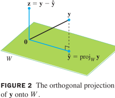

##  6.1 内积、长度、正交性

**内积（点积）**

> **定义** $u·v=u^Tv=[u_1\ ...\ u_n]\begin{bmatrix}v_1\\\vdots\\v_n\end{bmatrix}$ 为标量实数

**向量长度**

> **定义** 向量 **v** 的长度（范数）$\|\bm{v}\|=\sqrt{\bm{v·v}}=\sqrt{v_1^2+...+v_n^2},\ \|\bm{v}\|^2=\bm{v·v}$

向量 **v** 的单位化：$e=\frac{\bm{v}}{\|\bm{v}\|}$

> **定义** 向量 u 和 v 之间距离：$dist(u,v)=\|u-v\|$

**正交向量**

> **定义** 向量 u 和 v 正交：$u·v=0$

> **定理** 毕达哥拉斯（勾股）定理：向量 u 和 v 正交 $\Leftrightarrow \|u+v\|^2=\|u\|^2+\|v\|^2$

**正交补**

> z 正交于 W：向量 z 与 $R^n$ 子空间 W 中任意向量正交
>
> 正交补：与子空间 W 正交的向量 z 的全体集合，记：$W^\perp$

> **定理** $A_{m\times n}\Rightarrow$ A 的行空间的正交补 = A 的零空间，A 的列空间的正交补 = $A^T$ 的零空间
>
> $(Row\ A)^\perp=Nul\ A,\ (Col\ A)^\perp=(Row\ A^T)^\perp=Nul\ A^T$

## 6.2 正交集

正交集：$R^n$ 中向量集合 $\{u_1,...,u_p\}, \forall\ u_i,u_j,i\ne j, u_i·u_j=0$

> **定理** $S=\{u_1,...,u_p\}是R^n$ 中非零向量构成的正交集 $\Rightarrow S$ 是线性无关集，构成 S 所生成的子空间的一组基

> **定义** 正交基：$R^n 子空间 W$ 的一个正交基是 W 的一个基，也是正交集

> **定理** $\{u_1,...,u_p\}是R^n$ 子空间 W 的正交基 $\Rightarrow \forall y\in W,y=c_1u_1+...+c_pu_p$ 的权 $c_j=\frac{\bm{y·u_j}}{\bm{u_j·u_j}}=\frac{\|y\|·cos<y,u_j>}{\|u_j\|}$

证：$y·u_1=(c_1u_1+...+c_pu_p)·u_1=c_1(u_1·u_1)$

**正交投影**

$u,y\in R^n$，将 y 分解成两个正交向量之和：$y=\hat y+z$

$y 在 u$ 上的正交投影：$\hat y=proj_L\bm{y}=\frac{\bm{y·u}}{\bm{u·u}}·u=\frac{\|y\|·cos<y,u>}{\|u\|}·u$

$y 与 u$ 正交的分量： $z=\bm{y}-proj_L\bm{y}$

**定理的几何解释**

$W=R^2=Span\{u_1,u_2\},u_1与u_2$ 正交，$y\in R^2,\ 
y=\frac{\bm{y·u_1}}{\bm{u_1·u_1}}u_1+\frac{\bm{y·u_2}}{\bm{u_2·u_2}}u_2$

$Span\{u_1,...,u_p\}$ 中每个 y 被分解成 p 个相互正交的一维子空间上的投影之和

**单位正交基**

单位正交基：$\{u_1,...,u_p\}$ 是的一个正交集，且 $\|u_i\|=u_i·u_i=u_i^Tu_i=1$

> **定理** $U_{m\times n}$ 具有单位正交列向量 $\Leftrightarrow U^TU=I$

证：$let\ n=3,U^TU=\begin{bmatrix}u_1^T\\u_2^T\\u_3^T\end{bmatrix}[u_1\ u_2\ u_3]=\begin{bmatrix}u_1^Tu_1&0&0\\0&u_2^Tu_2&0\\0&0&u_3^Tu_3\end{bmatrix}=I$

> **定理** $U_{m\times n}$ 具有单位正交列，$x,y\in R^n$
>
> $\|Ux\|=\|x\|\\
> (Ux)·(Uy)=x·y\\
> (Ux)·(Uy)=0\Leftrightarrow x·y=0$

**正交矩阵**：具有单位正交列的可逆的方阵 $U_{n\times n},\ U^{-1}=U^T$，同样具有单位正交行

## 6.3 正交投影

> **定理** 正交分解定理：$W\subset R^n,y\in R^n\Rightarrow y=\hat y+z,\ \hat y\in W,z\in W^\perp$
>
> $\forall W的基\{u_1,...,u_p\}, \hat y=\frac{\bm{y·u_1}}{\bm{u_1·u_1}}u_1+...+\frac{\bm{y·u_2}}{\bm{u_p·u_p}}u_p,\ z=y-\hat y$
>
> $y\ 在\ W$ 上的正交投影：$\hat y,proj_wy$

向量 y 在 $R^3$ 子空间 $W=Span\{v_1,v_2\}$ 上的正交投影 = 它在 W 基的各相互正交的一维子空间 $Span\{v_1\},Span\{v_2\}$ 上的投影之和

**正交投影的性质**

$if\ y\in W=Span\{u_1,...,u_p\}\Rightarrow proj_Wy=y$

> **定理** $R^n子空间W$ 的基 $\{u_1,...,u_p\}$ 是单位正交基（$\|u_i\|=1$）$\Rightarrow proj_Wy=(y·u_1)u_1+...+(y·u_p)u_p$
>
> $U=[u_1\ ...\ u_p],\ proj_Wy=UU^Ty$

$U_{m\times n}$ 列单位正交，$W=Col\ U\\
\Rightarrow \forall x\in R^n, U^TUx=I^nx=x\\
\Rightarrow \forall y\in R^m, UU^Ty=proj_Wy$

## 6.4 施密特 (Schmidt) 方法

 $\{\bm{x_1,x_2,x_3}\}$ 线性无关，构成 $R^4$ 子空间 W 的一个基，构造（标准）正交基：

1. 取 $v_1=x_1, W_1=Span\{x_1\}=Span\{v_1\}$

2. 取 $v_2$ 为 $x_2$ 减去它在子空间 $W_1$ 上的投影(向量)，$v_2=x_2-proj_{w_1}x_2=x_2-\frac{x_2·v_1}{v_1·v_1}v_1$

   (可选) 缩放 $v_2$ 以简化后面计算

3. 取 $v_3$ 为 $x_3$ 减去它在子空间 $W_2$ 上的投影(向量)，

   计算 $x_3在正交基\{v_1,v_2\}$ 上的投影：$proj_{w_2}x_3=\frac{x_3·v_1}{v_1·v_1}v_1+\frac{x_3·v_2}{v_2·v_2}v_2$
   
   $v_3是x_3$ 正交于 $W_2$ 的分量，$v_3=x_3-proj_{w_2}x_3$

**标准正交基**：即单位正交基。对正交基 $\{v_1,...,v_p\}$ 各分量单位化：$u_i=\frac{v_i}{\|v_i\|}$

**矩阵的 QR 分解**

> **定理** QR 分解
>
> $A_{m\times n}$ 的列线性无关 $\Rightarrow A=QR, Q_{m\times n}$ 的列形成 $Col\ A$ 一个标准正交基，$R_{n\times n}$ 上三角可逆矩阵，$R_{ii}>0$

## 6.7 内积空间

