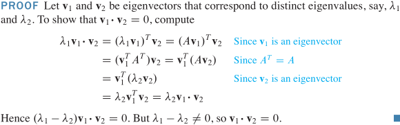
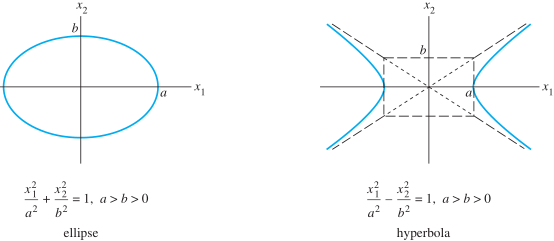
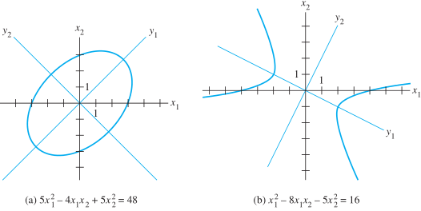
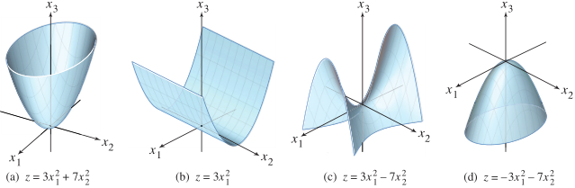
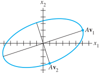

## 7.1 对称矩阵的对角化

对称矩阵：$A^T=A$，主对角线外的其它元素关于主对角线对称

$\forall A\Rightarrow A^TA$ 是对称矩阵

> **定理** A 是对称矩阵 $\Rightarrow A$ 的不同特征值对应的不同特征空间的任意两个特征向量正交
>
> $A^T=A,不同特征值\lambda_1,\lambda_2对应特征向量v_1,v_2\Rightarrow v_1·v_2=0$

> **定理** $A_{n\times n}$ 可正交对角化 $\Leftrightarrow A$ 是对称矩阵
>
> $A^T=A\Leftrightarrow \exist 正交阵 P:P^{-1}=P^T, A=PDP^T$

**谱定理**

A 的谱：A 的特征值集合

> **定理** 对称矩阵的谱定理：对称矩阵 $A_{n\times n}$ 性质
>
> 1. A 有 n 个实特征值（包含可能重复的）
> 2. $\forall \lambda$ 对应特征空间的维数 = $\lambda$ 作为特征方程根的重数
> 3. 特征空间相互正交，即不同特征值对应的任意两个特征向量正交
> 4. A 可正交对角化

**谱分解**

$if\ A=PDP^{-1}, P=[u_1\ ...\ u_n]$ 列是 A 的单位正交特征向量，对角矩阵 $D:D_{ii}=\lambda_i, P^{-1}=P^T\\
\Rightarrow A=PDP^T=[u_1\ ...\ u_n]
\begin{bmatrix}\lambda_1&&0\\&\ddots&\\0&&\lambda_n\end{bmatrix}
\begin{bmatrix}u_1^T\\\vdots\\u_n^T\end{bmatrix}
=[\lambda_1u_1\ ...\ \lambda_nu_n]\begin{bmatrix}u_1^T\\\vdots\\u_n^T\end{bmatrix}\\
=\lambda_1u_1u_1^T+...+\lambda_nu_nu_n^T$

$u_ju_j^T$ 是秩为1的 $n\times n$ 投影矩阵，$(u_ju_j^T)x$ 是 x 在 $u_j$ 生成的子空间上的[正交投影](linear-algebra/orthogonality-least-squares?id=_63-正交投影)

## 7.2 二次型

> **定义** 二次型：$R^n$ 上的一函数，它在向量 x 的值 $Q(x)=x^TAx$
>
> 二次型的矩阵：$A_{n\times n}$ 对称矩阵

$R^3$ 中的二次型：$Q(x)=x^TAx=[x_1\ x_2\ x_3]
\begin{bmatrix}a&d&f\\d&b&e\\f&e&c\end{bmatrix}
\begin{bmatrix}x_1\\x_2\\x_3\end{bmatrix}
=ax_1^2+bx_2^2+cx_3^2+2dx_1x_2+2ex_1x_2+2fx_1x_2$

**二次型的变量代换**

变量代换：$x,y\in R^n,\ x=Py, y=P^{-1}x, P$ 是可逆矩阵，其列确定 $R^n$ 的一个基，y 是 x 相对该基的坐标向量

二次型变量代换：$x^TAx=(Py)^TA(Py)=y^TP^TAPy=y^T(P^TAP)y,\exist 正交阵 P,x^TAx=y^TDy$

> **定理** 主轴定理
>
> $A_{n\times n}$ 是对称矩阵 $\Rightarrow \exist 正交阵 P, 正交变量代换\ x=Py,x^TAx=y^TDy=\lambda_1y_1^2+...+\lambda_ny_n^2\\
> \Rightarrow \|x\|=\|Py\|=\|y\|\ (P^TP=I)$
>
> 二次型 $x^TAx$ 的主轴：正交矩阵 P 的列，y 是 x 在这些主轴构造的 $R^n$ 空间的单位正交基下的坐标向量

**主轴的几何意义**

$Q(x)=x^TAx, A_{2\times 2}$ 可逆对称 $\Rightarrow x^TAx=c$ 的 x 集合对应于一椭圆（或圆）、双曲线、两条相交直线或单个点，或不含任意点
- A 是对角阵：图像是标准位置
- A 不是对角阵：图像是标准位置的旋转，找一对主轴——找一个新的坐标系，使得图像在该坐标系下是标准位置

**二次型分类**

$A_{n\times n}$，二次型 $Q(x)=x^TAx$ 是一个定义域为 $R^n$ 的实值函数

$R^3$ 空间 $x=(x_1,x_2),x_3=Q(x)=x^TAx$

> **定义** 二次型 Q 是：
>
> - 正定的：$\forall x\ne 0, Q(x)>0$
>
> - 负定的：$\forall x\ne 0, Q(x)<0$
>
> - 不定的：$\exist x,Q(x)>0;\exist x,Q(x)<0$
> - 半正定：$\forall x, Q(x)\ge0$
> - 半负定：$\forall x, Q(x)\le0$

> **定理** 二次型与特征值：$A_{n\times n}$ 对称矩阵，二次型 $x^TAx$：
>
> - 正定的 $\Leftrightarrow \forall \lambda >0$
> - 负定的 $\Leftrightarrow \forall \lambda <0$
> - 不定的 $\Leftrightarrow \exist \lambda >0,\exist \lambda <0$

## 7.3 条件优化
二次型 $Q(x)$ 在 $x^Tx=1(\|x\|=1)$ 条件下的最值

> **定理** A 是对称矩阵，$m=min\{x^TAx:\|x\|=1\},M=max\{x^TAx:\|x\|=1\}\Rightarrow m=\lambda_{min},M=\lambda_{max}$
>
> $if\ x$ 是对应 m 的单位特征向量 $\Rightarrow Q(x)=m,\ if\ x$ 是对应 M 的单位特征向量 $\Rightarrow Q(x)=M$

证：$A\xlongequal{正交对角化}PDP^{-1},\\
let\ x=Py, Q(x)=x^TAx=y^TDy,\|x\|=\|Py\|=\|y\|\\
let\ P=[u_1\ u_2\ u_3],\lambda_1\ge\lambda_2\ge\lambda_3,\ \forall y\in R^3,\|y\|=1\\
\Rightarrow y^TDy=\lambda_1y_1^2+\lambda_2y_2^2+\lambda_3y_3^2
\le \lambda_1(y_1^2+y_2^2+y_3^2)=\lambda_1\|y\|^2=\lambda_1$

$\exist\ y=e_1=(1,0,0)\Rightarrow x=Pe_1=[u_1\ u_2\ u_3]\begin{bmatrix}1\\0\\0\end{bmatrix}=u_1,\ Q(x)=x^TAx=y^TDy=\lambda_1=M$

## 7.4 奇异值分解
A 有分解式 $A=PDP^{-1}$ 的必要条件：$A_{n\times n}$ 方阵，
而 $\forall A_{m\times n}$ 都可能有分解式 $A=QDP^{-1}$

$T:x\mapsto Ax$ 的几何特性可用二次型来说明：

$T:x\mapsto Ax,\|x\|=1, \|Ax\|^2=(Ax)^T(Ax)=x^T(A^TA)x\\
\Rightarrow \|Ax\|$ 最值对应 $A^TA$ 的特征最值，x 是它对应的单位特征向量

**$A_{m\times n}$ 矩阵的奇异值**

> **定义** A 的奇异值：$A^TA$ 特征值的平方根，记：$\sigma_i,...,\sigma_n递减,\ \sigma_i=\sqrt{\lambda_i},\ \lambda_1\ge...\ge\lambda_n\ge 0$
> 
> A 的奇异值： $Av_i$ 的长度 $\|Av_i\|=\sigma_i$，$v_i 是 A^TA$ 特征向量

> **定理** $\{v_1,...,v_n\}\in R^n$ 是包含 $A^TA$ 特征向量的单位正交基，重排使 $A^TA$ 特征值 $\lambda_1\ge...\ge\lambda_n.\\
If\ A$ 有 r 个非零奇异值 $\sigma_{1...r}>0\Rightarrow \{Av_1,...,Av_r\}$ 是 $Col\ A$ 的一个正交基，$rank\ A=dim\ Col\ A=r$

**奇异值分解**

$\Sigma_{m\times n}=\begin{bmatrix}D_{r\times r}&0\\0&\bm{0}_{(m-r)\times (n-r)}\end{bmatrix}$ （$if\ r=m=n$，则没有零子矩阵）

> **定理** 奇异值分解(SVD)：$A_{m\times n},rank\ A=r\\
> \Rightarrow \exist\Sigma_{m\times n},D对角线元d_{11...rr}=\sigma_{1...r},\sigma_1\ge...\ge\sigma_r>0,\ 
> \exist 正交矩阵 U_{m\times m},V_{n\times n},\ A=U\Sigma V^T$
> 
> A 的左奇异向量：U 中的列；右奇异向量：V 中的列。

**奇异值分解步骤**

1. 矩阵 $A^TA$ 正交对角化，即求 $A^TA$ 的特征值及其单位特征向量

2. 算 $V 和 \Sigma$，将 $A^TA$ 的特征值降序排列 $\lambda_1\ge...\ge\lambda_n$，

   右奇异向量是对应单位特征向量 $v_1,...,v_n,\ V=[v_1\ ...\ v_n]$

   奇异值是特征值的平方根 $\sigma_1...\sigma_n=\sqrt{\lambda_1}...\sqrt{\lambda_n},\ D对角线元d_{11...rr}=\sigma_1...\sigma_r>0$

3. 构造 U，$rank\ A=r,\ U$ 的前 r 列是 $Av_1...Av_r$ 的单位向量：$u_i=\frac{Av_i}{\sigma_i}$

   若 $r<m$，U 正交阵的其他列是将集合 $\{u_1,...,u_r\}$ 扩充为 $R^m$ 的单位正交基而得，
   
   $u_{r+1},...,u_m与\{u_1,...,u_r\}$ 正交 $\Leftrightarrow 
   方程 \begin{bmatrix}u_1^T\\\vdots\\u_r^T\end{bmatrix}x=0$ **解集的基** 应用施密特正交化，标准化

## 7.5 图像处理和统计学中的应用

