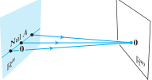

> 部分定义与定理见1,2两章

## 4.1 向量空间与子空间

向量空间V：定义了加法和数乘运算

子空间H：V中的零向量在H中，H对向量加法、数乘运算封闭

零子空间：仅含零向量的集合

由一个集合生成的子空间：$H=Span\{v_1,...,v_p\}$ 是由 $\{v_1,...,v_p\}\subset H$ 张成的子空间

$R^3$ 的非零子空间：$R^3,\ Span\{v_1,v_2\}$（过原点的平面），$Span\{v_1\}$（过原点的直线）

n 次多项式集合 $P_n:p(t)=a_0+a_1t+a_2t^2+...+a_nt^n$

满足：$(p+q)(t)=p(t)+q(t),\ (cp)(t)=cp(t)\Rightarrow P_n$ 是一个向量空间

## 4.2 零空间、列空间和线性变换

矩阵$A_{m\times n}$的零空间：$Ax=0$ 的解集，记：$Nul\ A=\{x:x\in R^n, Ax=0\}\subset R^n$

矩阵$A_{m\times n}$的列空间：A的(主元)列的所有线性组合 $Ax$​ 的集合，线性变换 $x\mapsto Ax$ 的值域

记：$Col\ A=Span\{a_1,...,a_n\}=\{b:b=Ax,x\in R^n\}\subset R^m$

**线性变换的核与值域**

> **定义** $T:V\mapsto W.\ x\in V,T(x)\in W$ 满足：
>
> $T(u+v)=T(u)+T(v),\ u,v\in V\\
> T(cu)=cT(u),\ u\in V$

线性变换T的核（零空间）：$\{u:u\in V, T(u)=0,0\in W\}$

线性变换T的值域（列空间）：$\{T(x):T(x)\in W,x\in V\}$

例：证明 微分运算 是一个线性变换？

$V=\{f:[a,b]\mapsto R,f连续可导\},\ W=C[a,b]$ （[a,b]上所有连续函数）$D:V\mapsto W\ (f\mapsto f')$

$D(f+g)=D(f)+D(g),\ D(cf)=cD(f)\Rightarrow D$ 是一个线性变换

D 的核（零空间）：$\{f:D(f)=0\}\subset V$ （[a,b]上的常函数集）

D 的值域（列空间）：$W=\{D(f),f\in V\}$

## 4.3 线性无关集和基

向量方程：$c_1v_1+c_2v_2+...+c_pv_p=0$

线性相关：$c_1,...,c_p$ 不全为0

线性无关：$c_1,...,c_p=0$​

> **定义** 向量空间的**基**：$H\subset V, B=\{b_1,...,b_p\}\subset V,B$ 满足：
>
> 1. B 是线性无关集
> 2. 由 B 生成的子空间与 H 相同，$H=Span\{b_1,...,b_p\}$

$R^n$ 标准基：$I_n=\{e_1,...,e_n\}$，它生成 $R^n$ 空间

例：证明 $S=\{1,t,t^2,...,t^n\}$ 是 $P_n$ 的一个（标准）基

证：S 线性无关：$c_0+c_1t+c_2t^2+...+c_nt^n=0\Leftrightarrow c_i=0\ (i=0,1,...,n)$

## 4.4 坐标系

> **定理** 唯一表示定理
>
> $B=\{b_1,...,b_n\}$ 是 V 的一个基，$\forall x\in V\Rightarrow \exist c_1,...,c_n$唯一，$x=c_1b_1+...+c_nb_n=[b_1\ ...\ b_n]\begin{bmatrix}c_1\\\vdots\\c_n\end{bmatrix}$

> **定义** $B=\{b_1,...,b_n\}$ 是 V 的一个基，$x\in V, x$ 相对于基 B 的坐标是：$x=c_1b_1+...+c_nb_n$ 的权 $c_1,...,c_n$
>
> x 相对于基 B 的坐标向量 $[x]_B=\begin{bmatrix}c_1\\\vdots\\c_n\end{bmatrix}$

**坐标的几何解释**

**$R^n$ 中的坐标**

已知基 $B,\ [x]_B$，求 x

​	$x=[x]_\varepsilon=c_1b_1+...+c_nb_n=[b_1...b_n][x]_B$

已知基 $B,\ x$，求 $[x]_B$

​	$c_1b_1+...+c_nb_n=[b_1...b_n][x]_B=[x]_\varepsilon=x$ 解非齐次方程

基 B 到 $R^n$ 标准基的坐标变换矩阵：$[b_1...b_n]$

$x=T_B[x]_B=[b_1...b_n][x]_B\\
[x]_B=(T_B)^{-1}x=[b_1...b_n]^{-1}x$

**坐标映射**

> **定理** V与$R^n$同构：$B=\{b_1,...,b_p\}$ 是 V 的一个基 $\Rightarrow T:x\mapsto [x]_B$ 坐标映射是由 V 映射到 $R^n$ 的一对一线性变换

证：$\pmb{u}=c_1b_1+...+c_nb_n,\ \pmb{v}=d_1b_1+...+d_nb_n\\
\pmb{u+v}=(c_1+d_1)b_1+...+(c_n+d_n)b_n\\
[\pmb{u+v}]_B=[u]_B+[v]_B,\ [c\pmb{u}]_B=c[\pmb{u}]_B$

 

## 4.5 向量空间的维数

> **定理** $B=\{b_1,...,b_n\}$ 是 V 的一个基 $\Rightarrow \forall v_i\in V, \{v_1,...,v_{p}\}\ (p>n)$ 线性相关

> **定义** 维数：V 的维数=V 的基的个数，记：$dim\ V$

例：$R^3$ 的子空间用维数分类：

- 零维子空间：只有零子空间
- 一维子空间：由一个非零向量生成，子空间是过原点的直线
- 二维子空间：由二个线性无关向量生成，子空间是过原点的平面
- 三维子空间：由三个线性无关向量生成，如 $R^3$

> $Nul\ A$ 的维数：$Ax=0$ 自由变量个数
>
> $Col\ A$ 的维数：A 中主元列个数

## 4.6 秩

**行空间**：$A_{m\times n}$ 的（主元位置所在）行向量的所有线性组合的集合，记：$Row\ A$

> **定理** $A\sim B$ 行等价 $\Rightarrow$ A 和 B 的行空间相同
>
> $A\sim B$ 行等价，B 是阶梯型 $\Rightarrow B$ 的非零行是 A、B 行空间一个基

### 秩定理

> **定义**：A 的秩：A 的列空间的维数，$A^T$ 的秩：A 的行空间的维数

> **秩定理** $A_{m\times n}$ 的列空间维数 = A 的行空间维数 = A 的秩 = A 的主元位置个数
>
> $dim\ Col\ A=dim\ Row\ A=rank\ A\\
> rank\ A+dim\ Nul\ A=n$（主元列个数+非主元列个数=列个数）

**4个子空间的维度**

**应用到方程组**

$A_{m\times n}x=0$

- 唯一零解 $\Leftrightarrow rank\ A=n$
- 无穷多解 $\Leftrightarrow rank\ A=n-dim\ Nul\ A<n$

$A_{m\times n}x=b$

- 无解 $\Leftrightarrow rank\ A<rank\ [A\ b]_{m\times (n+1)}$
- 唯一解 $\Leftrightarrow rank\ A=n$
- 无穷多解 $\Leftrightarrow rank\ A=n-dim\ Nul\ A<n$

**[秩和可逆矩阵定理](linear-algebra/matrix-algebra?id=_29-维数与秩)**

## 4.7 基的变换

$x\in V,\ [x]_C$ 与 $[x]_B$ 的联系

----
$\begin{cases}y_1=ax_1+bx_2\\y_2=cx_1+dx_2\end{cases}\Rightarrow
\begin{bmatrix}y_1\\y_2\end{bmatrix}=\begin{bmatrix}a&b\\c&d\end{bmatrix}\begin{bmatrix}x_1\\x_2\end{bmatrix}$

$\begin{cases}\pmb{y_1}=a\pmb{x_1}+c\pmb{x_2}\\\pmb{y_2}=b\pmb{x_1}+d\pmb{x_2}\end{cases}
\Rightarrow [\pmb{y_1}\ \pmb{y_2}]=[\pmb{x_1}\ \pmb{x_2}]\begin{bmatrix}a&b\\c&d\end{bmatrix}$​​（不同基的基向量的线性映射）

----

$\pmb{x}=[\pmb{b_1}\ \pmb{b_2}]\begin{bmatrix}3\\1\end{bmatrix}=[\pmb{c_1}\ \pmb{c_2}]\begin{bmatrix}4&-6\\1&1\end{bmatrix}\begin{bmatrix}3\\1\end{bmatrix}$​​​​​​

> **定理** $B=\{b_1,...,b_n\},C=\{c_1,...,c_n\}$ 是 V 的基 $\Rightarrow 
> [x]_C=T_{C\gets B}[x]_B=[[b_1]_C\ [b_2]_C\ ...\ [b_n]_C][x]_B\\
> T_{C\gets B}$：B 到 C 的坐标变换矩阵，它的列是基 B 的向量相对基 C 的坐标向量$\\
> T_{B\gets C}=(T_{C\gets B})^{-1}$：C 到 B 的坐标变换矩阵

**$R^n$ 中基的变换**

B 与 $R^n$ 标准基 $\varepsilon$ 之间坐标变换：$x_\varepsilon=T_B[x]_B,\ T_B=T_{\varepsilon\gets B}=[b_1\ b_2\ ...\ b_n]$

$R^n$ 中 B 与 C 之间坐标变换：设 $[b_1]_C=\begin{bmatrix}x_1\\x_2\\x_3\end{bmatrix},
[b_2]_C=\begin{bmatrix}y_1\\y_2\\y_3\end{bmatrix},
[b_3]_C=\begin{bmatrix}z_1\\z_2\\z_3\end{bmatrix}$

$\Rightarrow [\pmb{c_1\ c_2\ c_3}]\begin{bmatrix}x_1\\x_2\\x_3\end{bmatrix}=\pmb{b_1},
[\pmb{c_1\ c_2\ c_3}]\begin{bmatrix}y_1\\y_2\\y_3\end{bmatrix}=\pmb{b_2},
[\pmb{c_1\ c_2\ c_3}]\begin{bmatrix}z_1\\z_2\\z_3\end{bmatrix}=\pmb{b_3}$

$\Leftrightarrow \pmb{[c_1\ c_2\ c_3]}
\begin{bmatrix}x_1&y_1&z_1\\x_2&y_2&z_2\\x_3&y_3&z_3\end{bmatrix}
=\pmb{[c_1\ c_2\ c_3][x\ y\ z]=[b_1\ b_2\ b_3]}$

$\Leftrightarrow \pmb{[c_1\ c_2\ c_3\ |\ b_1\ b_2\ b_3]}\sim[I\ |\ \pmb{x\ y\ z}]=[I\ |\ \pmb{T_{C\gets B}}]\\
\Leftrightarrow \pmb{[b_1\ b_2\ b_3\ |\ c_1\ c_2\ c_3]}\sim[I\ |\ \pmb{T_{B\gets C}}]$

B 与 C 经标准基坐标变换：$T_B[x]_B=x=T_C[x]_C\Rightarrow [x]_c=T_C^{-1}x=T_C^{-1}T_B[x]_B=T_{C\gets B}[x]_B$​

