**考纲**

1. 网络应用模型：client/server (c/s), peer-to-peer (p2p)
2. 域名系统 DNS：层次域名空间，域名服务器，域名解析过程
3. 文件传输协议 FTP：FTP工作原理，控制/数据连接
4. 电子邮件：电子邮件系统组成结构，电子邮件格式与 MIME，SMTP 与 POP3
5. WWW：WWW 概念与组成结构，HTTP

**真题考点**

- c/s, p2p 模型，应用层协议使用的传输层协议
- 域名解析递归查询/迭代查询，FTP控制/数据连接及端口，SMTP/POP3协议，访问web页使用到的协议，HTTP报文

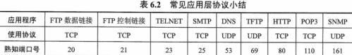

## 6.1 网络应用模型

### Client/Server

客户端请求，服务端响应

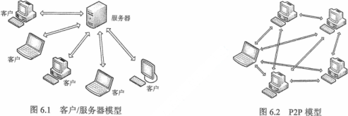

### Peer-to-Peer

对等网络中的结点既可以是客户端 leecher，也可以是服务端 seeder

- 加入对等网络的节点与相邻对等节点建立TCP连接
- 对等节点之间通过互相下载/上传，逐渐组装完整个文件完成下载，并向请求的对等节点贡献资源

特点：减轻服务器的计算压力，消除对某个服务器的完全依赖，可扩展性强

应用：BitTorrent, 分布式Hash表 DHT

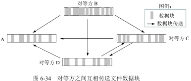

## 6.2 域名系统DNS

<u>UDP 连接，端口53</u>

### 层次域名空间

顶级域名分类：

- 国家顶级域名 (.cn)
- 通用顶级域名 (.com, .edu)

互联网的域名空间

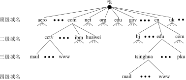

### 域名资源记录*

```
Domain-name	Time-to-live	Class	Type	Value
			86400			IN
```

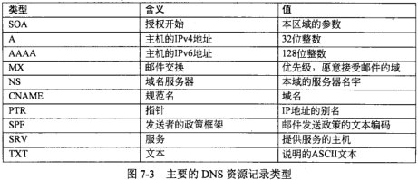

### 域名服务器

一个服务器所负责管辖的（或有权限的）范围叫做区。

每一个区设置相应的**权限域名服务器** (ANS)，用来<u>保存该区中的所有主机的域名到 IP 地址的映射</u>。

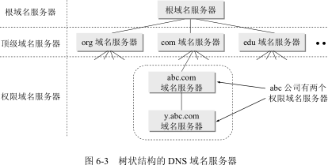

- <u>本地域名服务器：当一台主机发出 DNS 查询请求时，报文先发送给本地域名服务器</u>

- 根域名服务器：所有根域名服务器都知道所有的顶级域名服务器的域名和 IP 地址

  只要本地域名服务器无法解析，就首先要求助于根域名服务器

  根域名服务器告诉本地域名服务器下一步应当找哪一个顶级域名服务器进行查询

- 顶级域名服务器：负责管理在该顶级域名服务器注册的所有二级域名。

- 权限域名服务器：负责一个区的域名服务器。当一个权限域名服务器不能给出 IP 时，就告诉发出查询请求的 DNS 客户，下一步应当找哪一个权限域名服务器

### 域名解析过程

<u>主机向本地域名服务器的查询一般采用**递归查询**</u>

<u>本地域名服务器向根域名服务器的查询通常采用**迭代查询**</u>

- 递归查询：<u>本机递归查询本地NS，本地NS继续递归查询</u>：

  本地NS作为DNS客户请求根NS，根NS请求顶级NS，根NS请求权限NS，直到一个权限NS查询成功再一级级返回

- 迭代查询：<u>本机递归查询本地NS，本地NS作为DNS客户逐级各请求1次</u>

  本地NS作为DNS客户请求根NS，根NS根据顶级域名响应顶级NS地址 (dns.com)

  本地NS向顶级NS请求，顶级NS响应权限NS地址 (dns.example.com)

  本地NS向权限NS请求，若查询到则返回IP

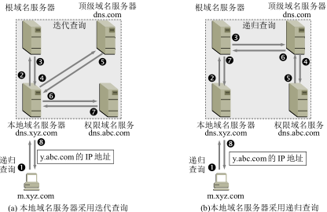

## 6.3 文件传输协议FTP

### FTP工作原理

FTP 的服务器进程分：

- 一个主进程，负责接受新的请求
- 若干子进程，负责处理客户请求

### 控制连接与数据链接

控制连接：客户端(端口N)与服务端(端口21)建立控制连接，交互命令，**整个会话期间保持打开状态**

数据连接：根据数据请求完成数据通信（默认被动模式）

- 主动 PORT 模式：客户端开临时数据连接端口 M 监听，用控制连接发送 `PORT M` 到服务器，**服务端主动在端口 20 与客户端端口 M 请求数据连接**
- 被动 PASV 模式：客户端用控制连接发送 `PASV` 到服务器，服务端开临时数据端口并返回 (ip:port)；由**客户端来请求(临时端口)数据连接**（服务器被动响应数据连接）

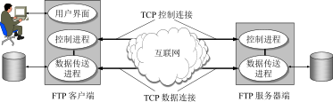

## 6.4 Email

### Email系统结构

- 用户代理 UA：运行 SMTP 客户端，POP3 客户端

- 邮件服务器 MS：运行 SMTP 服务端+客户端，POP3 服务端

- 简单邮件传输协议 SMTP：SMTP-client $\rightarrow$​ ​SMTP-server (push)

  邮局协议 POP3：POP3-server $\rightarrow$​​ ​POP3-client (pull)

```
               SMTP-client───╮╭──SMTP-client
                   ^        ╭┼╯      ^          
SMTP-client───>SMTP-server<─╯╰──>SMTP-server<───SMTP-client
                   v                 v
POP3-client<───POP3-server       POP3-server───>POP3-client
```

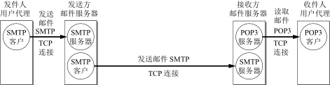

### Email格式与MIME

From / To / Subject / Date / \<Content\>

```
MIME-Version: 1.0
Content-Type: multipart/mixed;
boundary="-------417CA6E2DE4ABCAFBC5"
From: Alice Smith <Alice@cisco.com>
To: Bob@cs.Princeton.edu
Subject: promised material
Date: Mon, 07 Sep 1998 19:45:19 -0400

---------417CA6E2DE4ABCAFBC5
Content-Type: text/plain; charset=us-ascii
Content-Transfer-Encoding: 7bit

Bob,
Here are the jpeg image and draft report I promised.
--Alice

---------417CA6E2DE4ABCAFBC5
Content-Type: image/jpeg
Content-Transfer-Encoding: base64
... unreadable encoding of a jpeg figure
---------417CA6E2DE4ABCAFBC5
Content-Type: application/postscript; name="draft.ps"
Content-Transfer-Encoding: 7bit
... readable encoding of a PostScript document
```

#### 多用途互联网邮件扩展 MIME

> SMTP 限于传送 7 位的 ASCII 码，不能传送二进制文件；SMTP 服务器会拒绝超过一定长度的邮件

MIME 继续使用原来的邮件格式，但增加了邮件主体的结构，并定义了传送非 ASCII 码的编码规则

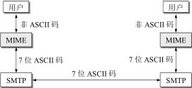

MIME 首部

- MIME-Version：1.0
- Content-Description
- Content-Type
- Content-Transfer-Encoding

MIME 内容类型 Content-Type: [type/subtype]

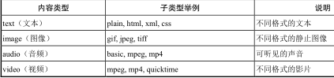

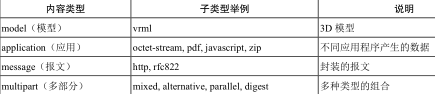

MIME 内容传输编码 Content-Transfer-Encoding

- 7 位 ASCII 码，MIME 对这种由 ASCII 码构成的邮件主体不进行任何转换
- quoted-printable，适用于所传送的数据中只有少量的非 ASCII 码，例如汉字。
- base64 编码，适用于任意二进制文件

### SMTP与POP3

#### SMTP

TCP 连接，端口25。SMTP-client $\rightarrow$ SMTP-server (push)

- 连接建立：客户端收到服务器就绪响应后，发送 `HELLO `，附上发送方的IP地址
- 邮件发送：发送 `MAIL FROM: xxx`，`RCPT TO: xxx`，`DATA <content>`
- 连接释放：邮件发送完后，SMTP 客户发送 `QUIT`

特点：

- SMTP 支持从用户代理 UA 发往邮件服务器 MS(From)，从 MS(From) 发往 MS(To)
- <u>SMTP 限于传送 7 位的 ASCII 码，不能传送二进制文件</u>
- SMTP 服务器会拒绝超过一定长度的邮件

```
HELO cs.princeton.edu
250 Hello daemon@mail.cs.princeton.edu [128.12.169.24]

MAIL FROM:<Bob@cs.princeton.edu>
250 OK

RCPT TO:<Alice@cisco.com>
250 OK

RCPT TO:<Tom@cisco.com>
550 No such user here

DATA
354 Start mail input; end with <CRLF>.<CRLF>
Blah blah blah...
<CRLF>.<CRLF>
250 OK

QUIT
221 Closing connection
```

#### POP3

TCP 连接，端口110。POP3-server $\rightarrow$​ POP3-client (pull)

两种工作方式

- 下载并保留：POP3 服务器保留已读邮件
- 下载并删除：POP3 服务器删除已读邮件

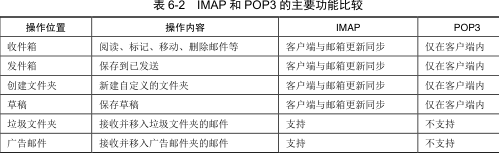

## 6.5 万维网WWW

### WWW概念与结构

三个标准：

- 统一资源定位符 URL，是统一资源标识符 URI 的一种。<协议>://<主机>:<端口>/<路径>

  URI 由 <scheme> 定义，如：mailto:santa@northpole.org，file:///C:/foo.html

- 超文本传送协议 HTTP

- 超文本标记语言 HTML 

### HTTP

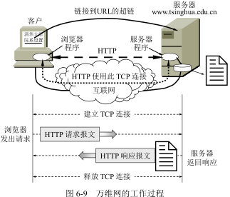

####HTTP 操作过程

- 发起 DNS(UDP) 请求域名解析，返回对应服务器 IP

- 发起 HTTP(TCP) 请求资源，返回服务器中的对应资源

  <u>从发起TCP连接请求到最后收到首个HTTP数据，需要 2 · RTT</u>

#### HTTP 特点

- 非持续连接：每一个对象请求都需要 2 · RTT 的开销（HTTP/1.0）

- 持续连接：服务器在响应后仍在一段时间内保持该连接，该客户进程可以继续在该连接上传送后续的 HTTP 报文（HTTP/1.1）

  - 非流水线：客户在收到前一个响应后才能发出下一个请求。每一个对象请求需要一个 RTT
- 流水线：客户在收到 HTTP 响应报文之前能够接着发送新的请求报文。一连串请求需要一个 RTT 稍多一点时间

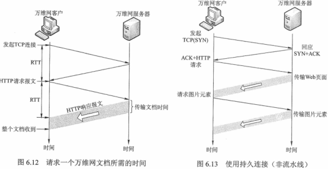

#### HTTP报文结构

请求、响应报文

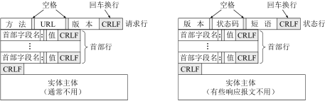

HTTP method

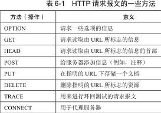

HTTP 请求例子

```
telnet www.example.com 80
GET /dir/index.html HTTP/1.1
Host: www.example.com
Connection: close

HTTP/1.1 200 OK
Connection: close
Date: Tue, 18 Aug 2015 15:44:04 GMT
Server: Apache/2.2.3
Last-Modified: Tue, 18 Aug 2015 15:11:03 GMT
Content-Length: 6821
Content-Type: text/html
<data...>
```

##### 条件方法 If-Modified-Since

条件方法报文告诉服务器，仅当自指定日期之后该对象被修改过，才发送该对象。

```
GET /fruit/kiwi.gif HTTP/1.1
Host: www.exotiquecuisine.com

HTTP/1.1 200 OK
Date: Sat, 3 Oct 2015 15:39:29
Server: Apache/1.3.0 (Unix)
Last-Modified: Wed, 9 Sep 2015 09:23:24
Content-Type: image/gif
<data...>

GET /fruit/kiwi.gif HTTP/1.1
Host: www.exotiquecuisine.com
If-modified-since: Wed, 9 Sep 2015 09:23:24

HTTP/1.1 304 Not Modified
Date: Sat, 10 Oct 2015 15:39:29
Server: Apache/1.3.0 (Unix)
<empty body>
```


