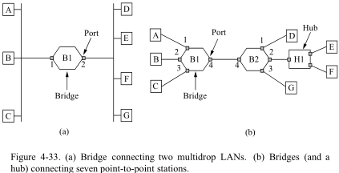
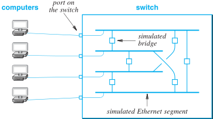

**考纲**

数据链路层功能，组帧，差错控制：检错/纠错编码

流量控制与可靠传输机制：流量控制，可靠传输与滑动窗口，停止-等待协议，后退 N 帧，选择重传

介质访问控制：信道划分（FDM/TDM/WDM/CDMA），随机访问（ALOHA, CSMA, CSMA/CD, CSMA/CA），轮询访问（令牌传递）

局域网：概念与结构，Ethernet 与 802.3，802.11 无线局域网，**VLAN基本概念、原理**，~~令牌环网原理~~

广域网：概念，PPP, ~~HDLC 协议~~

数据链路层设备：~~网桥概念及原理~~，局域网交换机及工作原理

**真题考点**

- 后退 N 帧 GBN 协议，选择重传协议 SR，滑动窗口协议，停止-等待协议，计算数据帧长度、帧序号比特数、接收窗口大小、数据传输率、信道利用率
- 介质访问控制复用技术哪个可能冲突，CSMA/CD 协议原理、最小距离、传播时延计算，Hub 再生比特流与以太网帧的最大距离计算，对数据帧进行确认的 MAC 协议，CSMA 接收码片计算，802.11 无线局域网的 MAC 协议 CSMA/CA 信道预约方法，CSMA/CA 帧间间隔时间 IFS
- 以太网 MAC 协议提供的服务，802.11 发送 IP 分组帧地址，10BaseT 快速以太网传输介质
- HDLC 协议组帧对应比特串
- 以太网交换机转发的 PDU 地址、帧的转发端口

## 3.1 链路层功能

### 为网络层服务

- 无确认、无连接服务：对丢失帧交给网络层数理。适用：实时/误码率低的信道（以太网）
- 有确认、无连接服务：目的端收到帧发确认。适用：误码率低的信道（无线网）
- 有确认、有连接服务：目的端收到帧发确认，等源端收到确认再发送下一帧。可靠性高

### 帧定界、帧同步与透明传输

封装成帧：添加序列号 SEQ、帧检查序列 FCS，数据前后添加首部/尾部标记

帧定界：将物理层的比特流根据首/尾部标记，识别出帧的开始/结束；可以丢弃不完整的差错帧

透明传输：首/尾序列可能出现在帧体中的任何位置导致错误识别（数据被截断），需采用填充法使数据无障碍的向上传递

帧的数据部分长度上限—最大传送单元 MTU


### 差错控制

错误类型：bit 位错、帧传输出错（丢失/重复/失序）

处理策略：纠错、检错

- 前向纠错 FEC：添加额外的检错序列，允许接收者验证数据是否正确到达并纠正错误
- 自动重传请求 ARQ：发送方向接收方发送消息时，接收方都会回传一个确认 ACK（短）消息。如果在 T 时间单元后还没收到确认 ACK，发送方认为消息已丢失并重传一次

### 流量控制

## 3.2 组帧

### 计数法

发送方在帧首部加一个计数字段标识帧的字节数

缺点：计数字段在传输中出错就无法实现帧同步

### 首尾定界-字符填充

帧首尾各使用一个 ASCII 码控制字符的数字作为定界符

透明传输填充方法：发送方在数据中每遇到一个定界符就在其前面加入一个其它填充字符数字；接收方在数据部分遇到每遇到一个填充字符就删除一次，再跳过后面紧挨的数据

缺点：数据部分若有大量控制字符则需大量填充字符

应用：PPP 协议


### 首尾标志-0 比特填充

帧首尾使用同一个特定比特串作为定界标志，如：01111110。

填充方法：发送方在数据中每遇到连续 5 个 1，就在输出的比特流中填入一个 0；接收方每遇到 5 个连续比特 1 ，且后面紧跟一个比特 0，就删除比特 0

缺点：数据部分若有大量标志串仍需不少填充比特

应用：HDLC 协议


### 物理层违规编码法

物理层基带编码如：曼彻斯特编码，位周期中心向上跳变代表 0，中心向下跳变代表 1；

其未使用两个不跳变电平对（高高/低低电平），则可利用该违规序列作为链路帧的定界标志

## 3.3 差错控制

### 检错编码

#### 奇偶校验码

奇偶位的选择原则：加入校验位使得码字中比特 1 的数目是偶数（或奇数）

例：数据 1011010（当前偶数个 1）。奇校验码：1011010**1**，偶校验码：1011010**0**

缺点：只能检测出 1 个位错误，若出现偶数的位错误则检测失效。

（图：使用字节交错校验检测突发错误）


#### 循环冗余 CRC 码

商定 r 阶生成多项式 P(x)，对应一个 r+1 位比特序列（最高位与最低位系数须为 1）

如：3 阶多项式 $P(x)=x^3+x^2+1$​ 对应 4 位串 1101​​​​

基本思想：将数据串看做系数为 0 或 1 的多项式，一个 m 位帧看作是一个 m-1 次多项式的系数序列$M(x)$。在帧的尾部附加一个 r 位冗余码，使附加之后的帧对应的多项式能被 P(x）整除；当接收方收到了带校验和的帧，试着用 P(x）对应序列去除它；如果有余数，则表明传输过程出错

计算冗余码：假设 P(x) r 阶， m 位帧对应多项式 $M(x)$​，r<m

- 帧序列左移 r 位（低位加 r 个 0），共 m+r 位，对应多项式 $x^rM(x)$​​​

- 用模 2 除法， P(x）对应位串去除对应于 $x^rM(x)$​​​​​ 对应位串；用模 2 减法（mod 2 或 xor）

  最终得到的余数作为冗余码加到 m+r 位帧


### 纠错编码

#### 海明码

## 3.4 流量控制与可靠传输

**理想的单工协议（无流控制与错误纠正）**

```c
typedef enum {frame arrival} event_type;
#include "protocol.h"
void sender(void) {
    frame s;					/* buffer for an outbound frame */
    packet buffer;				/* buffer for an outbound packet */
    while (true) {
        from_network_layer(&buffer); /* go get something to send */
        s.info = buffer;		/* copy it into s for transmission */
        to_physical_layer(&s);	/* send it on its way */
    }
}
void receiver(void) {
    frame r;
    event_type event;				/* filled in by wait, but not used here */
    while (true) {
        wait_for_event(&event);		/* only possibility is frame arrival */
        from_physical_layer(&r);	/* go get the inbound frame */
        to_network_layer(&r.info);	/* pass the data to the network layer */
    }
}
```

### 流量控制、可靠传输、滑动窗口

**流量控制**：限制发送方的发送频率

#### 停止-等待

发送方发送数据帧，等待接收方对该帧的确认帧到达，再继续发送下一帧

#### 滑动窗口

[Selective Retransmission Vs. Go Back N](https://sachithradangalla.medium.com/selective-retransmission-vs-go-back-n-e823e9fc1887)
[animations](https://www2.tkn.tu-berlin.de/teaching/rn/animations/gbn_sr/)

累计确认：发送方连续发送数据帧，接收方对最后一帧予以确认

捎带确认：接收到数据后，等到向外发送数据帧时附加上 ack 字段作为确认

帧序号位 n bit，循环使用序号 $0\sim 2^{n-1}$​​，对应发送方/接收方允许发送/接收的帧

**滑动窗口**：一对指向受帧序号位限制的固定大小帧缓冲区的循环移动的前后指针

发送窗口指针界内：包含已发送未确认的 / 允许发送的帧；当收到一个确认（已顺序），窗口下界指针前移

窗口大小：上下界指针的差值，$1\le W\le 2^{n-1}$​

- 停止-等待协议：发送窗口 WS = 1，接收窗口 WR = 1，即期望的下一个帧序号

- 后退 N 帧协议：发送窗口 $WS = 2^n-1$​，接收窗口 WR = 1，即期望的下一个帧序号

- 选择重传协议：发送窗口 $WS = 2^{n-1}= WR$​​

  接收窗口指针界内：含已标记接收 / 允许接收的帧序号，当顺序收到一个确认，窗口下界指针前移

基本同步关系：

- 发送方发送每发送一个帧就启动相应的超时计时器
- 若数据帧损坏/丢失，接收方均忽略，发送方计时器超时重传
- 若接收方收到旧帧，需重传上一个已接收的帧的确认

#### 可靠传输

自动重传请求 ARQ：发送方使用超时机制等待接收方的应答确认帧，若超时则重传

ARQ 包含：停止-等待 ARQ、后退 N 帧 ARQ、选择重传 ARQ

超时时间 Timeout = 2 \* RTT

数据传输效率 E = 数据传输时间 / 数据发送周期时间 $=T_t/(T_t+2T_p)=T_t/(T_t+RTT)$

数据传输速率 or 吞吐量 = 数据传输效率 \* 带宽 = EB

链路容量 = 带宽 _ 传播时延 = 2 _ 带宽 \* 传播时延（全双工）

### 停止-等待协议

超时重传的可能事件：数据帧丢失/接收方丢弃/确认帧丢失/确认帧超时到达

- 接收方 `接收帧seq!=期待的下一帧seq` 对发送方因未收到确认而发送的重复帧 丢弃，并重传对该帧的确认

- 发送方 `接收帧ack!=未确认的帧seq` 对接收方超时到达的确认帧 无视

帧编号使用一位 0 或 1 交替标识，只需比较当前帧与上一帧、当前帧与下一帧的关系


**协议**

发送方初始状态：下一帧序号 `nseq=0`

1. 若有数据需发送，则发送帧 `nseq`，启动计时器

2. 若未超时且收到 ACK 帧 `r.ack==nseq`，则停止计时器，更新下一帧序号 `nseq=1-nseq`

   若超时则继续执行 1.

接收方初始状态：期待的下一帧序号 `nseq=0`

1. 等待直到收到发送方的帧 `s`
2. 若 `s.seq==nseq`，则更新期待的下一帧序号 `nseq=1-nseq`
3. 发送确认帧 `s.ack=1-nseq`（包括对发送方未收到上一帧确认而重发的再次确认）

```pseudocode
N = 1;
function sender is:
    nseq = 0; /* seq number of next outgoing frame */
    while true:
        if request send then:
        	send frame s of nseq;
        	start timer of nseq;
        if receive frame r and r.ack == nseq then:
        	stop timer of nseq;
        	nseq = inc(nseq); /* nseq++ mod 2 */
        /* if timeout of nseq then: continue; */
function receiver is:
    nseq = 0;		/* seq number of next inbound frame */
    checked = false;/* recv checked frame */
    while (true) {
        if receive frame s and s is not corrupted then:
        	if s.seq == nseq then:
        		nseq = inc(nseq); /* nseq++ mod 2 */
        		checked = true;
            if checked then: /* old frame */
        		send ack frame of 1-nseq; /* ack last in order checked */
```

数据帧与确认帧发送时间关系


特点：发送方每个 RTT 仅发送一帧，链路上只有一个未确定的帧

### 后退 N 帧协议 GBN


**发送窗口**

帧序号 n bit，接收窗口大小 1，发送窗口大小 $N\le 2^n-1$​

留至少 1 个序号以便接收端区分是新帧（上界+1）or 重传的旧帧（下界），否则两种帧均指向下界

例：若 n=2, N=4，W=[0123]，发送方已发送但超时未收到确认，重传帧[0123]，接收方不知新/旧

**协议**

发送端初始：窗口序号下界 `base=0`，上界 `base+N-1`，下一个发送帧 `nseq=base`

1. 若请求发送帧且下一发送帧序号在窗口内 `nseq<base+N`，则发送帧 `nseq`，启动计时器，`nseq++`
2. 若收到已确认帧 `r`，则窗口下界前移到待确认帧 `base=r.ack+1`
3. 若 `base` 计时器超时，则下一个发送帧回退到下界 `base`，重发该帧及后续帧 `[base, nseq)`

接收端初始：期待的下一个接收帧 `nseq=0`

1. 等待接收帧 `s`，若帧出错则丢弃继续等待
2. 若帧未出错且按序 `s.seq==nseq`，`nseq++`
3. 继续发送上一接收帧的确认帧 `r.ack=nseq-1`（确保发送端收到）

**计算**

数据传输效率 E = $N*T_t/(T_t+2T_p)$​

数据传输速率 or 吞吐量 = 数据传输效率 * 带宽 = $(N*T_t/(T_t+2T_p)) * B$​​

缺点：如果任一帧丢失/损坏，或者确认 ACK 丢失/损坏，会导致多次发送帧，那么该帧和发送窗口中的所有后面已被接收的帧将被重发

```pseudocode
/* 	https://www.baeldung.com/cs/networking-go-back-n-protocol
	https://www.tutorialspoint.com/a-protocol-using-go-back-n
	|0|1|2|3|4|5|6|7|
	 +-----------+
	   +-----------+
	 +   +----------
*/
N = 2^n - 1; /*	seq occupies n bit, window size N=2^n-1 */
function inc(i) is
	return i < N ? i + 1 : 0
function dec(i) is
	return i > 0 ? i - 1 : N
function between(down, c, up) is /* c is between circular window [down, up) */
	return down <= c < up or up < down <= c or c < up < down;
function sender is
    nseq = base = 0;
    while true:
        if request send and between(base, nseq, base + N) then /* nseq < base + N */
            send frame of nseq;
            start timer of nseq;
            nseq = inc(nseq); /* nseq++ */
        if receive frame r then
			if between(base, r.ack, nseq) then
				stop timer of [base, r.ack];
			base = inc(r.ack); /* base = r.ack + 1 */
		if timeout of base then
			for i in [base, nseq): /* resend all unacked frames */
				send frame of i;
				start timer of i;
function receiver is
    nseq = 0;
    checked = false; 	/* recv checked frame */
    while true:
    	if receive frame s and s is not corrupted:
            if s.seq == nseq then
                nseq = inc(nseq); /* nseq++ */
                checked = true;
            if checked then: /* old frame */
	            send ack frame of dec(nseq); /* ack last in order checked (nseq-1) */
```

### 选择重传协议 SR

**发送/接收窗口**

接收端加大接收窗口，以便收下发送序号不连续（后续帧先到达）的数据帧

发送端/接收端窗口大小：$WS=WR\le 2^{n-1}$​​​，以避免发送方重传帧序号被包含在接收方期待的新帧窗口中，即避免旧帧与新帧序号重叠。

例：若 n=2, WS=[012], 接收方收到更新窗口 WS=[301]，发送方超时未收到 2 的确认，重传帧[012]，接收方不知 [01] 新/旧


**协议**

发送端初始：窗口序号下界 `base=0`，上界 `base+N-1`，下一个要发送的新帧 `nseq=base`

1. 若请求发送帧且下一发送帧序号在窗口内 `nseq<base+N`，则发送帧 `nseq`，启动计时器，`nseq++`
2. 若收到否定帧 `r.type==NAK`，则重发帧 `s.seq=r.nak`，启动计时器

   若收到已确认帧 `r.type==ACK`，则窗口下界前移到待确认帧 `base=r.ack+1`，停止计时器

3. 若 `base` 计时器超时，则重送下界所指的帧 `base`，启动计时器

接收端初始：期待的下一个接收帧 `nseq=0`，否定帧发出标记`NAKSent=false`

1. 等待接收帧 `s`，若帧出错且否定帧标记未发过，则发送否定帧 `r.nak=nseq`，标记 `NAKSent=true`，继续等待接收
   若帧未出错则往下执行：
2. 若到达的是后续帧 `s.seq!=nseq`，标记已接收；
   若否定帧标记未发过，则送期待帧的否定帧 `r.nak=nseq`，标记 `NAKSent=true`
3. 若到达的是顺序帧 `s.seq==nseq`，则根据窗口帧标记更新前移下一期待接收帧 `nseq`
4. 发送最后一个顺序接收帧的确认帧 `r.ack=nseq-1`（确保发送端收到）

**计算**

数据传输效率 E = $N*T_t/(T_t+2T_p)$​

数据传输速率 or 吞吐量 = 数据传输效率 * 带宽 = $(N*T_t/(T_t+2T_p)) * B$​​​

```pseudocode
/*  https://www.tutorialspoint.com/a-protocol-using-selective-repeat
	https://ghrcem.raisoni.net/SSR/criterion2/2.3.2_UNITII_CN.pdf
*/
N = 2^(n-1);
function sender is
    nseq = base = 0;
    while true:
        if request send and between(base, nseq, base + N) then /* nseq < base + N */
            send frame of nseq;
            start timer of nseq;
            nseq = inc(nseq); /* nseq++ */
        if receive frame r then
        	/* resend frame whose sequence number is with ACK */
			if r.type == NAK and between(base, r.nak, nseq) then
				send frame of r.nak;
				start timer of r.nak;
			if r.type == ACK and between(base, r.ack, nseq) then
				stop timer of [base, r.ack];
				base = inc(r.ack); /* base = r.ack + 1 */
		if timeout of base then	/* resend unacked frame */
            send frame of base;
            start timer of base;
function receiver is
	nseq = 0;
	NAKSent = false;
	for slot in range(base, base+N):
		Mark[slot] = false;
    while true:
    	if receive frame s then
            if s is corrupted and !NAKSent then
                send nak frame of nseq;
                NAKSent = true;
                continue;
            if s is not corrupted then
                if s.seq != nseq then 		/* unordered */
                    if !NAKSent then
                        send nak frame of nseq;
                        NAKSent = true;
                    if between(base, s.seq, base+N) and !Mark[s.seq] then
                        Mark[s.seq] == true;
                else
                    nseq = inc(nseq);	/* nseq++ */
                    while Mark[nseq]:	/* 遍历已标记缓存的帧, 累计确认 */
                        nseq = inc(nseq);	/* nseq++ */
                    NAKSent = false;
				send ack frame of dec(nseq); /* last in order, marked (nseq-1) */
```

**GBN ARQ VS SR ARQ**

| GBN                                   | SR                                          |
| ------------------------------------- | ------------------------------------------- |
| 接收窗口 1，顺序接收                  | 发送/端窗口 $2^{n-1}$​​，无序接收，顺序确认 |
| 若一帧损坏/丢失，则必须重传所有后续帧 | 在此情况下，仅再次发送损坏/丢失的帧         |
| 如果错误率高，则浪费大量带宽          | 存在低带宽损失                              |

## 3.5 介质访问控制 MAC

链路类型

- 点对点 p2p 协议：PPP、HDLC
- 广播：广播信道即多路访问信道，一般用在局域网

多路访问问题：如何协调多个发送和接收节点对一个共享广播信道的访问

多路访问协议：

- 静态**信道划分**：TDM/FDM/WDM/CDM，但不适合于局域网
- 动态**随机接入**：ALOHA, CSMA/CD, CSMA/CA
- 动态受控接入：分散控制（令牌环局域网），集中控制（多点线路**轮询**）

计算机通过适配器和局域网进行通信：

- 适配器收到正确帧才使用中断通知 CPU，以交付数据
- 适配器收到 CPU 要发送的 IP 数据报时，组装(MAC 地址)成帧后发送到局域网


### 信道划分

多路复用：在一条介质上能同时传输多个信号，即分出多个信道

#### 频分多路复用 FDM

将物理信道的总频率带宽分割成若干与传输单个信号带宽相同的子信道，每个子信道传输一种信号

将多路基带信号调制到物理频带的不同频率载波上，再叠加形成一个复合信号

特点：共享频带，同时传输；但使用固定分配，频率所属子信道未使用时就浪费了


#### 时分多路复用 TDM

将物理信道按时间分成若干时间片（时隙），轮流地分配给多路信号使用

特点：共享时间，交替传输；但使用固定分配，时序所属子信道未使用时就浪费了


##### 统计时分多路复用 STDM

按需动态分配时隙

#### 波分多路复用 WDM

光的波长频分复用，即在光纤中传输多种不同波长（频率）的光信号

#### 码分多路复用 CDM

比特时间：传输 1bit 的时隙。设 $d^j_i=\pm 1$​​ 为第 j 个站点第 i 个比特时隙中的数据比特值（假设数据比特 0 用-1 表示）

码片：将比特时间划分为 m 个微时隙

码片序列：如 $c=(-1,-1,-1,1,1,-1,1,1)$​​​​​

- 由站点指定的 m 位 1 或-1 组成的序列，当要发送比特 1 就发送 m 位序列，当要发送比特 0(对应-1)就发送 m 位序列的反码 $z=d_i·c=\pm c$​​​

- 不同站点使用不同码片序列，满足相互正交性（任意两站点码片序列规格化内积 $c_j· c_k=0$​​​​​​​​​）

原理：在同一物理信道第 i 个时隙，n 个站点发送编码后的序列 $z^k_i=d^k_i·c_k$，叠加后传输 $\sum_{k=1}^n z^k_i$；接收站点根据发送站点 j 的码片序列 $c_j$ 过滤掉其它站点信息，得到其在第 i 个时隙发送的数据 $d_i^j$：

$c_j·\sum_{k=1}^n z^k_i=c_j·z^j_i=c_j·d_i^j·c_j=m·d_i^j$​​

特点：共享时间与频率，同时传输；数据率需提高到原来 m 倍，频带需要扩频到原来 m 倍


### 随机访问

多个用户随机发送信息，在共享介质上可能产生**碰撞**（冲突），再按一定规则反复重传帧。实质上将广播信道转化为点到点信道。

#### ALOHA 协议

（始于早期的 Hawaii 无线电网络）

##### 纯 ALOHA

不同帧在时间上重叠，发生冲突时，帧均出现了差错，需重传

重传策略：发生冲突的各站等待一段随机时间再重传，直到重传成功

纯 ALOHA 网络吞吐量仅为 18%


##### 时隙 ALOHA

将时间划分为一段段等长的时隙，每个时隙对应于一帧，规定只能在下一个时隙开始时发送帧，减少了冲突


时隙 ALOHA 网络吞吐量提高一倍


#### 载波侦听多路访问/碰撞检测 CSMA

站点监听信道（出入口），等到空闲后再发送

- 1-坚持 CSMA：监听信道，若空闲则立即发送；若信道忙则继续监听

  缺点：存在空闲时同时发送的冲突

- 非坚持 CSMA：监听信道，若空闲则立即发送；若信道忙则放弃监听，等待随机时间后再监听

  缺点：增加了数据在网络中的平均延迟

- p-坚持 CSMA：监听信道，若空闲则以概率 p 发送，概率 1-p 推迟到下一时隙；若信道忙则推迟到下一时隙再监听（用于时分信道）


#### 载波侦听多路访问/冲突检测 CSMA/CD

流程：先听后发，边听边发；冲突停发，随机重发，16 次后丢弃

冲突检测：边发送边监听，即适配器边发送数据边检测信道电压变化（判断其它站点是否也在发）

> 电磁波信号传播速率：$2\times 10^5km/s$，$5\mu s/km$
>
> 局域网总线上单程端到端传播时延 $\tau=T_p=距离d/传播速率v$​​​​​​​
>
> 争用期：以太网端到端往返传播时延 $RTT=2\tau$​，也是发送最小帧的比特时间 $min(T_t)$​​​​

**举例** 如图，端到端距离 d=1km，$\tau=5\mu s$

接收端 B 在 $t<\tau$​​​​ 时检测到信道空闲 发送帧，之后发生碰撞；在 $t=\tau$​​​​ 检测到 A 的数据（得知已碰撞）

发送端 A 在 $t<2\tau$​​ 时检测到 B 的数据（得知已碰撞）

结论：发送端在发送后 只有在经过的 $2\tau$​​ 间隔时间（争用期）内未检测到冲突才能保证发送成功


**最小帧长、带宽、距离关系**

> 以太网 MAC 帧规定的最小帧长=64B，不足时填充
>
> 以太网规定帧间最小间隔：96bit 时间

- 若发生冲突，之后发送端检测到（争用期内）并立即停止发送，已发送字节<64B

- 若刚发满争用期时间，即已发送字节=64B，则说明未发生冲突且已占领信道，可继续发送

> 最小帧长 = 争用期 \* 带宽 = (2 \* 传播时延) \* 数据传输率或带宽
>
> $min(T_t)=512b/带宽B=RTT=2T_p=2·距离d/传播速率v$​

(a) 最小帧长不变，带宽改变，(b) 带宽不变，最小帧长改变 $\rightarrow$​​ 影响距离同步改变

- 当带宽 10Mb/s，争用期=最小帧的传输时延 51.2 µs=RTT，帧间最小间隔 9.6 µs

- 当带宽 100Mb/s，争用期=最小帧的传输时延 5.12 µs=RTT，帧间最小间隔 0.96 µs


**截断二进制指数退避**

基本退避时间：即争用期，端到端往返传播时延 RTT

重传次数参数：$k = min(重传次数, 10)$​​​

随机退避因子：$r=Random(0,1,...,2^k-1)$​​

重传所需退避时间：$T_{backoff}=r·RTT$​​​

重传次数越多，平均退避时间越长（若重传 16 次仍冲突则说明网络拥挤，将帧丢弃报告上层）

**缺点**：在无线通信中，并非所有站点都能听见对方，存在 **隐蔽站** 问题

**应用**：总线型网络或半双工网络（早期以太网的基础，但不再用于交换的以太网）

**以太网信道利用率**


默认情况下，源站发送的数据帧长>=64 字节，传输帧时间 $T_0$，最后一个 bit 传播时间 $\tau$，则该帧的发送完成时间 = $T_0+\tau$

定义参数 $a=\frac{\tau}{T_0}$​，a 越大，表示争用期所占比例越大，信道利用率低；所以 a 应尽可能小，检测出冲突时的信道资源浪费少

信道极限利用率 $S_{max}=\frac{T_0}{T_0+\tau}=\frac{1}{1+a}$

#### 载波侦听多路访问/冲突避免 CSMA/CA

在 CSMA 基础上，针对无线网络的 802.11 协议使用：停止等待/确认/重传 ARQ 方案

CSMA/CA


CSMA/CA RTS/CTS 机制


802.11 MAC 层两个子层：

- 分布协调功能 DCF：站点争用信道获取发送权
- 点协调功能 PCF：接入点 AP 使用集中控制+探询，把发送权轮流交给各个站

帧间间隔 IFS 类型：

- 短帧间间隔 SIFS：最短，分隔开属于一次对话的各帧。

  帧类型：RTS/CTS/ACK/分片数据帧/回答 AP 探询的帧

- 点协调帧间间隔 PIFS：中等长度，PCF 的间隔

- 分布式协调帧间间隔 DIFS：最长，DCF 的间隔

工作原理：

- 源站若检测到信道空闲，则先等待 DIFS 时间，再发送一个 **RTS**(Request To Send) 短帧，包含了数据帧长度

  若检测到信道忙，则等待 DIFS 时间

- 目的站收到 RTS 帧后等待 SIFS 时间，再发送 **CTS**(Clear To Send) 短帧作为应答，包含了数据长度

- 源站收到 CTS 帧后等待 SIFS 时间，再开始传输数据；传输完后等待监听 ACK 帧

- 目的站在收到数据后等待 SIFS 时间，然后发送 ACK 帧作为应答

冲突避免：

- 每个站点发送任意帧前均需要等待一个帧间间隔 IFS

- 源站临近站点监听到 RTS 帧 或 目的站临近站点监听到 CTS 帧后，都必须退避以避免干扰目的站发送的 CTS 帧
- 若两个源站同时发 RTS 给一个目的站，则两个 RTS 帧将冲突；其中一个源站（未在期望时间内听到 CTS）将退避随机时间再重试


### 轮询访问（令牌传递）

通过一个集中控制的监控站，轮询每个站点，若有信道请求则分配令牌；站点在信道占用结束后释放令牌

特点：适合数据负载高的广播信道，以避免大概率的冲突。如：令牌环局域网

## 3.6 局域网

### 概念与结构

特点：

- 单播/组播/广播，方便局域资源共享
- 地理范围与站点数有限，双绞线最大传输 100 米，若距离超过则需在双绞线之间安装中继器（最多 4 个）

### 以太网与 IEEE 802.3

**通信特点**：

- 无连接、帧不编号，不确认、不可靠服务；
- 带同步的信号编码：曼彻斯特编码（每个码元之间一次电压突变）

#### 传输介质与网卡


**适配器（网卡）**

介质访问控制 MAC 地址：是固化在适配器（网卡）ROM 中的特定标识。

MAC 帧使用 MAC 地址标识网络设备，控制数据通信：网卡从网络上每收到一个 MAC 帧，首先检查 MAC 帧中的目的 MAC 地址，若匹配且 FCS 检验通过则收下

MAC 地址格式：长 6 字节，可用 12 个十六进制数表示，高 24 位厂商代码+低 24 位厂商分配的序列号

#### 以太网 MAC 帧


前导码：8 个字节，7 个前同步码+1 个帧开始定界符，同步码使接收端与发送端时钟同步

目的/源地址：6 字节（48bit）MAC 地址，源地址第 8 位=0，

- 目的地址首位 0，表示普通地址，源站单播
- 目的地址首位 1，表示组地址，源站组播
- 目的地址全 1，表示保留的广播地址，源站广播，所有站接收

类型：2 字节

数据：46~1500 字节，即上层 IP 数据报的大小；以太网帧最小长度 64 字节（不足时填充）

帧检查序列 FCS：4 字节，如 CRC 循环冗余码

#### 高速以太网>=100Mb/s

**100BASE-T 以太网**

支持全双工、半双工（CSMA/CD 协议）通信

对于铜缆 100 Mbit/s 的以太网中，保持最短帧长不变，一个网段的最大长度是 100 m，其最短帧长仍为 64 字节。因此 100 Mbit/s 以太网的争用期是 5.12 µs，帧间最小间隔现在是 0.96 µs，都是 10 Mbit/s 以太网的 1/10


**GBASE 以太网**

支持全双工、半双工（CSMA/CD 协议）通信


### IEEE 802.11

**基本服务集 BSS**

无线局域网最小构件，包括一个基站 AP+若干移动站。安装 AP 时，为其分配不超过 32 字节的服务集标识符 SSID 和一个通信信道


**移动站加入到一个基本服务集 BSS**

先选择一个接入点 AP，并与此接入点建立关联，表示这个移动站加入了选定的 AP 所属的子网，并和这个接入点 AP 之间创建了一个虚拟线路。（类似手机开机后必须和附近的某个基站建立关联）

**移动站之间通信**

移动站与 AP 关联后，只有关联的 AP 能向该移动站发送数据帧，移动站也只有通过关联的 AP 向其他站点发送数据帧。

#### 802.11 局域网物理层


#### 802.11 局域网 MAC 层

**MAC 层协议**：CSMA/CA、信道预约

**MAC 帧**

帧类型：控制帧（RTS/CTS/ACK）、数据帧、管理帧


帧首部 30 字节

地址 1~3：取决于帧控制字段中的 To-AP（去往 AP）和 From-AP（来自 AP），两 bit 共有 4 种组合（常用 2 种）

- 地址 1：接收的无线站点 MAC 地址

- 地址 2：发送该帧的无线站点 MAC 地址

- 地址 3：与 AP 有关的远程端点地址（与当前发送无关的目的或源端）

  当无线源站点发送时 `To-AP=1`，地址 1 为 AP 地址，地址 2 为源站点地址，地址 3 是 AP 关联的目的站点地址或 AP 直连的路由器端口（目的）地址

  当 AP 发送时 `From-AP=1`，地址 1 为无线目的站点地址，地址 2 为 AP 地址，地址 3 是 AP 关联的源站点地址或 AP 直连的路由器端口（源）地址


### VLAN

#### VLAN概念


#### VLAN原理


## 3.7 广域网

### 概念

长距离点到点全双工通信


**PPP vs HDLC**

| PPP                                | HDLC                             |
| ---------------------------------- | -------------------------------- |
| 面向字节（异步）/ 面向比特（同步） | 面向比特位                       |
| 点对点                             | 点对点/多点                      |
| 同步 / 异步媒介                    | 同步媒介                         |
| 提供动态寻址                       | 不提供动态寻址                   |
| 使用各种协议提供链路认证           | 不提供链路认证                   |
| 无编号、无连接、无确认             | 可靠传输，滑动窗口+确认+超时重传 |

### 点对点协议 PPP

子协议：链路控制协议 LCP，网络控制协议 NCP（不同 NCP 对应连接不同的网络层协议）

字节填充法：起始标志字节 0x7E(01111110)，若其出现在 payload 字段，用转义字符 0x7D(01111101)填充

#### PPP 帧

协议段：以比特 0 开始——网络层协议（如 IP），以比特 1 开始——PPP 协议（LCP 与一个 NCP）

载荷段长度：0~1500B，默认 1500B(MTU)


工作过程

- 通过 moderm 向对端(ISP)路由器请求建立物理连接
- 路由器的 moderm 应答后，物理连接即建立
- 用户设备在一个或多个 PPP 帧的有效载荷字段中按顺序发送一组 LCP 数据包
- 根据数据包及其响应选择 PPP 参数
- 选择 PPP 参数后，下发 NCP 报文用于网络层的配置
- 在 NCP 的帮助下，IP 地址会动态分配给新连接的设备
- 此后，NCP 结束网络层连接并保留 IP 地址

### ~~高级数据链路控制 HDLC 协议~~

链路配置：

- 非平衡配置：主站与从站，主站控制链路
- 平衡配置：平等发起数据传输

0 比特填充法：起始/结束标志 0x7E(01111110)，若其出现在定界之间，则每 5 个连续 1 后用 0 填充

#### HDLC 协议帧


地址字段：从站地址（非平衡），应答站地址（平衡）

控制字段对应帧类型：

- 信息帧 I：第 1 位 0，传输数据，捎带确认
- 监督帧 S：第 1,2 位 01，流量控制，差错控制，对信息帧的确认，请求重发/暂停
- 无编号帧 U：第 1,2 位 11，链路建立拆除

## 3.8 数据链路层设备

### ~~网桥概念与原理~~

网桥工作中 MAC 子层，能够隔离冲突域，减少不必要的广播，但连接的多个 LAN 仍是同一网络（广播域）

特点：

- 网桥连接两个多点 LAN，或连接多个点到点结点
- 所有附在网桥同一端口的站都属于同一个冲突域，不同端口通信需借助网桥转发
- 寻址，路径选择，存储转发（包括帧协议转换）
- 扩大了物理范围

缺点：增大了时延，无流量控制，可能产生广播风暴

#### 透明网桥（非最佳路由）

即插即用

- 自学习：洪泛算法+后学习法，可能造成环路，进而导致广播风暴



- 最小生成树算法


#### 源路由网桥（最佳路由）

### 以太网(LAN)交换机及工作原理

以太网交换机：多端口网桥

原理：将数据帧的源/目的 MAC 地址与动态查找表比较，若不在表中则加入，并将帧转发到目的端口

特点：

- 即插即用，转发表通过自学习算法建立（端口到物理地址映射）
- 可隔离冲突域，每个端口都是一个冲突域，各个端口各自通信没有影响
- 全双工通信，独占传输媒体的带宽，N 端口交换机总带宽容量 N\*BandWidth

交换模式：

- 直通式：只检查帧的目的地址，速度快（默认）
- 存储转发式：先将帧缓存，检查数据是否正确，若无误则通过查找表转发，若有误则丢弃，可靠性高



### 设备是否隔离冲突域/广播域总结

冲突域：同一冲突域内每一结点都能收到任一结点发出的帧

广播域：同一网络中所有结点都能收到任一结点发出的广播帧


