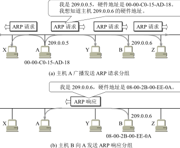

**考纲**

1. 网络层功能：异构网络互联，路由与转发，拥塞控制，**SDN基本概念**
2. **路由算法**：静态路由与动态路由，距离-向量路由算法，链路状态路由算法，层次路由
3. **IPv4**：IPv4分组，IPv4地址与NAT，子网划分、路由聚集、子网掩码、CIDR，ARP/DHCP/ICMP
4. IPv6：IPv6的主要特点，IPv6地址
5. **路由协议**：自治系统，域内路由与域间路由，RIP/OSPF/BGP路由协议
6. IP组播：组播的概念，IP组播地址
7. 移动IP：移动IP的概念，移动IP的通信过程
8. **网络层设备**：路由器的组成和功能，路由表与分组转发

**考点**

- RIP距离向量，IP地址划分及特殊地址，分片/片偏移，子网划分/CIDR/路由聚合，(定长)子网划分/掩码/子网数/主机数，默认网关与子网掩码，ARP功能，ICMP报文类型/上层协议，DHCP报文/工作过程，路由器转发前报文IP地址的修改，
- RIP距离向量，BGP路由协议/上层协议，TTL
- 抑制广播风暴的设备，冲突域与广播域，路由转发表，路由器功能，路由器与交换机

路由算法：5,7

IPv4：2,10,13,15,19,37,41,54

路由协议：9,15

网络层设备：8,9

## 4.1 功能

### 异构网络互联

将异构的物理网络通过IP互联成为一个统一的互联网

异构性：传输介质、数据编码、链路控制协议；主要在物理层、数据链路层

### 路由与转发

动态选择路由，分组转发（数据报）

### 拥塞控制

拥塞状态：随着网络负载的增大，网络的吞吐量明显低于正常吞吐量或下降

### SDN基本概念


## 4.2 路由算法

### 静态路由与动态路由

静态路由：手动配置，优先级最高

动态路由：路由器与相连的路由器交换路由信息，更新与优化

### 距离向量路由

每个节点 x 对集合 S 中所有其它节点 y，估计从 x 到 y 的最小路径开销 D(x, y)。 

节点 x 的距离向量：$D(x)=[D(x,y): y\in S]$​​​​​，是从 x 到 S 中所有其他节点 y 的开销估计向量

节点 x 路由信息：

- x 到每个直连邻居 v 的开销 $c(x,v)$​​
- x 的距离向量 $D(x)=[D(x,y): y\in S]$​​​ 包含了 x 到所有目的地 y 的开销估计值
- x 的每个邻居 v 的距离向量 $D(v)=[D(v,y): y\in S]$ 包含了邻居 v 到所有目的地 y 的开销估计值

节点 x 路由更新：（每个节点定期发送距离向量给邻居）

- 若节点 x 与邻居路径开销变动或收到来自邻居的新距离向量，则将其与自己的距离向量比较，新增或修改。满足关系式：$D(x,y)=min\{c(x,v)+D(v,y)\}\ \text{v: each neighbor of x, }y\in S$​
- 若更新后的距离向量中存在结点 x 到任一目的结点 y 的开销变化，则结点发送距离向量给所有邻居

```pseudocode
function Distance_Vector(x) is:
    for all destinations y in S:
        D(x,y)= c(x,y) /* if y is not a neighbor then c(x,y)= ∞ */
    for each neighbor w of x:
        D(w,y) = ? for all destinations y in S
    for each neighbor w of x:
        send distance-vector D(x) = [D(x,y): y in S] to w
    loop:
        wait (until see a link cost change to some neighbor w or
              until recv a distance-vector from some neighbor w)
        for each y in S:
            D(x,y) = min{c(x,v) + D(v,y)} for each neighbor v of x
        if D(x,y) changed for any destination y then
            send distance-vector D(x) = [D(x,y): y in S] to all neighbors
```

### 链路状态路由

- 发现邻居：路由器启动时，发送hello数据报，对端路由器应答自己信息

- 设置链路开销：路由器设置其与每个邻居结点的距离或路径开销

- 构造链路信息：链路状态发生变化时路由器构造链路信息

- 分发链路信息：使用洪泛法将**相邻链路信息**（带seq+age）发送给相邻路由器

  收到新链路信息的路由器确认并转发给其它相邻路由器

- 计算最短路径：(单源最短路径Dijkstra算法)

  - 根据节点图使用Dijkstra算法，初始集合 S 为结点自己 S={u}，

  - 从邻居结点依次选取到集合内结点 S 路径最小的 w 加入，

  - 若 w 的邻居 v 通过 w 连接节点 u 的路径 < 原先 u 到 v 的路径，则更新 u 到 v 的路径（途径w）

    $D(u,v) = min(D(u,v), D(u,w)+ c(w,v))$

```pseudocode
function Link_State(u) is:
	S = {u} /* 节点子集, 如果从源到v的最低开销路径已确知, 则v加入到S中  */
	for all nodes v
		if a neighbor of u then
			D(v) = cost(u,v)
		else D(v) = oo
	Loop:
		find w not in S such that D(S,w) is a minimum
		add w to S
		for each neighbor v of w and not in S:
			D(u,v) = min(D(u,v), D(u,w)+ c(w,v))
	until S.length == nodes.length
```

### 层次路由

自治系统内部——内部网关协议IGP：RIP，OSPF

不同自治系统间——外部网关协议BGP：BGP

## [4.3 IPv4](https://www.rfc-editor.org/rfc/rfc791.html#section-3.1)

### IPv4分组

#### IPv4分组格式


首部固定位置20B，

version：4bit，IPv4：0101

head-length(4B)：4bit，确定 lP 数据报中载荷实际开始的地方，默认 5=0101，即首部20B

DiffDerv：使用区分服务，可提供不同等级的服务质量，如优先级、低时延、高吞吐量、高可靠性

Total-length(B)：超过MTU=1500B时需分片<u>（小于46B时对应帧在快速以太网中需填充）</u>

16-bit Identifier：标识，每产生一个数据报，计数器加1，将值赋给标识字段；<u>用于分片/重组，源/目的主机捕获数据包时根据该标识可判断是否为同一分组</u>

3-bit Flags：标志，bit[0]=0，bit[1]: DF(Dont't Fragment) 0-允许分片, bit[2]: MF(More Fragment) 0-最后一片

13-bit Fragment-offset(8B)：相对于用户数据字段的起点，该片开始位置

Time-to-live(s)：允许通过的最大路由器数(时间度量)。每经过一个路由器，`TTL-=1`；当 `TTL=0`，表示不可达丢弃（确保分组不在网络中循环）

<u>IP分组经过的路由器数 = 原主机IP分组TTL字段 - 目的主机IP分组TTL字段</u>

Upper-layer protocol：IP 数据报到达目的地时，数据部分应交给哪个运输层协议


Header-checksum：初始化检验和0，反码计算。首部划分为若干16bit作为加数相加，和取反码填入检验和；接收方同样以16bit划分求和，和取反码为0 则保留，否则视为出错丢弃

#### IP数据报分片

> 以太网MTU=1500B，广域网MTU=576B

当IP数据包总长度>MTU，则需对数据部分分片装在多个IP数据报中，片在目的地网络层被重新组装

片偏移(单位量)：`(MTU - headLength) % 8 ? MTU - (MTU - headLength) % 8 : MTU - headLength`（需为8的整数倍！）

分片总数：$\lceil DL / 片偏移(单位量)\rceil$

第 i 个分片的偏移字段：$i · 片偏移(单位量)/8$


#### 网络层转发分组流程

路由表主要的路由信息：（目的网络地址，下一跳地址）


1. 从数据报首部提取目的主机IP地址D，得出目的网络地址N
2. 是否直连，若路由器与网络N直连，则直接交互给目的数据D；否则非直连：
3. 查找静态路由，若路由器有目的地址D的静态路由，则转发；否则为动态路由：
4. 查找动态路由，若路由器有网络N的路由，则转发；否则该路由不存在：
5. 默认，若路由表有一个默认路由，则转发给默认路由器；否则报告转发分组出错

> 在不同网络传送时，MAC帧的源、目的地址发生变化；网桥转发帧时，不改变帧的源地址

### IPv4地址与NAT

#### IPv4地址

两级分类IP地址：网络号, 主机号


特殊IP

<u>网络号全0，主机号全0：本网络本主机，作为**源地址**</u>

网络号全0，特定主机号：本网络特定主机，作为源地址

<u>网络号全1，主机号全1：本网络广播地址，作为目的地址</u>

特定网络号，主机号全0：特定网络，可作为目的地址（路由器根据网络号转发）

特定网络号，主机号全1：特定网络广播地址，可作为目的地址


#### 网络地址转换NAT

私有(专用)IP网段用于LAN

- 1个A类网段：10.0.0.0~10.255.255.255
- 16个B类网段：172.**16**.0.0~172.**31**.255.255
- 256个C类网段：192.168.0.0~192.168.255.255

NAT路由器LAN端——私有IP地址，WAN端——全球唯一地址；

NAT地址后跟端口号：对应一个主机进程 (LAN-ip: lan-port) 与 (WAN-ip: wan-port) 映射

NAT路由器转发IP数据报时，对路由表匹配的表项做LAN与WAN间的 (ipaddr: port) 转换

注：NAT路由器中的地址映射需由管理员手动添加

### 子网划分、子网掩码、无类域间路由CIDR

#### 子网划分

对分类IP划分子网得到三级分类IP地址：网络号, 子网号, 主机号

注：子网划分可减少广播域大小

#### 子网掩码

子网掩码在 主机号与子网号 的对应位取1，主机号对应位取0；

子网地址 = 子网掩码 & IP地址

默认子网掩码：分类的 A、B、C类地址的子网掩码 255.0.0.0，255.255.0.0，255.255.255.0

- 同一子网的所有主机即路由器端口设置同一子网掩码
- 路由表信息：目的网络地址 | 子网掩码 | 下一跳地址

使用子网的路由器分组转发算法：

1. 从数据报首部提取目的IP地址D
2. 直连匹配：将各直连网络子网掩码 & D，若得出子网地址匹配，则直接交互给地址D；否则非直连：
3. 查找静态路由：若路由器有目的地址D的静态路由，则转发；否则为动态路由：
4. 动态路由匹配：将各表项的子网掩码 & D，若得出子网地址与目的网络地址匹配，则转发；否则该路由不存在：
5. 默认：若路由表有一个默认路由，则转发给默认路由器；否则报告转发分组出错

#### 无分类域间路由CIDR

在变长子网掩码基础上消除ABC类网络划分，使用灵活的前缀编址代替网络号

无分类两级IP地址：网络前缀, 主机号

斜线记法：IP地址/网络前缀位数，子网地址 = 前缀位数对应的子网掩码 & IP地址

<u>在分组路由转发中，各表项子网掩码 = FF FF FF FF << (32-前缀长度)，用子网掩码 & 目的IP地址，若前缀长度部分匹配则转发，否则才考虑默认路由</u>

**CIDR 地址块子网划分**：如分配到：{IP地址}/20，需要8个子网（从主机号借3位），每个子网网络前缀 23 位

**路由聚合**：将相同长网络前缀的CIDR地址块合并为短网络前缀的CIDR地址块；使用短网络前缀作为该区域的聚合路由，外边的路由器可减少对该区域的路由信息。路由聚合是子网划分的逆过程


```
net1: addr1/pn, addr1: {prefix}0{0...0} ─┐
net2: addr2/pn, addr2: {prefix}1{0...0} ─┴─ net: addr/(pn-1), {prefix}{00...0}
```


例子中，R1到网络1,2的两条路由聚合为一条：206.1.0.0/16

<u>注：两路由 <ip1/pre1>, <ip2/pre2>聚合时，取共同前缀位，将首个相异位(一个0, 一个1) 及其后面位置 0 作为聚合路由（与pre1, pre2无必然联系）</u>

CIDR地址块子网划分举例：

大学分配到地址块 addr/pn=203.0.68.0/22

根据一系要求，二分借1位作为子网号，addr/23, addr[23]: 0，剩余地址块 addr/23, addr[23]: 1

根据二系要求，剩余二分借1位作为子网号，addr/24, addr[24]: 0，剩余地址块 addr/24, addr[24]: 1

根据三系要求，剩余二分借1位作为子网号，addr/24, addr[25]: 0，剩余给四系 addr/24, addr[25]: 1


**变长前缀编码**：任一子网号编码都不是另一子网号编码的前缀（联想Huffman编码）

此时对 CIDR 地址块不再是平均划分子网，子网号变长前缀编码长度与可分配地址数成反向关系

如：101.200.16.0/20 划分5个子网，则可能的最小子网可分配IP地址数?

```
0001|0000
     10
     110
     1110
     1111
```

**最长前缀匹配**：路由器遇到多个前缀均匹配时，选择具有最长网络前缀的路由（地址块越小越具体）

note：

- 网络号or前缀地址不同，即处于不同网段(络)
- 路由器一般会有多个IP地址，每个端口IP对应其直连的不同网段(络)
- 主机的网关IP必须是直连的路由器端口IP地址，否则无法通过该路由器与其它网段(络)通信
- 交换机可使同一网段(络)的主机之间通信

### ARP、DHCP、ICMP

#### IP地址与MAC地址

- 路由器/主机等设备之间通信，在得知对端IP后，需要通过广播获取对端MAC地址，即端到端通信实际上需要MAC地址才能发送出
- 路由器转发IP分组时，IP分组在每个网络中都被路由器拆帧与装帧

#### 地址解析协议ARP

**ARP表（IP-MAC地址映射）**


IP到MAC地址（A发给对端B）：
- A 在ARP缓存查看是否有 B 的IP地址，若有，则将对应MAC地址写入MAC帧，再发出
 否则 A 或 B 刚入网不知道对方
- A 封装一个(目的IP: B) 的数据报，(目的MAC: FF-FF-FF-FF-FF-FF-FF) 的帧，<u>广播ARP请求</u>
- B 收到ARP请求，发现目的IP地址匹配，向 A <u>单播ARP响应</u>（包含B的IP-MAC地址），并更新自己的 ARP 缓存
 其它主机发现不匹配则忽略
- A 收到 B 的ARP响应，写入 ARP 缓存；将MAC地址写入MAC帧发送给 B

```pseudocode
procedure ARP:
	The source NIC Broadcasts an ARP Request (Layer 2)
	Each NIC on the LAN processes the ARP Request
	if IP address matches NIC’s IP address then
		Destination NIC updates its ARP Table with the original NIC’s information
		NIC forms an ARP Response with its IP address
		NIC send ARP Response to requester NIC
	else
		All other NICs ignore ARP Request
	Source NIC updates its ARP Table
	Source NIC unicasts message to destination MAC
```



#### 动态主机配置协议DHCP

应用层协议：客户端/服务端之间请求/响应

> 在未知客户端IP地址前，客户机/服务器均不能通过 ARP 协议获知 DHCP 服务器地址，只能广播

DHCP服务器聚合DHCP客户端的交换过程：

- DHCP discover：DHCP客户端封装发现报文：UDP-源端口68-目的端口67，<u>IP数据报源IP地址0.0.0.0，目的地址255.255.255.255，广播</u>
- DHCP offer：一或多个DHCP服务器收到发现报文，广播提供报文（推荐的IP、掩码及租用期）
- DHCP request：DHCP客户端选中一个提供报文，广播请求报文以请求该IP
- DHCP ACK：DHCP服务器广播确认报文，完成分配IP


#### [互联网控制报文协议ICMP](https://www.rfc-editor.org/rfc/rfc792.html)

根据ICMP响应报文的类型来确定网络情况或重发


**ICMP差错报告报文**

- 3目的地不可达
- <u>4源站抑制：因拥塞而丢弃数据包时向源点发该报文</u>
- 5改变路由（重定向）
- 11超时：IP分组TTL==0 时，路由器丢弃分组并向源点发超时报文
- 12参数问题：IP首部字段不正确时丢弃数据报并向源点发该报文

应用：traceroute

**ICMP询问报告报文**

- echo 请求0/回答1
- timestamp 请求13/回答14
- infomation 请求15/回答16：找出主机所在的网络号

应用：ping


## 4.4 IPv6

### IPv6特点

### IPv6地址

## 4.5 路由协议

### 自治系统

### 域内路由与域间路由

自治系统内部——内部网关协议IGP：RIP，OSPF

不同自治系统间——外部网关协议BGP：BGP


### 路由信息协议RIP

#### RIP语法/语义

- 距离：从一路由器到直连网络的距离 1，从一路由器到非直连网络的距离为所经过的路由器数加 1

  距离 也称 跳数(hop count)，每经过一个路由器，跳数就加 1

- RIP 限制最长路径 15 跳，距离=16 相当于不可达。

- RIP 报文被<u>**封装在 UDP(port-520)**</u> 报文中

- 更新计时器：<u>RIP进程每隔 30 秒向每个**相邻路由器**广播(v1)或多播(v2)**一个包含完整路由表的报文**</u>

  无效回收计时器：路由条目不更新的保留时间，默认180秒

- 删除路由的原因：超时，距离=16

路由表项：目的网络IP地址 | 子网掩码 | 下一跳地址 | 距离 | 路由变更标识 | 若干计时器

**RIP报文格式**


**RIP特点**

- <u>每个路由器每30s与**相邻路由器交换路由表**信息</u>，n次后最多可知道n跳距离的网络
- <u>RIP以最少跳数衡量距离</u>，不管途径的网络质量
- <u>网络出现故障时，出现慢收敛(需长时间才将此消息传到区域所有路由器)——坏消息传得慢，可能导致回路</u>
- 最大距离15限制了网络规模，收到距离16即为不可达

例：假设R1、R2、R3采用RIP协议交换路由信息，且均已收敛。若R3检测到网络201.1.2.0/25不可达，并向R2通告一次新的距离向量，则R2更新后，其到达该网络的距离是？

```
 R1---┐
a|    |c
 R2---R3--201.1.2.0/25
    b     d
```

R1距离向量(0,1,1,2)，R2距离向量(1,0,1,2)，R3距离向量(1,1,0,1)

R3直连的d网络不可达，R3距离向量(1,1,0,16)，通告R2

R2距离向量(1,0,1,16)，并在30s内收到R1定期发来的距离向量，以最少跳数衡量距离，更新(1,0,1,3)

#### 距离向量算法

```pseudocode
function handle_rip_datagram(datagram) is:
	x = source address of datagram
	table = router cache table
	for each entry in datagram:
		entry.next_hop = x
		entry.dist = entry.dist + 1
	for each entry in datagram:
		exist = table.search(entry.dest)
		if exist is null then
			table.add(entry)
		else if entry.next_hop == exist.next_hop || entry.dist < exist.dist then
			table.update(exist, entry)
```

<details><summary>Bellman-Ford 算法</summary>

```pseudocode
function BellmanFord(list vertices, list edges, vertex src) is
    /* This implementation takes in a graph, represented as
    // lists of vertices (represented as integers [0..n-1]) and edges,
    // fills two arrays (distance and predecessor) holding
    // the shortest path from the source to each vertex */
    dist := list of size n
    predecessor := list of size n
    // Step 1: initialize graph
    for each vertex v in vertices do
        dist[v] := inf 
        predecessor[v] := null	/* And having a null predecessor  */
    dist[src] := 0	/* The distance from the source to itself is zero */
    /* Step 2: relax edges repeatedly */
    repeat |V|−1 times:
         for each edge (u, v) with weight w in edges do
             if dist[u] + w < dist[v] then
                 dist[v] := dist[u] + w
                 predecessor[v] := u
    /* Step 3: check for negative-weight cycles */
    for each edge (u, v) with weight w in edges do
        if dist[u] + w < dist[v] then
            error "Graph contains a negative-weight cycle"
    return dist, predecessor
```
</details>

### 开放最短路径优先OSPF

#### OSPF协议特点

- OSPF 链路度量(代价) 综合考虑网络时延、距离、带宽等

- 初始化/链路状态变化时，使用**洪泛法向自治系统所有路由器发信息**

  即相邻路由器收到后予以确认，并向其他路由器继续发送；更新收敛快

- 发送的信息是**相邻路由器的链路状态**，没有“坏消息传播得慢”的问题

- 多路径间**负载平衡**：若到同一个目的网络有多条相同代价的路径，则可将通信量分配

- 每隔30分钟，要刷新一次数据库中的链路状态

**OSPF协议格式**

- OSPF 报文被<u>**封装在 IP(protocol-89) 数据报**</u>中，数据报短，无需分片，避免丢失重传
- OSPF 路由器之间能对交换的分组进行**鉴别**，保证可靠交换
- 每个链路状态都带上一个 32 位的**序号**，序号越大状态就越新


**OSPF 区域层次结构**

主干区域：包括主干路由器、区域边界路由器，用来连通其他在下层的区域。标识符 0.0.0.0


#### OSPF 的 5 类分组

- HELLO：发现所有的邻居，每10s发一次，若路由器在40s内未收到某个邻居发的hello包，则认定它不可达
- DATABASE DESCRIPTION：主设备发送链路状态数据库 LSDB 给从设备
- LINK STATE REQUEST：路由器对另一台路由器发 LSR 消息，请求有关 LSDB 的更新信息
- LINK STATE UPDATE：由路由器定期广播或多播，作为对链路状态请求 LSR 的响应
- LINK STATE ACK：对收到的链路状态更新 LSU 的确认

### 边界网关协议BGP

#### BGP 协议特点

- 采用**路径-向量路由选择**，力求寻找一条能到达目的网络的较好路由（非最佳）
- 仅在自治系统的BGP发言人（边界路由器）之间交换信息
- 初始运行时，与邻居交换整个路由表；之后只在发生变化时更新有变化的部分，以节省带宽及减少开销


**BGP 协议格式**

<u>BGP为应用层协议，报文被封装在TCP报文中</u>


#### BGP 4种报文

- OPEN：与相邻的另一个 BGP 发言人建立关系
- UPDATE：通告某一路由的信息，以及列出要撤销的多条路由
- KEEPALIVE：周期性地证实邻站的连通性
- NOTIFICATION：发送检测到的差错

**三种协议比较**


## 4.6 IP组播

### 组播概念

### IP组播地址

本地组播地址：

- 224.0.0.1：LAN 上的全部系统
- 224.0.0.2：LAN 上的全部路由器
- 224.0.0.5：LAN 上的全部 OSPF 路由器
- 224.0.0.251：LAN 上的全部 DNS 服务器

### ICMP与组播路由算法

## 4.7 移动IP

### 概念

### 通信过程

## 4.8 网络层设备

### 路由器组成与功能


组成：交换结构、一组输入端口（拆）、一组输出端口（重组）

交换结构

- 经内存交换
- 经总线交换
- 经互联网络交换


功能：

- 路由计算：根据由其它路由器发来的路由信息更新路由表
- 分组转发：队列及任务调度，查表转发

<u>注：路由器监测到拥塞时合理丢弃IP分组，对IP分组头部进行差错校验，若差错则丢弃</u>

特点：

- 直接交付：源/目的连在同一网络；间接交互：源/目的不在同一网络，按路由转发表转发
- 实现了多层协议，可连接不同LAN，不同WAN，LAN与WAN；路由器互联、隔离广播域

### 路由表与路由转发

简化的路由表项：目的网络IP地址 | 子网掩码 | 下一跳地址 | 接口

默认路由：设置为默认转发端口（一表一个默认），**目的网络IP地址及子网掩码设置 0.0.0.0**


