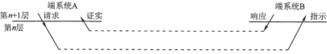

**考纲**

计算机网络概述：概念/组成/功能，分类，性能指标

计算机网络体系结构与模型：分层结构，协议/接口/服务概念，ISO/OSI参考模型与TCP/IP模型

**真题考点：**

网络体系结构，OSI参考模型各层功能及实现，OSI参考模型数据传输效率，TCP/IP模型，协议三要素

**错题**：

体系结构与模型：1,2,3,14,20,28

## 1.1 计算机网络概述

### 概述

由不同位置的多台自治计算机，遵循统一网络协议，实现互联与资源共享

### 组成

从实体分：

- 硬件：主机，通信处理机（网卡），通信链路（有线/无线），交换设备（路由器/交换机）
- 协议：网络传输数据时各层数据格式规范
- 软件：根据协议为用户提供的网络编程接口及网络应用

从分布分：

- 边缘网络：终端直连网络或为终端提供连接的接入网络。目的：资源共享

  小到无线接入耳机，大到当地的ISP大型机

- 核心网络：由大量通信链路、交换设备组成，目的：为边缘网络提供连通与交换

从功能分：

- 资源子网：服务机及服务软件、服务设备的集合，功能：提供共享资源
- 通信子网：由传输介质、通信设备、网络协议组成，功能：数据传输、交换、控制与存储，实现计算机之间通信

### 功能

- 数据通信：最基本
- 资源共享
- 分布式处理与负载均衡
- 提供可靠性：备用的链路与服务

### 分类

按拓扑结构分：

- 总线型：通过总线连接将终端串联。缺点：任意端点对故障敏感
- 星型：终端通过单独线路与中心设备连接。缺点：中心设备对故障敏感
- 环型：所有终端设备连接成一个环，如令牌环局域网，环中信号单向传输
- 网状型：每个节点至少有两条路径与其它结点相连，多用在广域网。优点：可靠性高

按交换技术分：

- 电路交换网络：源节点与目的节点间有一条专用通路用于传送数据。三阶段：建立连接-传输数据-断开连接（如传统电话网络）
- 报文交换网络：报文：目的地址+源地址+数据+校验码。也称存储-转发网络：报文转发给相邻交换节点，节点存储后查找转发表，转发给下一节点
- 分组交换网络：也称包交换网络。将数据分成较短长度的数据块，对每个数据块封装报文再存储-转发。特点：<u>平均延迟减小</u>

按分布范围分：<u>广域网WAN（点对点协议）</u>，城域网MAN，<u>局域网LAN（广播协议）</u>

按传输技术分：广播网络，点对点p2p网络

按传输介质分：有线网络（金属导体/光纤），无线网络（蓝牙/wifi/无线电）

按使用者分：公用网、私用（专用）网络

### 性能指标

#### 带宽

- 通信线路中表示允许通过的信号频率范围，单位Hz；
- 计算机网络中表示通信线路数字信道能传输的最高数据传输率，单位bit/s

#### 时延

报文/分组从链路一段传送到另一端所需总时间。

总时延 = 发送/传输时延 + 传播时延 [+ 处理时延 + 排队时延]

- 发送/传输时延 = 分组长度 / 信道宽度，$T_t=Data/Bandwidth$​
- 传播时延 = 信道长度 / 电磁波在信道上的传播速率，$T_p=distance/speed$
- 处理时延：数据在交换结点为存储转发而进行的必要处理时间（分析分组首部/提取数据/差错检验/查找路由）
- 排队转发时延：分组在路由器输入队列等待处理、输出队列<u>等待转发</u>的时间


<u>注：一个大文件被分成若干分组从一端发送至另一端，中间经过 n 个转发结点，</u>

<u>则时延包括：数据到线路上的传输时延，最后分组的全线路传播时延，最后分组经中间 n 个节点的处理时延、转发时延</u>

#### 时延带宽积

发送端从发出一个比特到它到达终点前，这段时间内发送端已发出的比特数

时延带宽积 = 传播时延 * 信道带宽（即信道可容纳的比特数）


#### 往返时延RTT

从发送端发完数据开始—到发送端收到来自接收端的确认 经历的时延

RTT = 2 * 传播时延（忽略处理时延）

#### 吞吐量

单位时间通过某个网络/信道/接口的数据量。受网络带宽限制

#### 数据率

主机在数字信道上传送数据的速率，也称比特率。单位：b/s, bit/s, bps

#### 信道利用率

信道有多少比例的时间有数据通过。信道利用率越高，信道/网络利用率急剧增大（拥塞）

信道利用率 = 1 - 网络空闲时延 / 当前时延

## 1.2 体系结构与模型

### 分层结构

对等实体：不同机器上的同一层实体（可发送/接收信息的硬件/软件进程）

各层报文：控制信息 + 数据

协议数据单元PDU：对等层次之间传送的数据单位。

服务数据单元SDU：该层报文数据

协议控制信息PCI：该层协议控制操作信息

- 本层PDU = 本层PCI + 上一层SDU
- 发送数据：接收上一层PDU作为本层SDU，封装当前层PCI，组成本层PDU向下传递
- 接受数据：接收下一层SDU作为本层PDU，去掉当前层PCI，剩下本层SDU向上传递


### 协议、接口、服务

#### 协议

协议：控制<u>**两个对等实体**</u>进行通信的规则集合。如：请求/传播/响应的规则

- 语法：数据与控制信息的结构/格式（如何讲）。如：交换的信息格式

- 语义：需要发出何种控制信息，完成何种动作/应答（讲什么）。如：数据何时必须重传或丢弃

- 同步：动作实现的<u>时序</u>规定（信息交流的次序）。

  

<u>注：本层及本层以下协议须相同，本层以上协议可不同</u>

**网络协议举例**

端系统拥塞控制协议：控制发送方与接收方之间传输分组发送的速率

硬件协议：控制网卡间比特流

路由器协议：决定了分组从源到目的地的路径

#### 接口

一个节点内相邻两层间交换信息的逻辑连接点，服务访问点SAP

#### 服务

<u>本层使用下一层提供的服务实现本层协议，并能向上一层提供服务</u>。

OSI参考模型4个服务原语：

```
user	Request->		server
user	<-Indication	server
user	Response->		server
user	<-Confirmation	server
```



**协议、接口、服务三者关系**


**服务分类**

- 连接/无连接服务，TCP连接，UDP无连接
- 可靠/不可靠服务，可靠：纠错/检错/应答机制，正确送到目的地。不可靠：可靠性由应用来保障
- 应答/无应答服务，文件传输服务应答，WWW服务客户端不应答


### OSI参考模型与TCP/IP模型

### OSI参考模型


#### 物理层

传输单位：比特bit

实现硬件：<u>集线器Hub</u>，中继器

物理层协议定义了终端设备与通信设备的物理与逻辑连接方法，也称物理层接口标准。

- 电路接口参数，如机械属性（网口）
- 信号意义与电气特征

协议：EIA-232C

#### 数据链路层

传输单位：帧

实现硬件：<u>交换机</u>，网桥

功能：帧定界与同步(顺序完整)，物理寻址，差错控制，流量控制

协议：PPP，HDLC

#### 网络层

传输单位：数据报

实现硬件：<u>路由器</u>

功能：路由选择，拥塞控制，差错控制，流量控制

协议：ARP，RARP，IP，ICMP，IGMP，OSPF

#### 传输层

传输单位：报文段（TCP），用户数据报（UDP）

实体：主机进程

功能：端到端可靠传输，差错控制，流量控制

协议：TCP，UDP

#### 会话层

会话层定义了会话的周期与<u>数据同步</u>（使用校验点使通信会话在失效时从校验点恢复通信）

#### 表示层

表示层定义了数据编码格式，数据压缩，加密/解密

#### 应用层

协议：FTP，SMTP，POP3，Telnet，HTTP

### TCP/IP模型


可靠性是端到端的问题

#### 网际层

网际层 IP 协议是互联网的核心协议，无连接

#### 传输层

TCP：面向连接，可靠交付

UDP：无连接，不可靠，尽最大努力交付

#### OSI与TCP/IP模型对比

| OSI参考模型                            | TCP/IP模型                               |
| -------------------------------------- | ---------------------------------------- |
| 服务、接口、协议                       | 接口、协议                               |
| 模型产生在协议提出之前                 | 模型产生在协议提出之后                   |
| 7层                                    | 4层                                      |
| 网络层：连接与无连接<br />传输层：连接 | 网络层：无连接<br />传输层：连接与无连接 |
