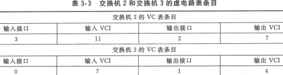
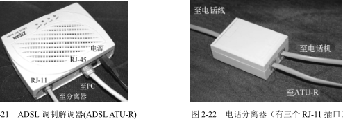

**考纲**

通信基础：信道/信号/宽带/码元/波特/速率/信源/信宿，奈奎斯特/香农定理，编码/调制，电路/交换/分组交换

传输介质：双绞线/同轴电缆/光纤/无线传输介质，物理层接口的特性

物理层设备：中继器，集线器

**真题考点**

10BaseT网卡协议及其编码，奈奎斯特定理/香农定理数据传输率，相位调制PM/相位+振幅QAM调制的链路波特率，信道数据传输速率影响因素，4种编码方式，报文交换/分组交换数据传输时间计算，虚电路，物理层接口规范/特性

**错题**

通信：7,8,10,15,22,23,25,37,38,39

传输介质：3,4,10

物理层设备：1,3,7

## 2.1 通信基础

### 概念

信号：数据的电气或电磁的表现。如：信号在双绞线中被视为其两根电线之间的电压差

信号分类：模拟信号（连续），数字信号（离散）

码元：一个脉冲信号，不同波形可代表不同离散数值。若用k进制编码，携带 $log_2k$​ bit 的码元可表示k个状态值


<u>如图：(a).1码元可有2种状态，(b).1码元可有4种状态</u>

基带信号：来自信源（终端发出）的信号。其往往包含有较多的低频成分，无线电波的频带信道并不能传输这种低频分量。故必须对基带信号进行调制(modulation)

**速率**

- 码元传输率：又称波特率，表示单位时间内信道传输的码元（脉冲或信号）个数。单位：Baud

- 数据传输率：又称比特率，表示单位时间内信道传输的比特数。单位：bit/s, bps

  数据传输率 = 码元传输率 $\times\ log_2k$​，（码元用 k 进制编码​）

<u>注：信道传输速率指--终端将数据传输到信道的速率，信道传播速率指--数据在信道上传播的速率。</u>

<u>影响信道传输速率的因素：信噪比、频率带宽、调制速率</u>

**通信交互方式**

- 单向：如：广播
- 半双工：双向交替发送或接收。如：单轨铁路
- 全双工：双方同时发送与接收

### 信道的极限数据率

#### <u>奈奎斯特定理</u>

**采样定理**

模数转换时，原始模拟信号最大频率 $f$​​​，采样频率 $f_采\ge 2f \Rightarrow$​​​​​ 采样后的数字信号能保留原始模拟信号信息

**奈奎斯特定理**

前提：理想低通信道（无噪声、带宽有限）

码元极限传输率 = 2 * 信道带宽，$B=2W$，W：理想低通信道带宽Hz

信道极限数据传输率（容量）$C = Blog_2k=2Wlog_2k\le 2f log_2k\le f_采 log_2k$​​​，k：量化级数(码元状态数)​

<u>注：若已知 $f_采$，则解调采样过程所需的数据传输率 $f_采log_2k$</u> 

#### <u>香农定理</u>

信道极限数据传输率（容量）$C = W log_2(1 + S/N)$​​，W：信道带宽Hz

信噪比：信号平均功率 / 噪声平均功率 $=S/N=10^{(dB)/10}$​​

信噪比的分贝数度量：$(dB)=10log_{10}(S/N)$​​​​

例：标准音频电话线支持的典型频率范围为300~3300Hz，信道带宽是3kHz。假设一个典型的信噪比为30dB，S/N=1000。则：$C=3000log_2(1001)\approx 30kbps$

- 信道带宽、信噪比越大，信道极限数据传输率越大

- 对于给定的信道带宽与信噪比，信道数据传输率上限确定；

  反过来根据奈奎斯特定理，一个码元携带的bit数是有限的

### 编码与调制

调制分类：

- <u>基带调制</u>：仅对基带信号的波形进行变换，使它能与信道特性相适应，变换后仍是基带信号（另一种形式的数字信号），也称编码。
- <u>带通(频带)调制</u>：使用载波(carrier)进行调制，把基带信号的频率范围移到较高的频段，并转换为模拟信号。经载波调制后的信号称为带通信号。

#### 数字—数字信号(编码)


- 不归零NRZ：正电平代表 1，负电平代表 0。不能从信号波形中提取信号时钟频率（没有自同步能力）

- 不归零反转NRZI：脉冲跳变代表 1，脉冲保持不变代表 0。（长串的0仍会产生时钟恢复问题）

- 曼彻斯特编码：位周期中心向上跳变代表 0，位周期中心向下跳变代表 1。<u>以太网使用该编码</u>

  <u>2码元可有2种状态，即2码元对应 $log_22$ =1bit，数据传输率 = 1/2 码元率(波特率)</u>

- 差分曼彻斯特编码：位开始边界有跳变代表0，位开始边界没有跳变代表 1

#### 数字信号—模拟信号(调制)

应用 Fourier 分析，离散的数字方波信号可调制为连续的模拟信号（三角函数）


- 幅移键控ASK：即调幅，载波的振幅随基带数字信号而变化。例如，0,1 分别对应无载波、有载波

- 频移键控FSK：即调频，载波的频率随基带数字信号而变化。例如，0,1 分别对应频率 f1,f2

- 相移键控PSK：即调相，载波的初始相位随基带数字信号而变化。例如，2进制 0,1两状态对应相位 0, 180度，称：2-PSK（2相位调制）

  正交相移键控QPSK：使用4个偏移：45, 135, 225, or 315 degrees. 称：4-PSK（一个码元传输2bit）

- 正交振幅调制QAM：振幅相位混合调制。如：3种振幅，各4,8,4相位 16-QAM（一个码元传输4bit）


#### 模拟信号—数字信号(编码)

<u>脉冲编码调制PCM技术</u>

- 采样：$f_采\ge 2f_{max}$​，确保采样的离散信号能不失真保留原始模拟信号
- 量化：把采样的电平值按一定分级标度转化为整数字
- 编码：把量化的整数转为二进制编码

####多路复用

##### 时分复用TDM

例：将1路模拟信号编码为数字信号后，和另外7路数字信号采用同步TDM方式复用到一条通信线路上。该路模拟信号的频率变化范围为0～1kHz，每个采样值使用PCM方式编码为4位的二进制数，7路数字信号的数据传输速率均为7.2 Kbps。复用线路需要的最小通信速率？

解：由 $f_采\ge 2f_{max}$ 知1路采样频率至多2kHz，1路数据传输率 2kHz\*4bit=8kbps。复用线路单位时间被划分多路，需满足多路同时先后在里面传输，所以需要 8\*8kbps 


##### 统计时分复用STDM

##### 频分复用FDM

##### 正交频分复用OFDM

##### 码分复用CDM

##### 波分复用WDM

### 电路、报文、分组交换

#### 电路交换

两结点间建立专用独占通信链路，实时有序传输。三阶段：建立连接、传输、释放连接

缺点：建立连接时间长，突发传送数字信号时线路利用率低，结点间故障容错率低，难以规格化及差错控制

应用：电话链路

#### 报文交换

报文：源地址 | 目的地址 | 数据

可随时发送报文，交换结点使用存储转发，动态分配线路（可靠、利用率高），可多播

缺点：<u>**存储转发报文需较大时延(交换结点转发传输)**</u>，报文大小不可知带来的缓冲空间问题

应用：早期电报通信

#### 分组交换

分组：源地址 | 目的地址 | 编号 | 分组数据

类似报文交换，但限制了传送数据块大小上限，将数据分成若干固定大小、带编号的数据块；减少重传数据量、<u>减少传输时延</u>

缺点：多了分组后控制信息量及到达后编号排序开销，实时性略差


例：在如图所示的采用“存储—转发”方式的分组交换网络中，所有链路的数据传输速率为100Mbit/s，分组大小为1000B，其中分组头大小为20B。若主机H1向主机H2发送一个大小为980000B的文件，则在不考虑分组拆装时间和传播延迟的情况下，从H1发送开始到H2接收完为止，需要的时间至少是?


```
H1---[Switch]---[Switch]---H2
80ms     0.08ms     0.08ms
```

例：主机甲通过1个路由器（存储转发方式）与主机乙互联，两段链路的数据传输速率均为10Mbps，主机甲分别采用报文交换和分组大小为10kb的分组交换向主机乙发送1个大小为8Mb (1M=10^6) 的报文。若忽略链路传播延迟、分组头开销和分组拆装时间，则两种交换方式完成该报文传输所需的总时间分别为?

```
800ms     800ms   
A---[Switch]---B
800ms     1ms
```

<u>注：一个大文件被分成若干报文/分组从一端发送至另一端，中间经过 n 个转发结点，</u>

<u>则时延包括：数据到线路上的传输时延，最后报文/分组的全线路传播时延，最后报文/分组经中间 n 个节点的处理时延、转发时延</u>

### 数据报与虚电路

<u>分组交换</u>包括数据报、虚电路

#### 数据报（无连接）

路由转发表：目的地址 | 端口

- 可随时发送/接收分组
- <u>网络尽最大努力交付，不保证可靠性及有序到达</u>（可靠性/流量控制由用户主机决定）
- 交换结点缓冲可能存在拥塞而丢弃分组
- <u>网络存在的冗余路径使其对故障的适应能力强</u>

#### 虚电路（连接）

三阶段：虚电路建立（呼叫请求/应答）、传输、虚电路释放（释放请求/应答）

虚电路路由表：输入端口 | 输入虚电路标识 | 输出端口 | 输出虚电路标识（每条链路对应一个输出虚电路标识）

表项语义：如果分组在指定的输入端口到达且首部包含指定的输入VCI，那么先将这个分组的首部VCI替换成指定的输出VCI并将分组发送到指定的输出端口。

虚电路建立：<u>主机A发送建立消息，主机B发送应答确认消息</u>；每一个交换节点需要知道它的下游相邻节点为此连接使用的VCI值，在输出端口分配VCI值（对应上游链路）





特点：

- <u>提供可靠通信，能保证每个分组正确有序到达，可对数据端点进行流量控制</u>
- 建立连接存在至少一个RTT的延迟
- 对长时间频繁的数据交换效率较高
- <u>虚电路中出现故障即失效</u>，需撤销并重新建立连接

应用：早期的 X.25网络


## 2.2 传输介质

### 电缆、光纤、无线

屏蔽层：抗电磁干扰

#### 双绞线TP

双绞线可以在没有放大的情况下运行几公里，但<u>对于更长的距离，信号衰减，需要中继器</u>。


商用建筑物电信布线标准 EIA/TIA-568，用于室内传送数据的无屏蔽双绞线UTP和屏蔽双绞线STP的标准

”Category 5e“ 5类线：由4对双绞线套在一个塑料保护套内


#### 同轴电缆Coax

特点：<u>高屏蔽性</u>、抗噪声性

基带同轴电缆：主要传送基带数字信号。应用于局域网(以太网)

宽带同轴电缆：主要传送宽带数字信号。应用于有线电视接入


#### 光纤Fiber-Optics

光纤传递光脉冲来进行通信。有光脉冲相当于 1，没有光脉冲相当于 0。可见光频率 $10^8MHz$​

在发送端，采用发光二极管或半导体激光器在电脉冲的作用下能产生出光脉冲。

在接收端，利用光电二极管做成光检测器，在检测到光脉冲时可还原出电脉冲。

传输原理：包层较纤芯有较低的折射率，当光线从高折射率的介质射向低折射率的介质时，折射角将大于入射角。因此，如果入射角足够大，就会出现全反射，光线碰到包层时会折射回纤芯……

多模光纤：一条光纤传输多个不同入射角的光线

单模光纤：光纤直径减小到一个光的波长，光纤如波导一直向前传播


#### 无线电波

可传输很长距离，且是全方向传播，容易穿透建筑物；但存在路径损耗及干扰


#### 微波、红外线与激光

发送方与接收方之间需存在一条视线通路，都沿直线传播

### 物理层接口特性

- 机械特性：指明外观、引脚
- 电气特性：指明电压范围、电线
- 功能特性：指明某<u>电平电压的意义</u>
- 规程特性：指明<u>事件时序</u>

**物理层标准**

同步光网络SONET/SDH

- 定义了标准光信号，规定了激光源的波长
- 定义了同步传输的线路速率等级结构
- 在物理层定义了帧结构

非对称数字用户线ADSL

用数字技术对现有的模拟电话用户线进行改造，使它能够承载宽带数字业务。ADSL技术把低频谱留给传统电话使用，而把原来没有被利用的高端频谱留给用户上网使用。

- ADSL 的下行（从 ISP 到用户）带宽都远远大于上行（从用户到 ISP）带宽，即“非对称"

- ADSL 在用户线（铜线）的两端各安装一个 ADSL 调制解调器，在用户端通过分离器分离话音/数字信号




## 2.3 物理层设备

### 中继器

将衰减的数字信号整形+再生转发，以消除信号失真与衰减。

中继线属于直通式设备，两端使用同一物理层协议，无存储定向转发功能

注：放大器是放大模拟信号

### 集线器Hub

即多端口中继器

- 物理上为星形，逻辑上为总线结构
- 多个端口属于同一冲突域，所有主机竞争访问同一条链路，一个周期只能传输（广播）一组信息，半双工通信；端口带宽被分配


<u>注：1. 传统以太网采用广播发送信息，同一时间仅允许一台主机发送，否则会形成冲突，主机间半双工通信。</u>

<u>2. 两个网段在物理层互联时需要数据传输率相同（上层协议可不同）</u>
