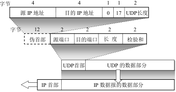
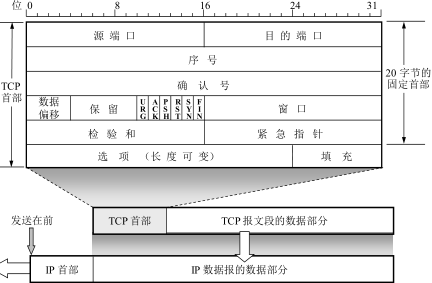
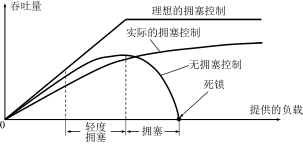
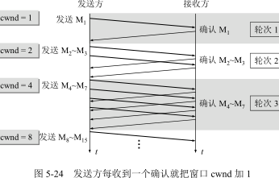

**考纲**

1. 传输层提供的服务：传输层功能/寻址/端口，无连接/面向连接服务
2. UDP：UDP数据报/校验
3. TCP：TCP段，TCP连接管理，TCP可靠传输，TCP流量控制与拥塞控制

**真题考点**

- UDP协议 分用
- TCP协议/进程端口，连接状态位，拥塞窗口/发送窗口/接收窗口，RTT时间，可发送最大字节，序号/确认号，快重传，三次握手确认序号，四次握手FIN序号

## 5.1 传输层服务

### 功能

- 传输层提供主机端到端的逻辑通信（socket）

- 复用：发送方传输层对每个不同socket数据封装首部，生成报文段

  分用：接收方传输层提取报文段的数据根据目的端口定向到不同的socket，并交给上层进程

- 差错检测、流量/拥塞控制


**简单传输服务原语**


**TCP套接字原语**


### 寻址与端口

#### 端口

端口：传输层服务访问点TSAP，作为进程通信点

#### 端口号

端口号：主机应用进程处于网络通信时的标识

报文中的端口号字段 16bit，大小 $2^{16}=65536$

- 服务端端口号：熟知端口号 0~1023，登记端口号 1024~49151
- 客户端端口号：临时端口号 49152~65536，由系统为客户端进程临时分配并在结束时回收

#### socket

$socket = (ipaddr:port)$​ 唯一标识网络一台主机及一个应用进程

### 无连接与连接服务

- 面向连接TCP：全双工可靠逻辑信道（对应网络层虚电路），应用层协议：HTTP/FTP/TELNET
- 无连接UDP：不可靠逻辑信道，应用层协议：DNS/SNMP/TFTP/RTP

## 5.2 用户数据报协议UDP

### UDP数据报

#### UDP 概述

- 基本服务：服用、分用、差错检测
- 无连接，实时性高
- UDP 报文长度取决于应用进程

#### UDP首部格式

- 源端口：在需要对方回信时选用。不需要时可用全 0

- 目的端口：在终点交付报文时必须使用（分用）。若收到目的端口不存在就丢弃，并由 ICMP 发送“端口不可达”差错报文

- 长度：UDP 用户数据报的长度，最小长度 8（仅有首部）

- 检验和：检测 UDP 用户数据报在传输中是否有错，有错就丢弃。加上临时伪首部后计算

  伪首部：含UDP及IP信息，协议号 17



### UDP校验

先构造一个临时的 UDP 用户数据报：UDP 首部前增加 12B 伪首部（仅计算检验和时用）

初始检验和0，临时报文以16bit划分，二进制求和取反码

接收方将 UDP 用户数据报连同伪首部一起，二进制求和取反码；结果1正确，否则丢弃

> IP 数据报检验首部，TCP/UDP 检验首部和数据


## 5.3 传输控制协议TCP

### TCP特点

- 面向连接，无差错可靠交付
- 全双工通信，两端各设置发送/接收缓存，各保持两个方向上的传输数据序号
- TCP 报文长度取决于接收方给出的窗口值 win 和网络拥塞窗口值
- 面向字节流，传输数据序号以字节为单位

### TCP报文段



源/目的端口：各 16bit，通过端口实现分用

- seq-n(B)：32bit，发送的本报文段数据部分第一字节序号。

  当以设置标志位作为发送信息主体时，需消耗一个 seq 号（下一报文seq+1）

- ack-n(B)：32bit，期望收到对方下一个报文段的第一个数据字节的序号，说明前 n-1 个序号字节已收到

- header-length(4B)：4bit，首部最大15*4B

- URG：紧急指针有效

- ACK：确认序号有效1，无效0。

  连接建立后的所有数据报文 ACK 标志都设置 1（发起连接 & 发起终止时不用）

  当报文段检验和出错，需要重复确认

- PSH：接收方应该尽快将这个报文段交给应用进程，而不再等到缓存填满了再交付

- RST：重置连接。如异常关闭时释放连接

- SYN：同步序号用来发起连接。主动请求连接 SYN=1，被动接受连接 SYN=1, ACK=1 

- FIN：发端完成发送任务。主动关闭连接 FIN=1，被动关闭连接 FIN=1, ACK=1 

- recv-win(B)：16bit，告知对方：从本报文段首部中的 ack-n 算起，允许对方发送的数据(B)。发送方根据接收窗口设置其发送窗口

- checksum：16bit，检验首部和数据。初始0，报文加上伪首部后以16bit划分，二进制求和取反码

  伪首部：含TCP及IP信息，协议号 6

- URG-data-pointer(B)：16bit，URG=1 时有效，为正偏移，(seq+它) 指出紧急数据的最后一字节序号

- options：常见的可选字段：最大报文段长度 MSS（数据段）。每个连接方在通信的第一个报文段（设置 SYN 建立连接）中指明 MSS

### TCP连接管理

TCP连接建立的要求：

- 允许双方协商参数（最大窗口值 / 是否使用窗口扩大 / 时间戳 / 服务质量）
- 能分配传输所需的实体资源（缓存）

#### TCP连接建立


| 端     | 状态        | 报文首部                       |
| ------ | ----------- | ---------------------------- |
|server|LISTEN||
| client | SYN-SENT    | SYN=1, seq=x                 |
| server | SYN-RECVD   | SYN=1, ACK=1, seq=y, ack=x+1 |
| client | ESTABLISHED | ACK=1, seq=x+1, ack=y+1      |
| server | ESTABLISHED |  |

#### TCP连接释放


最长报文段寿命 MSL：一般为 2 分钟

| 端     | 状态       | 报文首部                       | 说明 |
| ------ | ---------- | -------------------------------- | |
| client | FIN-WAIT   | FIN=1, seq=x                     | |
| server | CLOSE-WAIT | ACK=1, seq=y, ack=x+1            | client 收到后TCP半关闭 |
|(server)||| (send final data if it has) |
| server | LAST-ACK | FIN=1, ACK=1, seq=z=y+n, ack=x+1 | |
| client | TIME-WAIT | ACK=1, seq=x+1, ack=z+1          | client 发送后等待2MSL |
| server<br/>client | CLOSED |  | |

### TCP可靠传输

#### 序号

- 应用层传来的每个数据字节对应一个序号，保证接收方能收到有序的数据
- 报文段首部的序号 seq 对应数据部分第一字节

#### 确认

- 发送方发出后缓存未收到确认的报文段，等待计时器
- 接收方收到后使用累计+捎带确认，期望收到发送方下一报文段数据的第一字节序号 ack-n

#### 重传

- 超时：对已发出的数据缓存并设置计时器，超时未收到确认则重传

  超时重传时间 RTO >= 加权平均往返时间 $RTT_S$​（随新测量 RTT 样本值变化而变化）

- 冗余ACK：接收方若收到失序报文，则丢弃并重复发送 ack-n

  发送方在超时之前若收到接收方发的冗余ACK，表示已发生丢包，立即重传数据报文（快重传）

### TCP流量控制

流量控制：使用滑动窗口协议协调发送方发送速率，以避免接收端缓存区溢出

- 接收端根据接收缓存大小，在报文中设置接收窗口 rwnd；让发送端调整其发送窗口大小

- 发送端根据 rwnd 及 网络拥塞程度对应的窗口值 cwnd 确定自己的发送窗口 $swnd \le min(rwnd,cwnd)$

利用窗口控制：

- 窗口起始于确认序号 ack-n 指向的字节，也是接收端正期望接收的字节

  接收窗口终止于确认序号 ack-(n+rwnd) 指向的前一字节

- 收到窗口最后一字节后，发送端/接收端不再发送/接收新数据

  若窗口内有数据未收到，发送方应适时重传


> 数据链路层滑动窗口协议的窗口大小不能动态变化，而传输层的可动态变化

### TCP拥塞控制

拥塞：对网络中某一资源的需求超过了该资源所能提供的可用部分，网络吞吐量将随输入负荷的增大而下降。​

拥塞表现：

- 到达接收结点的分组因结点缓存耗尽无法暂存而不得不被**丢弃**，发送方对该报文的计时器**超时**
- 处理机处理速率太慢可能引起网络拥塞
- 拥塞引起的重传并不会缓解网络的拥塞，反而会加剧网络的拥塞

拥塞控制的作用



发送端调节发送速率的原则

- 收到 ACK 表明源到目的地路径无拥塞，报文段丢失意味着拥塞
- 当收到先前未确认报文段的确认时，发送方能增加发送速率
- 带宽探测：TCP 增加其传输速率以响应到达的 ACK，直到出现丢包事件，此时才减小传输速率 

**TCP 拥塞控制算法**：慢启动，拥塞避免，快重传与快恢复 

- 接收窗口 rwnd：接收端根据当前接收缓存大小设置的窗口值（在报文首部设置）
- 拥塞窗口 cwnd：发送端根据网络的拥塞程度维护的拥塞窗口变量
- 发送窗口 swnd：发送端设置的缓存大小窗口值，$swnd \le min(rwnd,cwnd)$​
  - If cwnd < rwnd,  是网络的拥塞程度限制发送方窗口上限
  - If cwnd > rwnd,  是接收方的接收能力限制发送方窗口上限

#### 慢开始与拥塞避免

> 此处分析假设：数据单向传送，对方只传送确认报文；接收方缓存空间足够大，发送窗口大小由网络的拥塞程度决定。$rwnd=\infty, swnd=cwnd$

##### 慢开始

初始拥塞窗口与发送方最大报文段 SMSS：（SMSS 越大，初始 cwnd 越小）

- 若 SMSS > 2190 B，则初始拥塞窗口 cwnd = 2 × SMSS (B)，不超过 2 个报文段。
- 若 (SMSS > 1095 B) && (SMSS ≤ 2190 B)，则初始拥塞窗口 cwnd = 3 × SMSS (B)，不超过 3 个报文段。
- 若 SMSS ≤ 1095 B，则初始拥塞窗口 cwnd = 4 × SMSS (B)，不超过 4 个报文段。

慢开始：发送端由小到大逐渐增大发送窗口

- **每收到一个新的确认**，拥塞窗口可增加一个 SMSS。

  $cwnd = cwnd + min(unAcked, SMSS)$​

- 每经过一个传输轮次（连续发送出并且都接收），拥塞窗口 cwnd 就加倍（指数）​​

  ````pseudocode
  n = cwnd/SMSS 
  while(n--):
  	send segment 
  	cwnd += SMSS
  /* new-cwnd = 2 * old-cwnd */
  ````



##### 拥塞避免

为防止拥塞窗口 cwnd 增长过大引起网络拥塞，需设置慢开始门限 $ssthresh < cwnd$

- 当 cwnd < ssthresh 时，使用慢开始算法。
- 当 cwnd = ssthresh 时，使用慢开始 或 拥塞避免算法。
- 当 cwnd > ssthresh 时，停止使用慢开始，改用拥塞避免算法。

拥塞避免：

- 从慢开始门限 ssthresh 开始，**每经过一个传输轮次**，发送端拥塞窗口 cwnd 加 1个MSS（线性）

  $cwnd = cwnd + SMSS$​​​

- 当出现拥塞（超时），调整门限值 $ssthresh = cwnd/2$，重置拥塞窗口 $cwnd=1$


#### 快重传与快恢复

> $拥塞\rightarrow 发送端计时器超时$，但超时并不一定都是拥塞。如：个别报文段在网络中丢失。

（图中4：发送端若误认为网络发生了拥塞，错误启动慢开始，把 cwnd 又设置 1，则会降低传输效率）

##### 快重传

- 接收方不使用捎带确认，而是**立即发送确认**，即使收到了失序的报文段也要立即发出重复确认；

  以便发送方尽早知道发生了个别报文段的丢失

- 发送方只要一连收到 3 个重复 ack-n，就知道接收方确实没收到该报文段，应**立即重传**

  以避免超时而误认为出现拥塞


##### 快恢复

发送方在知道个别报文段丢失后，不启动慢开始，而是执行快恢复算法：

快恢复：发送方调整门限值 $ssthresh = cwnd / 2$，设置拥塞窗口 $cwnd = ssthresh$，并开始执行拥塞避免算法（图中4-5-）

#### 拥塞控制流程


