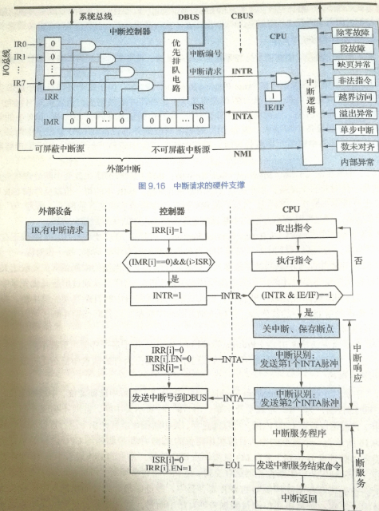

# 6. 总线与I/O系统

**考纲**

总线：基本概念、组成及性能指标，总线事务与定时

IO接口(控制器)：IO接口功能/基本结构，IO端口及其编址

IO方式：程序查询、程序中断方式，中断概念/响应/处理过程，多重中断和中断屏蔽概念，DMA方式，DMA控制器组成/传送过程

**真题考点**

- 系统数据总线可能传输的信号类型，并行总线 总线周期/时钟周期/总线时钟频率，

  同步总线 时钟频率 总线宽度 时钟周期 突发传输k位数据所需时间，

  同步总线 总线时钟频率 单时钟传输次数 总线带宽(数据传输率)，存储总线工作频率/带宽；总线事务方式，总线定时 异步通信（全互锁/非互锁）同步通信（同步时钟信号）半同步通信（握手信号的采样控制），并行总线与串行总线，信号线复用技术，分离事务通信，多总线结构，可提高同步总线数据传输率的措施；全双工同步串行总线 单时钟传输次数 总线带宽

- 能引起外部中断的事件，单级中断系统 中断服务程序内执行顺序，五级中断 中断屏蔽字 中断响应优先级 中断处理程序设置的中断屏蔽字，程序定时查询IO CPU用于设备IO的时间占CPU时间百分比，设备中断请求的响应/处理时间 中断请求间隔 占CPU时间百分比，响应外部中断的中断隐指令操作，多重中断系统，中断IO与DMA，中断开销占CPU时间百分比，中断IO控制输出 CPU与设备接口的IO端口间交换的信息，外部IO中断，DMA控制，自陷trap，外部中断事件，外部中断 不可屏蔽中断 可屏蔽中断 

  DMA 周期挪用 磁盘IO接口每秒发出的DMA请求次数，DMA控制器与CPU同时请求存储器总线时的优先级

  异步串行通信 通信规程 传送一个字符需传输位数 中断方式IO CPU完成读取任务所需时钟周期数 CPU用于完成任务的时钟周期数 CPU在中断响应阶段的操作

**补充**：图片数据比特数 = 总像素 * 颜色深度(颜色位数) = 总像素 * log2(总颜色数)

**错题**

总线：1,10,11,12,17,23 | 22,23,24,24,25

总线定时：6,7 | 2,6

IO接口：1,10,11 | 1

IO方式：5,10,12,13,15,18,19,20,26,30,31,44 | 

## 6.1 总线

### 概念

定义：一组能为多部件分时、共享的公共信息传送线路

设备：主设备（CPU，DMA控制器），从设备（主存）

特性：机械特性，电气特性，功能特性，时序特性

### 分类(按位置)

#### 片内总线

芯片内部，寄存器，ALU之间；如：AMBA，Wishbone(开源)

#### 系统总线

CPU，主存，IO接口之间。如：QPI、HT总线

传输模式：同步串行传输

外频：主板工作频率

CPU频率 = 外频 x 倍频，修改其一可实现超频

系统总线频率：DDR(外频的2倍)，QDR(外频的4倍)

- 控制总线(单向)：传输微命令信号、异步定时总线握手/应答信号

  读/写主存、IO读写、传输应答、总线请求/许可/正忙、中断请求/响应、时钟/复位信号

- 地址总线(单向)：CPU选择主存单元地址或IO端口地址

- 数据总线(双向)：传输泛指的数据，如读/写主存的数据、中断应答信号INTR

注：间址寻址首次访存的地址数据通过数据总线传

##### QPI总线

基于包传输的串行点对点全双工协议。QPI总线有20条数据线，发送/接收方有各自时钟信号，每个时钟周期传2次。QPI传输频率 = QPI 时钟频率 * 2（2路并行通路）

一个QPI数据包80bit，需要2个时钟周期（4次传输）才能传送整个包，每次传输20bit 有16bit有效数据（每次传2B，编码效率16/20）

QPI总线带宽 = QPI传输频率 * 每次传输有效数据2B * 2（双向）


##### 系统总线结构

单总线

双总线：一组主存总线（CPU - 主存 - 通道之间），一组IO总线（外设 - 通道之间）

三总线：主存总线，**DMA总线**，IO总线

使用总线结构变化：增设外设，减少了信息传输线数；但对于专线结构，降低了信息传输并行性和速度

#### IO总线

连接中低速设备，通过桥接器与高速总线相连接

如：PCI总线、连接磁盘的SATA总线，(E)ISA总线

#### 通信总线

RS-232C/RS485串行，IEEE-488并行，USB，IEEE1394，eSATA

### 总线复用技术

一套线缆分时传送不同类型or阶段的数据。<u>减少线的数量 节省成本，并没有提高传输率！</u>

如：PCI 地址总线与数据总线共用一组线，DRAM芯片行列地址线复用

### 总线信息传送

#### 并行总线

同时传输多位，对应需要多个独立传输线；一般用在CPU内部

缺点：随着传输频率越来越高，易引起线间串扰（传输数据无法恢复）

#### 串行总线

逐位按顺序以脉冲方式传送，一次传输1位。

##### 按传送方向分

单工：单线单向

半双工：单线双向

全双工：双线，各线单向(相反)，双向带宽为单向的两倍

##### 按定时方式分

**同步串行**：双方采用统一时钟，多个字节组成一个信息帧，帧首用同步字符表示开始，帧尾用结束字符表示开始（类似HDLC帧），信息帧还包含CRC帧校验序列

```
|01111110|...byte...|CRC-FCS|01111110|
```

**异步串行**：双方有各自时钟，按约定苏联发送和接受数据，利用信息帧的起/停信号实现数据同步。按字符传输，一个信息帧传输一个字符，长度固定

```
stop                                   stop 
---┐   ┌---┐       ┌-----------┐       ┌---┐
   ↓   | 1 | 0   0 | 1   1   1 | 0   0 |   ↓
   └---┘   └-------┘           └-------┘   └---
   start                            校验    start
```

如：RS-232C、RS-485串行总线

单向带宽 (b/s) = 总线时钟频率 * 编码效率 * 并发通路数

### 性能指标

总线传输周期，包括4阶段，即4个总线时钟周期

总线工作频率：同步传输总线中 传输双方拥有完全同步的时钟信号，独立于CPU时钟

总线宽度：<u>数据总线</u>根数，在并行总线中决定可并发传输位数

总线带宽：单位时间内总线最大传输数据字节数(B/s)， 

总线带宽 (B/s) = 总线时钟频率 * 并发通路数(单时钟传输次数) * 总线宽度 / 8，全双工(双向线路) * 2

## 6.2 总线事务和定时

### 总线传输4阶段

- 申请分配：<u>主设备申请</u>，总线控制器决定将下一传输周期总线使用权授予某一申请者
- 寻址阶段：获得使用权的<u>主设备发送从设备地址及操作命令</u>到总线，启动从设备
- 传输阶段：主从设备数据传输，通常一次只能传输一个字长数据
- 结束阶段：<u>主设备撤销</u>总线请求，让出总线控制权

#### 总线事务

总线上一对主从设备之间一次信息交换过程，一般由 <u>一个寻址阶段+一个传输阶段</u> 组成

如：存储器读、写，IO读、写，中断响应，DMA响应

#### 突发传送事务(成组传送事务)

由 <u>一个寻址阶段+多个传输阶段</u> 组成。寻址阶段发送连续数据单元的首地址，数据传输阶段传输多个字，直到一组信息全部传送完毕再释放总线

### 同步定时

采用<u>统一时钟信号</u>来协调发送和接收双方的传送定时

特点：传输速度快；但总线频率取决于最慢的设备，传输距离长时存在同步误差，可靠性差

适用：总线长度短，各部件存取时间接近的系统

### 半同步定时

以读为例，在同步存储器读时序的基础上引入一个等待信号wait，<u>存储器</u>未准备好数据时，<u>将wait信号置位</u>，插入等待周期；<u>主设备检测到wait信号消失时才取走数据</u>

### 异步定时

没有统一时钟，依靠传输双方相互制约的 <u>**握手信号**</u> 来实现定时控制。主设备发"请求"信号，从设备发"回答"信号

特点：不同速率设备之间可以通信；但比同步控制复杂，增加了握手应答时间

#### 不互锁(1次握手)

主设备发请求，不等从设备回答，一段时间后撤销请求信号；从设备接收到请求发回答，一段时间后撤销回答信号

#### 半互锁(2次握手)

主设备发请求，必须 <u>在得知从设备回答后才撤销请求</u>信号；从设备接收到请求发回答，一段时间后撤销回答信号

主设备发请求，从设备收到请求发回答，主设备收到应答撤销请求

#### 全互锁(3次握手)

主设备发请求，必须 <u>在得知从设备回答后**发**撤销请求</u>信号；从设备接收到请求发回答，必须 <u>在得知主设备撤销请求</u>信号后才撤销回答信号

主设备发请求，从设备收到请求发回答，主设备收到应答 <u>**发**撤销请求</u>，从设备受到撤销请求撤销应答

 

### 分离事务

主设备发请求，从设备应答后 <u>主设备立即释放总线控制权</u>；

从设备准备数据的时候 <u>总线处理其他总线事务</u>；

<u>从设备准备好</u> 数据后将 <u>作为主设备重新申请</u> 使用总线并放置数据；

原主设备接收数据。------提高总线利用率

## ~~总线标准~~

### 片内总线

AMBA：高级微控制器总线架构 Wishbone：开源并行总线标准

### 系统总线

ISA工业标准架构：数据线16位，地址线24位，总线时钟频率8.3MHz，带宽16MB/s，单系统总线结构

EISA扩展的ISA：32位数据线/地址线，总线带宽33MB/s，兼容ISA

VESA视频电子标准协会：32位，作为局部总线（双总线时代）

PCI外部设备互联：32/64位高速局部总线，不同总线之间通过桥芯片转接，与CPU无关，采用总线复用技术减少引脚数，采用同步并行传输，时钟频率33/66MHz，最大数据传输率133/266MB/s

HT超传输：AMD推出的CPU高速串行总线，点对点，全双工，支持DDR技术，支持32路串行并发 QPI快速通道互联：Intel推出，代替前端总线技术，基于包传输高速串行同步点对点连接，全双工，一个方向42根线

### IO总线

AGP加速图形接口：显卡专用局部总线，基于PCI2.1扩充，点对点，DDR技术，最大数据传输率533MB/s

PCI-Express：高速<u>串行</u>扩展总线，替代PCI和AGP；点对点，热插拔，支持多通路并发，如PCIe*8

IDE集成驱动电路：磁盘驱动器接口类型，主板连接硬盘/光驱，被SATA取代

SCSI小型计算机系统接口：连接智能设备（硬盘，软驱，光驱，打印机），支持同步/异步传输，热插拔

SATA串行高级技术附件：串行硬件驱动器接口，点对点，接口简单，线缆少，热插拔

### 设备总线

RS-232C：串行通信总线

USB通用串行总线：连接外设的IO设备总线，热插拔，可通过USB集线器扩展至127个设备；USB3.0总线带宽500MB/s

### 局部总线

VESA，PCI，AGP，采用局部总线技术作用是节省系统总带宽

## 6.3 IO接口(控制器)


### IO接口功能

地址译码/设备选择， 

数据交互，数据缓存(协调不同速率)

信号格式转换：电平/串并/数模转换

命令控制，状态检测

### IO接口结构

#### 与总线的接口

与系统总线并行传送

数据缓冲寄存器DBR，命令/状态寄存器DCR/DSR，存储器RAM(非必须如显存)，<u>通过数据线与CPU双向传输</u>

<u>地址译码(地址线)，控制逻辑(控制线)，由CPU单向传输给IO接口</u>

#### 与设备的接口

若干个设备接口连接外设，串行


### IO端口及其编址

IO端口：接口中可被CPU直接访问的寄存器，控制(写)/状态(读)/数据端口。 

接口 = 若干端口 + 控制逻辑电路

IO指令实现的数据传送：通用寄存器---IO端口(寄存器)

#### IO端口编址

对IO设备端口(寄存器)地址的映射

统一编址(内存映射)：统一访存指令访问IO端口，<u>预留地址码与主存区分</u>，执行速度较慢 

独立编址(IO映射)：CPU设置专门的输入/输出指令访问端口，独立的地址空间

[Memory-Mapped I/O](http://www.cs.uwm.edu/classes/cs315/Bacon/Lecture/HTML/ch14s03.html)


## 6.4 IO方式

### 程序查询

程序查询：CPU执行程序，通过读取设备接口中的状态寄存器查询是否就绪，决定数据传送或等待（忙等或定时查询）

特点：CPU与外设串行工作，浪费时间查询等待，数据经CPU寄存器送往内存

### 程序中断方式


#### 中断概念

##### 内部异常

发生在CPU内部，通常由CPU执行指令引起；可预测性，可再现性

- 故障Fault：非法操作码/溢出/除0/缺页/缺段/校验
- 自陷Trap：断点/系统调用(访管)/条件自陷
- 终止Abort：如线路故障、掉电。非指令产生（随机）

特点：异常的检测由CPU自身完成

注：浮点数下溢当做机器0处理，无需中断

##### 异步外部中断

本质上是电信号。与CPU/主存无关，<u>由外设产生，并施加到CPU的 `INTR` (可屏蔽)或 `NMI` (不可屏蔽)引脚</u>，不可预测。CPU在每条指令执行结束时主动检测是否有中断请求（由中断控制器接收并发送给CPU）

如：IO传送中断(键盘/打印机)，外部信号中断(按esc)，<u>定时器</u>引起的时钟中断。 

- 可屏蔽(INTR)，可设置屏蔽字改变处理优先级，关中断 `IF=0` 时不会被响应。一般为IO
- 不可屏蔽(NMI)，优先级最高，<u>关中断 `IF=0` 时也需响应</u>。<u>如外部掉电故障（非IO）</u>

中断过程：CPU启动外设后将当前进程放入等待队列，当外设准备就绪向CPU发中断请求，CPU适时响应，暂停正在执行程序并调用相应中断服务程序，由它唤醒等待进程

特点：外部中断需要通过总线传递标识信号通知CPU，以便CPU知道中断源；

CPU与外设并行，但每传送一次数据就中断一次，中断服务存在保护/恢复现场开销

##### 中断响应优先级

<u>访管 > 外部</u>，硬件中断 > 软件中断，

高速设备 > 低速设备，DMA中断 > IO设备中断，输入设备 > 输出设备，

不可屏蔽中断 > 内部异常 > 可屏蔽，重启优先级最低(等其他任务完成)

##### 中断处理优先级与屏蔽

处理优先级：中断嵌套中的实际处理优先级，可通过设置屏蔽字动态调整，从而使低响应优先级中断请求 可中断 高响应优先级中断请求。

中断屏蔽寄存器IMR的每一位对应一个设备中断源，1-屏蔽对应设备中断源请求，0-未屏蔽

中断屏蔽字：中断屏蔽寄存器IMR的所有位

CPU可为每个设备分配不同中断屏蔽字

- CPU<u>按照中断响应优先级执行某设备的中断服务程序</u>
- CPU清除该设备中断请求，<u>载入该设备中断屏蔽字</u>到 IMR
- CPU比较该屏蔽字中对其它中断源的屏蔽位，<u>若1则屏蔽，若0则会正常送到优先级排队电路</u>；即未被屏蔽的中断请求继续按固定的响应优先级先后次序被处理

#### 中断请求

对每个中断源设置中断请求标记触发器INTR（可屏蔽中断）

IO/DMA操作结束时会产生中断请求

**硬件组成**

中断请求寄存器IRR，中断屏蔽寄存器IMR，中断优先级排队电路PR，，中断服务寄存器ISR，中断请求标识触发器INTR（状态1-中断源有请求），中断允许触发器IE/IF



#### 中断响应

##### 中断响应条件

中断源有中断请求，CPU允许中断/开中断 `IE=1`，<u>一条指令执行阶段完毕</u>（响应时机）

##### <u>中断响应(中断隐指令)</u>

(指令执行完毕时)关中断 `IE=0`

保存断点：<u>PC, PSW</u> 到内存堆栈或特殊寄存器

根据中断号取出中断服务程序入口地址给PC（中断识别）

##### <u>中断向量</u>

中断向量：中断服务程序的入口地址、程序状态字

中断向量地址：存中断服务程序的入口地址的单元地址

#### 中断处理

##### 单级中断处理

- (<u>硬件</u>隐指令) 中断响应：关中断 `IE=0`，<u>保存断点 PC, PSW</u>，根据中断号取出中断服务程序入口地址给PC

- 保护现场，将（会被中断服务程序改写的）(通用)寄存器值压入内存栈

- 中断服务

- 恢复现场，内存中的寄存器值出栈

- (<u>硬件</u>隐指令) 开中断 `IE=1`，CPU可以接受新的中断请求

- 中断返回，将保存的断点恢复到PC、PSW

##### 多级中断处理

- (<u>硬件</u>隐指令) 中断响应：关中断 `IE=0`，<u>保存断点 PC, PSW</u>，根据中断号取出中断服务程序入口地址给PC

- 保护现场，寄存器值压入内存栈；<u>保存当前还在服务的中断屏蔽字 ISR 入栈，并设置当前中断服务程序的屏蔽字 IMR</u>
- <u>开中断 `IE=1`，能被更高优先级的中断请求中断</u>
- 中断服务
- <u>关中断 `IE=0`，准备恢复现场之前不能再被中断</u>
- 恢复现场，内存中的寄存器值出栈；<u>恢复前一个服务的中断屏蔽字ISR</u>
- <u>发送中断结束EOI，清除中断服务寄存器 ISR 最高优先级的中断位(刚结束的中断源)</u>
- 开中断 `IE=1`，CPU可以接受新的中断请求
- 中断返回，将保存的断点恢复到PC、PSW


- 每秒传输需 12.5k次中断/s，每次中断需 1000T时钟周期/s 处理，占比 = $(12.5k·1000)/1G$
- 每传输一次需 1/12.5k (s)，即1G/12.5k时钟周期，占比 = $1000/(1G/12.5k)$

### DMA方式

由DMA控制器(DMAC)接管CPU系统总线，控制设备与内存之间数据交换（不经CPU寄存器中转） 

特点：CPU与外设并行，消除CPU寄存器中转开销

#### DMA控制器组成

主存地址计数器，传送长度计数器

DMA请求触发器(IO设备准备好数据后置位)，数据缓冲寄存器

控制/状态逻辑，中断机构(传送完毕触发，向CPU提中断请求)

#### 解决内存争用的传送方式

IO与CPU同时访存时可能发生冲突

- 停止CPU访存：DMAC访问内存期间，CPU停止访存

- DMA与CPU交替访存，总线使用权分时控制，适用于CPU工作周期>主存存取周期

  一个CPU周期划分为两部分，使CPU、DMAC交替访存；但给DMA时间可能被浪费

- 存取周期挪用：当DMAC需要访存时，CPU在指令任一机器周期结束后让出总线控制器，暂停一个<u>存取周期供DMAC访存，一个数据字传送完后立即释放总线控制权**(单字传送)**</u>；<u>CPU可继续访存</u>

  只要DMA请求，CPU适时检测到即让出总线权 --- <u>周期挪用使DMA对总线权的优先级更高</u>


#### 传送过程

- 预处理：CPU初始化DMA(执行参数)，CPU初始化启动IO设备
- 数据传送：IO设备准备数据，IO设备向DMA控制器发DMA请求，DMA控制器向CPU发总线请求，总线仲裁与授权，DMA数据传输，<u>再次发出DMA请求直至数据传输完</u>
- 后处理：DMA向CPU发中断请求，CPU<u>执行中断服务程序</u>校验


#### DMA与中断方式对比

- 功能：中断方式具有对异常事件的处理能力，DMA仅限于传送数据IO操作
- 响应时机：中断响应发生在指令执行完毕时，<u>DMA响应发生在一个机器周期(指令任一阶段)结束时</u>
- 请求：中断请求CPU时间，DMA请求总线控制权
- 请求优先级：DMA > 中断
- 数据传送，<u>中断通过CPU执行程序传送</u>(需保护/恢复现场)，DMA硬件传送，除预处理/后处理外不占用CPU(不改变现场，<u>传送过程无中断请求</u>)

## ~~IO系统与设备~~

### IO系统

IO软件：与系统无关的IO库，与设备无关的系统调用，设备驱动程序

IO硬件：外部设备，设备控制器和接口，IO总线

### IO控制方式

低速-程序查询：程序不断查询IO设备是否已准备， 

低速-程序中断：IO设备准备就绪时向CPU发中断请求

高速-DMA：主存与IO无需调用中断服务程序， 

高速-通道：通道控制部件连外设，通道执行通道程序完成IO

### IO指令

IN/OUT，属于系统指令，格式与通用指令格式不同

### IO设备

#### 显示器

屏幕大小：对角线长度

分辨率：水平像素\*垂直像素

灰度级：黑白显示器像素点亮暗差别，彩色显示器颜色层次(8位-256级)，位数-刷新存储器单元字长

刷新频率：单位时间内扫描整个屏幕内容的次数。>30Hz不感到闪烁，通常60-120Hz 显存

VRAM：VRAM容量=分辨率\*灰度级位数/8，VRAM带宽=分辨率\*灰度级位数/8\*刷新频率

##### 阴极射线管CRT显示器

字符显示器：以点阵为基础，ASCII码存在VRAM中

图形显示器：将图形的一组坐标点和绘图命令组成显示文件，由矢量(线段)发生器产生相应模拟电压，控制电子束在屏幕上移动。显示复杂图形会有闪烁感

##### 液晶显示器LCD

利用液晶的电光效应，由图像信号电压直接控制薄膜晶体管，在电场作用下改变液晶晶体分子的排列，使液晶具有透光性

##### LED发光二极管显示器

控制半导体发光二极管来显示，已基本代替LCD

#### 打印机

击打式、非击打式；针式打印机，喷墨式打印机，激光打印机

#### 磁盘

##### 组成

盘片、磁盘驱动器(磁头)、磁盘控制器(磁盘与主机的接口，IDE/SCSI/SATA标准) 1盘片-2记录面，1记录面-若干磁道，1磁道-若干扇区

磁头数：记录面数，一个盘片两个记录面对应两个磁头 柱面数：每面盘片上的磁道数

##### 记录原理

磁头与磁记录面相对移动时，电磁转换完成读写操作

##### 性能指标

磁盘容量

- 非格式化容量：磁记录表明可利用的磁化单元总数

- 格式化容量：按特定记录格式所能存储信息的容量，比非格式化容量小

记录密度：道密度，位密度，面密度

平均存取时间 = 控制器延时 + 寻道时间 + 旋转延迟(旋转一周时间/2) + 传输时间

≈ $t_{寻道}+1/(2r)$

一个扇区的传输时间 = 一个扇区的旋转延迟

数据传输率：D = 磁盘转速r * 每条磁道容量N

##### 地址

驱动器号 \| 柱面(磁道)号 \| 盘面(磁头)号 \| 扇区号

##### 工作过程

取控制字，执行控制字（寻址，读盘写盘），读写串行

扇区(记录)是磁盘的最小地址单位

#### 磁盘阵列

RAID0：无冗余和无校验的磁盘阵列，多磁盘交叉并行读写，但无容错

RAID1：镜像磁盘阵列，两磁盘同时读写，互为备份，两盘当一盘用

RAID2：采用纠错的海明码磁盘阵列

RAID3：位交叉奇偶校验

RAID4：块交叉奇偶校验

RAID5：无独立校验的奇偶校验

多磁盘并行-提高数据吞吐量，镜像-提高可靠性，奇偶校验-提供容错能力
