# 5. CPU

**考纲**

CPU 的功能和基本结构

指令执行过程

**数据通路的功能和基本结构**（应用题）

控制器的功能和工作原理：硬布线控制器，微程序控制器（微程序、微指令和微命令，微指令格式，微
命令的编码方式，微地址的形成方式）

**异常和中断机制**：异常和中断的基本概念、分类、检测与响应

**指令流水线**：指令流水线的基本概念、基本实现，**结构/数据/控制冒险的处理**，超标量和动态流水线的基本概念（应用题）

**多处理器基本概念**：SISD/SIMD/MIMD/向量处理器的基本概念，硬件多线程的基本概念，多核处理器(nwlli-core)的基本概念，共享内存多处理器(SMP)的基本概念

**真题考点**：

- 对程序员可见的寄存器，指令字长与存储字长与程序计数器最小位数，减法指令执行后的CF/OF标志

- 区分存储器中的指令与数据的依据，开中断状态的指令周期内部

- 单周期处理器，数据通路结构

  指令不同阶段每个节拍(时钟周期)的功能及控制信号，控制信号位数/控制的部件/作用，数据通路端点连线

- 微程序/硬布线控制器特点区别，微程序控制 微指令 字段直接编码 微命令 互斥类 操作控制字段，微程序 微指令 断定法（下地址字段法）下地址字段位数，主存MM与控制存储器CS，处理器时钟脉冲信号的形成/宽度、时钟周期、时钟脉冲与指令执行，指令操作数 寄存器寻址/寄存器间接寻址 取数/执行中用到的部件

- 4级指令流水线(考虑/不考虑寄存器时延)CPU周期，指令流水线<u>阻塞因素</u>，超标量流水线特性，4级指令流水线 吞吐率，5段指令流水线 存在<u>数据冒险</u>的指令，指令流水线数据通路，CPI=1的处理器类型，

  5段流水线 按序发射/按序完成 未采用转发技术处理数据相关 同一寄存器读写周期分离 执行k条指令(未阻塞)所需时钟周期数，不同指令不同阶段阻塞的原因，程序代码赋值语句的(汇编)指令序列、流水线各周期执行过程

  汇编/机器代码 add/load/bne 相对寻址 bne 转移目标地址计算公式，按序发散/按序完成5级流水线 分支指令引起k个时钟周期阻塞 哪条指令会 <u>控制冒险 数据冒险</u>，指令流水线-cache流水线 Cache数据区容量 指令Cache命中率，可能发生溢出/缺页异常的指令，访问数组需要读磁盘/TLB次数

## 5.1 CPU功能与结构

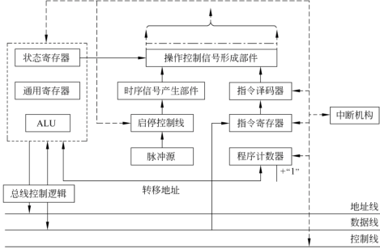

### 功能

指令控制，操作控制，时间控制，数据加工，中断处理

### 结构

#### 控制器

功能：取指，译码并产生操作控制信号，执行指令

程序计数器 PC：默认在取指阶段结束更新

指令寄存器 IR：位数取决于指令字长

指令译码器 ID 

地址寄存器 AR，数据寄存器 DR 

微操作信号发生器

#### 运算器

算数逻辑单元 ALU

暂存寄存器

累加寄存器 ACC

通用寄存器组：AX，BX，CX，DX，SP

程序状态字寄存器 PSW：表征程序运行状态 CF，OF，SF，ZF

移位器

计数器CT

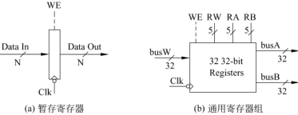

**用户可见寄存器**：通用寄存器组，程序状态字寄存器 PSW，程序计数器 PC

## 5.2 指令执行过程

时钟周期：时钟脉冲信号的宽度，以相邻状态单元间组合逻辑电路的最大延迟为基准确定

**早期计算机的三级时序系统**

机器周期：通过一次总线事务访问一次主存或 IO 的时间；即指令每个功能阶段的基本操作时间，包含不同的时钟周期。如：存储器读周期有送地址、发读命令、检测数据是否准备、取数据等。

一个机器周期划分成若干节拍，一个动作在一个节拍内完成。

一个节拍设置一或多个工作脉冲，如：在一个节拍内某个寄存器内容送到另一寄存器（设置先后两个脉冲）

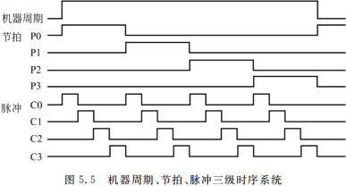

### 指令周期

包含若干个功能阶段，每个功能阶段由若干个时钟周期组成

取指，(间址，取数)，执行，(写回，中断)

### 指令周期数据流

#### 取值周期
```
PC->MAR->地址总线->M
CU-(read)->控制总线->M
M->数据总线->MDR->IR
CU->PC+1个指令长(或转移)
```
#### 间址周期

解析指令，取操作数据
```
Ad(IR)->MAR->地址线->M
CU-(read)->控制线->M
M->数据线->MDR
```
#### 执行周期

指令字根据操作码产生控制信号，(若有)将操作数送往 ALU 计算结果

#### 中断周期

在指令的执行周期完成后，若有中断请求会进入中断周期，需将程序断点存入堆栈（栈顶指针SP）

```
CU->SP-1
SP->MAR->地址线->M
CU-(write)->控制线->M(程序断点存入主存)
CU-(中断服务程序入口地址)->PC
```

## 5.3 数据通路功能与结构

### 数据通路

各子系统通过数据总线连接形成的数据传送路径。包括：PC, ALU, 通用寄存器组，取指部件(不包括控制部件)

功能：实现寄存器之间，运算器与寄存器之间的数据交换

#### 现代计算机的时钟信号

一个数据通路中的定时信号就是时钟，一个时钟周期就是一个节拍

数据通路基本结构：状态单元存储信息，操作单元从状态单元接收输入，并在时钟跳变(下降沿)时触发，将输出写入状态单元

```
—>状态单元—>操作元件(组合电路)—>状态单元—>
```

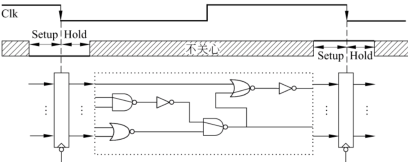

### 结构

#### 内部单总线数据通路

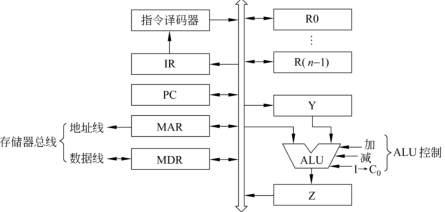

一个时钟周期内只能有一个寄存器向总线传送数据（三态门控制）

ALU一输入端连接总线，另一输入端通过暂存器连接总线，`操作数暂存器Y->ALU->结果暂存器Z`

一个时钟周期只允许一个基本操作，不适用单周期处理器

##### 通用寄存器之间传送数据

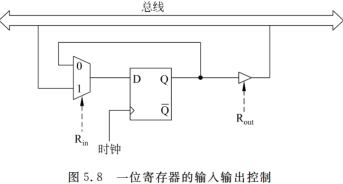

##### ALU中算术/逻辑运算

```
R[R3]<-R[R1]+R[R2]
R1out,	Yin
R2out,	add,	(Zin)
Zout,	R3in
```

ALU操作控制信号的定时

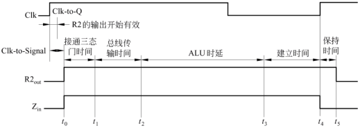

##### 从内存读取一个字(指令/数据/数据地址)

```
R[R2]<-M[R[R1]]
R1out,	MARin
read,	MDRin
MDRout,	R2in
```

##### 将一个字(数据)写入主存

```
M[R[R2]]<-R[R1]
R1out,	MDRin
R2out,	MARin
write
```

#### 内部多总线数据通路

寄存器输入输出端都连接到多条总线上

三总线数据通路：允许两个寄存器同时输出到两条总线上

如：指令 `op R1, R2, R3` 功能 `R[R3]<-R[R1] op R[R2]` 最少可在一个时钟周期完成

```
R1outA,	R2outB,	op,	R3inC
```

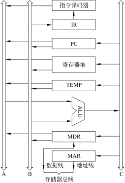


#### 专用数据通路

根据指令执行过程中的数据/地址流动方向连接线路。

特点：结构复杂，性能高，基本不存在数据冲突

#### 数据传送 (上图为例)

寄存器之间：传指令地址 

```
PCout,	MARin
```

CPU与主存之间：取指

````
PCout,	MARin,	MRead,	MDRin
MDRout,	IRin
````

取数执行运算

````
IRout,	MARin,	MRead,	MDRin
MDRout,	Yin
Yout,	ALUin
ALUout,	Zin
````

### 单周期处理器

CPI=1 取所有指令最大执行时间(一般是读写)作为时钟周期，一个指令(时钟)周期内控制操作信号不变

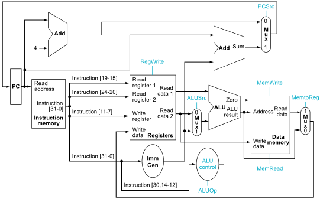

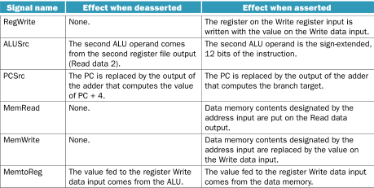

包含控制单元的数据通路

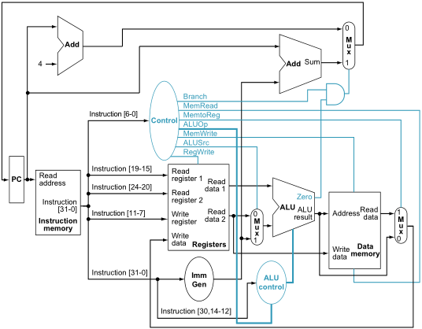

控制单元的输入是来自指令的7bit操作码

输出：控制多路复用器 ALUSrc, MemtoReg，控制寄存器/内存读写 RegWrite, MemRead, MemWrite，控制是否分支 Branch，控制ALU：ALUOp

### 多周期处理器

不同类型指令有不同功能阶段，每个阶段对应一个时钟周期； 到下一个阶段(时钟周期)时控制器会发出不同信号

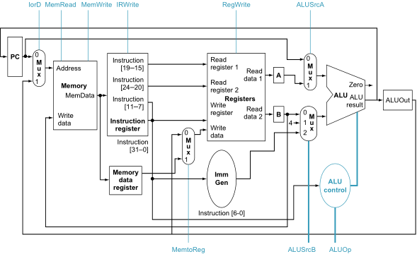

包含控制单元的数据通路

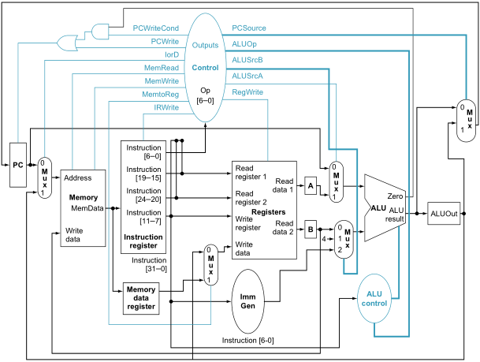

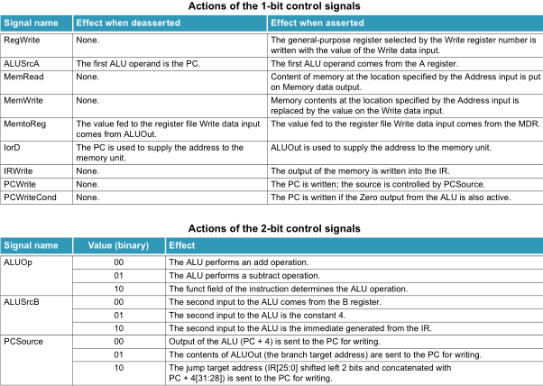

有限状态机描述：由当前状态和操作码确定下一状态，每来一个时钟发生一次状态改变，不同状态输出不同控制信号值，再送到数据通路来控制指令执行

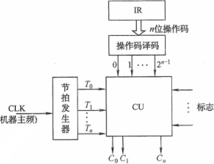

使用组合逻辑控制器 / PLA控制器 / 硬布线控制器、微程序描述

### 流水线处理器

每个时钟周期启动一条指令，一轮指令周期后（理想情况下）每个阶段对应的触发寄存器都有上一阶段过来的数据（多指令并行）

## 5.4 控制器功能与工作原理

**功能**

- 取指，更新PC
- 指令译码+测试，产生操作控制信号
- 控制CPU，主存，IO设备间的数据流动

### 硬布线控制器(组合逻辑电路)

#### 硬布线控制单元


输入信号：

操作码译码：`IR->ID->CU`

时序发生器：`CLK->时序/节拍发生器->CU`

执行部件/总线的反馈信号：`B1...Bj->CU`

#### 硬布线时序系统及微操作命令

**时钟周期**：用时钟信号控制节拍发生器产生节拍，其对应的宽度

**机器周期**：所有指令执行过程中的一个基准时间，通常以存取周期作为基准时间，即读取一个指令字的最短时间。一个机器周期可完成多个微操作。（若 存储字长 == 指令字长，则 取指周期 = 机器周期）

**微操作控制信号**：$C_n=∑_{(i,j,k,m)} 状态周期i · 节拍电位j · 指令操作码k · 反馈信号m$

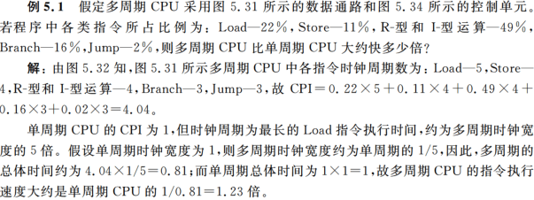

### 微程序控制器

#### 基本概念

##### 微命令

控制部件向执行部件发出的各种控制命令（构成控制序列的最小单位）

**微操作**：微命令执行过程

相容性微操作：同一机器周期内并行，总线向寄存器锁存数据使能 `PCin, ARin, IRin, Xin, Rin`

互斥性微操作：不能在同一周期内并行，存储器读写 `MRead, MWrite`，内总线输出 `PCout, DRout, Zout, IRout, Rout`，运算控制信号 `add,sub`

##### 微指令

若干相容性微命令的编码集合

- 操作控制字段（微操作码）

- 顺序控制字段（微地址码）

  判别测试字段：判别外部条件，如 分支/进位/结果是否0/是否为当前微程序最后一条微指令

  下地址字段：下条微指令地址

**微地址**：存放微指令的控制存储器内单元地址

**微周期**：从控制存储器读取一条微指令并执行相应微操作所需时间

##### 微程序

实现一条指令功能的若干条微指令集合，包括第一条公共取指微程序与各指令微程序（包含的最后一条微指令<u>下址</u>指向 <u>取指</u> 微程序）。微程序即机器指令的实时解释器（预先存方在控制存储器 CM 中）

微程序入口地址由机器指令的操作码形成

#### 微程序控制器

微地址转移逻辑(形成部件)：接收指令操作码译码，外部状态，微指令判别测试字段，下址字段，输出后续微地址

微地址寄存器 CMAR：由地址转移逻辑输出的新微地址作为输入，通过时钟控制锁存该地址输出到 CM（以便读写微指令）

控制存储器 CM ：存放微程序，接收微地址寄存器微地址，输出一条微指令字。在CPU内部，ROM实现

微指令寄存器 CMDR：由 CM 输出的微指令作为输入，输出控制信号到执行部件/总线

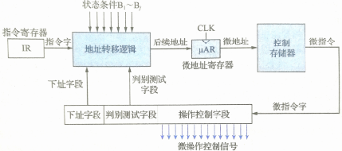

##### 微指令地址形成

下址字段断定法：由微指令字

计数器法：类似PC，`CMAR+1->CMAR`

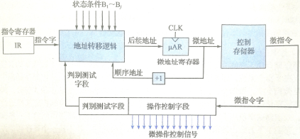

#### 微指令

##### 微指令编码

- 直接编码：微指令的微命令字段中每位代表一个微命令，设置1或0

- 字段译码：将微指令的微命令字段分成若干小段，把互斥性微命令组合在同一段，相容性微命令组合在不同字段；每一小段需译码，且保留一个空操作

  特点：缩短微指令字长，但需译码慢

  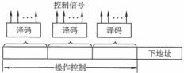

##### 微指令格式

水平型：一条定义执行几种并行操作 

特点：微程序短，执行速度块；但微指令长

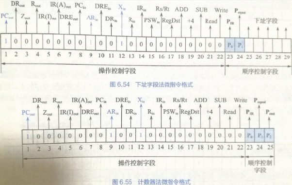

垂直型：类似机器指令，一条只定义执行一种基本操作

特点：微指令短，简单；但微程序长，执行速度慢（基本淘汰）

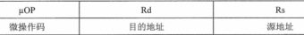

#### 微程序控制器/硬布线控制器对比

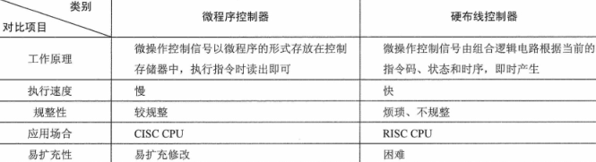

## 5.5 异常和中断机制

异常和中断的基本概念

分类

检测与响应

## 5.6 指令流水线

### 基本概念

设计原则：

- 指令流水段个数以最复杂指令所用的功能段个数为准， 

- 流水段时长以最复杂的操作所花时间为准（+流水寄存器延时）

指令集特征：指令长度尽量一致，指令格式尽量规整（源寄存器位置），仅用 `load/store` 指令访存，数据/指令在存储器中<u>对齐存放</u>

#### 流水线的表示

时间并行，各功能部件轮流、重叠执行

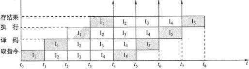

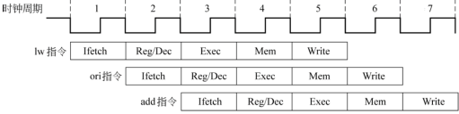

#### 流水线数据通路

流水线各功能段后面都要有一个<u>缓冲(流水)寄存器</u>，锁存本阶段执行结果，供给下一流水段使用

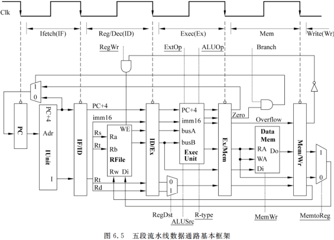

### 影响因素

#### 资源冲突 (结构冲突)

多条指令同一时刻争用同一部件（运算器/存储器）

如：访存冲突（前指令 `load` 访存阶段，后指令 `load` 取指），PC+1与跳转指令 PC 加法

解决：

- 单独设置 <u>数据存储器</u> 和 <u>指令存储器</u>
- <u>阻塞 PC</u>，<u>清空</u> 当前后面的指令功能段如 IF/ID 的 <u>流水寄存器</u>
- (软件法)编译器插入空操作 `nop`，以延缓取指令（流水线性能损失，各阶段空一次）

#### 控制冲突 (分支冲突)

转移/分支/调用/返回指令会改变 PC 值

```assembly
beq $0, $0, 8	# jump 8, EA=PC+4+8, 第4条
add $1, $2, $3	# 不应执行
addi $4, $5, $6	# 不应执行
bne $1, $2, 8	# jump 8, EA=PC+4+8, 第7条
lw $5, 4($1)	# 不应执行
sw $6, 8($1)	# 不应执行
```

解决：

- 将分支跳转信号作为流水线信号 `flush` 连接 IF/ID、ID/EX 流水寄存器的同步清零控制端

  时钟到来时，分支指令进入MEM 段，IF 段取分支目标地址处的新指令，同时IF/ID、ID/EX流水寄存器数据/控制信号全部清零

- 动态分支预测(取指 IF 阶段)
#### 数据冲突

下条指令用到当前指令执行结果

写后读（较多）

```assembly
add $1, $2, $3	# $1 为目的寄存器 EX段
sub $2, $1, $3	# $1 为源寄存器 ID段
```

写后写：乱序调度的流水线会出现结果错误

解决：

- (软件法)编译器插入空操作 `nop`，以延缓取指令（流水线性能损失，各阶段空一次）

- (硬件法)后面指令暂停一两个时钟周期，将数据相关(冲突)检测信号作为阻塞暂停信号取反送入PC使能端

  `PCen = !stall = !data_hazzard`；时钟到来时，PC忽略新输入，ID段指令不变，EX段指令进入MEM段仍冲突；再下一时钟到来时，EX段指令进入WB段，ID段指令与其不再冲突 进入EX段

- 重定向/旁路法：直接把正确数据位置(经专用通路)重定向到 EX 段格式位置（下条指令到EX段时直接用）

### 性能指标

#### 流水线吞吐率

单位时间内 k 段流水线完成的任务量，或输出结果的数量。$T_k$ 是处理完 n 个任务所用的时间

流水线吞吐量 $TP=n/T_k=\frac{n}{(k+n-1)\Delta t}(任务/s);\ \ n\rightarrow\infty, TP_{max}=1/\Delta t<时钟主频f$​​​

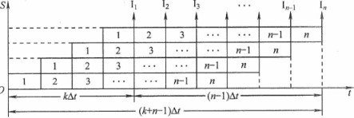

#### 流水线加速比

完成同一批任务，不使用流水线与使用流水线所用时间之比

$S=T_0/T_k=\frac{kn\Delta t}{(k+n-1)\Delta t}=\frac{kn}{k+n-1};\ \ n\rightarrow\infty, S_{max}=k$

#### 流水线效率

$E=\frac{(顺序执行)n个任务占用的时空区域有效面积}{n个任务所用时间与k个流水段所围成的时空区总面积}=T_0/kT_k;\ \ n\rightarrow\infty, E_{max}=1$​

### 超标量流水线

#### 超流水线

在一个时钟周期内再分段，一个功能阶段内多条指令并发流水，提高流水线主频

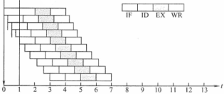

#### 超标量流水线

复制内部功能部件，每个功能阶段有多条指令并行（动态多发射，冲突由硬件解决）

多条流水线，空间并行，CPI\<1

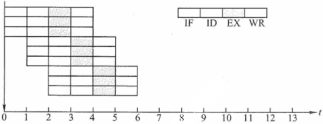

#### 超长指令字

将多条能并行的指令组合成一条有多操作码字段的超长指令字； 对 Cache 容量要求更大

**错题**：5.1-10,13,16,23,24, 5.2-12,13,18, 5.3-5, 5.4-3,4,5,20,22, 5.5-3,4,7,14,17

## 5.7 多处理器基本概念

### SISD/SIMD/MIMD/向量处理器的基本概念


### 硬件多线程的基本概念


### 多核处理器(nwlli-core)的基本概念


### 共享内存多处理器(SMP)的基本概念
