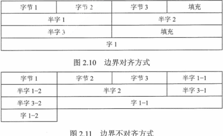

# 2.数据的表示和运算

**考纲**

数制与编码：进位计数制及其相互转换，**定点数的编码表示**，~~真值和机器数~~

运算方法和运算电路：基本运算部件（加法器，算术逻辑部件ALU），**加/减运算（补码加/减运算器，标志位的生成），乘/除运算（乘/除法运算的原理，乘/除法电路的结构）**

定点数的表示和运算：无符号/带符号整数的表示和运算

浮点数表示和运算：浮点数的表示：IEEE754标准，浮点数的加/减

**真题考点**：

- 计算机使用二进制编码的原因，十进制与十六进制转换

- 整数补码表示范围/溢出的情况，整数补码运算与溢出判断，整数逻辑/算术右移

  C不同字长整型数之间转换，C有符号/无符号数的转换、运算及溢出判断，

  字节编址/小端/边界对齐时 C结构体/存储单元的地址/内容、指令代码结构，

  有符号/无符号加法器电路，

  乘法器：基本运算指令/电路组成/控制逻辑作用，阵列乘法器实现原理与效率，有符号/无符号整数乘法运算及溢出判断

- 浮点数加减运算：对阶/尾数运算/规格化/舍入/溢出判断，

  IEEE754下的 float/double 格式、其与 int 整型之间的类型转换，浮点数的格式/表示/范围，浮点数与科学计数法的真数转换，最小的规格化正数

  C不同整型/浮点型类型转换

## 2.1 数制与编码

### 进位计数制及其相互转换

任意进制转换为十进制：按权展开相加法

十进制转换为任意进制

- 整数部分：除基取余，先余低位，后余高位，商0结束

- 小数部分：乘基取整，先整高位，后整低位，去整为0结束

如：123.6875(D) -> ?(B)

### ~~真值和机器数~~

真值X：带符号的k进制数，是机器数的实际值。如-2、-1010.1

机器数：将真值的符号和数值编码为二进制的数

定点数机器码：原码、反码、补码、移码

### ~~字符~~

字符编码ASCII码(7位)：0\~31控制字符，32空格SP，48\~57 0-9，65\~90 A-Z，97\~122 a-z

## 2.2 定点数的表示与运算

### 定点数的表示

无符号数/有符号数：二进制数的最高位是否为符号位

机器数的定点表示

- 定点整数：小数点位置固定在最低位之后

- 定点小数：小数点位置固定在最高位之前

不同机器数之间的转换

#### 原码

最高位符号位，其余位表示数的绝对值

#### 反码

正数与原码相同，负数符号位不变，对原码数值位取反

反码表示范围与原码一样

#### 补码

如钟表12小时制，12即钟表的模，超出会被舍弃。（24小时制的16点相当于12小时制的4点）

在11点将时间调到3点，可顺时针拨4小时，也可逆时针拨8小时

-8 = -8 (mod 12) = 12-8 = +4, -8与4相对12互补

##### 整数补码

字长n时，最高符号位的权重 $-2^{n-1}$，范围 [$-2^{n-1}, 2^{n-1}-1$​]，[1000, 0111]

$[X]_补=\begin{cases}X&X\in[0,2^n]\\2^n+X&X\in[-2^n,0]\end{cases}$​

$[X]_补=[X]_真\ mod\ 2^n$，如 n=4：$[-3]_补=-3\ mod\ 2^4=-11\ mod\ 10000=1101$

注：取模法的无符号数结果即负数补码

##### 小数补码

最高符号位的权重 $-2^0$​​​，范围 [$-2^0, 1-2^{1-n}$​]，\[1.000, 0.111]

$[X]_补=\begin{cases}X&X\in[0,1)\\2+X&X\in[-1,0]\end{cases}$​​​​

$[X]_补=[X]_真\ mod\ 2$，如 n=4：$[-.375]_补=-.375\ mod\ 2=-.011\ mod\ 10=1.101$

##### 负数原码求补码

反码法：原码符号位不变，数值位取反末位+1

扫描法：原码符号位及右起第一个1及其右边的0不变（=原码），其余各位取反（=反码）

##### 补码取负

由 $[x]_补$​ 求 $[-x]_补$：$[x]_补$ 连同符号位一起取反，末位+1

#### 移码

移码是将真值X加上一个偏置常数 $2^{n-1}$​​，真值 [$-2^{n-1},2^{n-1}-1$] 对应移码 [$0,2^n-1$]

移码与补码的换算：$[X]_移=2^{n-1}+[X]_补$​​​​​​（字长n）

补码 [1000,...,1111,0000,...,0111]+1000 对应移码 [0000,...,0111,1000,...,1111]

- 移码中0的表示唯一1000
- 移码 \[0000, 1111\] 对应真值最值 $[-2^{n-1}, 2^{n-1}-1]$​，范围与补码一样 
- 真值的移码与补码仅差一个符号位
- 移码保持了数据原有的大小顺序

移码用来表示浮点数的阶码，只能表示整数

### 定点数的运算

#### 定点数的移位运算

##### 算术移位（不产生溢出时）

正数移位：符号位不变，添0

**负数移位**：符号位不变，

- 原码添0
- 反码添1
- **补码左移添0**（同原码）**右移添1**（左边填充符号位） 

真值为奇数时右移影响精度（绝对值变小）

##### 逻辑移位

当做"无符号数"看待，非数值运算，都添0；左移高位移丢，右移时低位移丢

##### 循环移位

不带进位位的循环移位：左(右)移时，数据最高(低)位同时移入数据最低(高)位和进位标志C

带进位位的循环移位：进位标志C在数据最高位左边，与其一同循环移动

应用：将数据低字节与高字节互换

##### C语言中的位运算/逻辑运算/移位运算

**C语言位运算**

操作符：&, | , ~, ^，汇编指令：`and, or, not, xor`

**C语言逻辑运算**

操作符：&&, ||, !，汇编指令演变为程序分支指令：`cmp, je`

逻辑运算属于非数值运算：执行时，操作数若为0则不变，若非0则变为1（配合分支指令）

**C语言中的移位运算**

操作符：<<, >>

左移：汇编为逻辑左移，低位填0，`sll a, b, c # a=b<<c, shift left logical`

无符号数右移：汇编为逻辑右移，高位填0，`srl a, b, c # a=b>>c, shift right logical`

有符号数右移：汇编为算术右移，填充符号位。`sra a, b, c # shift right arithmetic`

#### 原码定点数的加减法

符号相同：绝对值相加，符号不变； 

符号不同：绝对值大的减去绝对值小的，符号取绝对值大的数

#### 补码定点数的加减法

按二进制运算法则：逢二进一，不够借一（减），符号位参与运算，结果溢出时取模

$[A+B]_补=[A]_补+[B]_补\ (mod\ M)\\
[A-B]_补=[A]_补+[-B]_补\ (mod\ M)$​​​

字长 n 时，整数模 $M=2^n$，小数模 $M=2$

如：n=4，$[5-(-3)]_补=0101-1101=1000=-8=(8 \mod 16)_补,\\
[-5-4]_补=1011-0100=0111=7=(-9 \mod 16)_补$​

#### 符号扩展/隐式类型转换

小字长数与大字长数运算时，先将小字长数转成大字长数。 

正数：添0；

负数：原码添0，反码添1，补码整数添1，小数右边添0

如：`int = int + short`，short 型扩展高位添1

#### 溢出OF概念和判别▲

溢出OF：运算结果超出机器字长所能表示的数的范围。分上(正)溢出、下(负)溢出。

溢出OF运算结果是错误的

溢出OF的判别（补码定点数加减运算溢出）：

- 使用一位符号位（模2补码），结果与原操作数的符号位不同则溢出

  如：n=4，$[-5-4]_补=1011+1100=0111=7$​

- 使用双符号位（模4补码），00正，01正溢出，10负溢出，11负

  如：n=4，$[-5-4]_补=(1)1011+(1)1100=(1)0111=7$

  两符号位相同-未溢出，两符号位不同-溢出

  最高符号位代表真正符号，低位符号参与移位操作 

  存储模4补码仅需一个符号位（正确数两符号相同）?，只在算术ALU中运算时采用双符号位 

- 符号位的进位 与 数值最高位的进位不同溢出（C1 xor C0）

  如：$x=x_n...x_0$​​​，当 $x_n\ne x_{n-1}$​​​​, 左移会溢出

#### 定点数的乘法

$x=x_0x_1...x_n,\ y=y_0y_1...y_n$​

部分积和被乘数采取双符号位，乘积结果2n+1位

标准算法需要3个寄存器：

- 存 被乘数 x

- 存 部分积的高位 

- 存 部分积低位 与 乘数 y 的待计算高位

  在部分积右移时，y 的低位已经完成计算，故可将部分积的低位存入y 寄存器的空余高位

##### 原码一位乘​​

符号位：$p_0=x_0\ \oplus \ y_0$​​ (异或)

部分积计算：从乘数 y 低位到高位判断，$(p,y)=((p+y_{n}|x|),\ y)·2^{-1}$​​​​​​​

$p=p+\begin{cases}|x|&y_n=1\\
0&y_n=0\end{cases}\ \ (p,y)>>=1$​​​

**原码一位乘法器**

##### 补码一位乘

被乘数与部分积采用双符号位，乘数采用单符号位，末位增设附加位 $y_{n+1}$（初始0） 

部分积计算核心逻辑：$(p, y)=((p+(y_{n+1}-y_n)[x]_补),\ y)· 2^{-1}$​

$p=p+\begin{cases}
[x]_补& y_ny_{n+1}=01\\
0& y_ny_{n+1}=00|11\\
[-x]_补& y_ny_{n+1}=10\end{cases},\ (p,y)>>=1(最后一次y不移动)$​​

加法次数：y 的位数 n+1，移位次数：y 的数值位数 n

**补码一位乘法器**

#### 定点数的除法◆

##### 原码除法（恢复余数）

若 $R_i\ge0$​，上商 $q_i=1$​，余数 $R_i$​ 左移1位，再减除数；$R_{i+1}=2R_i-y$​ 

若 $R_i<0$，上商 $q_i=0$，将余数 $R_i$ 先加上乘数 y 恢复余数，左移1位，再减除数$R_{i+1}=2(R_i+y)-y=2R_i+y$

##### 原码除法（不恢复余数/加减交替）

符号位：$q_0=x_0\oplus y_0$​，加除数：$+|y|$​，减除数：$+[-|y|]_补$​ 

余数共左移 n 次，最后的余数 $=R_n·2^{-n}$​，与被除数 x 符号相同

被除数与部分余数采用双符号位，$R_0=|x|+[-|y|]_补, R_{i+1}=2R_i+(-1)^{q_i} ·y$​​​​​ 

加减交替："R正上商1做减法，R负上商0做加法"

部分余数 $R\ge0,q_i=1$​​​，(若商的位数不够 $R<<1，R+=[-|y|]_补$​​​)

部分余数 $R<0,q_i=0$​​，(若商的位数不够 $R<<1),R+=|y|$​​；在最终余数 $R<0$​​ 时，需要恢复余数

不溢出前提：对于整数 $0<|除数|\le|被除数|$，对于小数 $0<|被除数|<|除数|$

##### 补码除法（加减交替法）

开始被除数 x 与除数 y 同号相减 $+[-y]_补$​，异号相加 $+[y]_补$ 

部分余数 $[R]_补$​​​ 与除数 $[y]_补$​ 同号，$q_i=1,R<<1,R+=[-y]_补$ 

部分余数 $[R]_补$​​​​ 与除数 $[y]_补$​​ 异号，$q_i=0,R<<1,R+=[y]_补$ 

商的末位恒置1

### C语言整数类型转换

#### 有符号与无符号数的转换

位值不变，高位的权重正负改变，第k位权 $\pm 2^k\rightarrow \mp2^k$​

例：`short x=-4321; unsigned short y=(unsigned short)x;` 

析：short 高位符号位权重 $-2^{15}$​，unsigned short 无符号高位权重 $2^{15},\ y=2^{16}+x$

#### 不同字长整型数之间转换

长转短时高位截断（新高位 权重正负改变），短转长时扩展符号位（结果不变）

例：`int x=165537, u=-34991; short y=(short)x, v=(short)u;`

解：$x=2^{17}+2^{15}+1697,\ 2^{15}$​​​​​​​​​ 在 short 类型高位作为符号位，权重变为 $-2^{15}$​, $y=-2^{15}+1697$​​​​

$u=-2^{16}+0+30545,\ 2^{15}$ 在 short 类型高位作为符号位，权重变为 0，$y=0+30545$​

### 数据的存储和排列

#### 数据的"大小端"存储

<u>小端模式(主)：低地址到高地址存数据的低字节到高字节（存放的低字节---数的低字节）</u> 

<u>机器数据 01234567H 小端存放：67H 45H 23H 01H（指令代码包含存储顺序）</u>

大端模式：低地址到高地址存数据的高字节到低字节

#### 数据 "边界对齐"存储

字长32位机器，一个地址对应一个内存单元4字节

数据按边界对齐存放时，半字地址是2整数倍，字地址是4整数倍，字节/半字/字 均可一次访存取出（需填充空白字节）

**2.2 错题**：5,20,23,25,31,32,44,51,52,53

## 2.3 浮点数的表示与运算

### 浮点数的表示

#### 格式

$N=(-1)^S\times 2^E\times M$​​​​​​​，S 数符，E 阶码，M 尾数

#### 表示范围

阶码最大值，尾数最大正值，浮点数-正数最大值

阶码最小值，尾数最小正值，浮点数-正数最小值

阶码最小值，尾数最大负值，浮点数-负数最大值

阶码最大值，尾数最小负值，浮点数-负数最小值

#### 规格化数

通过调整的尾数和阶码大小，使尾数的真值最高数位为1

二进制尾数真值的最高有效位为1（负数补码0），1/2\<=\|M\|\<=1 

规格化操作：对非规格化浮点数尾数算术左(右)移 k 位，同时对阶码 -k(+k)

- 左规：当运算结果为非规格化数时，尾数算术左移一位，阶码 -=1（可能需多次）
- 右规：当运算结果溢出（双符号位01/10）时，尾数算术右移一位，阶码 +=1（最多一次）

##### 原码规格化数

正数：0.1xxx，范围：\[0.1000, 0.1111\]，M真值范围：$[\frac{1}{2}, 1-2^{-n}]$​​ 

负数：1.1xxx，范围：\[1.1111, 1.1000\]，M真值范围：$[-(1-2^{-n}), -\frac{1}{2}]$​​​

##### 补码规格化数

$符号位\oplus 最高数位=1$

正数：0.1xxx，范围：\[0.1000, 0.1111\]，M真值范围：$[\frac{1}{2}, 1-2^{-n}]$ 

负数：1.0xxx，范围：\[1.0000, 1.0111\]，M真值范围：$[-1, -\frac{1}{2}-2^{-n}]$（相对原码左移 $2^{-n}$）

#### IEEE754标准

隐藏位：规格化的浮点数数值最高位总是1，尾数隐含了1，实际规格化尾数：1.M 

##### 短浮点数 float

<u>数符S 1位，阶码(移码)E 8位，尾数(原码)M 23位，移码偏置127=7FH</u>

规格化的短浮点数真值：$(-1)^S\times 1.M\times 2^{E-127}, E\in [1,254]$​​，有效 $e\in[-126,127]$​ 

<u>绝对值最小值</u>：E=1, M=0, $N=1.0\times 2^{1-127}$​​​

<u>绝对值最大值</u>：E=254, M=.11...11, $N=1.11...11\times 2^{254-127}=2^{127}\times (2-2^{-23})$

$\pm\infty$：E=255, M=0

##### 长浮点数 double

数符S 1位，阶码E 11位，尾数(小数点后)M 52位，移码偏置1023=3FFH

规格化的长浮点数真值：$(-1)^S\times 1.M\times2^{E-1023}, E\in[1,2046]$​​​，有效 $e\in[-1022,1023]$​​​ 

绝对值最小值：E=1, M=0, $N=1.0\times 2^{1-1023}$

绝对值最大值：E=2046, M=.11...11, $N=1.11...11\times 2^{2046-1023}=2^{1023}\times (2-2^{-52})$

$\pm\infty$​​：E=2047, M=0

##### 特殊值

+0/-0

$\pm\infty$：阶码E全1，尾数M=0

NaN：阶码E全1，尾数$M\ne 0$

非规格化数：阶码E全0，尾数$M\ne 0$​​​，真值：$(-1)^S\times 0.M\times2^{-126}$​

#### 溢出

 

溢出：规格化后 **阶码** 超出所能表示的范围（全0或全1）

下溢时，数据趋于0；上溢时，进行溢出中断处理

- 负数 $< –(2 – 2^{-23}) × 2^{127}$ (negative overflow)
- 负数 $> –2^{-149}$​ (negative underflow)
- Zero
- 正数 $<2^{-149}$ (positive underflow)
- 正数 $>(2 – 2^{-23}) × 2^{127}$ (positive overflow)

### 浮点数的加减运算

#### 对阶

使两个数的阶码相等，先求阶差 $[E_x]_补+[-E_y]_补=k$​，

低阶向高阶对齐，低阶尾数右移k位，阶码+k 

尾数右移时通常将最低位的移出位暂时保留（保留附加位），运算结果左规时再移入尾数低位

#### 尾数求和

用补码表示时，按照定点数的补码加减运算，双符号位（01/10为溢出）

#### 规格化

左规：当尾数为 00.0xxx 或 11.1xxx，尾数左移 k 位，阶码 -=k；使尾数为 00.1xxx 或 11.0xxx

右规：当尾数结果溢出 01.xxxx 或 10.xxxx，尾数右移1位，阶码加1

#### 舍入

对阶右移和尾数右规格化时，原来尾数的低位被舍弃，从而影响精度

- 0舍1入法：当丢失的最高位是1时尾数末位+1，是0则不变

- 末位恒置1：只要因移位而丢失的位中含1就把尾数最低位 置1，否则不变

#### 溢出判断

阶码溢出：阶码计算结果的双符号位为01或10

#### IEEE754浮点数加减运算

<u>阶码移码，尾数原码（最高位1隐藏）</u>，加减运算与基于补码表示的浮点数类似，

尾数隐藏位1参与运算及规格化，规格化尾数：1.xxx 

左规：当尾数 0.xxx，尾数左移，阶码减相应位数 

右规：当尾数 1x.xxx，尾数右移1位，阶码加1（使运算结果最高位1作为隐藏位）

溢出判断：右规使阶码为全11111111时上溢，左规使阶码为全00000000时下溢

#### C语言浮点数类型转换

float 精度24位，int精度 31位，double 精度53位

int-\>float：当 int 有效数据大于24位，`(float)int` 会将 int 数据高位截断

double-\>float：大转小时可能溢出，有效位数变少可能被舍入?

float/double-\>int：浮点小数会被舍去，int 仅保留整数部分；double->int 大转小时可能溢出

**错题**：3,7,12,16,22,28,29,30

## 2.4 算术逻辑单元ALU

### 串行加法器和并行加法器

#### 一位全加器FA

输入：加数 $A_i,B_i$、低位进位 $C_{i-1}$ 

输出：本位和 $S_i$、进位 $C_i$

和表达式：$S_i=A_i\oplus B_i\oplus C_{i-1}$（3位输入有奇数个1时，$S_i=1$） 

进位表达式：$C_i=A_iB_i+(A_i+ B_i)C_{i-1}=A_iB_i+(A_i\oplus B_i)C_{i-1}$（3位输入有1的个数 >=2 时，$C_i=1$）

全加器符号

#### 串行加法器CRA

进位信号顺序从最低位传到最高位

缺点：进位之间依赖明显，速度慢

时间：n个全加器经过3T并行产生 $X_i\oplus Y_i$，之后每经过2T，产生进位并传至下一位。

$C_n$​​ 进位延迟 (2n+3)T，$S_{n-1}$​​ 进位延迟 (2n+4)T

#### 并行先行加法器CLA

由多个全加器组成，各位数据同时运算，但低位进位传递到高位的延迟影响最长运算时间

进位表达式：$C_i=A_iB_i+(A_i\oplus B_i)C_{i-1}=G_i+P_iC_{i-1}$ 

进位产生函数：$G_i=A_iB_i$​，进位传递函数：$P_i=A_i\oplus B_i$​

理论上每一位的进位信号可并行产生，每位及其低位产生的 $G_i$​​​​​​​​​​​ 和 $P_i$​​​​​​​​​​​ 信号并行送到本位的进位门电路，并行产生进位信号。 

$C_4=G_4+P_4C_3=G_4+P_4G_3+P_4P_3G_2+P_4P_3P_2G_1+P_4P_3P_2P_1C_0$​

所有的进位输出仅由 $G_i,P_i$​​​、最低进位 $C_0$​​​ 决定，不依赖其低位进位 $C_{i-1}$​​

**单级先行进位**(组内并行、组间串行)

由多个4位先行进位电路CLA组成，组内4个进位同时产生，每组输出进位 $C_{4i}$​ 串行传递给高位

$C_4=G_1^*+P_1^*C_0$​​

成组进位产生函数：$G_1^*=G_4+P_4G_3+P_4P_3G_2+P_4P_3P_2G_1$​，成组进位传递函数：$P_1^*=P_4P_3P_2P_1$​

**两级先行进位**(组内并行、组间并行)

$C_{16}=G_4^*+P_4^*G_3^*+P_4^*P_3^*G_2^*+P_4^*P_3^*P_2^*G_1^*+P_4^*P_3^*P_2^*P_1^*C_0$ 

每组并行产生 $G_i^*, P_i^*$​，4组通过外加电路求和得最终进位 $C_{16}$​

使用成组先行进位BCLA部件

### 算术逻辑单元和功能与结构

#### <u>ALU常见标志位</u>

> <u>无符号数依据 CF 标志判断进位/借位/溢出，符号数依据 OF 标志判断溢出</u>

CF(Carry Out Flag) （看做无符号数）实际计算结果最高位产生进位/借位 $CF=Cin\oplus Cout$​​​​​​​ 

- Cin=0 最高位是否进位 CF=Cout，Cin=1 最高位是否借位 $CF=\overline{Cout}$​
- ~~逻辑左移溢出位~~

对无符号数，8+8 = 1000 + 1000 = 0000，CF=Cout=1，最高位有进位，相同符号数相加结果符号相反—溢出

0-1 = 0000 - 0001 = 1111，CF=Cout=1，最高位有借位，相同符号数相减无溢出

对符号数补码，相当于 Cin=1

-1+1 = 1111 + 0001 = 1 0000，$CF=Cout\oplus1=0$​​​，最高位实际不进位，不同符号数相加无溢出

6-3 = 0110 + 1101 = 1 0011，$CF=Cout\oplus1=0$，最高位实际不借位，不同符号数相加无溢出

3-6 = 0011 + 1010 = 1101，$CF=Cout\oplus1=1$，最高位实际需借位，不同符号数相加无溢出

OF(Overflow Flag) 为1表示**有符号数**(补码)运算溢出。$OF=C_n\oplus C_{n-1}$​​​

- 按计算式，符号位的进位与最高位的进位不同时溢出

- 使用双符号位，00实际正，01实际正溢出，10实际负溢出，11实际负

- 两相同符号数相加（两不同符号数相减）结果与原操作数1的符号相反时溢出

  两不同符号数相加（两相同符号数相减）不可能溢出

$SF=F_{n-1}$ 结果为负数，即**带符号**（只有符号数需要）

$ZF=\overline F$​​​ 运算结果F是否为0

<u>对于无符号数：进位--溢出，小减大--不够减--借位</u>

[The CARRY flag and OVERFLOW flag in binary arithmetic](http://teaching.idallen.com/dat2343/10f/notes/040_overflow.txt)

[关于ALU在SUB命令时，CF的判断](https://blog.csdn.net/h2809871142/article/details/108765511)

#### ALU部件

ALU符号

一位ALU结构

4位单级先行进位ALU

4位BCLA部件

16位两级先行进位ALU

#### 补充知识

锁存器：置1，置0，暂存 $Q_{n-1}$ 不变

触发器：由两个锁存器组成，前一个在 CLK 时钟上沿将数据传递到下一个

MUX n选1多路复用器：2选1的 mux 类似三元表达式

