## 4. 指令系统

**考纲**

指令系统基本概念、CISC和RISC基本概念

指令格式：指令基本格式、定长操作码指令格式，扩展操作码指令格式

指令寻址方式：有效地址概念，数据寻址和指令寻址，常见寻址方式

数据对齐与大小端存放方式

高级语言程序-汇编/机器代码之间的对应：编译器/汇编器/链接器基本概念，选择/循环结构语句、过程(函数)调用对应的汇编/机器代码

**真题考点**

- 

## 4.1 指令系统/CISC-RISC基本概念

### 指令系统基本概念


### CISC与RISC基本概念

|               | 复杂指令系统计算机CISC                                       | 精简指令系统计算机RISC                                       |
| ------------- | ------------------------------------------------------------ | ------------------------------------------------------------ |
| 指令复杂度    | 指令复杂                                                     | 单条指令简化                                                 |
| 指令字长      | 长度不固定                                                   | 长度固定                                                     |
| 格式/寻址方式 | 多                                                           | 少，只有 load/store 指令访存                                 |
| 通用寄存器数  | 较少                                                         | 多                                                           |
| 使用频率      | 各指令 使用频率/执行时间 相差大<br />常用20%的简单指令       | 优先使用频率高的简单指令                                     |
| 控制技术      | 多数采用微程序控制                                           | 以硬布线控制(组合逻辑)为主，<br />复杂指令由简单指令组合     |
| 执行时间      | 多数需多时钟周期完成                                         | 采用流水线技术，<br />除load/store外其它指令一个时钟周期完成 |
| 其它          | 兼容性好，兼容部分RISC<br />(简单指令用类RISC，复杂指令用微码) | 通用寄存器数量多(减少访存)，注重编译优化                     |
| 应用举例      | Intel X86, IA64                                              | ARM, MIPS, RISC-V                                            |

#### IA-32


#### ARM


## 4.2 指令格式

### 指令基本格式

指令结构：操作码 | 立即数/数据地址码/指令地址码

长度：半字长指令、单字长指令、双字长指令；是字节长或存储字长的整数倍，大于存储字长时取指需多次访存

#### ~~按操作数地址码数分~~

##### 零地址指令

OP

系统指令：空操作 `nop`，停机 `halt`，关中断

运算类指令：两操作数隐含地从栈顶和次栈顶弹出，送到运算器，运算结果隐含地压入堆栈

##### 一地址指令

OP \| A1

单操作数指令

- 操作数是源&目的 `OP(A1)->A1`，如：自增，自减，求反，求补
- 操作数是源/目的，如：栈操作，源地址数据入栈/栈顶数据出栈到目的地址，`push rsp; pop rsp`

双操作数指令：隐含约定目的地址，如：累加器 ACC，`(ACC)OP(A1)->ACC`

##### 二地址指令

OP \| A1 \| A2

若均为内存地址，则完成指令至少需3次访存，结果默认存 A1，也可能暂存 ACC

##### 三地址指令

OP \| A1 \| A2 \| A3(result)

若均为内存地址，则完成指令需4次访存

##### 四地址指令

OP \| A1 \| A2 \| A3(result) \| A4(next instruction address)

`(A1)<OP>(A2)->A3, PC=A3`

### 定长操作码指令格式

在指令字的高位部分分配固定的若干位表示操作码，n位操作码可表示 $2^n$ 条指令

### 扩展操作码指令格式

操作码的位数随地址码的减少而增加，不允许短操作码是长码的前缀

使用频率高的用短操作码，频率低的用长码（联想：变长前缀编码 Huffman编码）

### 指令操作类型

指令类型：硬件指令（中断）系统指令（特权）程序控制指令

待分类：等待，空操作 nop

##### 数据传送

寄存器之间 `mov`，内存单元读到寄存器 `load`，寄存器写到内存单元 `store`

##### 算术逻辑运算

加 `add`，减 `sub`，比较 `cmp`，乘 `mul`，除 `div`，自增 `inc`，自减 `dec`，与 `and`，或 `or`，取反 `not`，异或 `xor`

##### 移位操作

算术移位，逻辑移位，循环移位

##### 转移操作

无条件转移 `jmp`，条件分支转移 `branch`，调用 `call`，返回 `ret`，陷阱 `trap`

##### CPU内核态指令

停机，开中断，系统模式切换，进入特殊处理程序（向量指令）

##### 输入输出操作

完成CPU与外设交换数据或传送控制命令及状态

## 4.3 指令寻址方式

```
A: 形式地址, (A): A(寄存器编号/内存地址)的(解引用)地址, EA=(A): 表示形式地址A的(解引用)有效地址
```

### 指令寻址和数据寻址

#### 指令寻址

##### 顺序寻址

程序计数器 `PC=PC+1`（1个指令字长）

##### 跳跃寻址

`PC=<绝对地址>`，`PC=PC+<相对指令地址的偏移>`

#### 数据寻址

结构：操作码 | 寻址方式 | SIB | 形式地址A

### 常见数据寻址方式 (寻址特征位)

#### 隐含寻址

隐含操作数地址，如零地址/单地址指令：累加器 ACC

特点：缩短了指令字长；需增加存储操作数/隐含地址的硬件

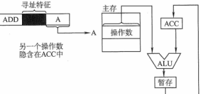

#### 立即寻址

地址字段存储操作数本身(立即数)

特点：不访存，定长指令执行时间最短；但定长指令中字段位数限制了立即数的范围

```assembly
mov eax, 2008H	# R[eax] = 2008H
```

#### 直接寻址

形式地址 A = 操作数地址EA，$EA=A$​，如：访存或无条件转移 `jmp`

特点：若A为内存地址，则1次访存，但形式地址位数限制了寻址范围，地址不易修改

```assembly
mov eax, [2008H]	# R[eax] = M[2008H]
```

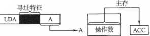

#### 间接寻址

形式地址 A = &EA 存放操作数地址的内存地址—指针，$EA=(A)$​

特点：扩大了寻址范围，但至少2次访存（被寄存器间接寻址取代）

```assembly
mov eax, @2008H	# R[eax] = M[M[2008H]]
```

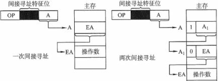

#### 寄存器寻址

形式地址 A = 操作数所在的寄存器编号 Ri，$EA=R_i$

特点：不访存，地址码位数最短，但寄存器数量有限

```assembly
mov eax, ecx	# R[eax] = R[ecx]
```

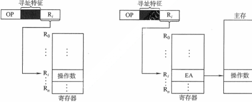

#### 寄存器间接寻址

形式地址 A = 存放操作数地址的寄存器编号 Ri，$EA=(R_i)$

特点：比间接寻址快，执行阶段需访存1次

```assembly
mov eax, [ebx]	# R[eax] = M[R[ebx]]
```

#### 基址寻址

形式地址 A = 相对隐含基址寄存器 BR 的偏移，$EA=(BR)+A$​

形式地址 A = 相对通用寄存器 Ri（含基址）的偏移，$EA=(R_i)+A$​​

特点：面向系统程序，执行中基址不变，形式地址（偏移）变；扩大寻址范围，利于多道程序设计

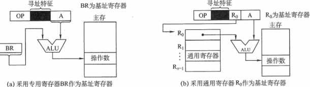

#### 相对寻址

形式地址 A = 相对下条指令地址的偏移量，$EA=(PC+1)+A$​​​

特点：便于程序浮动，广泛应用于 `jmp/call` 指令：`call <EA> # EA = PC + <当前指令长> + A`

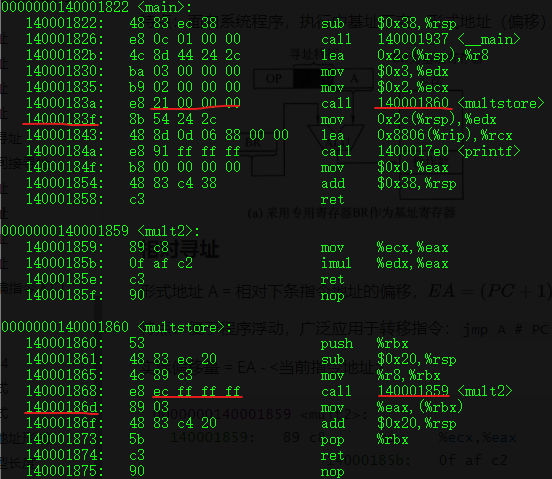

#### 变址寻址

形式地址 A = 相对变址寄存器的偏移，IX 为变址寄存器，$EA=A+(IX)$

特点：面向用户，执行中形式地址不变，变址偏移变。

如：A = 数组首地址，改变 IX 值遍历，IX 位数表示寻址范围

```assembly
mov eax, 32[esi]	# R[eax] = M[32+R[esi]]
```

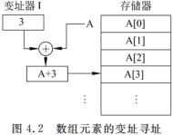

变址再间址：$EA=(A+(IX))$

#### 堆栈寻址

后进先出 LIFO，隐含栈指针 SP

### x86-64汇编指令入门

#### 寄存器

##### x86

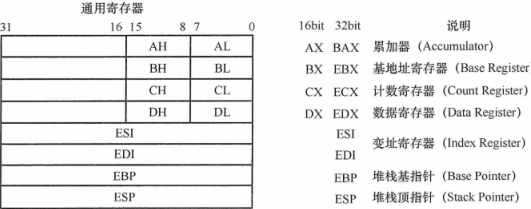

##### x86-64

16个通用寄存器，用于存储整数数据和指针

指令可以对这 16 个寄存器的低位字节中存放的不同大小的数据进行操作：

字节级操作可以访问最低的字节，16 位操作可以访问最低的 2 个字节，32 位操作可以访问最低的 4 个字节，64 位操作可以访问整个寄存器。

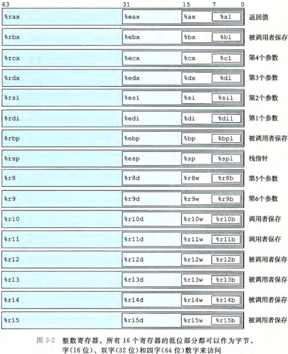

#### 指令格式

- 前缀：指令前缀|段前缀|操作数大小|地址大小

- 操作码：(单地址指令) 操作码(5)|寄存器编号(3)，(双地址指令) 操作码(6)|dest(1)|width(1)，

  (零/单/双地址指令) 操作码(8)，(双字节指令) 0F(8)|扩展操作码

- 寻址方式：Mod(2)|Reg/OP(3)|R/M(3)

  Mod R/M 操作数及其寻址方式，双操作数最多一个来自内存，Mod 寻址方式决定 R/M 是否表示操作数，R/M 操作数来自寄存器/内存

  Reg/OP 寄存器操作数编号，由操作码字段 d 决定是源or目的

- SS(2)|Index(3)|Base(3)：(变址寄存器)比例系数|变址寄存器号|基址寄存器号

  有效地址 = $R[B]+R[I]\times 2^{S}$​

- 偏移量

- 立即数

#### 寻址方式

指令形式：`op 目的 源`

```assembly
mov eax, 1000			# R[eax] = 1000					立即数
mov eax, [1080H]		# R[eax] = M[1080H]				直接
mov eax, ebx			# R[eax] = R[ebx]				寄存器
mov eax, [ebx]			# R[eax] = M[R[ebx]]			寄存器间接
mov eax, [esi+10H]		# R[eax] = M[R[esi]+10H]		寄存器相对/基址
mov eax, [ebx+edi*4]	# R[eax] = M[R[ebx]+R[edi]*4]	基址+比例变址
mov eax, [ebx+edi*4+6]	# R[eax] = M[R[ebx]+R[edi]*4+6]	基址+比例变址+偏移
jmp 1000H				# R[ecx] = R[ecx]+1000			相对 
```

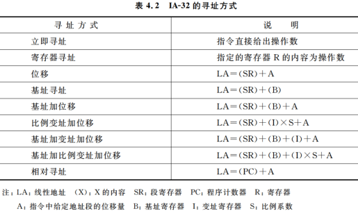

##### 线性地址形成

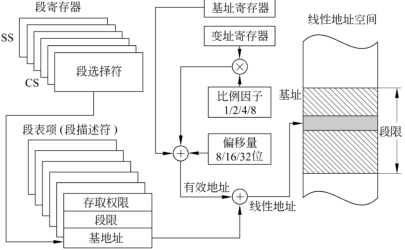

#### 数据类型长度

```assembly
mov byte ptr [ebx], eax		# M[ebx,ebx+1] = (byte)R[eax]
mov word ptr [ebx], eax		# M[ebx,ebx+2] = (word)R[eax]
mov dword ptr [ebx], eax	# M[ebx,ebx+4] = (dword)R[eax]
mov qword ptr [rbx], rax	# M[rbx,rbx+8] = (qword)R[rax]
```

#### 常用指令

<reg> 寄存器

- <reg8> ah, al, bh, bl, ch, cl, dh, dl
- <reg16> ax, bx, cx, dx
- <reg32> eax, ebx, ecx, edx, edi, esp/ebp

<mem> 内存地址，如：[eax], [var+4], dword ptr [eax+ebx]
<imm> 立即数

##### mov/add/sub/and/or/xor

```assembly
mov <reg>, <reg>
mov <reg>, <mem>
mov <mem>, <reg>
mov <reg>, <imm>
mov <mem>, <imm>
```

##### push/pop

在程序的过程调用中，栈底为高地址，栈顶为低地址；push 减小栈指针，pop 增加栈指针

```assembly
push <reg32>
push <mem>
push <imm32>
```

##### inc/dec

```assembly
inc <reg>
inc <mem>
```

##### imul

带符号整数乘法，第一个操作数必须为寄存器

```assembly
imul <reg32>, <reg32>
imul <reg32>, <mem>
imul <reg32>, <reg32>, <imm>
imul <reg32>, <mem>, <imm>
```

##### idiv

带符号整数除法，只有一个操作数—除数，被除数—edx:eax，商eax，余数edx

```assembly
idiv <reg32>
idiv <mem>
```

##### not/neg

not位翻转，neg取负

```assembly
not <reg>
not <mem>
```

##### shl/shr

逻辑移位，第二操作数表示移动位数

```assembly
shl <reg>, <imm8>
shl <mem>, <imm8>
shl <reg>, <cl>
shl <mem>, <cl>
```

##### jmp

```assembly
jmp <label>
```

##### je/jne/jg/jge/jl/jle/jz/jb

```assembly
j<condition> <label>
j<b><n><l|g><e>
```

##### cmp

```assembly
cmp <reg>, <reg>
cmp <reg>, <mem>
cmp <mem>, <reg>
cmp <reg>, <imm>
```

##### call/ret

call 调用时将当前指令地址入栈，ret 返回时弹出栈中保存的指令地址

```assembly
call <label>
ret
```

## 4.4 数据对齐与大小端存放方式

#### 数据的"大小端"存储

小端模式(主)：低地址到高地址存数据的低字节到高字节（存放的低字节---数的低字节） 

小端：数据划分的高低字节与其存储时的高低字节序相反

如：机器数据 01234567H 小端存放：67H 45H 23H 01H（指令代码包含存储顺序）

大端模式：低地址到高地址存数据的高字节到低字节

#### 数据 "边界对齐"存储

字长32位机器，按字编址时，一个地址对应一个内存单元4字节（共$2^{30}$个地址，低2位00）

数据按边界对齐存放时，半字地址是2整数倍，字地址是4整数倍，字节/半字/字 均可一次访存取出（需填充空白字节）

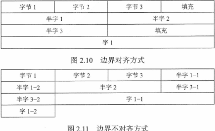

## 4.5 高级语言程序-汇编代码之间的对应

### 编译器/汇编器/链接器基本概念

编译器 cpp—>汇编代码 .s

汇编器 as—>目标文件 .o

链接器 ld—>可执行文件

#### 与静态库链接

将目标文件存档为静态库 ar

```sh
> gcc -c addvec.c multvec.c
> ar rcs libvector.a addvec.o multvec.o
```

使用静态链接库文件

```c
#include "vector.h" // vector.h 定义了 libvector.a 中例程的函数原型
```

编译静态链接

```sh
> gcc -c main2.c
> gcc -static -o prog2 main2.o ./libvector.a # gcc -static -o prog2 main2.o -L -lvector
```

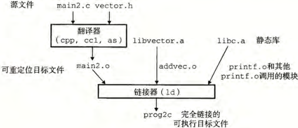

##### 链接器使用静态库解析引用

依赖树顺序，即定义一个符号的库应出现在引用这个符号的目标文件之后。（否则引用不能被解析，链接会失败）

```sh
> gcc -static ./libvector.a main2.c
/tmp/cc9XH6Rp.o: In function 'main':
/tmp/cc9XH6Rp.o(.text+0xl8): undefined reference to 'addvec'
```

如：`foo.c` 依赖 `libx.a, libz.a`，它俩依赖 `liby.a`

```sh
> gcc foo.c libx.a libz.a liby.a
```

#### 动态链接共享库

Linux 共享库-共享目标 shared object，微软 动态链接库 DLL

共享库在程序执行时加载，以减少像静态库那样被重复嵌入。在内存中，一个共享库的 `.text` 节的一个副本可以被不同的正在运行的进程共享。

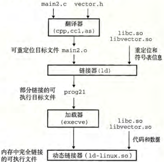

编译动态链接

```sh
> gcc -shared -fpic libvector.so addvec.c multvec.c # -fpic 编译器生成与位置无关的代码
> gcc -o prog2 main2.c ./libvector.so
```

可执行文件包含一个`.interp` 节，这一节包含动态链接器的路径名，动态链接器本身就是一个共享目标 `ld-linux.so`

加载器加载和运行动态链接器，动态链接器通过执行下面的重定位完成链接任务：

- 重定位 `libc.so` 的文本和数据到某个内存段。
- 重定位 `libvector.so` 的文本和数据到另一个内存段。
- 重定位 `prog21` 中所有对由 `libc.so` 和 `libvector.so` 定义的符号的引用。

最后，动态链接器将控制传递给应用程序。从这个时刻开始，共享库的位置就固定了，并且在程序执行的过程中都不会改变。

#### 程序运行中加载/链接共享库

```c
#include <dlfcn.h>
void *dlopen(const char *filename, int flag); //dlopen 函数加载和链接共享库 filename
void *dlsym(void *handle, char *symbol); //dlsym 函数接收一个指向已经打开了的共享库的句柄和一个  symbol 名字
const char *dlerror(void); //dlclose 函数卸载已加载(不再使用)的共享库
```

编译运行时链接

```sh
> gcc -rdynamic -o prog2r dll.c -Idl
```

```c
//dll.c
#include <stdio.h>
#include <stdlib.h>
#include <dlfcn.h>

int x[2] = {1, 2};
int y[2] = {3, 4};
int z[2];

int main() {
	void *handle;
	void (*addvec)(int *, int *, int *, int);
	char *error;
	/* Dynamically load the shared library containing addvecO */
    handle = dlopen("./libvector.so", RTLD_LAZY);
    if(!handle){
        fprintf(stderr, "7ÿs\n", dlerror());
        exit(1);
    }
    /* Get a pointer to the addvecO function we just loaded */
    addvec = dlsym(handle, "addvec");
    if ((error = dlerror()) != NULL){
    	fprintf(stderr, "%s\n", error);
        exit(1);
    }
    /* Now call addvecO just like any other function */
    addvec(x, y, z, 2);
    printf("z = [%d %d]\n",z[0], z[1]);
    /* Unload the shared library */
    if (dlclose(handle) < 0){
        fprintf(stderr, "%s\n", dlerror());
        exit(1);
    }
    return 0;
}
```

#### 位置无关的代码

位置无关代码(Position-Independent Code)：可以加载而无需重定位的代码

对 GCC 使用 `-fpic` 选项指示 GNU 编译系统生成 PIC 代码。共享库的编译必须总是使用该选项。

### 选择/循环结构语句对应的汇编代码

#### 条件码（标志位）

CF：最高位产生进位/借位。可检査无符号操作的溢出

OF：(带符号)补码溢出—— 正溢出或负溢出

SF：带符号，结果负数

ZF：结果0

cmp 类似 sub，test 类似 and，只设置条件码(标志位)而不更新目的寄存器

```assembly
cmp <> <>
je/jne/jg/jge/jl/jle/jz <addr>
```

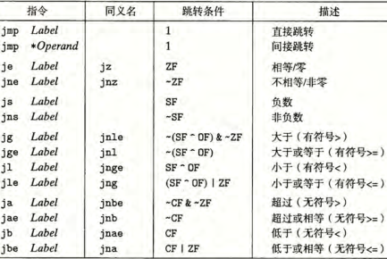

#### 访问条件码


#### 跳转指令编码


#### 条件控制实现条件分支

```c
if (test-expr)
	then-statement
else
	else-statement
        
//等价的go-to控制流
	if (!test-expr)
		goto false;
	then-statement
	goto done;
false:
	else-statement
done:        
```

举例：计算两数之差绝对值的函数

```c
long lt_cnt = 0;
long ge_cnt = 0;
long absdiff(long x, long y) {
    long result;
    if (x < y) {
        lt_cnt++;
        result = y - x;
    } else {
        ge_cnt++;
        result = x - y;
    }
    return result;
}
//等价的goto版本
long gotodiff(long x, long y) {
	long result;
	if (x >= y)
		goto x_ge_y;
	lt_cnt++;
	result = y - x;
	return result;
x_ge_y:
	ge_cnt++;
	result = x - y;
	return result;
}
```

汇编代码

```assembly

```

#### 条件传送实现条件分支

使用数据的条件转移。这种方法计算一个条件操作的两种结果，然后再根据条件是否满足从中选取一个

```c
//v = test-expr ? then-expr : else-expr
	if (!test-expr)
		goto false;
	v = then-expr;
	goto done;
false:
	v = else-expr;
done:   
//等价的条件传送代码
v = then-expr;
ve = else-expr;
t = test-expr;
if (!t) v = ve
```

#### 循环

##### do-while

```c
do
	body-statement
while (test-expr);
//等价goto语句
loop:
	body-statement
    t = test-expr;
    if (t)
	    goto loop;
```

##### while

```c
while (test-expr)
	body-statement
//等价goto语句
    goto test;
loop:
	body-statement
test:        
    t = test-expr;
    if (t)
	    goto loop;
```

##### for

```c
for init-expr ; test-expr; update-expr)
	body-statement
//等价while语句
init-expr;
while (test-expr) {
	body-statement
	update-expr;
}
//等价goto语句
	init-expr;
	goto test;
loop:
    body-statement
    update-expr ;
test:
    t = test-expr;
    if (t)
	    goto loop;
```

##### switch


### 过程(函数)调用对应的汇编代码


#### 运行时栈


#### 转移控制

`call` 指令将其后的下条指令地址 `PC+<当前指令长度>` 作为返回地址压入栈，被调用函数执行 `ret` 指令从栈中弹出该地址（给PC设置）

#### 数据传送


#### 栈上的局部存储


#### 寄存器中的局部存储空间


#### 递归过程


```assembly
call <label>(<addr>)
```

