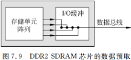
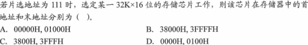
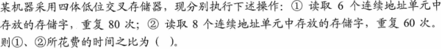
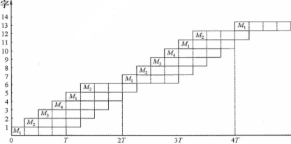
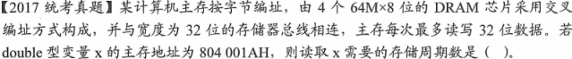
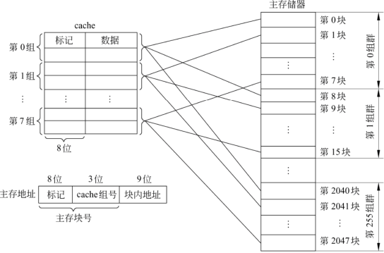
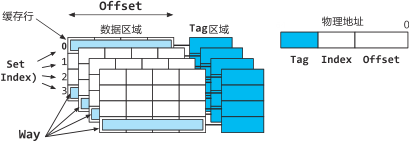
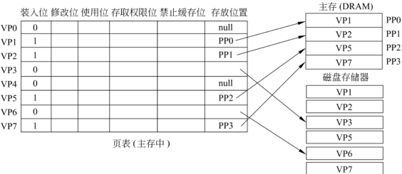

# 3.存储系统

**考纲**

存储器分类，层次化存储器的基本结构

半导体随机存取存储器：SRAM、DRAM、Flash

主存储器：DRAM 芯片和内存条，多模块存储器，主存储器与CPU的连接

外部存储器：磁盘存储器，固态硬盘（SSD）

高速缓冲存储器Cache：Cache基本原理、Cache和主存间的映射关系、Cache中主存块的替换算法、Cache写策略

虚拟存储器：虚拟存储器概念，页式虚拟存储器（原理、页表、地址转换、TLB），段式虚拟存储器原理、段页式虚拟存储器原理

**真题考点**

- 随机存取存储器

- RAM/ROM特点/区别，闪存特点，需刷新的存储器，DRAM扩展芯片的地址/数据引脚数

- 字位同时扩展，用芯片设计主存主存容量，某地址所在芯片的最小地址，MAR最小位数，要求地址引脚最少/尽量减少刷新开销来设计芯片

- 四体交叉编址存储器可能发生访存冲突的地址对，芯片采用交叉编址其读取double型变量的存储周期数

  8体交叉存储 总线完成一次**突发传送总线事务**所需时间

- Cache命中率，二路组相联映射 N号主存块单元所在主存块对应装入的Cache组号，

  指令Cache与数据Cache分离的目的，给定循环方式访问数组时的时间/空间局部性，

  Cache直接映射 数据Cache总容量、数组元素所在主存块对应Cache行号、访问数组的Cache缺失率、程序中数据访问命中率/执行时间，

  Cache缺失时 读取一个主存块需要几个**突发传送总线事务**，已知Cache缺失率及CPI求程序的CPU执行时间

  Cache 8路组相联、直写策略、LRU替换算法，Cache行位格式，循环访问数组 Cache缺失率

  Cache直写/回写策略，Cache缺失处理，从Cache中访问某指令的过程

  Cache直接映射，回写，能存放N个字数据Cache容量

- 页式虚拟存储、TLB全相联映射、TLB标记字段、Cache二路组相联、Cache缺失与缺页处理时间开销对比

  一次访存过程TLB/Cache/Page是否命中的组合其原理，缺页处理概念/特点

  页式存储、TLB全相联映射、某虚拟地址虚实地址变换的结果，Cache直写 完成某指令所需访存次数

  TLB与Cache比较

  TLB 四路组相联、虚拟地址位数、虚页号所在位、物理地址位数、页框（物理页号）所在位，物理地址访问Cache时划分的具体字段，某虚拟地址所在页面是否在主存，虚拟地址对应物理地址，访问是否cache命中

  主存物理地址位数，TLB映射方式，TLB采用的RAM类型，Cache映射方式，Cache LRU替换，Cache回写策略，Cache每行位格式 附加位、有效位的作用，Cache总容量，虚拟地址对应的物理地址，虚拟地址所在主存块映射到Cache组号
  
  页式虚存，指令-cache流水线，Cache数据区容量、指令Cache命中率，可能发生溢出/缺页异常的指令，访问数组需要读磁盘/TLB次数

**错题**

存储器层次：5,6

半导体存储器：5,10,14 | 7,9,10

主存储器：4,11 | 3,4,12,15

多模块存储器：4,5,6,7,8 | 4,6

cache: 1,8,10,13 | 11,15

虚存：2,3,4,7,11,12,13 | 9,11

## 3.1 存储器的分类及层次结构

### 存储器的分类

#### 层次分类

主存 辅存 高速缓存Cache

#### 存储介质分类

磁表面存储器：磁盘、磁带

半导体存储器：MOS型（SRAM、DRAM）、双极型（TTL型、ECL型）

光存储器（光盘）：CD-ROM、DVD-ROM

#### 存取方式分类

##### <u>随机存取RAM</u>

<u>按地址随机存取，易失性</u>

- SRAM（触发器原理）用作高速缓存
- DRAM（电容充电原理）用作主存
- ROM也是随机存取（只读）

##### 顺序存取SAM

按地址顺序访问。如<u>磁带、光盘(串行)</u>

##### 直接存取DAM

既有随机访问、又有顺序访问。如光盘、U盘、<u>磁盘</u>（寻道随机访问、旋转扇区顺序访问）

#### 信息可改写性

##### 读写存储器

##### 只读存储器(ROM)

早期只能读出而不能写入（随机访问），后期可以擦除写入，非易失性

- 掩膜型只读MROM（设定开关）
- 可编程PROM（烧断熔丝，用户写入一次）
- 可擦除可编程EPROM
- 电可擦除可编程（位）EEPROM
- 快擦除读写存储器（块）Flash Memory，使用损耗均衡技术（写操作分散），读比写快

用途：与随机存储器RAM构成主存，可存储固定不变的程序（系统固件）

#### 信息可保存性

##### 易失性存储器

断电后，存储信息即消失。如RAM

##### 非易失性存储器

断电后，存储信息仍保持。如ROM、磁表面存储器、光盘

### 存储器的性能指标

#### 容量/字长

存储容量 = 存储字数 * 存储字长

存储字数表示存储器地址空间大小，字长表示一次存取操作的数据量

#### 存储速度

数据传输率 = 数据宽度 / 存储周期

存取时间Ta：启动一次存储器操作到完成操作经历的时间

存储周期Tm：连续启动两次访问操作之间的最小时间间隔，存储周期Tm = 存取时间 + 恢复时间

主存带宽Bm：数据传输率，b/s, B/s

### ~~多级存储系统~~

从访问频率和存储速度上：寄存器 > 高速缓存 > 主存 > 磁盘

缓存---主存层次：解决CPU和主存速度不匹配

主存---辅存层次：解决存储系统容量问题

## 3.2 半导体随机存储器

### SRAM和DRAM

#### SRAM工作原理

组成：双稳态触发器（6管MOS）存储一位二进制

特点：非破坏性读出，易失性（加电保持），集成度低，功耗大

用途：组成高速缓存


#### DRAM工作原理

组成：单管（1MOS管+1电容C）利用电容C是否带电荷来表示信息

特点：

- 非破坏性读出，易失性（加电刷新保持），集成度高，功耗低（保持状态下没有电流流动）；
- 采用地址线复用技术，地址线数是 SRAM 相同规模下的一半，CPU分时传送行、列地址；
- 按行刷新，刷新时 DRAM 不能响应CPU访问

用途：组成主存


##### 刷新 (存储器R行)

每个存储元上电荷只能维持2ms，每隔2ms必须刷新一次（对存储电容重新充电）

刷新一行的时间 = <u>存储器读写周期</u>（一次刷新过程即对一行数据进行读操作，读后再生）

刷新周期：存储器实际完成两次完整刷新之间的时间间隔 = CPU读写存储器 + 刷新，即某一行的刷新周期，也是刷新完所有R行的一轮周期；一般为 2ms

刷新周期内的刷新时间：完整刷新R行的累计有效时间 = R * 存储器读写周期

最大刷新周期：数据存储到数据丢失之前的时间间隔

**集中刷新**

完整刷新R行的时间集中在一个刷新周期2ms的末尾 

优点：读写操作期间不受刷新操作影响

缺点：存在较长时间死区（CPU不能访问内存）

死时间率 = 刷新周期内的有效刷新时间 / 刷新周期(2ms)

**分散刷新**

按存储器周期间隔进行读写和刷新，读写一次就刷新一次；系统存取周期=2*芯片存取周期

缺点：刷新过于频繁

**异步刷新**

将R次刷新平均分散在刷新周期2ms时间内，每行刷新间隔 $T_r/R$ 

特点：结合了集中刷新与分散刷新

#### RAM芯片内部结构

容量 n 个存储单元

##### 单译码结构

一维行扩展，译码器输入线 $log_2n$​​，​输出线 n 根（对应 n 个字）

##### 双译码结构

二维行列扩展，译码器输入线 $log_2n$，行列各 $\frac{log_2n}{2}$ 根，输出线行列各 $\sqrt{n}$ 根

芯片引脚：读写控制线、<u>片选线</u>、地址线、数据线


##### DRAM地址线(引脚)复用

<u>行地址/列地址通过相同管脚分先后两次输入</u>，译码器输入线数 $\lceil \frac{log_2n}{2}\rceil$​，输出线行列各 $\sqrt{n}$​ 或 $\sqrt{2n},\sqrt{n/2}$​ 根

芯片引脚：读写控制线，<u>行、列地址选通控制线</u>，地址线，数据线


#### DRAM芯片读写周期


##### 读周期


$RA, \overline{RAS}=0, \overline{WE}=1, CA, \overline{CAS}=0, D_{out}$

读时间 $t_A=\overline{WE}\ \&\ CAS$，列地址片选 $\overline{CAS}$ 有效时间内，数据稳定输出到数据总线 

读周期 $t_{RC}$：连续两次读操作的间隔时间，在读时间后，还有输出数据稳定保持时间间隔

##### 写周期


$RA, \overline{RAS}=0, D_{in}, \overline{WE}=0, CA, \overline{CAS}=0$

写时间 $t_W = WE\ \&\ CAS$，列地址片选 $\overline{CAS}$ 有效时间内，数据总线写数据保持的一段时间

写周期 $t_{WC}$​：连续两次写操作的间隔时间，在写时间后，还有数据总线写数据继续保持的时间(写恢复)

#### SRAM和DRAM比较


#### SDRAM

同步DRAM(SDRAM)：自带时钟控制信号，能与系统总线频率同步。第一个列数据就绪后，每经历一个时钟周期即可得到一个数据，<u>突发传输</u>时无需等待，有效减少了数据传输时间的延迟。

DDR SDRAM：内部采用2路预取机制，第一个数据输出后，每个时钟周期可传两个数据（时钟的上升沿+下降沿），$传输频率 = 2 · 数据总线频率 = 2 · DRAM工作频率$

DDR(k)：内部采用 $2^k$ 路预取机制，$传输频率 = 2 · 数据总线频率 = 2 · 2^{k-1} · DRAM工作频率$



### ROM

#### ROM特点

非易失性（断电不丢），集成度高

#### ROM类型

MROM：单MOS管串联开关，由厂商直接设值

PROM：单MOS管串联熔丝，用户一次写入 

EPROM：单MOS管串联一个浮置栅组成的MOS管，高压击穿使其带电，紫外线可使电荷完全泄露(光电导)擦除；<u>可擦除可编程(块)</u>

EEPROM：基于EPROM，在浮置栅上加控制栅极，加电使浮置栅电荷泄露(某一单元)；<u>电可擦除可编程(位)</u>

闪存：通过写命令到命令寄存器来管理擦写，快速/在线擦写

### 补充知识

#### 存储元与存储单元

存储元：存储一个二进制位的物理器件

存储单元：地址码相同的多个存储元构成

#### nMOS和pMOS晶体管

nMOS管：中间栅极g，两边n型源极s+漏极d，p型衬底一般接地GND 栅极g电压0时，源极与漏极之间无电流，晶体管截止状态OFF， 栅极g电压VDD时，栅极与p型衬底之间形成电场电容，下表面负电荷反转为n沟道，两级电流导通ON

pMOS管：中间栅极g，两边p型源极s+漏极d，n型衬底一般接电源VDD 栅极g电压VDD时，源极与漏极之间无电流，晶体管截止状态OFF， 栅极g电压0时，栅极与p型衬底之间形成电场电容，下表面正电荷反转为p沟道，两级电流导通ON

## 3.3 主存储器

### 主存与CPU的连接

**地址线的连接**

地址线的低位与存储芯片地址线连接，作为(交叉)字选；由片内逻辑完成

地址线的高位与译码器链接，作为片选

**数据线的连接**

使CPU数据线数与存储芯片的数据线数一致（芯片位扩展）

**读写控制线的连接**

CPU的读/写控制线与存储芯片的允许读/写控制端相连

**片选线的连接**

CPU访存控制信号线 $\overline{MREQ}$​​ ​：

- 位扩展，直接与所有芯片的片选端 $\overline{CS}$ 相连
- 字/字位扩展，与地址译码器使能端相连，一个译码结果对应一个芯片簇（如果有位扩展）

注：DRAM 芯片没有片选控制线，容量扩展时利用 $\overline{RAS},\overline{CAS}$​ 控制片选

### DRAM芯片与内存条


### DRAM芯片的扩展

#### 位扩展/字长/数据总线扩展

前提：当存储芯片的位宽 k < CPU数据总线的位宽 n，需要 $n/k$ 个存储芯片来深度扩展

CPU内存请求信号 MREQ 分别与每个芯片的片选 $\overline{CS}$ 连接

如：用 8 片 $8K\times 1b$​​ 的 RAM 芯片组成 $8K\times 8b$​​ 的存储器。每片连接 13 根地址线，每片 1 位数据线分别连接一根数据总线


#### 字扩展/容量/地址总线扩展

各存储芯片的片选信号可由CPU多余的地址线（高位）通过译码器译码产生

CPU内存请求信号 MREQ 与译码器使能端连接，译码器分别与每个芯片 $\overline{CS}$​​ 连接

芯片存储单元(片内地址数) $2^n$​​，对应地址码的低位片内地址 n 位，高位地址码为片选信号

如：用 4 片 $16K\times 8b$​​ 的RAM芯片组成的 $64K\times 8b$​​​ 存储器。地址线低 14 位作为片内选字，高 2 位作为片选信号；每片连接 8 位数据总线




```
0011 1|000 0000 0000 0000
0011 1|111 1111 1111 1111
```

#### 字位同时扩展

位扩展填满数据线，字扩展填充高位地址线

CPU内存请求信号 MREQ 与译码器使能端连接，译码器分别与每个芯片 $\overline{CS}$​​​ 连接


### 并行主存(多模块存储器)

- 提高DRAM芯片速度，如SDRAM技术
- 并行结构，如双端口存储器、多模块存储器（时间/空间并行）
- CPU与主存间设置高速缓存Cache

#### ~~双端口RAM~~

具有两组独立的地址线、数据线、读写控制线，两套电路并行读写电路（空间并行）

访问冲突：两端口同时对同一地址写数据或一个写数据，一个读数据 

冲突解决：两端口各设置 $\overline{BUSY}$​ 标志，由判断逻辑决定哪个端口优先进行读写操作，而将另一个端口 $\overline{BUSY}$​​ 置0

应用：一个端口面向CPU，另一端口面向 I/O 或 DMA 设备


#### 多模块存储器

##### 单体多字长

在单体单字的基础上进行多个字长的位扩展，多个存储模块共享地址总线， 按同一地址并行访问不同存储模块上的同一地址对应单元，实现一个存储周期访问多个存储字

缺点：指令/数据若不能连续存放，则效果不明显

##### 多体交叉

###### 高位多体—顺序编址

与**字扩展**一样，高位地址译码产生片选信号，低位片内字选

特点：顺序编址，同一存储体内地址相邻；不同存储模块无法并行访问（程序局部性下 仍是串行）

应用：内存插槽插入内存条直接扩充


###### 低位多体交叉(低m位片选)—交叉编址

高位片内字选，低m位地址译码产生片选信号

特点：交叉编址，同一存储体内相邻单元地址相差m，不同存储体的相邻单元地址连续

访问模块号 = 访问地址 % 交叉模块数；m 体交叉存储，$m_i$​​ 体内单元地址：$i,m+i,2m+i,...,(n-1)m+i$​

应用：突发的顺序访问，Cache、SDRAM​


**流水线轮流访问多体**

设模块存储一个字的存储周期 T，总线传送周期 r，存储器交叉模块数 $m\ge T/r$​（​保证当前体上一次存取已完成）

每经过 r 时间延迟后启动下一个模块，每个存储周期可访存 m 次 

低位交叉编址流水线连续存取 n 个字需时间 $t=T+(n-1)r$​，高位顺序编址需 $t=nT$​

在一次突发传送总线事务中，每个体包括存取时间T+总线传输时间r，连续存取 n 个字需 $t=(n-1)r+T+r=T+nr$

冲突：在 t=T(一个存储周期) 时间 m 次访问中，2次出现在同一存储模块内，前一次可能在写，后一个读/写会出错

【计算】假设1轮需要读 k 个字，重复 n 次所需的周期

读下一轮1体首字需等上一轮第 $\lceil k/m\rceil$ 次访问1体，即第 $m\lfloor k/m\rfloor+1$ 个字结束，轮周期 $=\lceil k/m\rceil T$，最后一轮计开始到结束时间，$t=(n-1)·\lceil k/m\rceil T+T+(k-1)·T/m$​







```
A:10|10
     └---┐
[ ] [ ] [■] [■]
[■] [■] [■] [■]
[■] [■] [ ] [ ]
```

## 3.4 外部存储器

### 磁盘存储器

#### 磁盘逻辑结构


#### 磁盘驱动器

##### 磁盘驱动器的物理组成


##### 磁盘驱动器的内部逻辑


##### 三个操作

- 寻道
- 旋转等待
- 读写

#### 磁盘控制器

是主机与磁盘驱动器之间的接口

##### 磁盘控制器接口逻辑


如图，SCSI接口全部功能均在驱动器内

### 固态硬盘SSD

使用NAND闪存，与U盘没有本质差别

接口标准：SATA、IDE

特点：速度块、抗振性好、安全性高、无噪音、能耗低；数据以页为单位读写，在页所属的整个块被擦除后才能再写


## 3.5 高速缓冲存储器 （Cache-主存层次）

### ~~程序访问的局部性~~

时间局部性：正在使用的信息最近未来也可能使用，如循环访问某一变量

空间局部性：正在使用的信息最近未来可能使用与其临近的信息，如访问数组

### Cache基本原理

Cache和主存被分成若干个固定大小的数据块Block，每个数据块又包含若干个字word

数据缺失时需要将访问数据所在的**块从主存载入Cache行**中（注意是块地址）

#### 主存地址格式、Cache逻辑结构

主存地址

```
            主存块号 | 块内偏移(全相联)
主存块区号 | 行号/组号 | 块内偏移(直接/组相联)
```

Cache行结构

| 有效位 | 脏(一致性)位 | 使用(替换/淘汰)位 | 主存块号/区号tag | 数据块 |
| ------ | ------------ | ----------------- | ---------------- | ------ |

直接/全相联映射的Cache块内单元地址（cache内地址查找）

```
      Cache块号/行号 | Cache块内地址()
```

Cache块容量 = cache行数 $\times$​​ 数据块大小，总容量包括：有效位 | 脏位 | tag位 | (替换位)

主存块区数 = 主存容量 / Cache块容量 = 主存块数 / Cache行数

#### Cache命中/缺失率

Cache命中率：$h=N_c/(N_c+N_m)$​，$N_c$​ 为 Cache 命中次数，$N_m$为主存访问次数

Cache缺失率：$1-h=N_m/(N_c+N_m)$​

Cache-主存系统平均访问时间：$t_a=h·t_c+(1-h)t_m$​，$t_a$​ 应设计接近于 $t_c$​

<u>若平均每条指令需 k 次访存，Cache命中时的 CPI=C，则平均每条指令执行时间</u>：$t_I=T·C+k(1-h)t_m$

访问效率：$e=t_c/t_a=\frac{t_c}{h·t_c+(1-h)t_m}=\frac{1}{h+(1-h)t_m/t_c}$​​

#### Cache读流程

```pseudocode
// Cache Read
tag = addr_tag(RA), offset = addr_offset(RA); //读主存地址——取块号
entry = cache_find(tag);
if !entry then: //miss
	if cache_full() then:
		old_entry = cache_replacer();	//待替换or清除的cache行
		if WRITE_BACK && old_entry.dirty then:	//写回 & 脏数据
			Mem_Write_Block(old_entry.tag, old_entry.block);
		cache_reset(old_entry);
	block = Mem_Read_Block(tag);
	entry = cache_create({valid, tag, block}); //load data block, update cache table
word = cache_read_word(entry, offset); //read hit
```

#### Cache写流程

```pseudocode
// Cache Write
tag = addr_tag(WA), offset = addr_offset(WA); //写主存地址——取块号
entry = cache_find(tag);
if !entry then: //miss
	if NON_WRITE_ALLOCATE then: //非写分配
		Mem_Write_Word(WA, word); 
		return; 
	//写分配
	if cache_full() then:
		old_entry = cache_replacer();	//待替换or清除的cache行
		if WRITE_BACK && old_entry.dirty then:	//写回 & 脏数据
			Mem_Write_Block(old_entry.tag, old_entry.block); 
		cache_reset(old_entry); // WRITE_BACK && !old_entry.dirty || WRITE_THROUGH
	block = Mem_Read_Block(tag); 
	entry = cache_create({valid, tag, block}); //load data block, update cache table 
cache_write_word(entry, offset, word); //write hit
if WRITE_BACK then:		//写回
	cache_update(entry, {dirty: 1});
else if WRITE_THROUGH then:	//全写/直写/写直通/写穿
	Mem_Write_Block(block);
```

关键技术：数据查找、地址映射、替换策略、写入策略

### Cache-主存映射 相联存储/内容可寻址存储CAM

#### 全相联映射

主存中每一个数据块都可以放到Cache任意一行中，一对所有行映射关系

主存地址格式：

```
             主存块编号tag | 块内偏移offset
```

Cache行结构：

| 有效位 | 主存块编号tag | 数据块block |
| ------ | ------------- | ----------- |

特点：有空行就顺序载入---利用率高，cache满时根据替换算法进行数据块替换； 

n 行需要 n 路并发比较电路（每行一个）---成本高


#### 直接相联映射 =1路组相联

每个主存块只能映射到 cache 中固定的行，每 n 个主存块映射到 cache 中 0~n-1 行

不同区的同一索引主存块<u>直接相联映射</u>到同一 cache 行

$cache行号 = 主存块号 \mod (cache行数n)$​，即行索引字段

主存地址格式：

```
主存块区号tag | 行索引index | 块内偏移offset
```

Cache行结构：

| 有效位 | 主存块区号tag | 数据块block |
| ------ | ------------- | ----------- |

特点：index 相同的主存块映射到 cache 中同一特定行---利用率低、命中率低、冲突率高

只与对应 index 的 cache 行比较一次区号---成本低，冲突时直接替换


直接映射实现


#### 组相联映射

将 cache 分成固定大小的组，每组 k 行，k路组相联（组号确定后进行组内 k 行比较）；

不同区的同一索引主存块<u>直接相联映射</u>到同一 cache 组，再<u>全相联映射</u>到组内 k 行中任一行

同一组下缓存行数（Tag 数）称为路

$cache组数=2^{index位数}=n/k$​​

$cache组号=主存块号 \mod (cache组数=n/k)$​，即组索引字段​

主存地址格式

```
主存块区号tag | 组索引index | 块内偏移offset
```

Cache行结构：

| 有效位 | 主存块区号tag | 数据块block |
| ------ | ------------- | ----------- |

如图：8组2路组相联



如图：4组4路组相联



如图：256组2路组相联


硬件实现


#### 三种映射比较

主存块与cache行，直接映射一对一行，组相联一对组内k行，全相联一对所有行N（任意行）

- 关联度越低，命中率越低；直接映射命中率最低，全相联命中率最高
- 关联度越低，判断是否命中的比较开销越小，命中时间越短；直接映射命中时间最短，全相联命中时间最长
- 关联度越低，标记所占额外空间开销越少；直接映射额外空间开销最少，全相联额外空间开销最大

### Cache中主存块的替换算法

#### 先进先出FIFO

选择最先载入的cache行进行替换

缺点：不考虑程序访问的局部性，命中率不高

#### 最不经常使用LFU

将被访问次数最少的cache行淘汰：新载入行计0，命中行计数累加；淘汰时选计数小的（计访问次数）

特点：计数包含历史；但不能严格反映近期访问情况

#### 近期最少使用LRU

将近期最久未访问过的行淘汰：新载入行/命中行计数0，其它数据行计数累加，淘汰时选计数大的（计未访问次数）

特点：保护刚载入的新数据，符合cache工作原理


```cpp
void* lru(struct lru_cache cache, unsigned long pfn) {
    pages = cache->pages;
    struct page *newp = pfn_to_page(pfn);
    struct page *p = find(pages, [](it) => *it == *newp);
    for (auto it : pages)
        it->_count++;
 	if (p) {
        p->_count = 0;
        return NULL;
    } 
    newp->_count = 0;
    if (mem_page_free()) {
        pages.push(newp);
        return NULL;
    } else {
        struct page *oldp = find(pages, [](a, b) => a->_count > b->_count);
        pages->insert(oldp, newp); //replace
        return oldp;
    }
}
```

#### 随机替换

效果稍逊于 LFU 和 LRU，TLB 中采用

### Cache一致性(写策略)

写cache时，写分配+写回搭配，非写分配+全写搭配

#### 写命中

##### 全写/直写法

<u>同时修改cache和主存同一数据块</u>，无需设置修改dirty位，替换时数据块直接丢弃；

特点：仅维护单CPU下的cache-主存数据一致性

##### (替换)写回

<u>只修改cache内容而不立即写入主存</u>，需设置修改(脏)dirty位，替换时若脏位有效 则将脏数据写回主存；

特点：带来数据不一致性

#### 写不命中

写分配法：加载主存块到cache中

非写分配法：只写入主存，不载入块到cache

### Cache结构

由SRAM组成（速度快于主存DRAM）


### C语言补充

对数组元素的操作 `a[i]=a[i]+1; //读写各一次，共两次访存`

## 3.6 虚拟存储器 （主存-辅存层次）

### 基本概念

引入虚存的目的：解决内存容量不够

虚存设计依据：程序局部性原理

虚拟地址空间将主存和辅存地址空间统一编址，每个进程都有独立的虚拟地址空间；

CPU使用虚地址VA，通过硬件MMU找出其对应的实地址PA，

- 若内存该地址内容存在则访问
- 否则将字所在页/段调入主存再返回，若主存满则需要替换页/段

虚地址 = 虚存页号 + 页内偏移(字索引)

实地址 = 主存/物理页(框)号 + 页内偏移(字索引)

辅存地址 = 磁盘号 + 盘面号 + 磁道号 + 扇区号

### 页式虚存

内存划分为大小相等的较小块（页框），作为内存的基本单位；

进程也以块（页框）为单位划分，执行时装入多个非连续的内存块（页框）中。

**特点**

- 页表项长度 = 内存页长度，占用主存空间大； 
- 页面长度固定，但程序不可能正好是页面的整数倍，程序最后1页会造成浪费（页内碎片）

- 若页面很小，主存页面较多，(内存满后)缺页率增加，频繁换页，速度变慢；

  若页面很大，主存页面较少，装/换页时间变长，速度变慢；

访存：虚地址查页表（缺页时页面置换）、物理地址访存


#### 页表

| 有效位 | 脏位 | 使用位(替换) | 物理页号/磁盘地址 |
| ------ | ---- | ------------ | ----------------- |

页表项索引 = 虚拟页号

`valid=1` 存物理页号——命中，`valid=0` 表示空项 或 存的磁盘地址——缺页



**虚实地址**

```
	 | 页号VPN(页表项索引) | 页内偏移offset |
	VPN_MASK =	111110000	PAGE_SHIFT = 4
OFFSET_MASK =	000001111
| 物理页帧号PFN(页表项内容) | 页内偏移offset |
PFN_MASK =	  11111110000	PAGE_SHIFT = 4
```

**虚实地址转换**：

```pseudocode
PTEA = [PTBR] + VA.VPN
PTE = PT[PTEA]
if !PTE.valid then:
	PTE.PPN = Read_Disk(PTE.disk_addr)
PA = PTE.PPN + VA.offset
```

例：对 VP3 中的字的引用不命中，触发缺页； 缺页处理程序选择 VP4 作为牺牲页，并从磁盘上用 VP3 的副本取代它。在缺页处理程序重新启动导致缺页的指令之后，该指令将从内存中正常地读取字，而不会再产生异常


#### 快表TLB

考虑程序执行的局部性原理，将经常访问的内存页对应的页表项存到转换旁路缓存TLB快表（即页表的子副本）

先差快表再查页表，或两个同时查，块表命中则页表查找停止；

虚拟地址

```
                 虚拟页号VPN | 页内偏移offset(全相联)
页表项区号TLBT | TLB组索引TLBI | 页内偏移offset(组相联)
```

快表项

| 有效位 | VPN虚拟页号 | PPN物理页(框)号（全相联） |
| ----- | ---------- | ------------------------- |

| 有效位 | TLBT标记 | PPN物理页(框)号（组相联） |
| ----- | ------ | ------------------------- |

##### TLB-Cache 多级页式存储

虚地址->TLB, 页表 -> 物理地址->Cache, 主存

**CPU访存过程**


**TLB-Cache的地址-表项映射流**


```pseudocode
function access_data(va)->word: 
	tlbe = tlb_lookup(va.vpn);		//相联
	if !tlbe || !tlbe.valid then: 	//tlb miss, full or invalid
		ptea = MMU.PBTR + va.vpn; 	//pte addr
        pte = access_cache(ptea);	//find pte from cache/mem
        if tlb_full() then:			//tlb full
            tlbe = tlb_replacer(); 
        if !pte.valid && pte.disk_addr then://page miss, pte.disk_addr
            page = access_mem(pte.disk_addr);
            pte.pfn = page_to_pfn(page);
            pte.valid = 1;
            access_cache(ptea, pte);	//update pte into cache/mem
        tlb_update(tlbe, pte);			//update tlbe with pte
    pa = tlbe.pfn + va.offset;
    word = access_cache(pa);
	return word;

function access_cache(pa, word?)->word|bool:
	entry = cache_find(pa.tag);			//相联
	if !entry || !entry.valid then:		//cache miss, full or invalid
		if cache_full() then:
			entry = cache_replacer();	//待替换or清除的cache行
			cache_reset(old_entry);
		page = access_mem(pa & PAGE_SHIFET);//load page_table/page/block
        entry = cache_update(entry, {valid, tag, page}); 
    if word then: //write
    	return cache_write_word(entry, word);
	return cache_read_word(entry, pa.offset);
	
function access_mem(pa: mem_addr|disk_addr)->page:
	page = mem_find(pa);	//if pa is ptea or pfa, page exists?
	if !page then:			//disk data is uncached in mem
		if mem_full() then:
			//swap to disk, update swapped pte invalid, disk_addr
			page = page_replacer();	
		block = Disk_Read_Block(pa);//load block from disk
		page = malloc({valid, pa, block});
	return page;
```

**TLB、Page、Cache缺失情况**

page命中时，TLB与Cache是否命中没关系；若TLB命中，页一定在主存； 

page缺失时，TLB无对应表项，页(数据)不在主存，cache不可能命中（一般虚拟系统初始化时）


### 段式虚存

进程被划分为多个大小不等的逻辑段，执行时装入多个非连续的内存动态分区中作为物理段。

特点：段分界与程序逻辑分界对应，可共享/保护；但段长度可变，分配空间易留下内存碎片

**段表项**：

| 有效位 | 段首址 | 段长 |
| ------ | ------ | ---- |

**地址结构**

```
	 | 段号VSN(段表项索引) | 段内偏移offset |
	VSN_MASK =	111110000	SEG_SHIFT = 4
OFFSET_MASK =	000001111
| 段地址SA(段表项内容)     | 段内偏移offset |
```


### 段页式虚存

内存划分为大小相等的较小块（页框），作为内存的基本单位；

进程被划分为多个大小不等的逻辑段，每段（对应一个页表）分成多个大小固定的页；执行时装入多个非连续的内存块（页框）中。

缺点：两次查表开销

**段表项**：

| 有效位 | 页表基址 | 段长 |
| ------ | -------- | ---- |

**地址结构**

```
| 段号VSN(段表项索引) | 页号VPN(页表项索引) | 页内偏移offset |
	VSN_MASK =	111100000000	PTE_PAGE_SHIFT = 8
	VPN_MASK =	000011110000	PAGE_SHIFT = 4
OFFSET_MASK =	000000001111
```

### 虚存与Cache的比较

相同：地址映射，替换算法，更新策略；程序局部性原理；CPU检测 缺页/不命中 并中断处理

不同：

- cache主要解决系统速度，虚存为了解决主存容量； 
- 虚存不命中对系统性能影响更大，需要先由磁盘调入内存，不能直接与CPU通信
