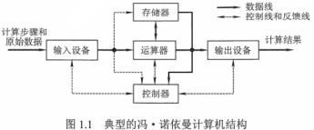
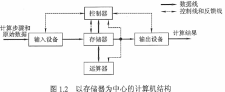
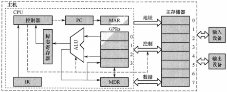

# 1.计算机系统概述

**考纲**

层次结构：计算机系统的组成，硬件的组成，软件和硬件的关系，计算机系统的工作原理（存储程序工作方式，高级/机器语言程序之间的转换，程序和指令的执行过程）

性能指标：吞吐量，响应时间，CPU时钟周期，主频，CPI，CPU执行时间，MIPS，MFLOPS，GFLOPS，TFLOPS，PFLOPS，EFLOPS，ZFLOPS

**真题考点**

- 已知字长/主频/CPI，求CPU/总线时钟周期，总线带宽(最大数据传输率)

## 1.1 系统层次结构

### 计算机系统组成

硬件：功能使用频繁、实现成本低

软件：灵活性高，效率实现往往不如硬件

共同点：逻辑上等效（不是等价）

### 计算机硬件的基本组成

#### 早期冯诺依曼机

5大组成部件：运算器+控制器（CPU）、存储器、输入、输出设备

特点

- 指令与数据载体：共存于存储器M，按地址访问

- 指令与数据构成形式：二进制代码

- 指令组成：操作码+地址码，地址码指出操作数地址

- 指令顺序：顺序存放，默认顺序执行，特定条件下会改变执行顺序

- 以**运算器**为中心

工作方式：控制流驱动

存储程序和程序控制思想：指令/数据以二进制存到存储器，控制器逐条从存储器取出指令并顺序执行

#### 现代计算机的组织结构

以**存储器**为中心，IO操作尽可能绕过CPU，直接在IO与存储器之间完成（DMA）

#### 计算机功能部件

##### 存储器

- 主存（内存）：CPU直接访问，按地址存取。（<u>注：相联存储器按内容访问</u>）

-  辅存（外存）：必须调入主存后才能为CPU所访问

主存逻辑：--->地址寄存器MAR$\xrightarrow{译码}$​存储体M--->数据寄存器MDR\<--->

时序控制逻辑：产生所需的各种时序信号

存储字：每个存储单元包含若干存储元件(存0或1)，存储单元存储的一串二进制代码——存储字 

存储字长：每个存储单元的存储元件个数（存储字的代码位数），1B(8bit)或字节偶数倍

MAR：寻址

- MAR位数：地址码长度 = log2(地址空间数=最大存储单元数) 
- MAR长度：与PC的长度相等？

MDR：暂存存储器中的读写信息

- MDR位数：与存储字长相等

##### 运算器

功能：算术、逻辑运算

核心：算术逻辑单元 ALU

通用寄存器：用于暂存操作数和中间结果

- 累加器 ACC，
- 乘商寄存器 MQ
- 操作数寄存器 X
- 变址寄存器 IX，基址寄存器 BR

程序状态寄存器 PSW（标志寄存器）：存放ALU运算得到的一些标志/状态信息。

- 结果是否溢出
- 有无产生进位/借位
- 结果是否为负

##### 控制器

功能：指挥各部件自动协调工作

程序计数器 PC：存放当前欲执行指令的地址，自动+1形成下一条指令地址，连通MAR

指令寄存器 IR：存放当前指令（来自主存-\>MDR）

- 操作码OP--->CU
- 地址码Ad--->MAR（去取操作数）

控制单元 CU

- 分析指令并发送微操作命令序列
- 控制修改 PC 以得到下一指令地址
- 控制ALU执行什么运算
- 控制主存进行读/写操作

##### 总线

地址线：MAR--->主存

控制线：读/写信号线指出数据是：主存读出到CPU / CPU写入主存

数据线：MDR\<--->主存

##### 寄存器总结

IR、MAR、MDR对用户是透明不可见的

PC、通用寄存器、状态寄存器对用户不透明可见 

### 计算机软件的分类

#### 按功能分类

系统软件：作为系统资源给用户，如操作系统、数据库管理系统，标准库程序，服务程序

（如解释程序逐条解释运行）

应用软件：用户为解决某个应用领域的问题编写的程序

#### 语言分类

- 机器语言：二进制代码语言。计算机唯一可以直接识别和执行的语言

- 汇编语言：用英文+符号代替二进制的指令代码。---汇编程序翻译--->机器语言

- 高级语言：---编译程序编译--->汇编语言

### 计算机系统的工作原理

#### 从源代码到可执行程序

1. 把程序和数据装入主存

2. 将源程序转换成可执行文件
   - hello.c$\xrightarrow{预处理器\ cpp}$hello.i$\xrightarrow{编译器}$汇编程序hello.s$\xrightarrow{汇编器\ as}$可重定位目标程序hello.o$\xrightarrow{链接器\ ld}$可执行目标程序hello
   - 预处理：将头文件插入到程序文件，生成 hello.i
   - 链接：链接器 ld 将多个可重定位目标文件(二进制)(hello.o) + 标准库函数(printf.o)合并-->可执行目标文件
3. 从可执行文件的首地址开始逐条执行指令

#### 指令的执行过程

1. 取指令：PC-\>MAR-\>M-\>MDR-\>IR

   程序计数器+1：(PC)+1-\>PC

2. 分析指令：OP(IR)-\>CU

3. 执行指令：Ad(IR)-\>MAR->M-\>MDR-\>运算器

**1.2 错题**：1,10,15,17,20

## 1.2 计算机性能指标

**机器字长**

CPU一次整数运算处理的二进制数据位数，决定计算精度。 一般与CPU内部数据通路部件（通用寄存器、运算器、数据总线）的位宽相等

**主存容量**

字数 * 字长。MAR位数反映最大寻址范围（最大寻址范围不等于实际寻址范围）

### 运算速度

#### 吞吐量

系统在单位时间内处理请求的数量。主要取决于主存的存取周期

#### 响应时间

用户发送请求，到系统对请求作出响应并获得结果的等待时间。

响应时间 = CPU运行时间 + 等待时间（存储器+IO）

#### 主频

时钟频率，每秒时钟周期数，是衡量速度的重要参数，GHz=1000MHz

#### CPU时钟周期

最小的时间单位，主频的倒数，T=1/f

注：CPU周期(机器周期)=多个时钟周期=指令的每个阶段(基本操作)所花费时间

#### CPI

Clock cycle Per Instruction 执行一条指令所需的平均时钟周期数

如：一个程序包含总指令条数 IC，执行所需时钟周期数 m，$CPI=\frac{m}{IC}$​

若每类指令使用频率 Pi，每类指令的条数 ICi

$CPI=\sum_{i=1}^n (CPI_i\times P_i)=\sum_{i=1}^n(CPI_i\times \frac{IC_i}{IC})$

#### CPU执行时间

执行一个程序的时间。t = 所需时钟周期数 * 时钟周期 = 指令数 IC * CPI * T

因素：指令条数 IC、CPI、主频 f

#### 计算能力

- MIPS：每秒执行百万条指令数

  MIPS = $指令数IC / 执行时间\ t(IC) \times 10^6 = 主频 f(MHz) /CPI$​​​​​

- MFLOPS：Mega 每秒执行 $10^6$​ ​次浮点运算 
- GFLOPS：Giga 每秒执行 $10^9$​​ 次浮点运算 
- TFLOPS：Tera 每秒执行 $10^{12}$​​​ 次浮点运算 
- PFLOPS：Peta 每秒执行 $10^{15}$​​​ 次浮点运算 
- EFLOPS：Exa 每秒执行 $10^{18}$​​​ 次浮点运算 
- ZFLOPS：Zetta 每秒执行 $10^{21}$​​​ 次浮点运算 

**错题**：8,10,12,14,16