**考纲**

文件：文件概念，**文件元数据和索引节点(inode)**，文件的操作：建立/删除/打开/关闭/读/写，文件逻辑结构，**文件物理结构**，文件保护

目录：概念，树形目录，**目录的操作**，硬链接和软链接，

文件系统：文件系统全局结构(layout)，**文件系统在外存/内存中的结构**，外存空闲空间管理，虚拟文件系统，**文件系统挂载(mounting)**

**知识框架**

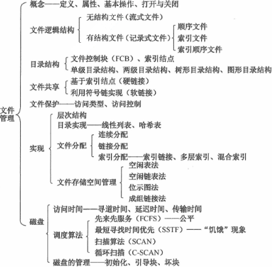

[linux/fs.h](https://elixir.bootlin.com/linux/v3.0/source/include/linux/fs.h) | [linux/fs_struct.h](https://elixir.bootlin.com/linux/v3.0/source/include/linux/fs_struct.h) | [linux/dcache.h](https://elixir.bootlin.com/linux/v3.0/source/include/linux/dcache.h) | [linux/mount.h](https://elixir.bootlin.com/linux/v3.0/source/include/linux/mount.h)

真题考点：

- 设置文件目录的目的，文件结构及其功能，文件相关系统调用过程(open/read/write/delete)，符号/硬链接/引用计数，文件访问优化，多进程访问同一文件
- 文件物理结构，索引结点inode，索引与磁盘访问块，位图与磁盘块，管理空闲磁盘块的结构，磁盘空间分配，文件目录结构与文件数量上限
- SCAN电梯调度，磁头移动过程，磁盘格式化，调度算法与访问磁道的关系，磁盘快/扇区/内存块大小关系

错题：

文件：5,7,8,12,15,16,21,24,25,26,27,29

文件系统：7,8,12,13,14,15,16,18,20,21,22

## 1. 文件
### 文件概念

**文件对象file**：表示进程/文件系统已打开的文件；包含：

- `f_pos`当前偏移位置 (文件指针)
- `f_dentry` 指向目录项的指针 
- `f_flags` 打开文件时指定的标志
- `f_count` 文件对象的使用计数
- `f_op` 文件对象操作，文件对象由 `open` 系统调用创建，`close` 系统调用撤销，实际调用文件操作表里的方法

**目录项dentry**：表示路径的一个组成部分；当前目录项包含名称，指向索引结点 `inode` 的指针，<u>子目录/文件的目录项链表指针</u>

**索引结点inode**：文件属性等元数据，如硬链接数、进程引用计数、设备参数

多个进程可能同时打开/操作同一文件，同一文件也可能存在多个对应对应的文件对象，但一个文件对应的索引结点与目录项对象是唯一的

### 文件元数据和索引节点(inode)

索引结点：文件属性等元数据，如硬链接数、进程引用计数、设备参数、所属、地址空间映射

### 文件操作

open, close, read, write, seek, delete

truncate：文件属性不变，擦除内容，释放空间

```c
int open(char *filename, int flags, modest mode);
int close(int fd);
ssize_t read(int fd, void *buf, size_t n);
ssize.t write(int fd, const void *buf, size_t n);

int stat(const char *filename, struct stat *buf);
int fstat(int fd, struct stat *buf);
```

#### 文件的打开与关闭

- open：根据文件名搜索，确保目录项创建，再创建文件对象结构，将其链接到进程/系统打开文件表，引用计数 `count++`，返回文件描述符 fd，用来操作文件
- close：引用计数 `count--`，若 `count==0`，且文件执行了写入，则先写回外存，再删除文件结构

<u>注：问某文件被用户进程首次打开 `open` 的过程，系统为其创建文件对象，并未将文件内容读到内存（那是 `read`）</u>

### 文件逻辑结构

- 字符流，如：源代码、目标代码文件

- 记录型文件：文件由一组相似的记录组成，每个记录包含若干个域名及对应的域值（基本数据项）

  - 顺序文件：记录包含一个关键字，用来唯一标识该记录；

    定长记录文件支持随机访问；平均查找 n/2 次

  - 索引文件：对于变长记录的顺序文件，引入索引表；索引项顺序对应文件记录顺序，索引项包含文件关键字，文件指针，支持随机访问

  - 索引顺序文件：对顺序文件中所有文件分若干组，索引项顺序对应文件记录顺序，索引项包含关键字、指向一组文件的起始位置的指针；

    顺序文件 n 个记录的最少(查找)分法即 $\sqrt{n}$ 组，每组指向 $\sqrt{n}$ 个记录的首址，平均查 $\sqrt{n}$ 次
  
  - 散列文件：Hash Bucket 存储，$addr = Hash(key)$

### 文件物理结构

连续文件、链式文件、索引块直链

### 文件保护

#### 访问控制

**设置用户权限**

文件所属用户类型：owner, group, other

每个用户类型的操作类型：r, w, x（用户可 `cd` 到设置了 `x` 的子目录）

```c
drwxr-xr-x 1 35398 197609     0 8月  13 05:41 ./
drwxr-xr-x 1 35398 197609     0 8月   1 23:02 ../
-rw-r--r-- 1 35398 197609 17868 8月  13 05:41 file.md
```

注：多用户存取权限保护 可用存储控制矩阵描述，此例为 3行3列

**设置口令/密码**

加密/解密文件

## 2. 目录

### 目录概念

目录项：表示路径的一个组成部分；当前目录项包含名称，指向索引结点 `inode` 的指针，<u>子目录/文件的目录项链表指针</u>

一个文件对应的索引结点与目录项对象是唯一

### 目录结构

引入多级目录可以避免命名冲突

- **树形目录**：由根目录逐层向下级联，进程相关的文件目录信息包括：根目录、当前工作目录 `pwd`；便于分类管理，但不便于实现文件共享
- ~~无环图目录~~：在树形目录基础上增加指向同一结点的有向边，结点包含使用计数器，实现文件共享

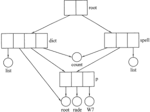

### 目录操作

```c
DIR *opendir(const char name);
struct dirent *readdir(DIR *dirp);
int closedir(DIR *dirp);
```

### 硬链接和软链接

#### 硬链接

硬链接目录项的 `d_inode` 指向目标路径末端目录项对应的同一文件的 inode

即同一文件的 inode 可被若干不同路径的末端目录项 `d_inode` 指针引用

索引结点硬链接使用计数 `i_nlink` 为 0 时删除该文件

```c
int (*link) (struct dentry *old_dentry,struct inode *dir,struct dentry *dentry);
```

shell

```sh
ln <source> <linkname>
```

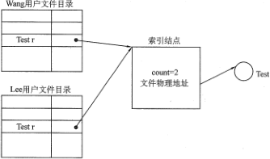

####符号链接

符号链接目录项的 `d_inode` 指向一个独立的 inode，该 inode 数据段包含目标路径的字符串；

文件删除后，其对应的符号链接均无效

```c
int (*symlink) (struct inode *dir,struct dentry *dentry,const char *symname);
```

shell

```sh
ln -s <source> <linkname>
```

**硬链接与软链接关系**

```sh
> ls -al foo*
-rw-r--r-- 3 35398 197609 4 Oct 28 22:23 foo.hard
-rw-r--r-- 3 35398 197609 4 Oct 28 22:23 foo.hard2
-rw-r--r-- 1 35398 197609 4 Oct 28 22:23 foo.sym
-rw-r--r-- 1 35398 197609 4 Oct 28 22:23 foo.sym2
-rw-r--r-- 3 35398 197609 4 Oct 28 22:23 foo.txt
> stat foo*
  File: 'foo.hard'
  Size: 4               Blocks: 1          IO Block: 65536  regular file
Device: 4a686077h/1248354423d   Inode: 35747322042552797  Links: 3
  File: 'foo.hard2'
  Size: 4               Blocks: 1          IO Block: 65536  regular file
Device: 4a686077h/1248354423d   Inode: 35747322042552797  Links: 3
  File: 'foo.sym'
  Size: 4               Blocks: 1          IO Block: 65536  regular file
Device: 4a686077h/1248354423d   Inode: 7881299348548797  Links: 1
  File: 'foo.sym2'
  Size: 4               Blocks: 1          IO Block: 65536  regular file
Device: 4a686077h/1248354423d   Inode: 10414574138913593  Links: 1
  File: 'foo.txt'
  Size: 4               Blocks: 1          IO Block: 65536  regular file
Device: 4a686077h/1248354423d   Inode: 35747322042552797  Links: 3
Access: (0644/-rw-r--r--)  Uid: (197609/   35398)   Gid: (197609/ UNKNOWN)
```

```
dentry:foo.txt	----─╮	
					 inode:xxx
dentry:foo.hard	----─╯  
                       
dentry:foo.sym	---->inode:yyy(foo.txt)
```

## 2. 文件系统

### 文件系统结构(layout)
- 系统调用接口
- 虚拟文件系统VFS
- 各类独立文件系统，如：FAT32, NTFS, ext2/3/4, UFS, NFS, iso9660(CD-DOM), proc
- 设备驱动

#### 文件系统的外存结构


#### 文件系统的内存结构


### ~~目录实现~~

- 线性表，线性检索
- hash表，根据文件名得到一个地址，指向线性列表的某个元素

### ~~文件存储块分配~~

文件系统为每个文件创建一个<u>索引表</u>，存放文件数据块在磁盘的位置

#### 连续分配

文件在磁盘上占有一组连续的块，分配表目录项<u>包含文件起始块号、块数</u>

优点：支持顺序且直接访问，磁盘寻道数与寻道时间最小

缺点：文件长度<u>不便动态增加</u>（只适用长度固定的文件），<u>顺序存放易产生外部存储碎片</u>

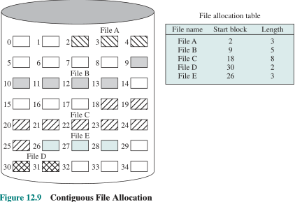

#### 链式分配

文件在磁盘上离散在不同位置的块，前后记录块通过指针相连

- 隐式：分配表目录项包含文件起始块号、最后一块号或块数，每个块包含指向下一块号（磁盘链式查找）
- 显式：每个磁盘建立文件分配表FAT，存放所有物理块号，表的每一项包含指向该表下一分配项的指针（分配表链式查找）

优点：支持文件长度动态增长（动态分配）

缺点：需为文件多个块分配指针空间，<u>不支持文件的直接访问</u>，指针的可靠性问题

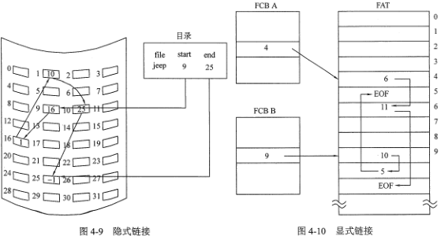

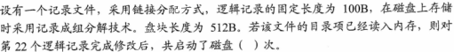

#### 索引分配

每个文件有一个<u>索引块</u>，存放文件若干物理块号，分配表目录项包含文件索引块号

优点：支持直接访问

缺点：需为索引块分配空间，索引块分配大小未知

<u>注意：用到的是索引块，不是索引结点 inode</u>

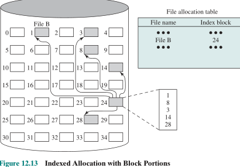

**解决索引块分配问题**

- 一个物理块包含多个索引块
- 多级索引：针对大文件，一级索引块指向下一级索引块，最后一级索引块指向文件块
- 组合索引：直接索引块指向文件块，多级索引块指向下一级索引块

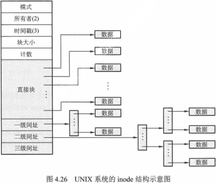

分配方式比较

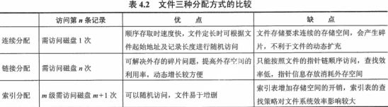

### 磁盘空闲块管理

块设备的扇区长度都是512B

块设备的块长度则有512/1024/2048/4096B等。块的最大长度受特定体系结构的内存页长度的限制。如：IA-32系统支持的块长度为4096B = 内存页长度4096B

设备驱动程序一次从块设备取出一个完全块的数据，因此对块设备的访问有大规模的缓存

#### 空闲表

表项包含：起始空闲块号，空闲块数

空闲块的分配类似内存块的动态分配

如：<u>文件分配表 FAT</u>

#### 空闲链表

- 空闲块链：每个空闲块包含指向下一空闲块的指针
- 空闲区链：将连续的空闲块内部链接成为一个空闲区，每个空闲区包含指向下一空闲块的指针（二维链式）

#### 位图/位表

每个字包含固定bit位长度，每一个bit位表示块，空闲0，已分配1

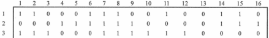

一个内存块可表示的磁盘块数 = 8*块大小(B)，磁盘总块数 = 磁盘容量(B) / 块大小(B)

位表占用的内存块字节数(B) = 磁盘总块数 / (8块/B) = 磁盘容量(B) / (8*块大小(B))

注：计算某个盘块号在位图的哪个块及块内字节/比特时，注意编号是否从0开始

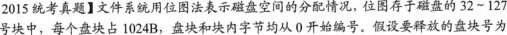

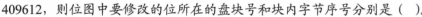

409612 / 8192 = 50...12

从0开始编号，即 $32+\lfloor 409612 / 8192\rfloor=82$块，$\lfloor 409612 \% 8192\rfloor=1$号字节；

从1开始编号，即 $32+\lceil 409612 / 8192\rceil=83$块，$\lceil 409612 \% 8192\rceil=2$号字节；

#### 成组链接

初始 0 号扇区保存第一组顺序 $1...n$​​​ 号空闲扇区地址，组末 n 号扇区存储第二组顺序 $n+1...2n$​​​ 号空闲扇区地址；……

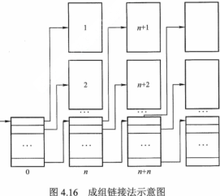

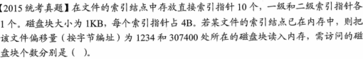

### 虚拟文件系统VFS
文件结构：文件目录、文件操作

文件目录结构：目录名，索引结点、目录操作

索引结点结构：索引结点操作、文件操作、地址空间映射

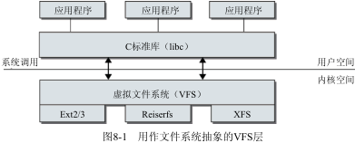

#### VFS 结构

一个文件系统对应一个超级块，超级块维持一个文件系统打开文件表；

一个进程维持一个进程打开文件表，对同一文件(inode)的多次打开对应多个文件(file)结构实例，

```
super_block─╮
			file->dentry->inode->address_space->page
task_struct─╯
```

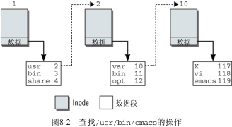

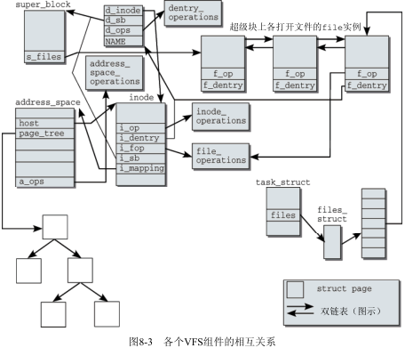

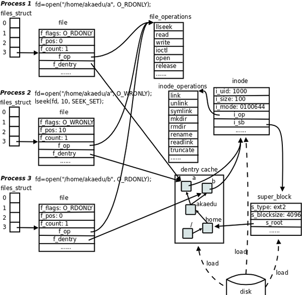

##### inode

```c
/* linux/fs.h#L738 */
struct inode {
    struct hlist_node	i_hash;
    struct list_head	i_list;
    struct list_head    i_sb_list;
    struct list_head    i_dentry; /* 所依附的同名硬链接目录 */
    unsigned long		i_ino; /* 编号标识 */
    atomic_t		    i_count; /* 使用计数，访问该inode结构的进程数目 */
    unsigned int	    i_nlink; /* 计数，记录使用该inode的硬链接总数 */
    uid_t			    i_uid;
    gid_t			    i_gid;
    dev_t			    i_rdev; /* 表示与哪个设备进行通信 struct block_device */
    unsigned long	    i_version;
    loff_t			    i_size; /* 文件字节长度 */
    struct timespec	    i_atime; /* 最后访问的时间 */
    struct timespec	    i_mtime; /* 最后修改的时间 */
    struct timespec	    i_ctime; /* 最后修改inode的时间 */
    unsigned int	    i_blkbits; /* block size in bits */
    blkcnt_t		    i_blocks; /* 文件块长度 */
    umode_t			    i_mode; /* 文件类型和访问权限 */
    struct inode_operations *i_op; /* 管理文件结构性及元数据的操作 */
    const struct file_operations *i_fop; /* 操作文件中包含的数据 */
    struct super_block	*i_sb;
    struct address_space *i_mapping;
    struct address_space i_data; /* mapping for device */
    struct dquot	    *i_dquot[MAXQUOTAS]; /* disk quotas for inode */
    struct list_head    i_devices; /* 设备文件链表 */
    union {
        struct pipe_inode_info *i_pipe; /* 用于实现管道的inode的相关信息 */
        struct block_device *i_bdev; /* 用于块设备 */
        struct cdev *i_cdev; /* 用于字符设备 */
    };
    int				    i_cindex;
    __u32			    i_generation;
    unsigned long	    i_state;
    unsigned long	    dirtied_when; /* 第一个脏操作发生的时间，以jiffies计算 */
    unsigned int	    i_flags;
    atomic_t		    i_writecount;
    void			    *i_security;
}; 
```

##### inode_operations 

管理文件结构性及元数据的操作

```c
struct inode_operations {
    int (*create) (struct inode *,struct dentry *,int, struct nameidata *);
    struct dentry * (*lookup) (struct inode *,struct dentry *, struct nameidata *); /* 根据文件名查找其inode实例 */
    int (*link) (struct dentry *old_dentry,struct inode *dir,struct dentry *dentry); /* create a hard link of the file `old_dentry` in the directory `dir` with the new filename `dentry` */
    int (*unlink) (struct inode *dir,struct dentry *dentry); /* remove the inode specified by the directory entry `dentry` from the directory `dir` */
    int (*symlink) (struct inode *dir,struct dentry *dentry,const char *symname); /*  create a symbolic link named `symname` to the file represented by `dentry` in the directory `dir` */
    int (*mkdir) (struct inode *,struct dentry *,int);
    int (*rmdir) (struct inode *,struct dentry *);
    int (*mknod) (struct inode *,struct dentry *,int,dev_t);
    int (*rename) (struct inode *, struct dentry *, struct inode *, struct dentry *);
    int (*readlink) (struct dentry *dentry, char __user *buffer,int buflen); /* copy at most `buflen` bytes of the full path associated with the symbolic link specified by `dentry` into the specified `buffer` */
    void * (*follow_link) (struct dentry *, struct nameidata *); /* 根据符号链接查找目标文件的inode */
    void (*put_link) (struct dentry *, struct nameidata *, void *);
    void (*truncate) (struct inode *); /* 指定inode的长度 */ 
    int (*permission) (struct inode *, int, struct nameidata *);
    int (*setattr) (struct dentry *, struct iattr *);
    int (*getattr) (struct vfsmount *mnt, struct dentry *, struct kstat *);
    /* xattr: 建立、读取、删除文件的扩展属性 */
    int (*setxattr) (struct dentry *, const char *,const void *,size_t,int);
    ssize_t (*getxattr) (struct dentry *, const char *, void *, size_t);
    ssize_t (*listxattr) (struct dentry *, char *, size_t);
    int (*removexattr) (struct dentry *, const char *);
    void (*truncate_range)(struct inode *, loff_t, loff_t); /* 截断一个范围内的块 */
    long (*fallocate)(struct inode *inode, int mode, loff_t offset, loff_t len); /* 对文件预先分配空间 */
};
```

##### dentry 目录项缓存

只包含文件系统结构中最常用文件和目录对应的目录项

```c
/* linux/dcache.h */
struct dentry {
    atomic_t d_count;
    /*	DCACHE_DISCONNECTED:该dentry未连接到超级块的dentry树，
    	DCACHE_UNHASHED:	该dentry没有包含在任何inode的散列表中 */
    unsigned int d_flags;	
    spinlock_t d_lock;		/* 每个dentry的锁 */
    struct inode *d_inode;	/* 文件名所属的inode，如果为NULL，则表示不存在的文件名 */
    /* 接下来的3个字段由__d_lookup处理
     * 将它们放置在这里，使之能够装填到一个缓存行中*/
    struct hlist_node d_hash;	/* 用于查找的散列表 */
    struct dentry *d_parent;	/* 父目录的dentry实例 */
    struct qstr d_name;
    struct list_head d_lru;		/* LRU链表 */
    union {
        struct list_head d_child;
        /* 链表元素，用于将当前dentry连接到父目录dentry的d_subdirs链表中 */
        struct rcu_head d_rcu;
    } d_u;
    struct list_head d_subdirs;	/* 子目录/文件的目录项链表 */
    struct list_head d_alias;	/* 链表元素，用于将dentry连接到inode的i_dentry链表中 */
    unsigned long d_time;		/* 由d_revalidate使用 */
    struct dentry_operations *d_op;
    struct super_block *d_sb;	/* dentry树的根，超级块 */
    void *d_fsdata;				/* 特定于文件系统的数据 */
    int d_mounted;
    unsigned char d_iname[DNAME_INLINE_LEN_MIN]; /* 短文件名存储在这里 */
};
```

##### dentry操作

`dentry_operations` 结构保存了一些指向各种特定于文件系统可以对dentry对象执行的操作的函数指针

```c
/* dcache.h */
struct dentry_operations {
    /*d_revalidate检查内存中的各个dentry对象构成的结构是否仍能反映当前网络文件系统中的情况*/
    int (*d_revalidate)(struct dentry *, struct nameidata *);
    /*d_hash计算散列值，该值用于将对象放置到dentry散列表中*/
    int (*d_hash) (struct dentry *, struct qstr *);
    /*d_compare比较两个dentry对象的文件名,VFS默认只执行简单的字符串比较*/
    int (*d_compare) (struct dentry *, struct qstr *, struct qstr *);
    /*在最后一个引用已经移除（d_count到达0时）后，将调用d_delete*/
    int (*d_delete)(struct dentry *);
    void (*d_release)(struct dentry *);
	/*d_iput从一个不再使用的dentry对象中释放inode*/
    void (*d_iput)(struct dentry *, struct inode *);
    char *(*d_dname)(struct dentry *, char *, int);
};
```

##### 与进程有关的文件信息

`files` 指向的 `struct files_struct` 实例成员 `fd_array` 数组包含指向进程打开的文件指针

```c
/* sched.h */
struct task_struct {
    ...
    struct fs_struct *fs;		/* 文件系统信息 */
    struct files_struct *files;	/* 打开文件信息 */
    struct nsproxy *nsproxy;	/* 命名空间 */
	...
}
```
```c
/* linux/fs_struct.h */
struct fs_struct {
	int users;
	spinlock_t lock;
	seqcount_t seq;
	int umask; /* 标准的掩码，用umask命令读取或设置新文件的权限 */
	int in_exec;
	struct path root, pwd; /* 进程相关的根目录、工作目录及各自所挂载的虚拟文件系统 */
};
/* linux/path.h */
struct path {
	struct vfsmount *mnt;
	struct dentry *dentry;
};
```

```c
/* sched.h */
struct files_struct {
    atomic_t count;
    struct fdtable *fdt;
    struct fdtable fdtab;
    int next_fd; /* 下一次打开新文件时使用的文件描述符 */
    /* close_on_exec_init和open_fds_init是位图。 
    对执行exec时将关闭的所有文件描述符，在close_on_exec中对应的比特位都将置位。
	open_fds_init是最初的文件描述符集合 */
    struct embedded_fd_set close_on_exec_init;
    struct embedded_fd_set open_fds_init;
    /* fd_array每个数组项都是一个指针，指向每个打开文件的struct file实例 */
    struct file * fd_array[NR_OPEN_DEFAULT];
};
/* file.h */
struct embedded_fd_set {
	unsigned long fds_bits[1];
};
```

##### file

```c
/* linux/fs.h#L738 */
struct file {
	/* fu_list becomes invalid after file_free is called and queued via
	 * fu_rcuhead for RCU freeing */
	union {
		struct list_head	fu_list;
		struct rcu_head 	fu_rcuhead;
	} f_u;
	struct path		f_path;	/* 包含目录项 */
#define f_dentry	f_path.dentry
#define f_vfsmnt	f_path.mnt
	const struct file_operations	*f_op;
	spinlock_t		f_lock;  /* f_ep_links, f_flags, no IRQ */
	atomic_long_t		f_count; /* 文件对象的引用计数 */
	unsigned int 		f_flags; /* 打开文件时指定的标志 */
	fmode_t			f_mode;
	loff_t			f_pos;	/* 偏移位置 */
	struct fown_struct	f_owner; /* 处理该文件的进程有关的信息 */
	const struct cred	*f_cred;
	struct file_ra_state	f_ra; /* 预读取特征 */
	u64			f_version;
	struct address_space	*f_mapping; /* 指向属于文件相关的inode实例的地址空间映射 */
};
```

##### file_operations

操作文件中包含的数据

```c
struct file_operations {
	struct module *owner;
	loff_t (*llseek) (struct file *, loff_t, int);
	ssize_t (*read) (struct file *, char __user *, size_t, loff_t *);
	ssize_t (*write) (struct file *, const char __user *, size_t, loff_t *);
	ssize_t (*aio_read) (struct kiocb *, const struct iovec *, unsigned long, loff_t); /* 异步读取 */
	ssize_t (*aio_write) (struct kiocb *, const struct iovec *, unsigned long, loff_t);
	int (*readdir) (struct file *, void *, filldir_t);
	unsigned int (*poll) (struct file *, struct poll_table_struct *); /* 用于poll和select系统调用，以便实现同步的I/O多路复用 */
    /* ioctl用于与硬件设备通信 */
	long (*unlocked_ioctl) (struct file *, unsigned int, unsigned long);
	long (*compat_ioctl) (struct file *, unsigned int, unsigned long);
	int (*mmap) (struct file *, struct vm_area_struct *);
	int (*open) (struct inode *, struct file *);
	int (*flush) (struct file *, fl_owner_t id); /* 文件描述符关闭时将调用，引用计数-1 */
	int (*release) (struct inode *, struct file *); /* file对象的使用计数器到0时调用 */
	int (*fsync) (struct file *, int datasync); /* 由fsync和fdatasync系统调用使用，用于将内存中的文件数据与存储介质同步 */
	int (*aio_fsync) (struct kiocb *, int datasync);
	int (*fasync) (int, struct file *, int); /* 启用/停用由信号控制的输入和输出 */
	int (*lock) (struct file *, int, struct file_lock *);
	ssize_t (*sendpage) (struct file *, struct page *, int, size_t, loff_t *, int); /* 通过sendfile系统调用在两个文件描述符之间交换数据 */
	unsigned long (*get_unmapped_area)(struct file *, unsigned long, unsigned long, unsigned long, unsigned long);
	int (*check_flags)(int);
	int (*flock) (struct file *, int, struct file_lock *);
	ssize_t (*splice_write)(struct pipe_inode_info *, struct file *, loff_t *, size_t, unsigned int); /* 从管道向文件传输数据 */
	ssize_t (*splice_read)(struct file *, loff_t *, struct pipe_inode_info *, size_t, unsigned int);
};
```

#### 文件系统操作

##### 文件系统注册

```c
/* linux/fs.h */
struct file_system_type {
    const char *name; /* 文件系统名，如reiserfs、ext3等 */
    int fs_flags;
    struct dentry *(*mount) (struct file_system_type *, int, const char *, void *);
    void (*kill_sb) (struct super_block *);
    struct module *owner;
    struct file_system_type * next;
    struct list_head fs_supers;
};
```

##### 文件系统的装载与卸载

vfsmount结构

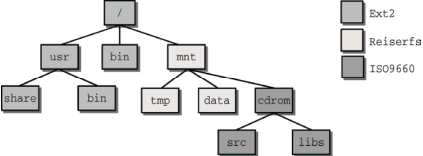

`/mnt` 和 `/mnt/cdrom` 目录被称为装载点，其附接(装载)文件系统的位置。每个装载的文件系统都有一个本地根目录，其中包含了系统目录（如`cdrom` 包含 `src` 和 `libs`目录）。

在将文件系统装载到一个目录时，装载点的内容被替换为即将装载的文件系统的相对根目录的内容。前一个目录数据消失，直至新文件系统卸载才重新出现（在此期间旧文件系统的数据不会被改变，但是无法访问）。

```sh
#unix
> mount
/dev/hda7 on / type ext2 (rw)
/dev/hda3 on /mnt type reiserfs (rw)
/dev/hdc on /mnt/cdrom type iso9660 (ro,noexec,nosuid,nodev,user=xxx)
```

windows上

```sh
$ mount
D:/Program Files/Git on / type ntfs (binary,noacl,auto)
D:/Program Files/Git/usr/bin on /bin type ntfs (binary,noacl,auto)(binary,noacl,posix=0,usertemp)
C: on /c type ntfs (binary,noacl,posix=0,user,noumount,auto)
D: on /d type ntfs (binary,noacl,posix=0,user,noumount,auto)
```

每个装载的文件系统都对应于一个vfsmount结构的实例

```c
/* linux/mount.h */
struct vfsmount {
    struct list_head mnt_hash;
    struct vfsmount *mnt_parent; /* 装载点所在的父文件系统 */
    struct dentry *mnt_mountpoint; /* 装载点在父文件系统中的dentry */
    struct dentry *mnt_root; /* 当前文件系统根目录的dentry */
    struct super_block *mnt_sb; /* 指向超级块的指针 */
    struct list_head mnt_mounts; /* 子文件系统链表 */
    struct list_head mnt_child; /* 链表元素，用于父文件系统中的mnt_mounts链表 */
    int mnt_flags;
    char *mnt_devname; /* 设备名称，例如/dev/dsk/hda1 */
    struct list_head mnt_list;
    struct list_head mnt_expire; /* 链表元素，用于特定于文件系统的到期链表中 */
    struct list_head mnt_share; /* 链表元素，用于共享装载的循环链表 */
    struct list_head mnt_slave_list;/* 从属装载的链表 */
    struct list_head mnt_slave; /* 链表元素，用于从属装载的链表 */
    struct vfsmount *mnt_master; /* 指向主装载，从属装载位于master->mnt_slave_list
    链表上 */
    struct mnt_namespace *mnt_ns; /* 所属的命名空间 */
    /* 我们把mnt_count和mnt_expiry_mark放置在struct vfsmount的末尾，
     * 以便让这些频繁修改的字段与结构的主体处于两个不同的缓存行中
     * （这样在SMP机器上读取mnt_flags不会造成高速缓存的颠簸）*/
    atomic_t mnt_count;
    int mnt_expiry_mark; /* 如果标记为到期，则其值为true */
};
```

###### super_block 

`s_files` 链表包含了一系列file结构，列出了该超级块表示的文件系统上所有打开的文件。内核在卸载文件系统时将参考该链表。如果其中仍然包含为写入而打开的文件，则文件系统仍然处于使用中，卸载操作失败。

```c
struct super_block {
	struct list_head	s_list;		/* Keep this first */
	dev_t			s_dev;		/* search index; _not_ kdev_t */
	unsigned char		s_dirt;
	unsigned char		s_blocksize_bits;
	unsigned long		s_blocksize;
	loff_t			s_maxbytes;	/* Max file size */
	struct file_system_type	*s_type;
	const struct super_operations	*s_op;
	const struct dquot_operations	*dq_op;
	const struct quotactl_ops	*s_qcop;
	const struct export_operations *s_export_op;
	unsigned long		s_flags;
	unsigned long		s_magic;
	struct dentry		*s_root; /* 全局根目录 */
	struct rw_semaphore	s_umount;
	struct mutex		s_lock;
	int			s_count;
	atomic_t		s_active;
	const struct xattr_handler **s_xattr;

	struct list_head	s_inodes;	/* all inodes */
	struct hlist_bl_head	s_anon;		/* anonymous dentries for (nfs) exporting */
    struct list_head	s_files; /* 超级块表示的文件系统上所有打开的文件 */
	/* s_dentry_lru, s_nr_dentry_unused protected by dcache.c lru locks */
	struct list_head	s_dentry_lru;	/* unused dentry lru */
	int			s_nr_dentry_unused;	/* # of dentry on lru */

	struct block_device	*s_bdev;
	struct backing_dev_info *s_bdi;
	struct mtd_info		*s_mtd;
	struct list_head	s_instances;
	struct quota_info	s_dquot;	/* Diskquota specific options */

	int			s_frozen;
	wait_queue_head_t	s_wait_unfrozen;

	char s_id[32];				/* Informational name */
	u8 s_uuid[16];				/* UUID */
	void 			*s_fs_info;	/* Filesystem private info */
	fmode_t			s_mode;
	u32		   s_time_gran; /* Granularity of c/m/atime in ns. Cannot be worse than a second */
};
```

###### 超级块操作

```c
/* fs.h */
struct super_operations {
    struct inode *(*alloc_inode)(struct super_block *sb);
    void (*destroy_inode)(struct inode *);
    void (*read_inode) (struct inode *);
    void (*dirty_inode) (struct inode *);
    int (*write_inode) (struct inode *, int);
    void (*put_inode) (struct inode *);
    void (*drop_inode) (struct inode *);
    void (*delete_inode) (struct inode *);
    void (*put_super) (struct super_block *);
    void (*write_super) (struct super_block *);
    int (*sync_fs)(struct super_block *sb, int wait);
    void (*write_super_lockfs) (struct super_block *);
    void (*unlockfs) (struct super_block *);
    int (*statfs) (struct super_block *, struct kstatfs *);
    int (*remount_fs) (struct super_block *, int *, char *);/*重新装载一个已经装载的文件系统*/
    void (*clear_inode) (struct inode *);
    void (*umount_begin) (struct super_block *);
    int (*show_options)(struct seq_file *, struct vfsmount *);
    int (*show_stats)(struct seq_file *, struct vfsmount *);
};
```

###### mount/unmount系统调用

#### 文件操作

##### 查找inode

根据给定的文件名查找 inode，`nameidata `结构用来向查找函数传递参数，并保存查找结果

```c
/* fs.h */
struct nameidata {
    struct dentry	*dentry;
    struct vfsmount	*mnt;
    struct qstr		last; /* 包含字符串，字符串的长度和一个散列值 */
    unsigned int	flags;
    ...
}
```

内核使用 `path_lookup` 函数查找路径或文件名

```c
/* fs/namei.c */
int fastcall path_lookup(const char *name, unsigned int flags, struct nameidata *nd)
```

##### 内存地址空间

```c
/* linux/fs.h */
struct address_space {
    struct inode *host; /* 所有者：inode，或块设备 */
    struct radix_tree_root page_tree; /* 所有页的基数树 */
    unsigned int i_mmap_writable; /* VM_SHARED映射的计数 */
    struct prio_tree_root i_mmap; /* 私有和共享映射的树 */
    struct list_head i_mmap_nonlinear; /* VM_NONLINEAR映射的链表元素 */
    unsigned long nrpages; /* 页的总数 */
    pgoff_t writeback_index; /* 回写由此开始 */
    struct address_space_operations *a_ops; /* 方法，即地址空间操作 */
    unsigned long flags; /* 错误标志位/gfp掩码 */
    struct backing_dev_info *backing_dev_info; /* 设备预读 */
    struct list_head private_list;
}
struct address_space_operations {
    int (*writepage)(struct page *page, struct writeback_control *wbc);//将一页的内容从物理内存写回到块设备上对应的位置
    int (*readpage)(struct file *, struct page *); //从块设备读取一页到物理内存
    ...
    /* 回写该映射的一些脏页。 */
    int (*writepages)(struct address_space *, struct writeback_control *);
    /* 将页设置为脏的。如果设置成功则返回true。 */
    int (*set_page_dirty)(struct page *page);
    int (*readpages)(struct file *filp, struct address_space *mapping,
    struct list_head *pages, unsigned nr_pages);
    ...
};
```

