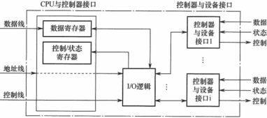
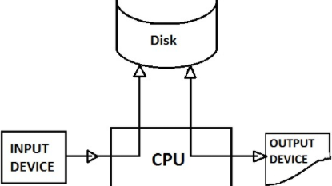

**考纲**

IO管理基础：设备：设备的概念/分类、**I/O 接口与I/O 端口**；I/O 控制方式：轮询/中断/DMA；I/O 软件层次结构：**中断处理程序**、驱动程序、**设备独立软件**、用户层 I/O 软件；**I/O应用程序接口：字符设备/块设备/网络设备接口、阻塞/非阻塞I/O**

设备独立软件：缓冲区管理，设备分配与回收，假脱机技术(SPOOLing)，**设备驱动程序接口**

外存管理：磁盘：磁盘结构、格式化、**分区**、磁盘调度方法；**固态硬盘：读写性能特性、磨损均衡**

**知识框架**


真题考点：

IO请求的处理过程及相应程序，内存从磁盘读数据过程DMA，IO子系统层次

IO设备标识，磁盘设备IO性能改善，单缓冲/双缓冲区下读数据时间计算，磁盘缓冲区目的，设备独立的系统，SPOOLing技术

错题：

磁盘：3,11,19,20

IO管理：1,4,9,12,14,23

设备独立软件：2,13,14,18,19,20,21,22,27

## 1. I/O管理基础


### I/O设备

#### 设备概念


#### 设备的分类

- 块设备(b)：以数据块为单位交换，<u>可寻址</u>，有结构设备。如：磁盘，光驱
- 字符设备(c)：以字符为单位交换，<u>不可寻址</u>，无结构设备。如：键盘，打印机

<details><summary>查看设备</summary>
```sh
ls -l /dev/sd{a,b}* /dev/tty*
brw-rw---- 1 root disk    8,  0 10月 31  2021 /dev/sda
brw-rw---- 1 root disk    8,  1 10月 31  2021 /dev/sda1
brw-rw---- 1 root disk    8,  2 10月 31  2021 /dev/sda2
brw-rw---- 1 root disk    8,  3 10月 31  2021 /dev/sda3
brw-rw---- 1 root disk    8,  4 10月 31  2021 /dev/sda4
brw-rw---- 1 root disk    8,  5 10月 31  2021 /dev/sda5
brw-rw---- 1 root disk    8, 16 10月 31  2021 /dev/sdb
brw-rw---- 1 root disk    8, 17 10月 31  2021 /dev/sdb1
brw-rw---- 1 root disk    8, 18 10月 31  2021 /dev/sdb2
brw-rw---- 1 root disk    8, 21 10月 31  2021 /dev/sdb5
crw-rw-rw- 1 root tty     5,  0 10月 31  2021 /dev/tty
crw--w---- 1 root tty     4,  0 10月 31  2021 /dev/tty0
crw--w---- 1 root tty     4,  1 10月 30 17:18 /dev/tty1
crw--w---- 1 root tty     4, 10 10月 31  2021 /dev/tty10
crw--w---- 1 root tty     4, 11 10月 31  2021 /dev/tty11
crw--w---- 1 root tty     4, 12 10月 31  2021 /dev/tty12
```

</details>

主设备号

```c
/*<major.h>*/
#define TTY_MAJOR			4
#define SCSI_DISK0_MAJOR	8
```

#### I/O设备控制器*



#### I/O接口

##### I/O接口功能

地址译码/设备选择， 

数据交互，数据缓存(协调不同速率)

信号格式转换：电平/串并/数模转换

命令控制，状态检测

##### I/O接口结构

**与总线的接口**

与系统总线并行传送

数据缓冲寄存器DBR，命令/状态寄存器DCR/DSR，存储器RAM(非必须如显存)

地址译码(地址线)，控制逻辑(控制线)，两者均由CPU单向传输给IO接口

**与设备的接口**

若干个设备接口连接外设，串行


#### I/O端口

IO端口：接口中可被CPU直接访问的寄存器，控制(写)/状态(读)/数据端口。数据的目标设备通过唯一端口号标识，内核发送数据给 I/O 控制器

接口 = 若干端口 + 控制逻辑电路

IO指令实现的数据传送：通用寄存器---IO端口

**独立编址（IO端口映射）**：CPU设置专门的输入/输出指令访问端口

```sh
cat /proc/ioports
```


**统一编址（IO内存映射）**：统一访存指令访问IO端口，预留地址码与主存区分，执行速度较慢 

```sh
cat /proc/iomem
```


### I/O控制方式

#### 轮询(程序)

CPU轮询读取设备寄存器，检查标记状态是否置位，若已置位则开始数据传输

#### 中断

- CPU发请求后继续自己的任务，在每个指令周期的末尾检查是否存在中断

- IO设备就绪时向CPU发中断信号

- CPU响应中断，找到对应的中断处理程序执行，接收数据

缺点：CPU完全干预到IO与内存的数据传输，处理大量中断时过载

#### DMA

- CPU启动DMA，提供设备/内存地址、操作、传输字节数

- DMA控制器开始请求获取总线，从设备读数据到总线并写到内存，直到全部数据快传输完

- DMA控制器发中断，CPU响应中断

优点：CPU仅在初始化DMA传输、DMA传输结束后的中断处理时干预


#### ~~通道~~

由一个通道处理机控制内存与多个设备(控制器)

减少CPU的干预()，通道可以控制多个设备，传输数据块大小、传输的内存位置

### I/O软件层次结构

- I/O系统调用
- 虚拟文件系统VFS：为用户提供统一接口
- 设备驱动程序：为系统提供标准接口
- ~~设备控制器~~：地址线/数据线/控制线，状态寄存器/数据寄存器，IO控制逻辑
- 中断处理程序

### I/O应用程序接口

inode 中的设备文件成员

```c
/* <fs.h> */
struct inode {
    dev_t	i_rdev; /*存储了主从设备号,在内核中合并为一种变量类型dev_t*/
    umode_t    i_mode; /*标识与一个设备文件关联的设备,文件类型（面向块，或面向字符）*/
    struct file_operations *i_fop; /*一组函数指针，包括文件操作(如打开、读取、写入)*/
    union {
        struct block_device *i_bdev;
        struct cdev *i_cdev;
    };
};
```

#### 字符设备接口

get, put

内核维护了一个数据库，包括所有活动的 `struct cdev` 实例

```c
/* cdev.h */
struct cdev {
    struct kobject kobj; /*嵌入在该结构中的内核对象*/
    struct module *owner; /*指向提供驱动程序的模块*/
    const struct file_operations *ops; /*一组文件操作，实现了与硬件通信的具体操作*/
    struct list_head list; /*链表包含所有表示该设备的设备特殊文件的inode*/
    dev_t dev; /*设备号*/
    unsigned int count; /*与该设备关联的从设备号的数目*/
};
```

打开字符设备的通用函数 `chrdev_open`

字符设备的各数据结构间关系


#### 块设备接口

read, write, seek


```c
/* <fs.h> */
struct block_device {
    dev_t bd_dev; /* 不是kdev_t，它是一个用于搜索的键值 */
    int bd_openers;
    struct list_head bd_inodes;
    void * bd_holder;
    struct block_device * bd_contains;
    unsigned bd_block_size;
    struct hd_struct * bd_part; /*表示包含在该块设备上的分区*/
    unsigned bd_part_count; /*计算了内核中引用该设备内分区的次数*/
    int bd_invalidated;/*1表示该分区在内核中的信息无效,下一次打开该设备时,将要重新扫描分区表*/
    struct gendisk * bd_disk; /*一个抽象层，也用来划分硬盘*/
    struct list_head bd_list; /*跟踪记录系统中所有可用的block_device实例*/
    unsigned long bd_private; 
};
```

通用磁盘与分区

```c
/*<genhd.h>*/
struct gendisk {
    int major;    /* 驱动程序的主设备号 */
    int first_minor;
    int minors;    /* 从设备号的最大数目，=1表明磁盘无法分区。*/
    char disk_name[32];    /* 主驱动程序的名称 */
    struct hd_struct **part;    /* [索引是从设备号] */
    int part_uevent_suppress;
    struct block_device_operations *fops;
    struct request_queue *queue;
    void *private_data;
    sector_t capacity;	/*指定了磁盘容量，单位是扇区*/
    int flags;
    struct device *driverfs_dev;
    struct kobject kobj;
};
struct hd_struct {
    /*start_sect和nr_sects定义了该分区在块设备上的起始扇区和长度*/
    sector_t start_sect;
    sector_t nr_sects;
    struct kobject kobj;
};
```

块设备block_device, 通用硬盘gendisk, 分区hd_struct 之间的关联

- 一个已分区的磁盘有多个block_device实例，但只对应于一个gendisk实例
- 所有的block_device实例都通过`bd_disk`，指向其对应的通用磁盘数据结构gendisk
- 对块设备上已经打开的每个分区，都对应于一个struct block_device的实例


#### 网络设备接口

socket, read/recv, write/send

每个网络设备都表示为net_device结构的一个实例。在分配并填充该结构的一个实例之后，必须用net/core/dev.c中的register_netdev函数将其注册到内核

```sh
ls -l /sys/class/net
total 0
lrwxrwxrwx 1 root root 0 10月 31  2021 enp0s3 -> ../../devices/pci0000:00/0000:00:03.0/net/enp0s3
lrwxrwxrwx 1 root root 0 10月 31  2021 lo -> ../../devices/virtual/net/lo
```

<details><summary>struct net_device</summary>

```c
/*<netdevice.h>*/
struct net_device {
    char    name[IFNAMSIZ];
    /* 设备名散列链表的链表元素 */
    struct hlist_node name_hlist;
    /* I/O相关字段    */
    unsigned long    mem_end;    /* 共享内存结束位置 */
    unsigned long    mem_start;    /* 共享内存起始位置 */
    unsigned long    base_addr;
    /* 设备I/O地址    */
    unsigned int    irq;
    /* 设备IRQ编号    */
    unsigned long    state;
    struct list_head    dev_list;
    int    (*init)(struct net_device *dev);
    /* 接口索引。唯一的设备标识符*/
    int    ifindex;
    struct net_device_stats* (*get_stats)(struct net_device *dev);
    /* 硬件首部描述 */
    const struct header_ops *header_ops;
    unsigned short	flags;    /* 接口标志（按BSD方式） */
    unsigned		mtu;    /* 接口MTU值*/
    unsigned short	type;
    /* 接口硬件类型    */
    unsigned short	hard_header_len; /* 硬件首部长度*/
    /* 接口地址信息。 */
    unsigned char	perm_addr[MAX_ADDR_LEN]; /* 持久硬件地址*/
    unsigned char	addr_len; /* 硬件地址长度*/
    int    promiscuity;
    /* 协议相关指针 */
    void    *ip_ptr;    /* IPv4相关数据    */
    void    *dn_ptr;    /* DECnet相关数据    */
    void    *ip6_ptr;    /* IPv6相关数据    */
    void    *ec_ptr;    /* Econet相关数据    */
    unsigned long    last_rx;    /* 上一次接收操作的时间 */
    unsigned long    trans_start; /* 上一次发送操作的时间 */
    /* eth_type_trans()所用的接口地址信息 */
    unsigned char    dev_addr[MAX_ADDR_LEN]; /* 硬件地址，（在bcast成员之前，因为大多数分组都是单播） */
    unsigned char    broadcast[MAX_ADDR_LEN]; /* 硬件多播地址 */
    int (*hard_start_xmit) (struct sk_buff *skb, struct net_device *dev);
    /* 在设备与网络断开后调用*/
    void	(*uninit)(struct net_device *dev);
    /* 在最后一个用户引用消失后调用*/
    void	(*destructor)(struct net_device *dev);
    /* 指向接口服务例程的指针 */
    int	(*open)(struct net_device *dev);
    int	(*stop)(struct net_device *dev);
    void	(*set_multicast_list)(struct net_device *dev);
    int	(*set_mac_address)(struct net_device *dev,
    void *addr);
    int	(*do_ioctl)(struct net_device *dev,
    struct ifreq *ifr, int cmd);
    int	(*set_config)(struct net_device *dev,
    struct ifmap *map);
    int	(*change_mtu)(struct net_device *dev, int new_mtu);
    void	(*tx_timeout) (struct net_device *dev);
    int	(*neigh_setup)(struct net_device *dev, struct neigh_parms *);
```

</details>

#### 阻塞/非阻塞I/O

select


## 2. I/O设备独立软件

### 缓冲区管理

#### 磁盘高速缓存 Disk Cache

将从磁盘读出的一系列数据暂存在内存

#### 缓冲区 Buffer

缓冲区数据为空时读入数据直到填满；非空时不能写入数据，需等待读出

引入(内存)缓冲区目的：

- 缓和CPU与IO设备间速度不匹配的矛盾
- 减少对CPU的中断频率
- 提高CPU与IO设备间的并行性


输入一个数据块到缓冲区的时间 T，数据从缓冲区复制到用户内存区的时间 M，对该数据块处理的时间 C

对每个数据块的处理时间，同一状态在两次请求之间的间隔

**单缓冲**

一边写入后，另一边读出并处理，设备与处理器对缓冲区串行工作

假设初始状态：缓冲区慢后开始复制数据

对每个数据块的处理时间 = M+max(C,T)

<u>注：计算多个磁盘块读入+分析总时间时，需加上最后一块的分析时间</u>


**双缓冲**

在向缓冲区1写入后，对数据1读出并处理的同时可以继续向缓冲区2写入。

假设初始状态：一个缓冲区满（另一缓冲区空）后开始复制数据

对每个数据块的处理时间 = max(M+C,T)

<u>注：计算多个磁盘块读入+分析总时间时，需加上最后一块的复制到内存+分析时间</u>


**循环缓冲**

将多个缓冲区组成循环队列，需要两个指针：in, out（类似有界缓冲区的生产者/消费者模型）

输入时 in 前进指向空缓冲区，输出时 out 前进指向满缓冲区

**缓冲池**


###设备分配与回收

- 独占式，如打印机
- 分时共享，如磁盘
- SPOOL，对IO操作批处理

#### 数据结构

系统设备表SDT，设备控制表DCT，控制器控制表COCT，通道控制表CHCT


#### 分配策略

**分配方式**

- 静态分配：IO设备资源占用直到进程结束。适合独占式设备
- 动态分配：运行时申请IO设备，用完后释放

**分配算法**

FIFO，优先级

#### 设备独立性

通过逻辑设备-物理设备映射，应用程序只需访问逻辑设备名（独立于物理设备标识）

对IO设备的映射即对IO设备寄存器地址的映射

[Memory-Mapped I/O](http://www.cs.uwm.edu/classes/cs315/Bacon/Lecture/HTML/ch14s03.html)


### SPOOL假脱机

外设同时联机操作：一种设备共享技术。多个进程请求独占设备IO时，将数据先存放到在磁盘临时区队列中，进程继续执行其它任务，在之后的某时间点对其访问。如：共享打印机

目的：<u>提高独占设备利用率</u>，缓和CPU高速与IO设备低速间的矛盾（以高速的磁盘为中介）

(虚拟设备)程序组成：预输入、井管理、缓输出程序

特点：<u>将独占设备改造为共享设备，实现虚拟设备功能</u>(分配给进程一段外存区)；以空间换时间




### 设备驱动程序接口

<details><summary>通用驱动程序模型</summary>

```c
/* <device.h> */
struct device {
    struct klist	klist_children;
    struct klist_node knode_parent;    /* 兄弟结点链表中的结点 */
    struct klist_node knode_driver;
    struct klist_node knode_bus;
    struct device    * parent;
    struct kobject kobj;
    char bus_id[BUS_ID_SIZE];    /* 在父总线上的位置 */
    struct bus_type * bus;    /* 所在总线设备的类型 */
    struct device_driver *driver;    /* 分配当前device实例的驱动程序 */
    void    *driver_data;    /* 驱动程序的私有数据 */
    void    *platform_data;    /* 特定于平台的数据，设备模型代码不会访问 */
    void (*release)(struct device * dev);
};
struct device_driver {
    const char			* name;
    struct bus_type		* bus;
    struct kobject		kobj;
    struct klist		klist_devices;
    struct klist_node	knode_bus;
    int    (*probe) (struct device * dev);
    int    (*remove) (struct device * dev);
    void   (*shutdown) (struct device * dev);
    int    (*suspend) (struct device * dev, pm_message_t state);
    int    (*resume) (struct device * dev);
};
struct bus_type {
    const char	* name;
    struct kset    subsys;
    struct kset    drivers;
    struct kset    devices;
    struct klist    klist_devices;
    struct klist    klist_drivers;
    int    (*match)(struct device * dev, struct device_driver * drv);
    int    (*uevent)(struct device *dev, struct kobj_uevent_env *env);
    int    (*probe)(struct device * dev);
    int    (*remove)(struct device * dev);
    void   (*shutdown)(struct device * dev);
    int    (*suspend)(struct device * dev, pm_message_t state);
    int    (*resume)(struct device * dev);
};
```

</details>

## 3. 外存管理

### 磁盘

#### 磁盘结构

- 每个盘片有上下两个盘面

- 每个盘面径向包含固定数量的圆形**磁道**（环），由柱面号与盘面号确定

- 每个磁道包含固定数量的**扇区**，扇区大小 512B，最内道的扇区数据密度最大

  扇区是磁盘可寻址的最小单位，而设备驱动程序存取的最小单位是块，其与内存块大小相同

- 柱面：各盘面上相对位置相同的磁道集合

磁盘扇区地址：柱面号 - 盘面号 - 扇区号


块设备的扇区长度都是512B

块设备的块长度则有512/1024/2048/4096B等。块的最大长度受特定体系结构的内存页长度的限制。如：IA-32系统支持的块长度为4096B = 内存页长度4096B

设备驱动程序一次从块设备取出一个完全块的数据，因此对块设备的访问有大规模的缓存


#### 磁盘格式化

1. 低级格式化：分成<u>扇区</u>结构，初始化逻辑块号到无损磁盘扇区的映射

2. 磁盘分区：操作系统将磁盘分为由柱面组成的多个分区（可作为单独磁盘）

3. 逻辑格式化：创建<u>文件系统</u>，将相关<u>数据结构</u>存到磁盘（包含空闲磁盘块信息）

#### 磁盘分区


#### 磁盘访问时间

- 寻道时间：磁头臂移动到磁道所在柱面的时间，包括：跨过n条磁道时间，启动磁臂时间 s。（最长，与调度算法有关）

  $T_s=m · n + s$​

  若给出平均寻道时间 $\overline{T_s}$，则总寻道时间 = $\overline{T_s}·b/N$

- 旋转延迟：旋转盘片使磁头定位到扇区的时间（平均旋转1/2圈），旋转速度=r转/min。

  $T_r=\frac{1}{2r}(min)=\frac{30}{r}(s)=\frac{30000}{r}(ms)$​

- 传输时间：从磁盘上读/写数据的时间，取决于数据字节数 b 与磁盘旋转速度 r。磁道字节数 N（代表1圈）

  $T_t=转周期·比例圈(磁道)数=\frac{b}{rN}(min)=\frac{60b}{rN}(s)=\frac{60000b}{rN}(ms)$​​


#### 磁盘调度算法

磁头初始位置在磁道100，请求队列磁道序列：55,58,39,18,90,160,150,38,184

根据给定算法计算请求队列各请求的平均寻道数

##### 先来先服务FCFS

按请求队列顺序调度，相对公平，不会导致磁道黏着


磁头共移动 45+3+19+21+72+70+10+112+146=498个磁道。平均寻道数=498/9

##### 最短寻道时间优先SSTF

每次选择与当前磁头所在磁道距离最近的磁道。

特点：调度可能会聚集在某些临近磁道，导致较远的磁道“饥饿”，磁道黏着


磁头共移动 10+32+3+16+1+20+132+1+24=248个磁道

##### 扫描SCAN（电梯调度）

在当前磁头移动方向上选择磁道距离最近的请求，到达一端后反向继续选择

特点：对最近扫描过的区域不公平，会导致磁道黏着


假设初始磁头沿磁道增大方向移动，磁头共移动 50+10+24+16+110+32+3+16+1+20=282个磁道


磁头共移动 50+10+24+94+32+3+16+1+20个磁道

##### 循环扫描C-SCAN

在扫描算法基础上规定了磁头单向运动，如从里向外或从外向里，移动到一端后立即回返到另一端继续单向循环移动

特点：消除了对两端磁道请求的不公平，但也会导致磁道黏着


磁盘调度算法比较

磁道黏着，如请求序列：100,5,100,100。执行完第一个磁道号100的请求后，发现队列里有当前磁道上的请求，就继续执行；而忽略了磁道号5的请求。

SSTF/SCAN/CSCAN算法都有可能导致磁道黏着


### 固态硬盘

使用NAND闪存，与U盘没有本质差别

接口标准：SATA、IDE

特点：速度块、抗振性好、安全性高、无噪音、能耗低；


#### 读写性能特性

数据以页为单位读写，在页所属的整个块被擦除后块中的页才能再写

随机写较慢，擦除块1ms级

#### 磨损均衡

反复写10万次数量级后，闪存块会磨损；闪存翻译层中平均磨损逻辑 通过将擦除平均分布在所有块上来最大化每个块的寿命
