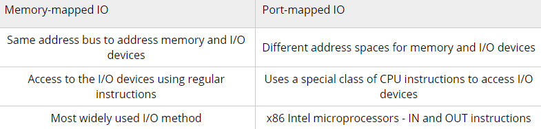

**考纲**

IO管理基础：设备：设备的概念/分类、**I/O 接口与I/O 端口**；I/O 控制方式：轮询/中断/DMA；I/O 软件层次结构：**中断处理程序**、驱动程序、**设备独立软件**、用户层 I/O 软件；**I/O应用程序接口：字符设备/块设备/网络设备接口、阻塞/非阻塞I/O**

设备独立软件：缓冲区管理，设备分配与回收，假脱机技术(SPOOLing)，**设备驱动程序接口**

外存管理：磁盘：磁盘结构、格式化、**分区**、磁盘调度方法；**固态硬盘：读写性能特性、磨损均衡**

**知识框架**

真题考点：

IO请求的处理过程及相应程序，内存从磁盘读数据过程DMA，IO子系统层次

IO设备标识，磁盘设备IO性能改善，单缓冲/双缓冲区下读数据时间计算，磁盘缓冲区目的，设备独立的系统，SPOOLing技术

## 1. I/O管理基础

### I/O设备

#### 设备概念

#### 设备的分类

- 块设备：以数据块为单位交换，可寻址，有结构设备。如：磁盘
- 字符设备：以字符为单位交换，不可寻址，无结构设备。如：键盘

#### I/O接口与I/O端口

### I/O控制方式

#### 轮询(程序)

CPU轮询读取设备寄存器，检查标记状态是否置位，若已置位则开始数据传输

#### 中断

- CPU发请求后继续自己的任务，在每个指令周期的末尾检查是否存在中断

- IO设备就绪时向CPU发中断信号

- CPU响应中断，找到对应的中断处理程序执行，接收数据

缺点：CPU完全干预到IO与内存的数据传输，处理大量中断时过载

#### DMA

- CPU启动DMA，提供设备/内存地址、操作、传输字节数

- DMA控制器开始请求获取总线，从设备读数据到总线并写到内存，直到全部数据快传输完

- DMA控制器发中断，CPU响应中断

优点：CPU仅在初始化DMA传输、DMA传输结束后的中断处理时干预

#### ~~通道~~

减少CPU的干预，通道可以控制多个设备，传输数据块大小、传输的内存位置

### I/O软件层次结构

- I/O系统调用
- 中断处理程序
- 虚拟文件系统VFS：为用户提供统一接口
- 设备驱动程序：为系统提供标准接口
- ~~设备控制器~~：地址线/数据线/控制线，状态寄存器/数据寄存器，IO控制逻辑

### I/O应用程序接口

#### 字符设备接口

#### 块设备接口

#### 网络设备接口

#### 阻塞/非阻塞I/O

## 2. I/O 核心子系统

### 缓冲区管理

#### 磁盘高速缓存 Disk Cache

将从磁盘读出的一系列数据暂存在内存

####缓冲区 Buffer

引入缓冲区目的：

- 缓和CPU与IO设备间速度不匹配的矛盾
- 减少对CPU的中断频率
- 提高CPU与IO设备间的并行性

输入一个数据块到缓冲区的时间 T，数据从缓冲区复制到用户内存区的时间 M，对该数据块处理的时间 C

对每个数据块的处理时间，同一状态在两次请求之间的间隔

**单缓冲**

一边写入后，另一边读出并处理，设备与处理器对缓冲区串行工作

假设初始状态：数据从缓冲区复制到用户内存区后

对每个数据块的处理时间 = max(C,T)+M

**双缓冲**

在向缓冲区1写入后，对数据1读出并处理的同时可以继续向缓冲区2写入。

假设初始状态：一个缓冲区满（另一缓冲区空）后开始复制数据

对每个数据块的处理时间 = max(M+C,T)

**循环缓冲**

将多个缓冲区组成循环队列，需要两个指针：in, out（类似有界缓冲区的生产者/消费者模型）

输入时 in 前进指向空缓冲区，输出时 out 前进指向满缓冲区

**缓冲池**

###设备分配与回收

- 独占式，如打印机
- 分时共享，如磁盘
- SPOOL，对IO操作批处理

#### 数据结构

系统设备表SDT，设备控制表DCT，控制器控制表COCT，通道控制表CHCT

#### 分配策略

**分配方式**

- 静态分配：IO设备资源占用直到进程结束。适合独占式设备
- 动态分配：运行时申请IO设备，用完后释放

**分配算法**

FIFO，优先级

#### 设备独立性

逻辑设备-物理设备映射

对IO设备的映射即对IO设备寄存器地址的映射

[Memory-Mapped I/O](http://www.cs.uwm.edu/classes/cs315/Bacon/Lecture/HTML/ch14s03.html)

### SPOOL假脱机

目的：缓和CPU高速与IO设备低速间的矛盾（以高速的磁盘为中介）

外设同时联机操作：一种设备共享技术。多个进程请求独占设备IO时，将数据先存放到在磁盘临时区队列中，进程继续执行其它任务，在之后的某时间点对其访问。如：共享打印机

### 设备驱动程序接口

##3. 外存管理

### 磁盘

#### 磁盘结构

- 每个盘片有上下两个盘面

- 每个盘面径向包含固定数量的圆形**磁道**（环），由柱面号与盘面号确定

- 每个磁道包含固定数量的**扇区**，扇区大小 512B，最内道的扇区数据密度最大

  扇区是磁盘可寻址的最小单位，而设备驱动程序存取的最小单位是块，其与内存块大小相同

- 柱面：各盘面上相对位置相同的磁道集合

磁盘扇区地址：柱面号 - 盘面号 - 扇区号

#### 磁盘格式化

- 低级格式化：分成扇区结构，初始化逻辑块号到无损磁盘扇区的映射
- 磁盘分区：操作系统将磁盘分为由柱面组成的多个分区（可作为单独磁盘）

- 逻辑格式化：创建文件系统，将相关数据结构存到磁盘

#### 磁盘分区

#### 磁盘访问时间

- 寻道时间：磁头臂移动到磁道所在柱面的时间，包括：跨过n条磁道时间，启动磁臂时间 s。（最长）

  $T_s=m\times n + s$​​​​

- 旋转延迟：旋转盘片使磁头定位到扇区的时间（平均旋转1/2圈），旋转速度=r转/min。

  $T_r=\frac{1}{2r}(min)=\frac{30}{r}(s)=\frac{30000}{r}(ms)$​

- 传输时间：从磁盘上读/写数据的时间，取决于数据字节数 b 与磁盘旋转速度 r。磁道字节数 N（代表1圈）

  $T_t=\frac{b}{rN}(min)=\frac{60b}{rN}(s)=\frac{60000b}{rN}(ms)$​​

#### 磁盘调度算法

磁头初始位置在磁道100，请求队列磁道序列：55,58,39,18,90,160,150,38,184

根据给定算法计算请求队列各请求的平均寻道数

##### 先来先服务FCFS

按请求队列顺序调度

磁头共移动 45+3+19+21+72+70+10+112+146=498个磁道。平均寻道数=498/9

##### 最短寻道时间优先SSTF

每次选择与当前磁头所在磁道距离最近的磁道。

特点：调度可能会聚集在某些临近磁道，导致较远的磁道“饥饿”

磁头共移动 10+32+3+16+1+20+132+1+24=248个磁道

##### 扫描SCAN（电梯调度）

选择与当前磁头所在磁道距离最近的请求磁道作为寻道方向，即在最短寻道时间优先算法基础上选定了磁头运动方向

特点：对最近扫描过的区域不公平，且多了到边界磁道的移动（适合偏向边界端的请求）

假设初始磁头沿磁道增大方向移动，磁头共移动 50+10+24+16+110+32+3+16+1+20=282个磁道

##### 循环扫描C-SCAN

在扫描算法基础上规定了磁头单向运动，移动到边界端时立即回返到另一端继续单向循环移动

磁盘调度算法比较

### 固态硬盘

#### 读写性能特性

#### 磨损均衡

