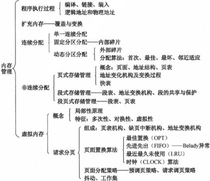

**考纲**

内存管理基础：概念，逻辑/物理地址空间，**地址变换，内存共享**，内存保护，**内存分配与回收**，连续分配管理，分页/分段/段页式管理

虚拟内存管理：概念，请求分页管理，**页框分配**，页面置换算法，**内存映射文件(Memory-Mapped Files)，虚拟存储器性能的影响因素及改进方法**

**知识框架**



[linux/mm_types.h](https://elixir.bootlin.com/linux/v3.0/source/include/linux/mm_types.h) | [linux/mmzone.h](https://elixir.bootlin.com/linux/v3.0/source/include/linux/mmzone.h) | [mm/memory.c](https://elixir.bootlin.com/linux/v3.0/source/mm/memory.c)

[asm-generic/page.h](https://elixir.bootlin.com/linux/v3.0/source/include/asm-generic/page.h) | [asm/pgtable_types.h](https://elixir.bootlin.com/linux/v3.0/source/arch/x86/include/asm/pgtable_types.h) | [asm/pgtable.h](https://elixir.bootlin.com/linux/v3.0/source/arch/x86/include/asm/pgtable.h) | [asm/page.h](https://elixir.bootlin.com/linux/v3.0/source/arch/x86/include/asm/page.h)

错题

内存管理：1,2,3,4,6,10,21,26,28,32,34,35,37,38,44,45

虚拟内存：6,11,12,16,17,18,32,34,39

## 1. 内存管理

### 内存管理概念

内存管理功能：

- 内存空间分配与回收
- 地址转换
- 内存空间的扩充：虚拟内存
- 存储保护

注：对主存的访问以字/字节为单位

#### 程序的链接

- 静态链接：编译后链接成可执行文件
- 装入时动态链接：边装入边链接
- 运行时动态链接：按需加载/共享同一存储块的可重入程序，减少换入/换出

逻辑分段 <u>有利于动态链接</u>

#### 指令/数据绑定存储器地址时机

- 编译时：编译时知道进程在内存中的驻留地址，生成绝对代码（绝对装入）

- 装入时：使用相对地址，编译器生成**可重定位**代码，装入时绑定到绝对地址（静态重定位）

  若进程被换出，再次换入时被指定到内存其它地址，需要再次将代码完成地址转换

- 运行时：使用相对地址+基址寄存器，进程在执行时可能在内存中移动或需要动态加载模块，指令在执行时才绑定绝对地址（动态重定位）

#### 逻辑/物理地址空间

**逻辑地址**（相对地址）：目标模块从0号单元开始编址

**物理地址**：内存物理单元地址，是地址转换的最终地址

以C语言为例，

编译时，产生<u>可重定位</u>的二进制目标文件，内部逻辑地址仅是相对该模块的偏移

链接时，将所有目标文件及其依赖库目标文件链接成一个可执行文件，此时<u>完成重定位</u>，形成程序完整逻辑地址空间

#### 地址变换

#### 内存共享

#### 内存保护

MMU 设置 <u>基址寄存器(重定位)</u>、界限或限长寄存器

[基址寄存器] + 逻辑地址 < [界限寄存器]

#### 内存分配与回收

malloc, free

#### 交换

将处于等待状态的程序从内存移到外存，把竞争CPU运行的程序从外存移到内存

（不考虑缓冲区时）进程在I/O操作时不能交换出主存（否则I/O数据输入到换入的进程空间）

### 连续内存分配管理

#### 固定分区分配

在系统生成阶段，内存被划分为若干静态分区。程序采用静态重定位装入，分区 $\ge$​ 进程大小。

缺点：一个分区在已分配进程后因剩余空间太小而产生**内部碎片**

#### 动态分区分配

按进程大小动态创建分区，分区 = 进程大小

缺点：由于有进程的换入/换出，分区逐渐分散不连续，产生很多难以容纳的小分区，即**外部碎片**


空闲分区记录数据结构：数组或链表

当系统回收某一进程空间并合并空闲区时，若该进程空间存在上邻、下邻空闲区，则回收合并后的空闲区数减1

**动态分区分配策略**

- <u>首次适应FF</u>：空闲分区按地址递增次序链接，顺序查找第一个满足大小的分区

  缺点：随着进程换入/换出，低地址会出现很多小的空闲分区，每次查找需要绕过

- 邻近适应NF：又称循环首次适应，空闲分区按地址递增次序链接成**循环队列**，从上次放置位置开始找

  缺点：随着进程换入/换出，高地址会出现很多小的空闲分区，比首次适应算法差

- <u>最佳(小)适应BF</u>：空闲分区<u>按容量递增次序链接</u>，顺序查找第一个满足大小的分区

  缺点：分配”最佳“分区，导致留下更小的难以利用的分区，<u>产生更多的外部碎片</u>

- 最坏(大)适应WF：空闲分区按容量递减次序链接，顺序查找第一个满足大小的分区

  缺点：分配最大分区，逐渐导致分区没有大内存块可容纳

### 非连续内存分配

一个程序分散在多个位置

#### 简单分页

内存划分为大小相等的较小块（页框），作为内存的基本单位；

进程也以块（页框）为单位划分，装入多个非连续的内存块（页框）中，每个进程平均只产生半个块 **页内碎片**

每个进程有一张页表(在内存)，执行时将页表基址+长度装入页表基址寄存器

页面较大，页表较小，但页内碎片较大；页面较小，页内碎片较小，但页表较大

**地址结构**

```
	 | 页号VPN(页表项索引) | 页内偏移offset |
	VPN_MASK =	111110000	PAGE_SHIFT = 4
OFFSET_MASK =	000001111
| 物理页帧号PFN(页表项内容) | 页内偏移offset |
PFN_MASK =	  11111110000	PAGE_SHIFT = 4
```

**页表**

页表数组存储非连续的物理内存块（页框）号

```c
struct PTE {
  unsigned long PFN;  
};
```


**地址转换**

页表基址 PBA

虚拟页号：`VPN = (VA & VPN_MASK) >> PAGE_SHIFT`，页内偏移：`offset = VA & OFFSET_MASK`

页表项指针：`PTE = PBA + VPN * sizeof(struct PTE)`

页帧号：`PFN = PTE->PFN`，页帧地址：`PFA = PFN << PAGE_SHIFT`

物理地址：`PA = PFN << PAGE_SHIFT | offset`

**带TLB(转换旁路读出缓冲)的地址变换**

TLB 表项 TLBEntry

```c
struct TLBE {
    unsigned long VPN, PFN;
};
```

- 若通过页号 `VPN` 在 TLB 中查询到 TLBE（命中），页帧号：`PFN = TLBE.PFN`
- 若未命中，则去查页表，读出页表项 PTE，同时存入 TLB


#### 两级页表

逻辑地址结构

```
| 页表号PTN(页表索引) | 页号VPN(页表项索引) | 页内偏移offset |
	PTN_MASK =	111100000000	PTE_PAGE_SHIFT = 8
	VPN_MASK =	000011110000	PAGE_SHIFT = 4
OFFSET_MASK =	000000001111
```

两级页表项

```c
struct RPTE {
    struct PT		*PBA;
}; //根页表项，用来索引页表的基址
struct PTE {
    unsigned long	PFN;
}; //页表项
```

地址转换

页表基址：`PBA = (VA & PTN_MASK) >> PTE_PAGE_SHIFT`

虚拟页号：`VPN = (VA & VPN_MASK) >> PAGE_SHIFT`，页内偏移：`offset = VA & OFFSET_MASK`


#### 简单分段

进程被划分为多个大小不等的逻辑段，执行时装入多个非连续的内存动态分区中作为物理段。

段内可以集中一系列共享代码/数据，分段共享/分段保护，<u>有利于动态链接、动态增长</u>；<u>无内部碎片</u>

**地址结构**

```
	 | 段号VSN(段表项索引) | 段内偏移offset |
	VSN_MASK =	111110000	SEG_SHIFT = 4
OFFSET_MASK =	000001111
| 段地址SA(段表项内容)     | 段内偏移offset |
```

**段表项**

```c
struct STE {
    unsigned long	SA;			//内存段地址
    unsigned int	seg_bytes;	//内存段字节长度
};
```

**地址转换**

段表基址 SBA

虚拟段号：`VSN = (VA & VSN_MASK) >> SEG_SHIFT`，段内偏移：`offset = VA & OFFSET_MASK`

段表项指针：`STE = SBA + VSN * sizeof(struct STE)`

段地址：`SA = STE->SA`

物理地址：`PA = SA + offset`


#### 段页式管理

内存划分为大小相等的较小块（页框），作为内存的基本单位；

进程被划分为多个大小不等的逻辑段，每段（对应一个页表）分成多个大小固定的页；执行时装入多个非连续的内存块（页框）中。

**地址结构**

```
| 段号VSN(段表项索引) | 页号VPN(页表项索引) | 页内偏移offset |
	VSN_MASK =	111100000000	PTE_PAGE_SHIFT = 8
	VPN_MASK =	000011110000	PAGE_SHIFT = 4
OFFSET_MASK =	000000001111
```

**段表项**

```c
struct STE {
    struct PT		*PBA;		//页表基址
    unsigned int	pt_length; 	//页表长度（项个数）
};
```

**地址转换**

段表基址 SBA

虚拟段号：`VSN = (VA & VSN_MASK) >> PTE_PAGE_SHIFT`，虚拟页号：`VPN = (VA & VPN_MASK) >> PAGE_SHIFT`，段内偏移：`offset = VA & OFFSET_MASK`

段表项指针：`STE = SBA + VSN * sizeof(struct STE)`，页表基址：`PBA = STE->PBA`

页表项指针：`PTE = PBA + VPN * sizeof(struct PTE)`

页帧号：`PFN = PTE->PFN`，页帧地址：`PFA = PFN << PAGE_SHIFT`

物理地址：`PA = PFN << PAGE_SHIFT | offset`


## 2. 虚拟内存管理

> 简单分页/分段/段页式内存管理存在的问题：一次性装入内存，即使阻塞也不换出直到运行结束

### 虚拟内存概念

页帧：内存的最小单位，每个页对应一个 `struct page` 实例

```c
/* linux/mm_types.h */
struct page {
	unsigned long flags;		//页的状态，包括是否脏，是否被锁定在内存
    atomic_t _count;			//引用计数
	atomic_t _mapcount;			//内存管理子系统中映射的页表项计数，用于表示页是否已经映射
	unsigned long private;//设置PagePrivate,用于buffer_heads;设置PageSwapCache,用于swp_entry_t;设置PG_buddy,用于表示伙伴系统中的阶
	struct address_space *mapping;//指定了页帧所在的地址空间
	pgoff_t index;				/* 页帧在映射内部的偏移量 */
	struct list_head lru;		//换出页列表，例如由zone->lru_lock保护的active_list
	void *virtual;				//虚拟地址(如果没有映射则为NULL，即高端内存区域)
};
```

**进程虚拟地址空间**


内存区域包含的内存对象：

- 代码段、数据堆段、进程用户空间栈
- 静态/共享库的代码段、数据段
- 内存映射文件、共享内存段、匿名的内存映射（如 `malloc`）


每个进程 `task_struct` 都有一个 `struct mm_struct` 成员实例（保存了进程的内存管理信息）

```c
/* linux/mm_types.h */
struct mm_struct {
    struct vm_area_struct * mmap;		/* 虚拟内存区域列表VMAs */
    struct rb_root mm_rb; 				/* red-black tree of VMAs */
    struct vm_area_struct * mmap_cache;	/* 上一次find_vma的结果 */
    unsigned long (*get_unmapped_area) (struct file *filp,
    									unsigned long addr, unsigned long len,
    									unsigned long pgoff, unsigned long flags);
    unsigned long mmap_base; /* mmap区域的基地址 */
    unsigned long task_size; /* 进程虚拟内存空间的长度 */
    pgd_t * pgd; /* page global directory */
    unsigned long total_vm, locked_vm, shared_vm, exec_vm;
	unsigned long stack_vm, reserved_vm, def_flags, nr_ptes;
    unsigned long start_code, end_code, start_data, end_data; /* 代码段地址 */
    unsigned long start_brk, brk, start_stack; /* 堆地址 */
    unsigned long arg_start, arg_end, env_start, env_end; /* 参数，环境变量地址 */
    struct file *exe_file; /* store ref to file /proc/<pid>/exe symlink points to */
}
```

每个区域都通过一个`vm_area_struct`实例描述，进程的各区域按两种方法排序。

- 在一个单链表上（开始于`mm_struct->mmap`）
- 在一个红黑树中，根结点位于`mm_rb`


**虚拟内存区域**

```c
/* linux/mm_types.h */
struct vm_area_struct {
    struct mm_struct * vm_mm; /* 所属地址空间。 */
    unsigned long vm_start; /* vm_mm内的起始地址。 */
    unsigned long vm_end; /* 在vm_mm内结束地址之后的第一个字节的地址。 */
    struct vm_area_struct *vm_next; /* 各进程的虚拟内存区域链表，按地址排序 */
    pgprot_t vm_page_prot; /* 该虚拟内存区域的访问权限。 */
    /* 对于有地址空间和后备存储器的区域来说，shared连接到address_space->i_mmap优先树，
    或连接到悬挂在优先树结点之外、类似的一组虚拟内存区域的链表，
    或连接到address_space->i_mmap_nonlinear链表中的虚拟内存区域 */
    union {
        struct {
            struct list_head list;
            void *parent; /* 与prio_tree_node的parent成员在内存中位于同一位置 */
            struct vm_area_struct *head;
        } vm_set;
    	struct raw_prio_tree_node prio_tree_node;
    } shared;
    ...
    struct vm_operations_struct * vm_ops; /* 用于处理该结构的各个函数指针。 */
    /* 后备存储器的有关信息： */
    unsigned long vm_pgoff; /* (vm_file内)的偏移量，单位是PAGE_SIZE */
    struct file * vm_file; /* 映射到的文件(可能是NULL) */
    void * vm_private_data; /* vm_pte（即共享内存） */
};
```

#### 局部性原理

- 时间局部性：同一指令邻近时间内可能再次被访问。如：循环访问同一变量
- 空间局部性：邻近的存储单元可能再次被访问。如：遍历数组元素

#### 虚拟内存特征

在程序装入时，将程序必要的部分装入内存，其余子程序或数据留待执行时需要再换入内存

特征：多次装入、换入/换出、非连续分配，<u>逻辑上扩充</u>内存，虚拟内存容量取决于CPU寻址范围

#### 虚拟内存实现

逻辑：请求分页、请求分段、请求段页式

额外支持：借助外存空间，缺页中断处理（换入/换出），地址变换

### 请求分页管理
初始化时，根据虚拟页是否在内存中(<u>是否缺页</u>)，设置 `_PAGE_BIT_PRESENT`，`pte_set_flags(pte, _PAGE_PRESENT)`
#### 页表

```c
typedef struct {
	unsigned long pte;
} pte_t;
```
PTE 比特位信息：
```c
#define _PAGE_BIT_PRESENT	0	/* 虚拟内存页是否存在于内存中 */
#define _PAGE_BIT_RW		1	/* writeable */
#define _PAGE_BIT_USER		2	/* userspace addressable */
#define _PAGE_BIT_PWT		3	/* page write through */
#define _PAGE_BIT_PCD		4	/* page cache disabled */
#define _PAGE_BIT_ACCESSED	5	/* was accessed (raised by CPU) */
#define _PAGE_BIT_DIRTY		6	/* was written to (raised by CPU) */
#define _PAGE_BIT_PSE		7	/* 4 MB (or 2MB) page */
#define _PAGE_BIT_PAT		7	/* on 4KB pages */
#define _PAGE_BIT_GLOBAL	8	/* Global TLB entry PPro+ */
#define _PAGE_BIT_UNUSED1	9	/* available for programmer */
#define _PAGE_BIT_IOMAP		10	/* flag used to indicate IO mapping */
#define _PAGE_FILE		_PAGE_BIT_DIRTY /* 换出页的位置(页不在内存中时) */
/* #define _PAGE_XX	(unsigned long)1  << _PAGE_BIT_XX */
#define _PAGE_XX	(_AT(pteval_t, 1) << _PAGE_BIT_XX) 
```


简化页表项

| 有效位 | 脏位 | 使用位(替换) | 物理页号/磁盘地址 |
| ------ | ---- | ------------ | ----------------- |

`valid=1` 存物理页号——命中，`valid=0` 表示空项 或 存的磁盘地址——缺页

#### 块表

虚拟地址

```
                 虚拟页号VPN | 页内偏移offset(全相联)
页表项区号TLBT | TLB组索引TLBI | 页内偏移offset(组相联)
```

快表项

| 有效位 | VPN虚拟页号 | PPN物理页(框)号（全相联） |
| ------ | ----------- | ------------------------- |

| 有效位 | TLBT标记 | PPN物理页(框)号（组相联） |
| ------ | -------- | ------------------------- |

#### 缺页中断

进程在TLB或页表请求页，若页不在内存 `present==false`，则发缺页中断，阻塞；

缺页中断处理程序 调页至内存，可能淘汰页，唤醒缺页进程，恢复现场

```c
bool get_page(unsigned long vma, unsigned long address) {
	vpn = (vma & VPN_MASK) >> PAGE_SHIFT;
	tlbe = find_tlb_entry(vma);
	if (tlbe) 
		return pfn_to_page(pte_pfn(tlbe->pte));
	else {
		pte = find_pte(vpn);
		if (pte_present(pte)) 
			return pfn_to_page(pte_pfn(pte));
		else { //page have been swapped out
            if (mem_full()) {
                struct entry = evict_pte();
                pfn = pte_pfn(entry);
                page = pfn_to_page(pfn);
                if (pte_dirty(entry))
                    //write_page_to_file(pte_file(entry), pfn << PAGE_SHIFT);
            } else {
                page = alloc_page();
				pfn = page_to_pfn(page);
            }			
			set_pte(&pte, pfn_pte(pfn)); // pfn << PAGE_SHIFT			
			//load_file(pte_file(pte), pfn);
            pte_set_flags(pte, _PAGE_PRESENT);
            return page;
		}
	}
}
```

### 页面置换算法

#### 最佳置换OPT

淘汰页：以后不再被访问或最迟被访问的页面（向后看，理想）


#### 先进先出FIFO

淘汰页：最先进入内存的页面（驻留时间最长）

（可选）数据结构：队列


Balady异常：当分配的内存物理块增多时，缺页故障次数不减反增


请求分页存储中，采用FIFO页面淘汰算法，当可分配页帧数增加时，缺页中断次数：

- 可能增加如Balady异常，
- 可能减少如页面引用序列1,2,3,1,2,3，页帧数2时产生6次缺页异常，页帧数3时产生3次缺页异常

#### 最近最少未使用LRU

淘汰页：最近最久未使用的页，计未引用次数最多的页（向前看）

- （可选）数据结构：双向链队列


- 计未引用次数，涉及排序(开销)


```cpp
// return swapped page or NULL
// using queue
struct lru_cache {
	queue *pages;
};
void* lru(struct lru_cache cache, unsigned long pfn) {
    pages = cache->pages;
    struct page *newp = pfn_to_page(pfn);
    struct page *p = find(pages, [](it) => *it == *newp);
    if (p) { //hit and move to new position in queue
    	pages->remove(p);	//move forward
        pages->push(p);		//new position
        return NULL; 
    }
    if (mem_page_free()) {
        pages.push(newp);
	    return NULL;
    } else {
        struct page *oldp = pages->top();
        pages->pop();
        pages->push(newp);
        return oldp;
    }
}
// based on _count
void* lru(struct lru_cache cache, unsigned long pfn) {
    pages = cache->pages;
    struct page *newp = pfn_to_page(pfn);
    struct page *p = find(pages, [](it) => *it == *newp);
    for (auto it : pages)
        it->_count++;
 	if (p) {
        p->_count = 0;
        return NULL;
    } 
    newp->_count = 0;
    if (mem_page_free()) {
        pages.push(newp);
        return NULL;
    } else {
        struct page *oldp = find(pages, [](a, b) => a->_count > b->_count);
        pages->insert(oldp, newp); //replace
        return oldp;
    }
}
```

#### 时钟置换CLOCK

也称：<u>最近未使用 NRU</u>。页面设置一个最近访问位 `used:bool`

数据结构：循环链队列（初始指针 `p = p->next`）

1. 从当前位置 `p` 开始遍历链表，若页面存在，置访问位 `p->used = 1`，返回

2. 若存在空闲页帧，页指针入队并置访问位 `p->used = 1`，更新指针 `p = p->next`，返回

3. 否则进行淘汰替换：循环遍历链表，

   若页面访问位0，`out = p` 更新指针 `p = p->next`，替换 `out` 返回

   若页面访问位1，`p->used = 0`


##### 改进的时钟置换

考虑页面载入内存后是否被修改，页面设置 访问位 `used`、修改位 `modified`

淘汰页优先级：未访问过>未修改过；(used, modified)：(0, 0)>(0, 1)>(1, 0)>(1, 1)

1. 从当前位置 `p` 开始遍历链表，若 `p->used == 0 && p->mod == 0`，则 `out = p` 更新指针 `p = p->next`，返回

2. 从当前位置 `p` 开始遍历链表，若 `p->used == 0 && p->mod == 1`，则 `out = p` 更新指针 `p = p->next`，返回

   否则即为已访问页，重置所有帧访问位 `p->used = 0`；执行 1.

### 页面分配

#### 页面分配策略

- 固定分配局部置换：为进程分配一定的内存页，缺页时从该进程的已有内存页置换
- 可变分配全局置换：系统保持一个空闲内存页队列，进程缺页就分配
- 可变分配局部置换：有空闲内存页时，进程缺页率低，低频率分配；进程缺页率高，高频率分配；无空闲内存页时，缺页从该进程已有内存页置换（保证每个进程较低缺页率）

#### 页面调入时机

- 预调页：一次调入若干相邻页（空间局部性）
- 请求调页：运行到所需页不在内存时请求调页

#### 从何处调入页面

文件区、对换区

### 内存映射文件(Memory-Mapped Files)

内存映射：将一个虚拟内存区域与一个磁盘上的对象(object)关联起来，以初始化这个虚拟内存区域的内容

一旦一个虚拟页面被初始化了，它就在一个由内核维护的专门的交换文件(swap file)或交换空间之间换来换去

#### mmap 函数用户级内存映射

```c
#include <unistd.h>
#include <sys/mman.h>
/* 指向映射区域的指针, 或 MAP_FAILED(—1) */
void *mmap(void *start, size_t length, int prot, int flags, int fd, off_t offset);
/* 让内核创建一个新的包含 size 字节的只读、私有(写时复制)、匿名(二进制零)的虚拟内存区域 */
bufp = mmap(NULL, size, PROT_READ, MAP.PRIVATE|MAP_ANON, 0, 0); 

int munmap(void *staxt, size_t length); //删除从虚拟地址start开始，接下来length字节组成的区域
```

#### 动态内存分配

动态内存分配器维护着一个进程的虚拟内存区域，称为堆（heap)

malloc, free

### 虚拟存储器性能的影响因素及改进方法


### ~~抖动~~

进程抖动：进程缺页率高，频繁的页面调度(换入/换出)，进程频繁访问的页面数>可用物理页数，调页时间>进程执行时间；

原因：CPU调度程序(为提高CPU利用率)增加了进程多道程序度；页面置换算法不合理


#### 限制抖动

- 可变分配局部置换
- 预调页，工作集（以提供足够的帧）


缺页率高的表现：磁盘因用于交换空间而利用率满负荷

解决缺页率高：增加内存容量，减少进程多道程序度(减少主存进程)，

### ~~工作集~~

基于（时间）局部性假设：一个函数被调用时就定义了一个新的局部（局部变量）

**工作集**：t 时间点之前，进程在工作集窗口大小 $\Delta$ 内访问过的不重复页面（前 $\Delta$ 个不重复页面）集合


内存页帧的总需求量 D

分配给每个进程的页帧数 > 进程工作集帧数

- 若有足够的额外页帧，可运行或唤醒另一进程
- 若页帧总需求量 > 页帧总数 (D>m)，系统将选择一个进程挂起（换出），防止抖动
