**考纲**

操作系统概念

操作系统发展**历程**

操作系统运行环境：内核态与用户态，中断与异常的处理，系统调用，程序的链接与装入，**程序运行时内存映像与地址空间**

**操作系统结构：分层，模块化，宏内核，微内核，外核**

操作系统引导

**虚拟机**

**知识框架**


​	

## 1. 操作系统概念

### 操作系统特征

- 并发

  同一时间间隔内有多个程序正在运行

  单处理机环境，微观上多个程序分时交替执行

- 共享

  互斥共享：一段连续时间内只允许一个进程访问该资源。如：打印机

  同时访问：宏观上同时，微观上交替分时共享访问。如：磁盘

- 虚拟

  将一个物理实体变为若干逻辑对应物。如：虚拟处理器（多用户分时使用），虚拟内存，虚拟设备

- 异步

  多进程并发执行，由于资源限制与抢占，进程的执行走走停停，以<u>不可预知的顺序与速度</u>向前

### 操作系统功能

#### 系统资源管理

- 处理器管理：进程管理，包括：进程控制，进程同步，进程通信，死锁处理，处理机调度
- 存储器管理：内存分配与回收，地址映射，内存保护与共享，内存扩充
- 文件管理：文件系统，功能包括：文件存储空间管理，目录管理，读写管理与保护
- 设备I/O管理：缓冲管理，设备分配，设备控制，设备独立性（虚拟设备）

#### 用户-硬件系统间的接口

- 命令接口：联机（交互式），脱机（批处理）
- 程序接口：系统调用

## 2. 发展历程

### 无系统（手工）

程序卡片装入输入机，启动输入机，通过控制开关启动程序

### 批处理

#### 单道批处理

引入脱机输入/输出技术，通过读卡机将批量作业读入磁带，再将磁带送入磁带机，由监督程序读入并运行、输出到磁带。每个作业结束，系统自动读入下一个作业并运行。当一批作业结束后，将输出磁带打印

特点：顺序串行执行


#### 多道批处理

- 引入多道程序技术，多道程序并发执行

  将内存分为几部分存放不同作业，作业A请求I/O时，作业B可以使用CPU；宏观上并行，微观上交替串行

- 有了磁盘引入SPOOL技术（同时的外设联机操作）：当一个作业运行结束，系统能将一个新作业从磁盘读入装入空出的内存区域运行

问题：用户响应时间长，没有人机交互功能（提交作业后只能等待）

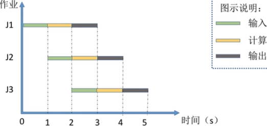

### 分时系统

系统以<u>时间片为单位轮流</u>为各个联机用户/作业服务，各用户通过终端与计算机交互

问题：不能优先处理实时的紧急任务

响应时间 T = 用户数 * 单位时间片

### 实时系统

高响应、高可靠性

进程调度：采用<u>抢占式高优先级</u>算法

## 3. 运行环境

### 运行模式：用户态-内核态

内核态能执行所有特权指令，访问所有寄存器和存储器

用户态进入内核态：访管指令(中断陷入)，即设置中断/陷入(门)值（寄存器置位）

内核态回到用户态：中断返回指令

用户态切换到内核态的操作(指令)：访管指令、(调用)系统调用、非法指令异常引起的中断、<u>缺页中断，外设中断</u>

内核态操作(指令)：执行内核态系统调用(广义指令)，设置中断屏蔽，开/关中断，(由用户态请求/触发的中断引出的)<u>中断服务程序</u>，设置时钟，存储保护，进程调度程序

### 中断与异常的处理

#### 内中断(异常)

不可屏蔽，需立即处理

- 陷入trap：主动执行，如通过访管指令执行系统调用，Linux 汇编代码 `int $0x80`

  [traps.c](https://github.com/torvalds/linux/blob/v3.13/arch/x86/kernel/traps.c#L770)
  
  ```c
  #ifdef CONFIG_IA32_EMULATION
      set_system_intr_gate(IA32_SYSCALL_VECTOR, ia32_syscall);
      set_bit(IA32_SYSCALL_VECTOR, used_vectors);
  #endif
  
  #ifdef CONFIG_X86_32
      set_system_trap_gate(SYSCALL_VECTOR, &system_call);
      set_bit(SYSCALL_VECTOR, used_vectors);
  #endif
  ```
  
  [irq_vectors.h](https://github.com/torvalds/linux/blob/v3.13/arch/x86/include/asm/irq_vectors.h#L49)
  
  ```c
  #define IA32_SYSCALL_VECTOR		0x80
  #ifdef CONFIG_X86_32
  # define SYSCALL_VECTOR			0x80
  #endif
  ```
  
- **异常**：CPU指令执行产生，可预测/可再现。如：非法操作(指令)，地址越界，算术非法如除0（中断返回无法继续执行），算术溢出，缺页（中断返回可继续执行），存储保护异常？

- 终止abort：硬件故障

#### 异步外中断

本质上是电信号。由外设产生，并施加到CPU的 `INTR` (可屏蔽)或 `NMI` (不可屏蔽)引脚，不可预测。CPU在每条指令执行结束时主动检测是否有中断请求（由中断控制器接收并发送给CPU）

如：I/O传送(请求/结束)中断，定时器时钟中断

#### 中断处理

- (<u>硬件</u>隐指令) 中断响应：关中断 `IE=0`，

  <u>保存断点 PC, PSW</u> 到内存堆栈或特殊寄存器

  根据中断号取出中断服务程序入口地址给PC（中断识别）

- 保护现场，将（会被中断服务程序改写的）(通用)寄存器值压入内存栈

- 中断服务

- 恢复现场，内存中的寄存器值出栈

- (<u>硬件</u>隐指令) 开中断 `IE=1`，CPU可以接受新的中断请求

- 中断返回，将保存的断点恢复到PC、PSW

### 系统调用

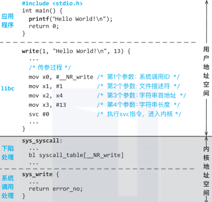

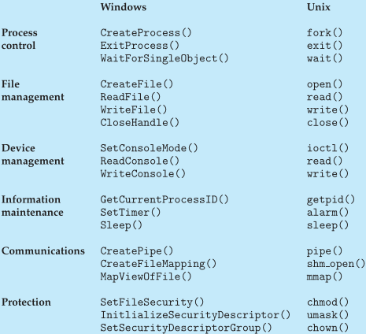

### 程序的链接与装入

- 编译：源程序 $\rightarrow$​ object file
- 静态链接：object files + static linked lib $\rightarrow$​​ executable file
- 装入+动态链接：executable file + dll $\rightarrow$​​​ 内存中的程序

#### 程序的链接

- 静态链接
- 装入时动态链接
- 运行时动态链接：按需加载，共享

#### 指令/数据绑定存储器地址时机

- 编译时：编译时知道进程在内存中的驻留地址，生成绝对代码（绝对装入）

- 装入时：使用相对地址，编译器生成**可重定位**代码，装入时绑定到绝对地址（静态重定位）

  若进程被换出，再次换入时被指定到内存其它地址，需要再次将代码完成地址转换

- 运行时：使用相对地址+基址寄存器，进程在执行时可能在内存中移动或需要动态加载模块，指令在执行时才绑定绝对地址（动态重定位）


### 程序运行时内存映像与地址空间


### 错题

13,17

13

4,9,11,15,16,20,22,24,29

## 4. 操作系统结构

### 分层与模块化

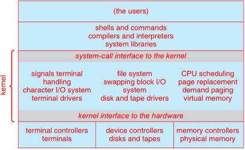

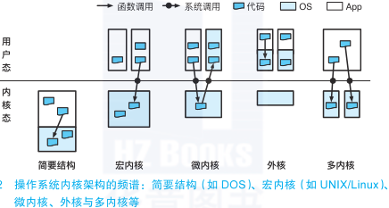

MS-DOS系统结构

应用程序域操作系统置于同一地址空间，无特权级隔离

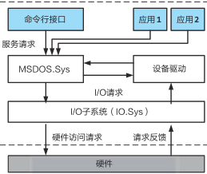

#### 模块化

采用可加载的内核模块LKM。内核只提供核心服务，其他服务可在内核运行时动态加载实现；通过可加载模块，还可以支持不同文件系统

### 宏内核

所有内核模块均运行在特权空间，单点错误可能导致系统崩溃

如：Linux，Windows

### 微内核

特点：特权级仅保留较少功能，服务之间干扰少，对于操作系统相对安全可靠，但性能损失

如：Mach(from CMU) 微内核提供：内存管理、远程过程调用RPC、进程间通信IPC、线程调度，Fushcia

### 外核Exokernel

库操作系统 LibOS：将对硬件的抽象封装到 LibOS 中，与应用直接链接，降低应用开发的复杂度；操作系统内核只负责对 硬件资源在多个库操作系统之间的多路复用 的支持，并管理这些 LibOS 的生命周期

如：对操作系统接口要求不高但对性能/时延敏感的嵌入式系统

### 多内核架构*

多核处理器上每个CPU核运行一个独立的操作系统节点，节点间交互由操作系统节点之上的进程间通信完成，可支持异构处理器架构


### 混合内核*

Mac OS X(Darwin) 在BSD内核基础上增添了部分Mach微内核

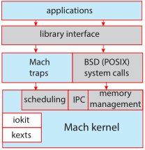

Android 架构

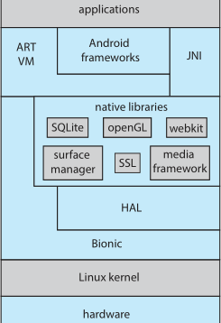

操作系统架构演进

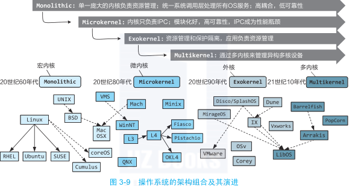

## 5. 操作系统引导

处于 ROM 中的 `bootstrap` 程序运行，启动硬件，并从磁盘找到引导程序 `bootloader` 以初始化机器，并启动操作系统

Windows 的引导程序位于磁盘第一个扇区，称为主引导记录MBR，包含磁盘分区表

grub 程序可引导 Linux

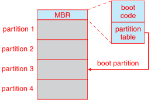

## 6. 虚拟机

### 系统级虚拟化

每个虚拟机安装独立操作系统，隔离性强，开销大

### 轻量级虚拟化*

容器技术将应用程序与其依赖关系打包形成一个镜像，可在其他环境中部署大量相同容器

#### 镜像Image

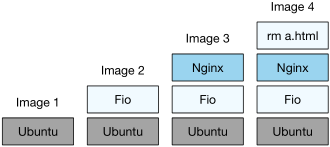

#### 容器Container

容器与镜像关系类似进程与程序关系。容器是镜像产生的实例，一个镜像可被多次运行生成多个容器

**虚拟机与容器架构对比**

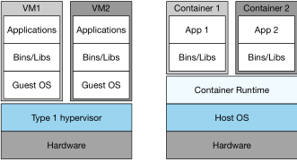

##### Docker

使用 Linux namespace, cgroups 技术实现资源隔离

```sh
docker pull <username>/<container>:<version>
docker run <username>/<container>:<version>
docker run -it ubuntu bash
```

##### Kubernetes

容器编排系统，主要有节点 Node 和控制平面 Control Plane 组成；

Pod：一组正在运行应用负载的容器，是 Kubernetes 管理的最小单元

节点包括几个用于维护运行在该节点中的 Pod 的组件：

- kubelet：每个节点与控制平面交互的代理，接受控制平面的 Pod 创建请求，与节点上的容器运行时交互并创建 Pod 相关的容器，监控容器运行状况
- kube-proxy：每个节点上的网络代理，维护节点中的网络规则，实现节点流星转发
- 容器运行时：管理容器生命周期，负责创建、运行、销毁容器。如：Docker、containerd

控制平面组件：

- API-server：作为前端，暴露API
- scheduler：为新创建的 Pod 寻找合适节点
- etcd：键值存储系统，用于存储集群运行状态、配置信息
- controller manager：管理 Node controller, Replication controller 等控制器


