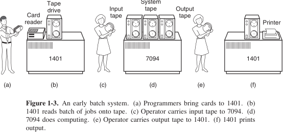
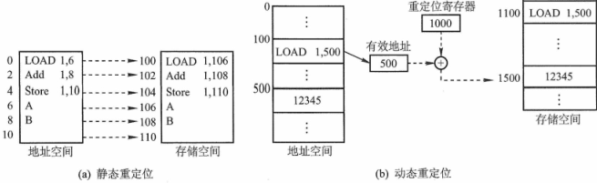

**考纲**

操作系统概念

操作系统发展**历程**

操作系统运行环境：内核态与用户态，中断与异常的处理，系统调用，程序的链接与装入，**程序运行时内存映像与地址空间**

**操作系统结构：分层，模块化，宏内核，微内核，外核**

操作系统引导

**虚拟机**

**知识框架**


​	

## 1. 操作系统特征

- 并发

  同一时间间隔内有多个程序正在运行

  单处理机环境，微观上多个程序分时交替执行

- 共享

  互斥共享：一段连续时间内只允许一个进程访问该资源。如：打印机

  同时访问：宏观上同时，微观上交替分时共享访问。如：磁盘

- 虚拟

  将一个物理实体变为若干逻辑对应物。如：虚拟处理器（多用户分时使用），虚拟内存，虚拟设备

- 异步

  多进程并发执行，由于资源限制与抢占，进程的执行走走停停，以不可预知的顺序与速度向前

## ~~操作系统目标与功能~~

### 作为系统资源管理者

- 处理器管理：进程管理，包括：进程控制，进程同步，进程通信，死锁处理，处理机调度
- 存储器管理：内存分配与回收，地址映射，内存保护与共享，内存扩充
- 文件管理：文件系统，功能包括：文件存储空间管理，目录管理，读写管理与保护
- 设备I/O管理：缓冲管理，设备分配，设备控制，设备独立性（虚拟设备）

### 作为用户与硬件系统间的接口

- 命令接口：联机（交互式），脱机（批处理）
- 程序接口：系统调用

## 2. 发展历程

### 无系统（手工）

程序卡片装入输入机，启动输入机，通过控制开关启动程序

### 批处理

#### 单道批处理

引入脱机输入/输出技术，通过读卡机将批量作业读入磁带，再将磁带送入磁带机，由监督程序读入并运行、输出到磁带。每个作业结束，系统自动读入下一个作业并运行。当一批作业结束后，将输出磁带打印



#### 多道批处理

1. 引入多道程序技术，多道程序并发执行

   将内存分为几部分存放不同作业，作业A请求I/O时，作业B可以使用CPU；宏观上并行，微观上交替串行

2. 有了磁盘引入SPOOL技术（同时的外设联机操作）：当一个作业运行结束，系统能将一个新作业从磁盘读入装入空出的内存区域运行

问题：用户响应时间长，没有人机交互功能（提交作业后只能等待）


### 分时系统

系统以时间片为单位轮流为各个联机用户/作业服务，各用户通过终端与计算机交互

问题：不能优先处理实时的紧急任务

### 实时系统

高响应、高可靠性

进程调度：采用抢占式高优先级算法

## 3. 运行环境

### CPU 运行模式

#### 用户态与内核态

内核态能执行所有特权指令，访问所有寄存器和存储器

内核指令：设置时钟，设置中断屏蔽，清内存，存储保护，IO

用户态进入内核态的方式：中断

### 中断与异常的处理

**软中断**：如通过访管指令执行系统调用，Linux 汇编代码 `int $0x80`

[traps.c](https://github.com/torvalds/linux/blob/v3.13/arch/x86/kernel/traps.c#L770)

```c
#ifdef CONFIG_IA32_EMULATION
	set_system_intr_gate(IA32_SYSCALL_VECTOR, ia32_syscall);
	set_bit(IA32_SYSCALL_VECTOR, used_vectors);
#endif

#ifdef CONFIG_X86_32
	set_system_trap_gate(SYSCALL_VECTOR, &system_call);
	set_bit(SYSCALL_VECTOR, used_vectors);
#endif
```

[irq_vectors.h](https://github.com/torvalds/linux/blob/v3.13/arch/x86/include/asm/irq_vectors.h#L49)

```c
#define IA32_SYSCALL_VECTOR		0x80
#ifdef CONFIG_X86_32
# define SYSCALL_VECTOR			0x80
#endif
```

同步中断和**异常**：由CPU自身产生

- 由进程导致，内核发信号，程序可改正。如：程序非法操作，地址越界，算术溢出
- 非进程导致，如：缺页

**异步中断**：由外设产生，可能发生在任意时间，本质上是电信号，由中断控制器接收并发送给处理器。如：I/O中断，网卡数据包到达发中断，时钟中断

### 系统调用


### 程序的链接与装入

- 编译：源程序 $\rightarrow$​ object file
- 静态链接：object files + static linked lib $\rightarrow$​​ executable file
- 装入+动态链接：executable file + dll $\rightarrow$​​​ 内存中的程序

#### 程序的链接

- 静态链接
- 装入时动态链接
- 运行时动态链接：按需加载，共享

#### 指令/数据绑定存储器地址时机

- 编译时：编译时知道进程在内存中的驻留地址，生成绝对代码（绝对装入）

- 装入时：使用相对地址，编译器生成**可重定位**代码，装入时绑定到绝对地址（静态重定位）

  若进程被换出，再次换入时被指定到内存其它地址，需要再次将代码完成地址转换

- 运行时：使用相对地址+基址寄存器，进程在执行时可能在内存中移动或需要动态加载模块，指令在执行时才绑定绝对地址（动态重定位）



### 程序运行时内存映像与地址空间


## 4. 操作系统结构

### 分层与模块化


### 宏内核


### 微内核


### 外核


## 5. 操作系统引导

处于 ROM 中的 `bootstrap` 程序运行，启动硬件，并从磁盘找到引导程序 `bootloader` 以启动操作系统

Windows 的引导程序位于磁盘第一个扇区，称为主引导记录MBR，包含磁盘分区表


## 6. 虚拟机

