**考纲**

进程与线程：进程/线程基本概念，进程/**线程的状态与转换**，进程/**线程的组织与控制**，线程实现（内核线程/线程库支持的线程），进程间通信（共享内存/消息传递/管道）

CPU 调度与上下文切换：调度概念/**目标**；调度实现：**调度程序scheduler**、调度时机、调度方式(抢占式/ 非抢占式)，**闲逛进程，内核级/用户级线程调度**；调度算法

**同步与互斥**：同步与互斥概念，临界区**互斥**的基本实现方法：软件/硬件法，**锁，信号量，条件变量**，~~管程~~，经典同步问题

死锁：死锁概念，~~死锁处理策略~~，死锁预防，死锁避免，死锁检测与解除

**知识框架**

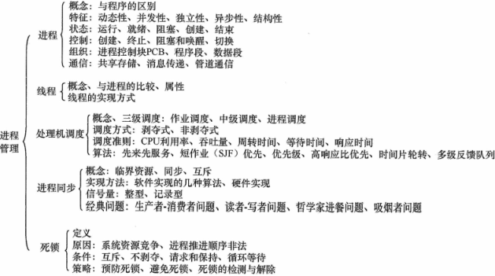

## 1. 进程与线程

### 进程概念

进程描述符

```c
struct task_struct {
    volatile long state; /* -1表示不可运行，0表示可运行，>0表示停止 */
    void *stack;
	atomic_t usage;
	unsigned long flags; /* 每进程标志，下文定义 */
	unsigned long ptrace;
	int lock_depth; /* 大内核锁深度 */
    
    struct task_struct *parent; /* 父进程 */
    struct list_head children; /* 子进程链表 */
	struct list_head sibling; /* 连接到父进程的子进程链表 */
    unsigned long nvcsw, nivcsw; /* 上下文切换计数 */
    char comm[TASK_COMM_LEN]; /* 除去路径后的可执行文件名称 */
    struct sysv_sem sysvsem; /* ipc相关 */
    struct fs_struct *fs; /* 文件系统信息 */
    struct files_struct *files; /* 打开文件信息 */
    struct nsproxy *nsproxy; /* 命名空间 */
    /* 信号处理程序 */
    struct signal_struct *signal;
    struct sighand_struct *sighand;
    
    void *journal_info; /* 日志文件系统信息 */
    struct reclaim_state *reclaim_state; /* 虚拟内存状态 */
};
```

进程特征：

- 动态性，具有生命周期：创建、活动、暂停、终止
- 并发性：多进程在一段时间内同时运行
- 独立性：是系统进行资源分配的基本单位
- 异步性：由于资源与调度的制约，进程按各自独立的、不可预知的速度向前推进，执行结果可能不可再现

### 进程状态与转换

- TASK_RUNNING (ready) 就绪待运行，等待调度

- TASK_RUNNING 运行

- TASK_INTERUPTIBLE 可中断的等待，针对等待某事件或某资源的睡眠进程

  等待接收信号告知某事件已发生（被唤醒）$\rightarrow$​​ TASK_RUNNING (ready)

- TASK_UNINTERUPTIBLE 不可中断的等待，不能由外部信号唤醒，只能由内核唤醒

- TASK_STOPPED 进程特意停止运行，如调试器暂停

- EXIT_ZOMBIE 僵尸，由另一进程或用户杀死（SIGTERM|SIGKILL），进程终止之后其数据尚未从进程表删除之前的状态

状态转换：

- 就绪$\rightarrow$​运行：被处理机调度，分配到CPU资源（时间片）
- 运行$\rightarrow$​​就绪：运行态进程用完时间片被其它高优先级进程抢占，让出CPU
- 运行$\rightarrow$​​阻塞：等待事件发生，包括请求资源
- 阻塞$\rightarrow$​​​就绪：等待的事件发生了进程被唤醒


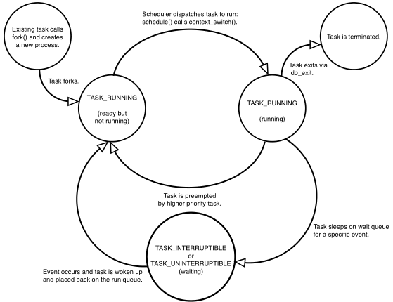

### 进程控制

- 进程创建，新进程插入就绪队列，等待被调度

- 进程终止，包括：正常退出，异常退出（访存越界、非法指令、超时、运算错、IO故障）

- 进程阻塞与唤醒：请求资源或等待某事件发生时，调度器收回CPU资源，设置为阻塞态；资源到达或事件发生时进程被唤醒，设置为就绪态

- 进程切换

### 进程的组织与控制

**进程描述符**

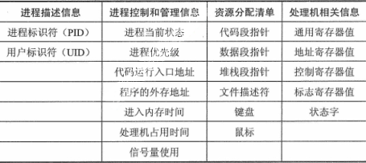

**代码段**

**数据段**

### 进程间通信

竞态条件（race condition）：几个进程在访问资源时彼此干扰的情况，即试图执行的代码被其它进程竞争访问并修改。称这块关键代码为：临界区。进程对临界区资源的访问应是互斥的

#### 低级

**信号量**（semaphore）：受保护的变量，初值=1（互斥量）

```c
/* arch/semaphore.h */
struct semaphore {
    atomic_t count;
    int sleepers;
    wait_queue_head_t wait; /* 在信号量上睡眠的进程队列 */
};
void down(struct semaphore *); /* 信号量>0可进入临界区，否则进入睡眠队列 */
void up(struct semaphore *); /* 退出临界区，唤醒等待进程 */
```

特性：

- 进程1进入临界区，对信号量 `down`，信号量=0；进程2试图进入临界区时，将在该信号量上“睡眠”，等待进程1退出
- 进程1退出临界区时，对信号量 `up`，信号量=1；选择一个在该信号量上睡眠的进程恢复执行

**互斥量**（mutex）：即二值信号量

```c
/* <mutex.h> */
struct mutex {
    atomic_t count;	/* 1: 未锁定, 0: 锁定, 负值：锁定，可能有等待者 */
    spinlock_t wait_lock;
    struct list_head wait_list;
};
void mutex_lock(struct mutex *);
void mutex_unlock(struct mutex *);
```

#### 高级

##### 消息队列

发送者写入消息；接收者根据消息编号获取消息（消息队列由内核维护）

```c
/* msg.h */
struct msg_queue {
    struct kern_ipc_perm q_perm;
    time_t q_stime;			/* 上一次调用msgsnd发送消息的时间 */
    time_t q_rtime;			/* 上一次调用msgrcv接收消息的时间 */
    time_t q_ctime;			/* 上一次修改的时间 */
    unsigned long q_cbytes;	/* 队列上当前字节数目 */
    unsigned long q_qnum;	/* 队列中的消息数目 */
    unsigned long q_qbytes;	/* 队列上最大字节数目 */
    pid_t q_lspid;			/* 上一次调用msgsnd的pid */
    pid_t q_lrpid;		    /* 上一次接收消息的pid */
    struct list_head q_messages;
    struct list_head q_receivers;
    struct list_head q_senders;
};
```

##### 共享内存

举例 POSIX C shared-memory API

```c
/* Producer process */
#include <stdio.h>
#include <stdlib.h>
#include <string.h>
#include <fcntl.h>
#include <sys/shm.h>
#include <sys/stat.h>
#include <sys/mman.h>
int main() {
    const int SIZE = 4096;	/* the size (in bytes) of shared memory object */
    const char *name = "OS";	/* name of the shared memory object */
    const char *message_0 = "Hello";/* strings written to shared memory */
    const char *message_1 = "World!";
    int fd;		/* shared memory file descriptor */
    char *ptr;	/* pointer to shared memory object */
    fd = shm_open(name,O_CREAT | O_RDWR,0666);/* create the shared memory object */
    ftruncate(fd, SIZE);/* configure the size of the shared memory object */
    /* memory map the shared memory object */
    ptr = (char *)mmap(0, SIZE, PROT_READ | PROT_WRITE, MAP_SHARED, fd, 0);    
    sprintf(ptr,"%s",message 0);/* write to the shared memory object */
    ptr += strlen(message_0);
    sprintf(ptr,"%s",message_1);
    ptr += strlen(message_1);
    return 0;
}
```

```c
/* Consumer process */
#include <stdio.h>
#include <stdlib.h>
#include <fcntl.h>
#include <sys/shm.h>
#include <sys/stat.h>
#include <sys/mman.h>
int main() {
    const int SIZE = 4096;	/* the size (in bytes) of shared memory object */
    const char *name = "OS";/* name of the shared memory object */
    int fd;					/* shared memory file descriptor */
    char *ptr;				/* pointer to shared memory obect */
    fd = shm_open(name, O_RDONLY, 0666);/* open the shared memory object */
	/* memory map the shared memory object */
    ptr = (char *)mmap(0, SIZE, PROT_READ | PROT_WRITE, MAP_SHARED, fd, 0);
    printf("%s",(char *)ptr);/* read from the shared memory object */
    shm_unlink(name);		/* remove the shared memory object */
    return 0;
}
```

##### 管道通信

$writer \rightarrow pipe\ buffer \rightarrow reader$​​​​​​，半双工单向通信，如命令：`ls | less`

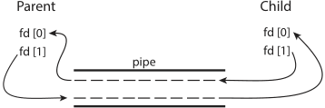

```c
/* a parent process creates a pipe and uses it to communicate with
a child process */
#include <sys/types.h>
#include <stdio.h>
#include <string.h>
#include <unistd.h>
#define BUFFER_SIZE 25
#define READ_END 0
#define WRITE_END 1
int main(void) {
    char write_msg[BUFFER_SIZE] = "Greetings";
    char read_msg[BUFFER_SIZE];
    int fd[2];
    pid t pid;
    if (pipe(fd) == -1) {	/* create the pipe */
        fprintf(stderr,"Pipe failed");
        return 1;
    }
    pid = fork();			/* fork a child process */
    if (pid < 0) { 			/* error occurred */
        fprintf(stderr, "Fork Failed");
        return 1;
    }
    if (pid > 0) { 			/* parent process */
        close(fd[READ_END]);	/* close the unused end of the pipe */
        write(fd[WRITE_END], write_msg, strlen(write_msg)+1);/* write to the pipe */
        close(fd[WRITE_END]);	/* close the write end of the pipe */
    }
    else { 					/* child process */    
        close(fd[WRITE_END]);	/* close the unused end of the pipe */
        read(fd[READ_END], read_msg, BUFFER_SIZE);/* read from the pipe */
        printf("read %s",read_msg);
        close(fd[READ_END]);	/* close the read end of the pipe */
    }
    return 0;
}
```

### 线程概念和多线程模型

#### 线程概念

线程属性：

- 线程是轻量的进程，其生命周期与进程类似

- 同一进程的各个线程共享该进程拥有的资源

- 线程是处理机独立调度的基本单位，多线程可以并发执行

  单核CPU，各线程交替占用CPU

  多核CPU，各线程可同时占用不同CPU，真正并行

#### 线程的实现

##### 用户线程(线程库)

```c
#include <pthread.h>
#include <stdio.h>
#include <stdlib.h>
int sum; /* this data is shared by the thread(s) */
void *runner(void *param); /* threads call this function */
int main(int argc, char *argv[]) {
    pthread_t tid; 			/* the thread identifier */
    pthread_attr_t attr;	/* set of thread attributes */
    pthread_attr_init(&attr);/* set the default attributes of the thread */
    pthread_create(&tid, &attr, runner, argv[1]);/* create the thread */
    pthread_join(tid, NULL);	/* wait for the thread to exit */
    printf("sum = %d∖n",sum);
}
/* The thread will execute in this function */
void *runner(void *param) {
    int i, upper = atoi(param);
    sum = 0;
    for (i = 1; i <= upper; i++)
	    sum += i;
    pthread_exit(0);
}
```

##### 内核线程

是直接由内核本身启动的进程，由内核线程创建，只在内核空间运行。内核线程经常称之为（内核）守护进程。

创建内核线程原型：

```c
/* arch/processor.h */
int kernel_thread(int (*fn)(void *), void * arg, unsigned long flags)
```

```c
/* kernel/kthread.c */
struct task_struct *kthread_create(int (*threadfn)(void *data), void *data, const char namefmt[], ...)
```

### 线程的状态与转换


### 线程的组织与控制


#### ~~多线程模型~~

即用户线程与内核线程之间的联系

- 多对一：多个用户线程映射到一个内核线程，任意时间只能由一个线程可访问内核，仅适用单核机
- 一对一：每个用户线程映射到一个内核线程，允许多个线程在多核处理器并行，但创建线程开销大
- 多对多：多个用户线程映射到较少数量的内核线程

## 2. CPU调度与上下文切换

### 调度的概念

#### 调度的层次

- 长期调度（作业调度）：批处理系统中，进程被保存到磁盘缓冲区，作业调度从其中选择进程加到内存（就绪）。频率低
- 中期调度：将暂时不能运行的进程从内存移出挂起，之后可被重新调入内存的就绪队列——交换
- 短期调度（CPU调度）：从内存就绪队列中选择进程分配CPU。频率高

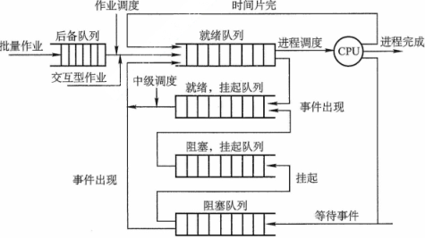

### 调度的目标

公平，调度就绪队列中等待时间最长的

优先级：实时进程 > 完全公平进程(红黑树按等待时间) > 空闲进程

### 调度的实现

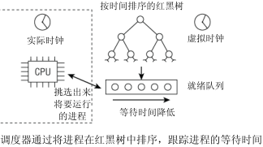

进程中与调度相关的数据成员

```c
/* <sched.h> */
struct task_struct {
...
    int prio, static_prio, normal_prio;	/* 动态优先级，静态优先级，普通优先级 */
    unsigned int rt_priority;			/* 实时优先级 */
    struct list_head run_list;
    const struct sched_class *sched_class;
    struct sched_entity se;
    unsigned int policy;	/* 对该进程的调度策略 */
    cpumask_t cpus_allowed; /* 位域，在多处理器系统上使用，限制进程可在哪些CPU上运行 */
    unsigned int time_slice; /* 指定进程可使用CPU的剩余时间段 */
...
}
/* kernel/sched.c */
static inline int rt_policy(int policy) /* 判断给出的调度策略是否属于实时类 */
static inline int task_has_rt_policy(struct task_struct *p)
```

**调度器类**

```c
/* <sched.h> */
struct sched_class {
    const struct sched_class *next;
    /* 向就绪队列添加一个新进程, 在进程从睡眠状态变为可运行状态时触发 */
    void (*enqueue_task) (struct rq *rq, struct task_struct *p, int wakeup);
    /* 逆向操作，将一个进程从就绪队列去除, 在进程从可运行状态切换到不可运行状态时触发 */
    void (*dequeue_task) (struct rq *rq, struct task_struct *p, int sleep);
    /* 在进程想要自愿放弃对处理器的控制权时使用 */
    void (*yield_task) (struct rq *rq);
    /* 用一个新唤醒的进程来抢占当前进程, 例如在用wake_up_new_task唤醒新进程时会调用 */
    void (*check_preempt_curr) (struct rq *rq, struct task_struct *p);
    /* 选择下一个将要运行的进程 */
    struct task_struct * (*pick_next_task) (struct rq *rq);
    /* 用另一个进程代替当前运行的进程之前调用 */
    void (*put_prev_task) (struct rq *rq, struct task_struct *p);
    /* 在进程的调度策略发生变化时，需要调用 */
    void (*set_curr_task) (struct rq *rq);
    /* 在每次激活周期性调度器时，由周期性调度器调用 */
    void (*task_tick) (struct rq *rq, struct task_struct *p);
    /* 用于建立fork系统调用和调度器之间的关联。每次新进程建立后，用new_task通知调度器 */
    void (*task_new) (struct rq *rq, struct task_struct *p);
};
```

标准函数 `activate_task` 和 `deactivate_task` 调用前述的函数，提供进程在就绪队列的入队和离队功能。

```c
/* kernel/sched.c */
static void enqueue_task(struct rq *rq, struct task_struct *p, int wakeup)
static void dequeue_task(struct rq *rq, struct task_struct *p, int sleep)
```

**就绪队列**

```c
/* kernel/sched.c */
struct rq {
    unsigned long nr_running;
    #define CPU_LOAD_IDX_MAX 5
    unsigned long cpu_load[CPU_LOAD_IDX_MAX]; /* 就绪队列当前负荷的度量 */
...
    struct load_weight load;
    /* 子就绪队列，分别用于完全公平调度器和实时调度器 */
    struct cfs_rq cfs; 
    struct rt_rq rt;
    /* curr指向当前运行的进程的task_struct实例,idle指向idle进程的task_struct实例 */
    struct task_struct *curr, *idle;
    u64 clock; /* 用于实现就绪队列自身的时钟 */
...
};
```

**调度实体**

```c
/* <sched.h> */
struct sched_entity {
    struct load_weight load; /* 用于负载均衡 */
    struct rb_node run_node;
    unsigned int on_rq; /* 表示该实体当前是否在就绪队列上接受调度 */
    u64 exec_start;
    u64 sum_exec_runtime;
    u64 vruntime; /* 在进程执行期间虚拟时钟上流逝的时间数 */
    u64 prev_sum_exec_runtime; /* 在进程被撤销CPU时，其当前sum_exec_runtime值保存到prev_exec_runtime。此后在进程抢占时又需要该数据 */
...
}
```

每个task_struct都嵌入了sched_entity的一个实例，所以进程是可调度实体

#### 调度程序 scheduler

```c
kernel/sched.c
asmlinkage void __sched schedule(void) {
/* 首先确定当前就绪队列，并在prev中保存一个指向（仍然）活动进程的task_struct的指针 */
    struct task_struct *prev, *next;
    struct rq *rq;
    int cpu;
need_resched:
    cpu = smp_processor_id();
    rq = cpu_rq(cpu);
    prev = rq->curr;
...
/* 类似于周期性调度器，内核也利用该时机来更新就绪队列的时钟，并清除当前运行进程task_struct中的重调度标志TIF_NEED_RESCHED。*/
    __update_rq_clock(rq);
    clear_tsk_need_resched(prev);
...
/* 同样因为调度器的模块化结构，大多数工作可以委托给调度类。如果当前进程原来处于可中断睡眠状态但现在接收到信号，那么它必须再次提升为运行进程。否则，用相应调度器类的方法使进程停止活动(deactivate_task实质上最终调用了sched_class->dequeue_task) */
	if (unlikely((prev->state & TASK_INTERRUPTIBLE) && 				           			unlikely(signal_pending(prev)))) {
	    prev->state = TASK_RUNNING;
    } else {
    	deactivate_task(rq, prev, 1);
    }
...
/* put_prev_task首先通知调度器类当前运行的进程将要被另一个进程代替。注意，这不等价于把进程从就绪队列移除，而是提供了一个时机，供执行一些簿记工作并更新统计量。调度类还必须选择下一个应该执行的进程，该工作由pick_next_task负责 */
    prev->sched_class->put_prev_task(rq, prev);
    next = pick_next_task(rq, prev);
...
/* 不见得必然选择一个新进程。也可能其他进程都在睡眠，当前只有一个进程能够运行，这样它自然就被留在CPU上。但如果已经选择了一个新进程，那么必须准备并执行硬件级的进程切换。*/
    if (likely(prev != next)) {
        rq->curr = next;
        context_switch(rq, prev, next);
    }
...
/* context_switch一个接口，供访问特定于体系结构的方法，后者负责执行底层上下文切换。下列代码检测当前进程的重调度位是否设置，并跳转到如上所述的标号，重新开始搜索一个新进程 */
    if (unlikely(test_thread_flag(TIF_NEED_RESCHED)))
    	goto need_resched;
}
```

#### 调度的时机与上下文切换

- 在 `fork()` 新进程后，需决定运行父进程还是子进程
- 在进程退出时
- 在进程阻塞时
- I/O完成发起中断，被阻塞进程被唤醒为就绪态时   

不能进行进程调度与切换的情况：

- 系统处理中断时
- 进程执行临界区代码时
- 屏蔽中断的原子操作，如：加锁，解锁，中断现场保护与恢复

**上下文切换**

`switch_mm` 更换通过 `task_struct->mm` 描述的内存管理上下文。主要包括加载页表、刷出地址转换后备缓冲器、向内存管理单元（MMU）提供新的信息。

`switch_to` 切换处理器寄存器内容和内核栈（虚拟地址空间的用户部分在第一步已经变更，其中也包括了用户状态下的栈，因此用户栈就不需要显式变更了）

```c
kernel/sched.c
static inline void context_switch(struct rq *rq, struct task_struct *prev, struct task_struct *next) {
    struct mm_struct *mm, *oldmm;
    /* 调用每个体系结构都必须定义的prepare_arch_switch挂钩 */
    prepare_task_switch(rq, prev, next);
    mm = next->mm;
    oldmm = prev->active_mm;
...
	/* 内核线程没有自身的用户空间内存上下文，可能在某个随机进程地址空间的上部执行。其task_struct->mm为NULL。从当前进程“借来”的地址空间记录在active_mm中 */
    if (unlikely(!mm)) {
        next->active_mm = oldmm;
        atomic_inc(&oldmm->mm_count);
        /* 通知底层体系结构不需要切换虚拟地址空间的用户空间部分。这种加速上下文切换的技术称之为惰性TLB */
        enter_lazy_tlb(oldmm, next);
    } else
	    switch_mm(oldmm, mm, next);
...
	/* 如果前一进程是内核线程（即prev->mm为NULL），则其active_mm指针必须重置为NULL，以断开与借用的地址空间的联系：*/
    if (unlikely(!prev->mm)) {
        prev->active_mm = NULL;
        rq->prev_mm = oldmm;
    }
...
	/* 最后用switch_to完成进程切换，该函数切换寄存器状态和栈，新进程在该调用之后开始执行 */
    /* 这里我们只是切换寄存器状态和栈。 */
    switch_to(prev, next, prev); //prev = switch_to(prev,next)
	/* barrier一个编译器指令，确保switch_to和finish_task_switch语句的执行顺序不会因为任何可能的优化而改变 */
    barrier(); 
	/* this_rq必须重新计算，因为在调用schedule()之后prev可能已经移动到其他CPU，因此其栈帧上的rq可能是无效的。*/
	finish_task_switch(this_rq(), prev); /* 完成一些清理工作，使得能够正确地释放锁*/
}    
```

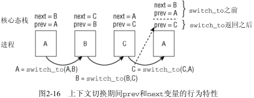

#### 调度方式(抢占/非抢占)

- 非剥夺（非抢占）调度：进程只在运行完或等待某事件发生而进入阻塞态时，才让出CPU
- 剥夺（抢占）调度：可被更高优先级的其他进程抢占CPU

#### 闲逛进程


#### 内核级/用户级线程调度

轻量级线程LWP：在用户与内核线程之间增加的一个数据结构，表现为虚拟处理器；每个LWP与一个内核线程相连。

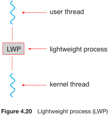

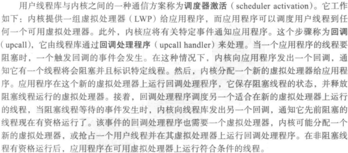

CPU调度的是内核级线程。用户级线程由线程库管理，需要通过映射到相关内核级线程才能运行在CPU上

- PTHREAD_SCOPE_PROCESS：按进程竞争范围来调度，将用户级线程映射到可用的轻量级进程LWP
- PTHREAD_SCOPE_SYSTEM：按系统竞争范围来调度，创建一个轻量级进程LWP，将多对多系统的每个用户级线程绑定到轻量级进程LWP（实际一对一映射）

pthread scheduling API

```c
#include <pthread.h>
#include <stdio.h>
#define NUM_THREADS 5
int main(int argc, char *argv[]) {
	int i, scope;
    pthread_t tid[NUM THREADS];
    pthread_attr_t attr;
    /* get the default attributes */
    pthread_attr_init(&attr);
    /* first inquire on the current scope */
    if (pthread_attr_getscope(&attr, &scope) != 0)
	    fprintf(stderr, "Unable to get scheduling scope∖n");
    else {
        if (scope == PTHREAD_SCOPE_PROCESS)
        	printf("PTHREAD SCOPE PROCESS");
        else if (scope == )
        	printf("PTHREAD SCOPE SYSTEM");
        else
        	fprintf(stderr, "Illegal scope value.∖n");
    }
    /* set the scheduling algorithm to PCS or SCS */
    pthread_attr_setscope(&attr, PTHREAD_SCOPE_SYSTEM);
    /* create the threads */
    for (i = 0; i < NUM THREADS; i++)
	    pthread_create(&tid[i],&attr,runner,NULL);
    /* now join on each thread */
    for (i = 0; i < NUM_THREADS; i++)
    	pthread_join(tid[i], NULL);
}
/* Each thread will begin control in this function */
void *runner(void *param) {
    /* do some work ... */
    pthread exit(0);
}
```

### 调度算法的评价准则

- CPU利用率

- 系统吞吐量：单位时间内CPU完成作业的数量。长作业降低，短作业提高

- 等待时间 = 作业开始时间 - 作业提交时间

- 周转时间：从作业提交到作业完成所经历的时间。作业等待+就绪等待+运行+I/O

  周转时间 = 作业完成时间 - 作业提交时间

  平均周转时间 = $\frac{1}{n}\sum_{i=1}^n job_i$​​ 周转时间，$\bar T=\frac{1}{n}\sum_{i=1}^n T_i$​​

  带权周转时间 = $\frac{作业周转时间}{作业实际运行时间}$​​

  平均带权周转时间 = $\frac{1}{n}\sum_{i=1}^n job_i$ 带权周转时间

- 响应时间：从用户提交请求到系统首次响应所用时间。对交互式系统尤为重要

### 调度算法

#### FCFS 先来先服务

$p=1/T_{req}$​​

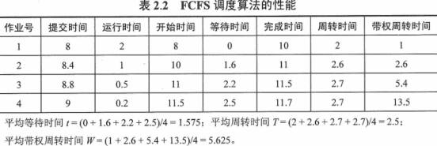

特点：对长作业有利，对短作业不利；有利于CPU繁忙型作业，不利于I/O繁忙型作业；

平均等待时间较长

#### SJF 短作业优先

$p=1/T_{run}$​

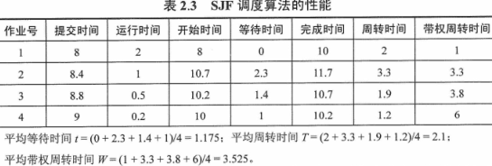

特点：对长作业不利，长作业长期不被调度——“饥饿”；未考虑作业紧迫度；时间需要估计不准

平均等待时间、评价周转时间最短

最短作业优先的抢占式版本：最短剩余时间优先

#### 优先级调度

进程优先级设置依据：

- 系统进程>用户进程
- 交互型进程>非交互型进程
- I/O型进程>计算型进程
- 占用CPU时间短的>占用CPU时间长的
- 就绪等待时间长的>就绪等待时间短的

#### 高响应比优先

是对FCFS与SJF调度算法的综合平衡，同时考虑作业的等待时间与估计的运行时间

$p=(T_{wait}+T_{run})/T_{run}$

特点：

- 等待时间相同时，估计运行时间越短，响应比越高，实现了短作业优先
- 估计运行时间相同时，等待时间越长，响应比越高，实现了先来先服务
- 对于长作业，等待时间越长，响应比越高，克服了饥饿

#### 时间片轮转调度

时间片长短影响因素：与系统响应时间成正比，与就绪队列进程数成反比

#### 多级队列调度


#### 多级反馈队列调度

是对优先级与时间片轮转调度算法的综合

实现思想：

1. 设置多个就绪队列，每个队列赋予不同优先级，依次降低

2. 优先级高的队列，进程的运行时间片越小

3. 多级队列逐级向下调度执行

4. 新进程进入内存，首先放入当前未满（1级）队列末尾，按FCFS原则等待调度

   当轮到该进程执行，若能在该时间片内完成，便可正常退出

   若在该时间片内未完成，进入下一级（2级）队列末尾，……

   当长进程从1级队列降到n级队列，在n级队列采用时间片轮转调度执行完

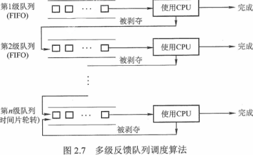

特点：

- 终端型作业用户：短作业优先
- 短作业用户：周转时间较短
- 长作业用户：不会“饥饿”

## 3. 同步与互斥

### 同步与互斥概念

#### 临界资源

临界资源：一次只能为一个进程所用

临界区：访问临界资源的代码

#### 同步与互斥

同步：多个进程需要在某些位置上协调它们的工作次序而等待、传递信息产生的前后制约关系。如：生产者-消费者关系

**互斥**：多个进程试图进入同一临界区，先进入的访问临界资源，后面的进程必须等待其退出。如：消费者-消费者关系

禁止两进程同时进入临界区的同步机制准则：

- （互斥）空闲让进 + 忙则等待
- （公平）有限等待：保证在有限时间内进入临界区，不饥饿
- （性能）让权等待：不能进入临界区的进程应释放处理器，不忙等

#### 整数原子操作

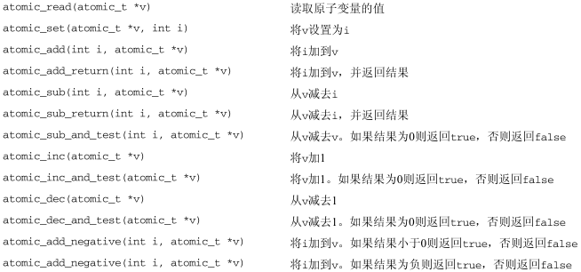

```c
/* arch/atomic.h */
typedef struct { volatile int counter; } atomic_t;
static inline void atomic_add(int i, atomic_t *v) {
	asm volatile(LOCK_PREFIX "addl %1,%0"
		     : "+m" (v->counter)
		     : "ir" (i));
}
static inline void atomic_sub(int i, atomic_t *v) {
	asm volatile(LOCK_PREFIX "subl %1,%0"
		     : "+m" (v->counter)
		     : "ir" (i));
}
```

### 实现临界区互斥

#### 软件实现

**Perterson 方案**

```c
int turn; /* i or j */
bool req[2];

/* process i */
req[i] = true;
turn = j;
while (req[j] && turn == j); //spin block
/* critical section */
req[i] = false;

/* process j */
req[j] = true;
turn = i;
while (req[i] && turn == i); //spin block
/* critical section */
req[j] = false;
```

特点：满足互斥与公平

#### 硬件实现

硬件指令方法：基于加锁、解锁的原子操作

**TestAndSet 指令**：更新为新值，返回旧值

```c
bool TestAndSet(bool *flag, bool new) {
    bool old = *flag;
    *flag = new;
    return old;
}
```

只有锁开的状态 `flag == false` 才能加锁，进入临界区；否则自旋等待（阻塞）

```c
typedef struct lock_t { bool flag; } lock_t;
void init(lock_t *lock) {
    lock->flag = false;
}
void lock(lock_t *lock) {
    while (TestAndSet(&lock->flag, true)); //spin wait
}
void unlock(lock_t *lock) {
    lock->flag = false;
}
```

**CompareAndSwap 指令**：如果旧值是传入的期待值，则旧值变量更新为新值；返回旧值

```c
bool CompareAndSwap(bool *flag, bool expected, bool new) {
    bool actual = *flag;
    if (actual == expected)
        *flag = new;
    return actual;
}
```

```c
void lock(lock_t *lock) {
    while (CompareAndSwap(&lock->flag, false, true)); //spin wait
}
```

特点：满足互斥，缺点：

1. 会忙等
2. 不公平（竞态下的多进程自旋可能导致饥饿）
3. 可能死锁（p1进入临界区被中断让出给高优先级p2，由于互斥p2忙等自旋，而p1因优先级低无法再被调度）

### 锁


### 信号量

信号量：定义了一个用于进程间传递信号的整数变量，两个原子操作：递减，递增。信号量初值=1，负数时的值为等待线程的个数。

信号量一种睡眠锁：

- 若一个进程试图获得一个已被占用的信号量，则进程进入等待队列睡眠（让出CPU）。处理器执行其它代码
- 当持有的信号量可用（被释放），处于等待队列的队首进程将被唤醒并获得该信号量

```c
typedef struct {
    int		count;
    queue	wait_list;
} semaphore;
void wait(semaphore *s) {
    s->count--;
    if (s.count < 0) {
    	// add task p to s->wait_list    
        // block(p)
    }
}
void signal(semaphore *s) {
    s->count++;
    if (s.count <= 0) {
    	// pop a task p to from s->wait_list    
        // wakeup(p)
    }
}
```

#### 信号量实现同步

$P_2$ 的操作依赖于 $P_1$ 的运行结果

```c
/* example: variable y in p2 depends on variable x in p1 */
semaphore s = 0;
/* p1 */
p1() {
	func(x);
    signal(s); //
}
/* p2 */
p2() {
    wait(s); //
	func(y);
}
```

#### 信号量实现互斥

$P_1 与 P_2$​​​ 的临界区代码包含对相同的临界资源​的访问

```c
/* example: critical section in p2 and its in p1 have the same critical data */
semaphore s = 1;
/* p1 */
p1() {
    wait(s);
	// critical section
    signal(s); //
}
/* p2 */
p2() {
    wait(s); //
	// critical section
    signal(s); //    
}
```

#### 信号量实现前驱关系

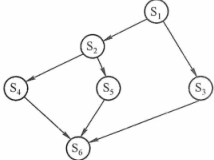

```c
/* p1-p2--p4-p6
       \__p5_p6
   p1---p3---p6 */
semaphore s12 = s13 = s24 = s25 = s36 = s46 = s56 = 0;
p1() { 
    /* ... */
    signal(s12); 
    signal(s13); 
}
p2() { 
    wait(s12);
    /* ... */
    signal(s24);
    signal(s25);    
}
p3() { 
    wait(s13);
    /* ... */
    signal(s36);    
}
p4() { 
    wait(s24);
    /* ... */
    signal(s46);    
}
p5() { 
    wait(s25);
    /* ... */
    signal(s56);    
}
p6() { 
    wait(s36);
    wait(s46);
    wait(s56);   
    /* ... */
}
```

#### Linux Kernal semaphore

```c
/* linux/semaphore.h */
struct semaphore {
    unsigned int		count;
    raw_spinlock_t		lock;
    struct list_head	wait_list; /* 在信号量上睡眠的进程队列 */
};
void down(struct semaphore *); /* 信号量>0可进入临界区，否则进入睡眠队列 */
void up(struct semaphore *); /* 退出临界区，唤醒等待进程 */
```

`kernel/locking/semaphore.c` 简化版

```c
typedef struct {
    unsigned int	count;
    spinlock		lock;
    queue			wait_list;
} semaphore;
typedef struct {
    task_struct *task;
    bool up;
} semaphore_waiter;
void down(semaphore *s) {
    spin_lock(&s->lock);
    if (s->count > 0)
        s->count--;
    else {
        semaphore_waiter waiter;
        waiter.task = current;
        waiter.up = false;
        wait_list.push(waiter);
        while(!waiter.up); //
    }
    spin_unlock(&s->lock);    
}
void up(semaphore *s) {
    spin_lock(&s->lock);
    if (water.empty()) 
        s->count++;
    else {
        semaphore_waiter waiter = wait_list.top();
        wait_list.pop();
        waiter->up = true;
        wake_up_process(waiter->task);
    }
    spin_unlock(&s->lock);   
}
```

#### POSIX C semaphore API

```c
sem_init(sem_t *s, int pshared, unsigned int value); /* unnamed */
sem_t *sem_open(char name[], int operate, int mode, int value);
sem_wait(sem_t *s);
sem_post(sem_t *s);
int sem_destroy(sem_t *s);
```

```c
#include <semaphore.h>
sem_t s;
sem_init(&s, 0, 1); 

sem_wait(&s);
/* critical section */
sem_post(&s);
```


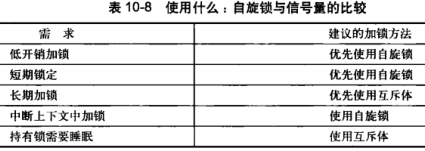

### ~~管程 monitor~~

#### 定义

管程：一种编程语言结构（ADT），封装了若干数据结构（内部共享），初始化代码及互斥访问过程

- 管程内的数据只能被管程内的过程访问
- 每次只有一个进程能通过调用管程内的过程访问管程内数据

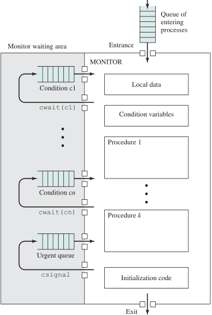

#### 条件变量

管程为避免进程一直阻塞不释放管程，通过使用条件变量来实现同步

条件变量：用来阻塞一个进程，直到特定条件为真。每个条件变量保存了一个等待队列。

条件变量的两个操作：

- `cond_wait(c)` 当条件 c 不满足时，进程在条件 c 上阻塞进入等待队列
- `cond_signal(c)` 唤醒在条件 c 上阻塞的一个进程

```c
/* A Solution to the Bounded-Buffer Producer/Consumer Problem Using a
Monitor */
monitor bounded_buffer_queue {
    char buffer[N];
    int in, out;	/* buffer pointers */
    int count;
    cond_t	not_full, not_empty;
    initialize() {
		in = out = count = 0;
    }
    void push(char x) {
        if (count == N) 
        	cond_wait(not_full);
        buffer[in] = x;	/* append */
        in = (in + 1) % N;
        count++;
        cond_signal(not_empty);
    }
    void pop(char *x) {
        if (count == 0)
	        cond_wait(not_empty);
        *x = buffer[out];
        out = (out + 1) % N;
        count--;
        cond_signal(not_full);
    }
}
void producer() {
    char x;
    while (1) {
        produce(&x);
        buffer.push(x);
    }
}
void consumer() {
    char x;
    while (1) {
        buffer.pop(&x);
        consume(x);
    }
}
```

信号量与条件变量的不同：条件变量没有（对资源）记录值，管程中由共享数据结构对记录资源值

### 条件变量


##### POSIX C condition-variable API

```c
pthread_cond_init(pthread_cond_t *c, NULL);
pthread_cond_wait(pthread_cond_t *c, pthread_mutex_t *lock);
pthread_cond_signal(pthread_cond_t *c);
```

```c
pthread_mutex_t m;
pthread_cond_t c;
pthread_mutex_init(&m, NULL)
pthread_cond_init(&c, NULL);

pthread_mutex_lock(&m);
while (!ready)
	pthread_cond_wait(&c, &m);
/* critical section */
pthread_mutex_unlock(&mutex);

pthread_mutex_lock(&m);
/* critical section and ready */
pthread_cond_signal(&c);
pthread_mutex_unlock(&m);
```

### 经典同步问题

#### 生产者-消费者问题

生产者放数据：若缓冲区未满则将数据入队并唤醒在睡眠的消费者，否则等待条件-未满

消费者拿数据：若缓冲区非空则从队头取数据并唤醒在睡眠的生产者，否则等待条件-非空

临界资源：

- 有界缓冲区，生产者与消费者对缓冲区的访问——互斥与同步 `mutex`
- 空位：生产者对缓冲区空位的等待(-1) `wait(empty)`，消费者对缓冲区空位的释放(+1)，唤醒生产者 `signal(empty)`——互斥与同步
- 数据：消费者对缓冲区数据的等待(-1) `wait(full)`，生产者为缓冲区增加数据(-1)，唤醒消费者 `signal(full)`——互斥与同步

```c
semaphore mutex = 1;
semaphore empty = n;
semaphore full = 0;
void producer() {
    item x;
    while(1) {
        produce(&x);
        wait(empty); //等待空位
         wait(mutex);
          buffer_push(x); //
         signal(mutex);
        signal(full);
    }
}
void consumer() {
    item x;
    while(1) {
        wait(full); //等待非空
         wait(mutex);
          buffer_pop(&x); //
         signal(mutex);
        signal(empty);
        consume(x);
    }
}
```

使用互斥量+条件变量

```c
cond_t empty, full;
mutex_t mutex;
void *producer(void * arg) {
    item x;
    while (1) {
        mutex_lock(&mutex);
        while (buffer_full(b)) 
            cond_wait(&empty, &mutex); //等待空
        buffer_push(x);	//
        cond_signal(&full);
        mutex_unlock(&mutex);
    }
}
void *consumer(void *arg) {
    item x;
    while (1) {
        mutex_lock(&mutex);
        while (buffer_empty(b)) 
            cond_wait(&full, &mutex); //等待满
		buffer_pop(&x); //
        cond_signal(&empty);
        mutex_unlock(&mutex);
    }
}
```

#### 读者-写者问题

任意数目的进程都可以并发读取数据结构，而写访问只能限于一个进程。

临界资源：

- 数据区，读者与写者对数据区的访问——互斥与同步 `rw_mutex`

  当仅有一个读者时就等待数据区访问权(-1)，当最后一个读者访问完成就让出数据区访问权(+1)。

- 读者数变量：读者之间对其访问——互斥与同步 `cmutex`

- 顺序权：不管是读者还是写者都按照顺序请求操作——互斥与同步 `ticket`（公平）

  读者在已获数据区访问权的前提下对数量操作后就让出顺序权；写者在访问完成时让出顺序权

**读者优先**

第一个读进程获取数据区访问权，后续读进程并发访问，写者需等到无其它读写进程时才能访问，会导致”饥饿“

```c
semaphore cmutex = 1;
semaphore rw_mutex = 1;
int read_count = 0;
void writer() {
    while(1) {
        wait(rw_mutex);
        write(fd); //
        signal(rw_mutex);
    }
}
void reader() {
    while(1) {
      ╭─wait(cmutex);
      ├─read_count++;
      │ if (read_count == 1) /* only reader */
      │    wait(rw_mutex);   ─╮
      ╰─signal(cmutex);       |
        read(fd); //         ─┤
      ╭─wait(cmutex);         |
      ├─read_count--;         |
      | if (read_count == 0)  |
      |     signal(rw_mutex);─╯
      ╰─signal(cmutex);
    }
}
```

公平（按到达顺序），不管是读者还是写者都要请求一个仅有的入场券：

- 读者在访问完 `read_count` 及可能的对数据区的请求 `wait(rw_mutex)` 后让出入场券

- 写者在访问完数据区后让出入场券

```c
semaphore ticket = 1;
semaphore cmutex = 1;
semaphore rw_mutex = 1;
int read_count = 0;
void writer() {
    while(1) {
        wait(ticket);
        wait(rw_mutex);        
        write(fd); //
        signal(rw_mutex);
        signal(ticket);        
    }
}
void reader() {
    while(1) {
        wait(ticket);
      ╭─wait(cmutex);
      ├─read_count++;  
      │ if (read_count == 1) /* only reader */
      │    wait(rw_mutex);   ─╮
      ╰─signal(cmutex);       |
        signal(ticket);       |
        read(fd); //         ─┤
      ╭─wait(cmutex);         |
      ├─read_count--;         |
      | if (read_count == 0)  |
      |     signal(rw_mutex);─╯
      ╰─signal(cmutex);
    }
}
```

## 4. 死锁

### 死锁概念

```
Process P: 
  wait(A); wait(B); signal(A); signal(B);
Process Q: 
  wait(B); wait(A); signal(B); signal(A);
```

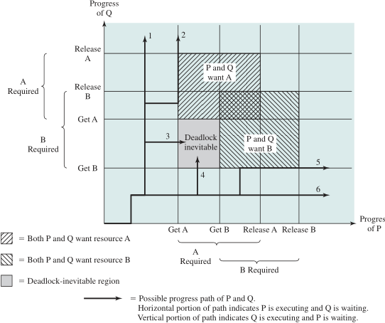

#### 死锁产生的原因

- 对不可剥夺的互斥资源的竞争
- 不同进程对资源的保持并请求存在逆序

#### 死锁产生的必要条件

- 互斥：同一时间资源仅能被一个进程占有

- 不剥夺：进程占用的资源在未使用完之前不能被其他进程抢占

- 保持并请求：保持一个资源的同时请求另一个资源

- 环路等待：环路内的同类资源未被环路外的进程占有的情况（纯环路）。

  若环路外的进程占有环路内的资源，通过释放占有资源可以打破环路等待。

### 死锁预防

破坏死锁产生的4个必要条件之一

1. 破坏互斥条件
2. 破坏不剥夺条件：占有资源的进程得不到其它资源请求时释放已有资源
3. 破坏请求并保持条件：预先静态分配，一次性申请完所需资源再运行
4. 破坏环路等待条件：给资源编号，顺序分配

### 死锁避免（先验）

#### 系统安全/不安全状态

进程推进序列：$seq=(...,P_i,P_j,...),P_i\rightarrow P_j.\ i,j\in range(n)$​​​​​​​​​​

安全状态：存在 $seq$，系统能按照进程推进顺序 $seq$ 对进程预分配所需资源及回收，使每个进程都能满足对资源的需求直至完成，称 $seq$ 为安全序列

例：如图，存在 $(P_2,P_1,P_3)$​​​​ 安全序列​。资源先给需求最小的 $P_2$​​，回收后6；再给需求最小的 $P_1$​，回收后9

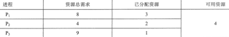

**不安全状态与死锁关系**

死锁是不安全状态的真子集，死锁 $\Rightarrow$​​​​ 不安全状态

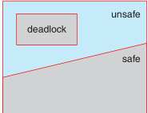

### 安全检查算法

```c
bool isSafeStatus(state s):
    seq = (), remains = s.available;
    loop:
        find P[i]: P[i] ∉ seq, s.need[i] ≤ remains;
        if found:  
			seq.add(P[i]), remains += s.allocation[i];
		else break;
    return seq.length == P.length; //true-safe
```

### 银行家算法

数据结构：

- 进程 $P_1...P_n$​​​​​​​，资源 $R_1...R_m$​​​​​​，当前可用资源​ $Available(1...m)$​​​​

- 最大需求矩阵 $Max_{n\times m},\ Max(i)$​表示进程 $P_i$​ 对 m 类资源的总需求量，$Max(i,j)$​表示进程 $P_i$​ 对资源 $R_j$​ 的总需求量
- 已分配矩阵 $Allocation_{n\times m},\ Allocation(i)$​表示进程 $P_i$​ 已获得 m 类资源的量，$Allocation(i,j)$​表示进程 $P_i$​ 已获得资源 $R_j$​ 的量
- 需求矩阵 $Need_{n\times m},\ Need(i)$​​​表示进程 $P_i$​​​ 对 m 类资源的剩余需求量，$Need(i,j)$​​​表示进程 $P_i$​​​ 对资源 $R_j$​​​ 的剩余需求量
- 矩阵关系：$Need=Max-Allocation$​

```c
struct state {
	task P[n];
    int resource[m], available[m];
    int allocation[n][m], need[n][m];
    //int request[n][m];
};
```

银行家资源分配算法：测试是否可以对 $Pi$ 的请求 $request(i)$ 进行分配

```cpp
bool allocate(state s, request, i):
	if !request[i] ≤ s.need[i]: 
		throw new Error("overflow");
	if !request[i] ≤ s.available: 
		p[i].wait(); return false;
	else //pre-allocate
        s.available -= request[i], s.need[i] -= request[i];
		s.allocation[i] += request[i];
	if isSafeStatus(s): 
		return true;
	else //cancel pre-allocate
        s.available += request[i], s.need[i] += request[i]; 
		s.allocation[i] -= request[i];
		p[i].wait(); return false;
```

例题：

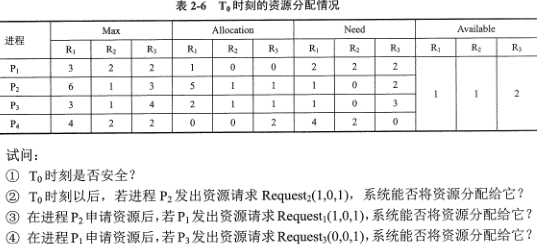

### 死锁检测

#### 资源分配图

申请边 $P_i\rightarrow R_j$​​​​​，分配(持有)边 $R_j\rightarrow P_i$​

#### 每种资源仅单个

资源分配图中若存在请求保持关系：$P_i\rightarrow R_k\rightarrow P_j$，将该资源节点的各对前后边合并 $P_i\rightarrow P_j$；删除资源节点 $R_k$​​​；得到进程等待图。

若等待图中有一个环则说明系统死锁。

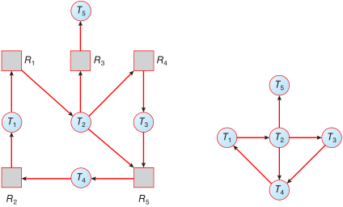

#### 每种资源有多个

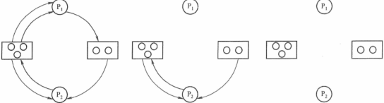

1. 资源分配图中，找出不孤立且不阻塞（请求能满足）的进程，删除它的所有边使其孤立；进程可完成（不参与死锁）释放资源，唤醒其它等待进程；继续化简直至不可化简。

   若不能消去所有边，则图不可完全化简——死锁

2. 死锁检测算法

   ```c
   bool isDeadLock(state s, request):
       seq = (), remains = s.available;
   	for i in (1...n):
   		if s.allocation[i] == (0): 
   			seq.add(P[i]);
       loop:
           find P[i]: P[i] ∉ seq, request[i] ≤ remains;
           if found:  //假定可完成，预回收；若假定不正确，下次request可以检测到死锁
   			seq.add(P[i]), remains += s.allocation[i]; 
   		else break;
       return seq.length < P.length; //deadlock
   ```

### 死锁解除

- 进程回退：进程自愿释放资源而非被剥夺
- 剥夺资源
- 撤销进程
